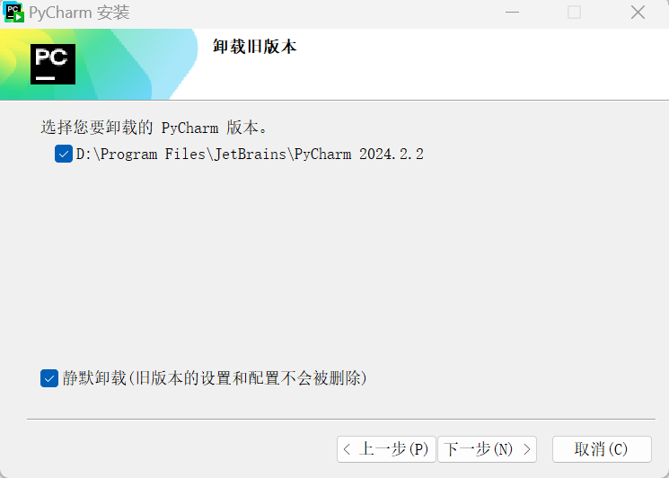

# Intellij IDEA激活码

```markdown
# 获取地址  ->  微信公众号
https://www.ajihuo.com  ->  架构汪[回复：验证码]
https://ziby0nwxdov.feishu.cn/docx/WcJNdnsQDoaGamxnnWYcb1YpnCh  ->  顶尖架构技术栈[回复：A01]
https://www.ajihuo.com  ->  offer鱼/架构狮[回复：001]
https://idea.javatiku.cn  ->  Github开源项目/程序媛山楂[回复：激活码]
http://idea521.com  ->  程序猿小张[回复：激活码]

# 激活错误
https://ziby0nwxdov.feishu.cn/docx/JxjUdjEmko4bJUxp5eZcMxEsnyd
进入 C:\Users\Viski\AppData
删除 Local && Roaming 下的 JetBrains
Win+R 输入 regedit 删除如下目录文件
  计算机\HKEY_CURRENT_USER\Software\JavaSoft\Prefs\jetbrains
执行 uninstall-all-users.vbs

# 工具压缩包
E:\DevDoc\scripts\idea → jetbra.zip
```

# [IntelliJ IDEA 2024](https://shimo.im/docs/gXqmdEwygMHyrj3o/read)

[安装包](https://pan.baidu.com/s/1U5DC7XisNNbz4DQIOcCoOA?pwd=2g4h) | <a href="激活脚本/2024最新永久激活.rar">本地文件</a>

```markdown
# 已保存到 百度网盘
全部文件>我的应用数据>开发资源 → 2024最新永久激活
```

## 步骤：

```markdown
# 打开 win2021-2024 文件
E:\DevDoc\scripts\idea\win2021-2024
1) 进入 scripts
运行脚本 install.vbs
(若有弹窗)是 → 确定 → 等待弹出success → 确定
2) 进入 Activation_Code
打开对应激活码文件(如：IntelliJ IDEA.txt) → 复制文件内容 → Activation code(有登录账号必须退出)
```

## 注意：

```markdown
# 若之前用过其他激活脚本，需要先删除配置
Help → Edit Custom VM options → 删除一行配置(-javaagent:磁盘:\xxx)

# 地区不要设置中国 (搜索 region，设置 Not specified)
File | Settings | Appearance & Behavior | System Settings | Language and Region
Region: Not specified

# 若想安装新版本，可先卸载
Win + X → 设置(N)
应用 → 安装的应用 → 卸载 IDEA
Delete IntelliJ IDEA xxxx.x caches and local history (删除缓存和本地历记录)

# 假设已经激活成功，可直接下载新版本，点击安装
[√] 卸载旧版本
[√] 静默卸载
```



# [IntelliJ IDEA 2022.1](https://www.exception.site/essay/idea-reset-eval)

## 激活破解图文教程：

- **第一种**：👉 **【推荐】永久激活 IDEA （适合最新的几个版本）, 即本文教程所写的**，具体步骤**跟着下面的图文教程一步一步来就行，一分钟即可搞定，过程也非常简单。**

> **PS: 补丁的原理是暴力拦截了 IDEA 的剩余使用期网络请求，实际上等于永久激活，至于激活到哪天，在之前的 `2021.3.3` `2021.3.2` 等老版本中是可以手动配置的，比如改成激活到 2099 年，最新的版本只能显示到 2023 年, 其实效果还是一样的。**
>
> 想要显示到 2099 年的, 通过下面链接下载 2021.3.3 的历史版本的 IDEA 后, 再使用此教程即可:
>
> 历史版本下载链接：https://www.jetbrains.com/idea/download/other.html
>
> 最后, 感谢z大的补丁~ 无敌~ nbility~。

- **第二种**：👉 **[无限重置 IDEA 30 天试用期（适合比较老的版本）](https://www.exception.site/essay/how-to-free-use-idea-202022-by-resigter-code)**；

## 注意：

- **本教程适用于 IntelliJ IDEA 2022.1 以下所有版本，请放心食用~**
- **本教程适用于 JetBrains 全系列产品，包括 IDEA、Pycharm、WebStorm、Phpstorm、Datagrip、RubyMine、CLion、AppCode 等。**
- **本教程适用 Windows/Mac/Linux 系统，文中以 Windows 系统为例做讲解，其他系统按照教程顺序即可。**

## 前言：

> PS: IDEA 前面的安装步骤还是一样，主要是后面的激活步骤~

## 第一步: 下载最新的 IDEA 2022.1 版本安装包

载链接如下：

https://www.jetbrains.com/idea/download

## 第二步: 先卸载老版本的 IDEA

> 注意，如果电脑上之前有安装老版本的 IDEA, 需要先卸载干净，否则可能安装失败！
>
> 注意，一定要先卸载干净掉老版本的 IDEA。

## 第三步: 开始安装 IDEA 2022.1 版本

安装目录默认为 `C:\Program Files\JetBrains\IntelliJ IDEA 2022.1`

IDEA 运行成功后，会弹出对话框，提示需要先登录 JetBrains 账户才能使用：

这里先不管，**先点击 `Exit` 退出，准备开始运行激活脚本**。

## 第四步：清空 IDEA 以前使用过的激活方式【非常重要】

**运行激活脚本之前，如果你之前安装过 IDEA, 且手动为 IDEA 修改过 hosts 文件，那么添加的配置，记得要删除；引用过的补丁也要移除掉等, 不然可能会与本文提供的补丁有冲突，出现各种奇奇怪怪的问题。**

```tex
C:\Windows\System32\drivers\etc → hosts
```

**如果没有动过 hosts 文件，则不用管，继续走下面的步骤。**

## 第五步：开始激活

### 下载

<a href="激活脚本/JetBrains 2022 最新版本全家桶激活.rar">JetBrains 2022 最新版本全家桶激活.rar</a>

> **需要的小伙伴，扫描下方公众号二维码，或者关注公众号： `Java学习者社区`，回复关键字：`idea`, 即可免费无套路获取激活码、破解补丁，持续更新中~。**


先通过网盘下载好激活补丁，打开文件夹如下：

- `scripts`: 放置了相关脚本，包含自动安装、卸载破解补丁脚本（Windows、Mac、Linux 对应系统的脚本都有）；

  > 之前的 IDEA 版本，我们都是手动在 `idea.vmoptions` 配置文件引入破解补丁，但是有部分小伙伴反映找不到 `idea.vmoptions` 文件，这次，通过运行脚本可以直接引入补丁，针对小白，方便了很多。

- `vmoptions`： 放置了 JetBrains 产品的 `idea.vmoptions` 配置文件。之前版本都是通过在这个文件中手动引入破解补丁，但是最新版本 IDEA 2022.1 官方加入了反制手段，在用户目录下已经找不到这个文件了，新版本我们直接引用这个文件夹下的 `idea.vmoptions` 配置文件；

### 运行激活脚本

将 `ja-netfilter-all`激活文件夹移动到电脑上某个位置，笔者做演示放置在了桌面上，你可以放到 `D` 盘或者其他路径下：

Windows 系统，点击运行 `install-current-user.vbs` 脚本，为当前用户安装破解补丁。

Mac/Linux 系统，点击运行 `install.sh` 脚本安装。   

> PS: `install-all-users.vbs` 为系统所有用户安装，不太推荐。`unistall-*`前缀的是卸载补丁脚本。

点击安装，会弹出提示

运行此补丁大约花费几秒钟，点击 `确定`，等待 `Done` 完成提示框出现，到这里，表示补丁安装成功。

> 注意：运行此脚本因为需要添加 `idea.vmoptions` 文件的环境变量，可能会被杀毒软件误报为木马，大家允许运行即可。
>
> 实在不放心的小伙伴也可打开该脚本，看看源码
>
> 大致看下，代码主要是为 JetBrains 系列产品在外置 `.vmoptions` 配置文件中引用破解补丁：
>
> 以及添加`idea.vmoptions` 文件的环境变量，脚本运行成功后，打开环境变量看下
>
> 可以看到，除了为 IDEA 添加 `.vmoptions` 环境变量外，还有其他产品的，如 Goland 等。
>
> 所以，小伙伴们不用担心是木马啥的，安心运行等待安装成功就行。

## 第六步：打开 IDEA, 填入指定激活码完成激活

运行脚本安装破解补丁完成后，**一定要重启 IDEA**，然后，填入下面的激活码，点击激活即可。

<a href="激活码/IDEA 激活码.txt">IDEA 激活码</a>

> Jetbrains 每个产品对应激活码都不一样，其他 IDE, 如 Pycharm、Webstrom 等激活码可点击下面链接获取：
>
> [👉《Jetbrains 其他产品对应激活码》](https://www.exception.site/essay/jetbrains-all-active-code)
>
> <a href="激活码/Pycharm 激活码.txt">Pycharm</a>、<a href="激活码/Webstorm 激活码.txt">Webstorm</a>、<a href="激活码/DataGrip 激活码.txt">DataGrip</a>、<a href="激活码/Phpstorm 激活码.txt">Phpstorm</a>、<a href="激活码/AppCode 激活码.txt">AppCode</a>、<a href="激活码/Goland 激活码.txt">Goland</a>、<a href="激活码/RubyMine 激活码.txt">RubyMine</a>、<a href="激活码/Rider 激活码.txt">Rider</a>、<a href="激活码/CLion 激活码.txt">CLion</a>

复制激活码后填入，点击 `Activate` 按钮完成激活(IntelliJ IDEA 和 Code With Me 都要激活)

> PS: 有部分小伙伴反应，重启 IDEA 填入激活码依然无法激活，重启系统才行，如果有小伙伴遇到这种情况，不妨试试看~

点击激活后，就可以看到激活成功辣，又可以开心的 coding 了~：

## 自定义配置：

永久激活、2099年等信息可以通过修改 config-jetbrains 文件下 mymap.conf  自定义

## 一切按照教程来的，还是提示 `Key is invalid`？

- 1、执行脚本提示 `Done`, 检查配置环境变量的值：**路径中是否包含中文**, 包含中文是不行的，换成英文路径；
- 2、笔者亲测的版本 `2022.1`、`2021.3.3`、`2021.3.2` 都是可以的，确认你的版本号是否是最新的这两个版本，太老的版本请用第一种方法；
- 3、有些小伙伴是重启系统后，才行的，这种法子也可以尝试一下；
- 4、检查破解补丁的位置是否动了，切记不要动，不然重启 IDE 又找不到补丁位置了，自然就失败了；

## 2022.1 版本为啥不能像 2021.3.3 版本那样显示到 2099 了？

最新的 2022.1 版本应该是做了反制，只能显示到 2023 年，但补丁的本质是暴力拦截了剩余使用期限网络请求，应该还是永久激活。

有强迫症的小伙伴，可以降低一个小版本，下载 2021.3.3 版本的 IDEA 后，再使用此教程，即可显示激活到 2099 年。

## 激活成功后，不要升级 IDEA 版本

官方反制手段越来越严厉，这个版本能激活，新版本大概率补丁就被搬了。所以，如果打开 IDEA 后，右下角若出现提示升级新版本，请不要升级版本。能用就行，它不香嘛！

> 也可以手动关闭升级提示，这样就可以防止控制不住自己升级了，如何关闭，参考下面的文章：
>
> [👉《IntelliJ IDEA 如何关闭更新提示？》](https://www.exception.site/article/30)
>
> 点击 `File` | `Settings` | `Appearance & Behavior` | `System Settings` | `Updates` 取消勾选 `Check IDE updates for`

## 激活成功后，补丁文件夹能不能删掉或者移动？

前文中的环境变量，小伙伴也看到了，对应了你放置补丁位置的路径，删除掉或者移动，再打开 IDEA 就找不到对应文件了，激活也就失效了。放着吃灰就行，别动它。

## 其他IDEA激活码

微信关注公众号「Java团长」

回复 “激活码”，即可查看最新激活码

[最新激活码](https://docs.qq.com/doc/DTVlaWHBOd1BCWGFF)

