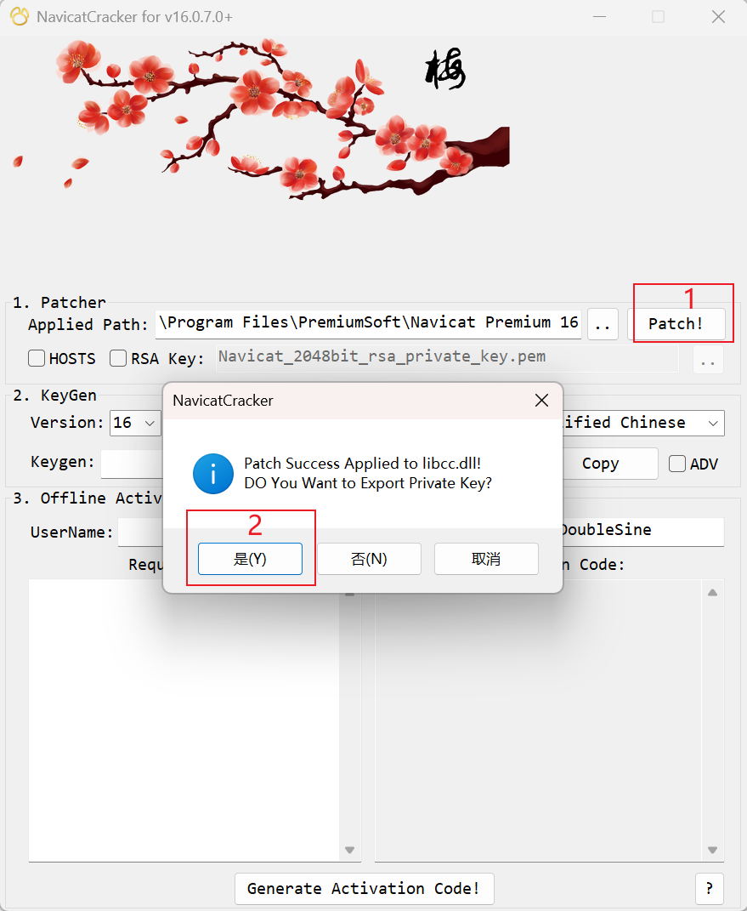

# Navicat Premium 17

## 无限试用

[参考1](https://www.bilibili.com/opus/976275890691375107) | [夸克网盘](https://pan.quark.cn/s/e747feb3f6e8) | [本地文件1](../docs/Navicat/17/Navicat16和17补丁.rar)

[参考2](https://www.cnblogs.com/ssmushui/p/17556189.html) | [GitHub](https://github.com/user-attachments/files/17795403/Navicat16.x_17.x.zip) | [本地文件2](../docs/Navicat/17/Navicat16.x&17.x.zip)

## 使用步骤

```markdown
1) 双击 Navicat.bat 脚本
2) 将 winmm.dll 拖进 navicat.exe 安装的目录(★ 需先关闭navicat)
```

# Navicat Premium 16

## 注意

```markdown
# 报错
[-] .\Navicat-Cracker NavicatCrackerDlg.cpp:332 -3All patch solutions are suppressed. Patch abort!

# 原因1
在 [NavicatCracker弹窗] 点击了 [否/取消]
# 解决1
卸载 → 重新破解

# 原因2
安装了 16.2 以上的版本
# 解决2
安装 16.2 以下版本 → 重新破解
```

## 注册机

[参考1](https://www.bilibili.com/opus/666392617288728582) | [百度网盘1](https://pan.baidu.com/s/1pB5xh9CvFOnaWXWnjQX6zg?pwd=ir74) | [本地文件1](../docs/Navicat/16/NavicatCracker.exe)

[参考2](https://learnku.com/articles/67706) | [百度网盘2](https://pan.baidu.com/s/1YrB06AZaDNSddtSevbwqzA?pwd=wsnk) | [本地文件2](../docs/Navicat/16/NavicatCracker.exe)

```markdown
[version]、[production]需要和[Navicat]版本一致
默认为[16]、[Premium]
```

## 破解步骤

### 1) 选择安装路径 → Patch

### 2) NavicatCracker弹窗 → 是



### 3) 打开 Navicat → 注册


### 4) 复制keygen到激活框

### 5) 激活


### 6) 手动激活(★ 需离线)


### 8) 剪贴[Request Code]

### 9) Generate Activation Code

### 10) 复制[Activation Code]


### 7) 复制[请求码]

### 11) 剪贴[激活码]

### 12) 激活


