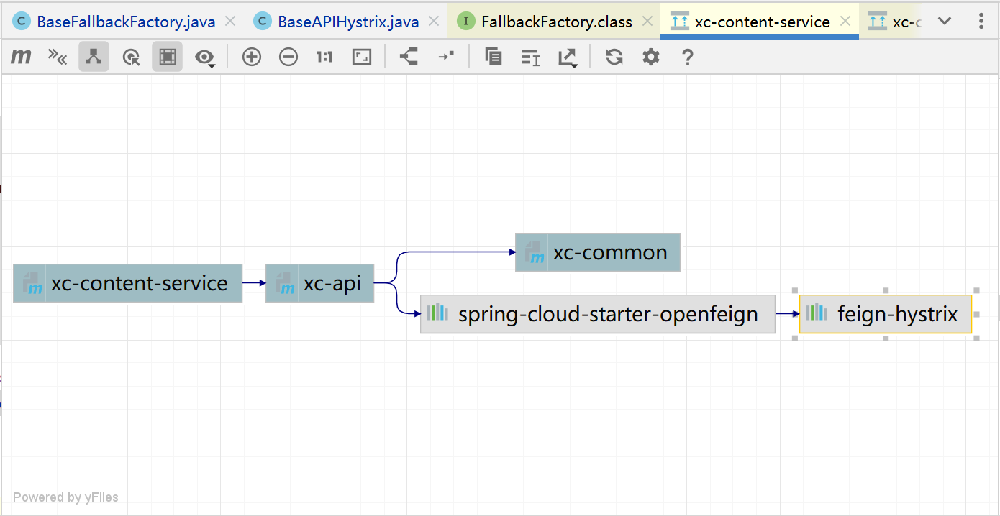
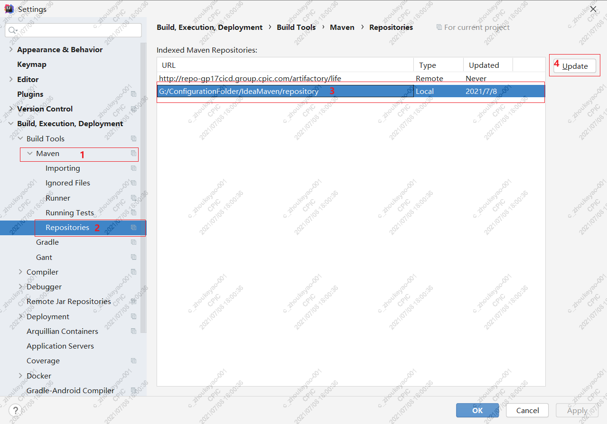
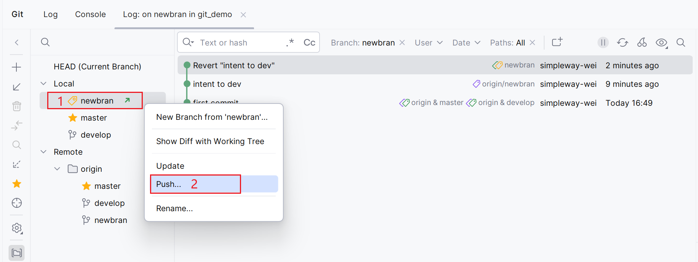

# 开发工具

## 【[VS Code](https://code.visualstudio.com)】工具集成

```markdown
# Visual Studio Code (跨平台)
https://code.visualstudio.com/Download
# 往期版本
https://code.visualstudio.com/updates
https://code.visualstudio.com/updates/v1_75
https://code.visualstudio.com/updates/v1_58
......
# 下载较慢问题
解决办法：将地址中[/stable]前的[xxx.vo.msecnd.net]换成[vscode.cdn.azure.cn]
-- 原地址 
https://az764295.vo.msecnd.net/stable/e2816fe719a4026ffa1ee0189dc89bdfdbafb164/VSCodeUserSetup-x64-1.75.0.exe
-- 换为
https://vscode.cdn.azure.cn/stable/e2816fe719a4026ffa1ee0189dc89bdfdbafb164/VSCodeUserSetup-x64-1.75.0.exe

# Visual Studio (Windows平台)
https://visualstudio.microsoft.com/downloads
# 往期版本
https://learn.microsoft.com/en-us/visualstudio/releases/2022/release-notes
https://learn.microsoft.com/en-us/visualstudio/releases/2019/release-notes
```

### # [常用快捷键](https://zhuanlan.zhihu.com/p/652337848)

```tex
* 快捷键设置
文件 → 首选项 → 键盘快捷方式
按住[Ctrl]不松，按一下[k]、一下[S]

* 显示所有命令
Control + Shift + P

* 主要设置
触发参数提示(Trigger Parameter Hints) → [Control + Alt + .]
触发建议(editor.action.triggerSuggest) → [Control + Alt + /]
快速修复...(editor.action.quickFix) → [Control + Alt + Space]
切换块注释(editor.action.blockComment) → [Control + Shift + /]

* 搜索文件
  Ctrl + P

* 搜索关键字
  Ctrl + Shift + F
```

### # VSCode-插件

[修改VSCode的插件安装目录](https://it.cha138.com/javascript/show-4674673.html)

```markdown
# 方法1
进入命令窗口
code --extensions-dir "E:\DevDoc\vscode\extensions"

# 方法2
右键[VSCode 快捷方式] → 点击[属性] → 在[目标]后[添加]
 --extensions-dir "E:\DevDoc\vscode\extensions"

# VsCode默认的插件安装位置
%UserProfile%\.vscode\extensions
```

搜索插件快捷键：Ctrl + Shift + X

```markdown
* open in browser					直接右键项目单击启动

* Live Server						在服务端运行页面 → Alt + L  Alt + O

* ESLint							语法纠错

* JavaScript (ES6) code snippets	ES6语法智能提示以及快速输入

* Path Intellisense					自动路径补全

* Auto Close Tag					自动闭合HTML/XML标签

* Auto Rename Tag					自动完成另一侧标签的同步修改

* Vue 3 Snippets					Vue语法提示

* Vetur								语法高亮、智能感知、Emmet...
									  Alt + Shift + F → 格式化全文
									  Ctrl + F 、Ctrl + K → 格式化选中代码

Rainbow CSV							CSV、TSV 文件编辑

Beautify							格式化代码(不再维护，已弃用)

Bracket Pair Colorizer 2			给括号加上不同的颜色，便于区分不同的区块(已内置)

Chinese (Simplified)				简体中文

Debugger for Chrome					映射vscode上的断点到chrome上，方便调试(已弃用)
									  现在使用 JavaScript Debugger

Material Theme UI					主题插件，以下是一些热门主题
									  Dracula Official
									  Atom One Dark Theme
									  Bracket Lights Pro
									  Bluloco Light
									  Quiet Light
```

### # 基础配置

#### File | Preferences

```markdown
# 注意：新版本需要点击[左下角 ⚙] → [Settings] 或者 [Ctrl + ,] (这个快捷键一般会冲突)
Settings → 搜索 Enable Preview → 点击 Workbench | Editor Management → 取消勾选 Enable Preview
```

#### 新建窗口打开

```tex
Settings | User | Window | New Window
                           → Open Files In New Window → on
                           → Open Folders in New Window → on
```

#### Terminal编码

```bash
Settings → 点击[右上角 📄Open Settings (JSON)] → 添加如下佩蓉
    "terminal.integrated.profiles.windows": {
        "PowerShell": {
            "source": "PowerShell",
            "args": [
                "-NoExit",
                "-Command",
                "[Console]::OutputEncoding = [System.Text.Encoding]::UTF8; $OutputEncoding = [System.Text.Encoding]::UTF8"
            ]
        }
    },
    "terminal.integrated.defaultProfile.windows": "PowerShell",
VSCode
```

#### 语言设置

```tex
Ctrl + Shift + P → 搜索 Configure Display Language → Enter → 选择语言(en、zh-cn) → 重启
```

#### 工具/插件

```markdown
# TypeScript 文件下载位置
%LocalAppData%\Microsoft\TypeScript
```

## 【[HBuilder](https://www.dcloud.io)】APP工具

### # 下载地址

```tex
https://www.dcloud.io/hbuilderx.html
```

### # 编译运行

```markdown
# 运行
不压缩 JS、代码 直接在浏览器输出
# 发行
压缩打包
```

## 【[CLion](https://www.jetbrains.com/clion)】c/C工具

```markdown
# 下载地址
https://www.jetbrains.com/clion/download

# 往期版本
https://www.jetbrains.com/clion/download/other.html
```

### # 基础配置

#### File | Settings

##### * 窗口设置

```tex
同[IDEA]
```

##### * 字体样式

```markdown
同[IDEA]
```

##### * 编码设置

```tex
同[IDEA]
```

##### * 编译器配置

```markdown
Build,Execution,Deployment | Toolchains
➕ → [MinGw]
             → Name [MinGW]
             → Toolset [Bundled / mingw64目录]
             → Debugger [Bundled GDB / MinGW GDB]
```

##### * 终端配置

```markdown
Tools | Terminal
                 → Application Settings
                   → Shell path
                     C:\Windows\System32\WindowsPowerShell\v1.0\powershell.exe
                     C:\Windows\system32\cmd.exe
                     删除为 null → 选择[系统环境变量]中[Path 优先级较高]的那一个
                 注意：目前怎么选择，都是使用 cmd，待解决
```

##### * 跨平台构建

```tex
Build,Execution,Deployment | CMake
➕ → [自动生成 Release]
```

#### File

##### * 创建项目

```markdown
New | Project
1) C++ Executable
  创建一个可执行文件(.exe 文件，在 Windows 中)  →  这个类型的项目通常包括 main() 函数和程序的入口点
  包含一个或多个源文件(例如 .cpp 文件)
  通常会有一个 CMakeLists.txt 文件来管理构建过程，生成可执行文件
2) C++ Library
  创建一个静态库或动态库(例如 .lib 或 .dll 文件)  →  封装一些功能，编译成可以被其他程序调用的库，通常没有 main() 函数
  包含一个或多个源文件(例如 .cpp 文件)
  生成一个 .a 或 .lib 或 .dll 文件，供其他程序使用
  同样使用 CMakeLists.txt 文件来配置构建过程
3) [×]Add Onboarding Tips
  勾选后，CLion会在创建项目时给一些帮助和提示，使得快速了解如何设置项目、构建、调试等功能
```

##### * 项目文件

```markdown
右击项目 | New
1) cpp 和 h 一起创建
[C++ Class]
           → Name [xxx]
           → Type [.cpp /.h]
           → OK
2) 只创建 c/cpp
[C/C++ Source File]
                   → Name [yyy]
                   → Name [c / cpp / cu]
3) 只创建 c/cpp 的 h 文件
[C/C++ Header File]
                   → Name [yyy]
                   → Name [h / cuh]
```

##### * 重载项目

```tex
Reload CMake Project
```

#### Build

##### * 构建项目

```tex
Build Project
```

##### * 重构项目

```tex
Rebuild Project
```

### # CLion-常见问题

#### * 中文乱码

##### 方案1 (推荐)

```markdown
# 取消勾选 pty
[Ctrl + Alt + Shift + /] → Registry → [×] run.processes.with.pty

# 在 Run 模式下
CLion 默认使用 PTY 伪终端（Pseudo Terminal）运行进程，可能会影响控制台编码
# 在 Debug 模式下
不会使用 PTY，而是直接通过 GDB 运行
# [×] run.processes.with.pty
Run 进程也使用普通终端
```

##### 方案2 (可用)

```markdown
# 设置[输入/输出 编码]
SetConsoleCP(65001);
SetConsoleOutputCP(65001);
```

##### 方案3 (可用)

```markdown
# 设置[执行命令]
system("chcp 65001");
```

##### 方案4 (无用)

```markdown
# CMakeLists.txt 配置
-- [c++]
Set(CMAKE_CXX_FLAGS "${CMAKE_CXX_FLAGS} -Wall -fexec-charset=GBK")
-- [c]
Set(CMAKE_C_FLAGS "${CMAKE_C_FLAGS} -Wall -fexec-charset=GBK")
```

##### 注意：

```markdown
# 方案1 是在CLion[内部]执行
# 方案2、方案3、方案4 是在CLion[外部]执行
# [外部]执行，需要[暂停控制台]等待确认[否则会闪退]
system("pause");

# [勾选] 在外部控制台中运行
Run | Edit Configurations → [√] Run in external console
```

## 【[Pycharm](https://www.jetbrains.com/pycharm)】Python工具

```markdown
# 下载地址
https://www.jetbrains.com/pycharm/download

# 往期版本
https://www.jetbrains.com/pycharm/download/other.html
```

### File | Settings

#### * 窗口设置

```tex
同[IDEA]
```

#### * 字体样式

```markdown
同[IDEA]
```

#### * 编码设置

```tex
同[IDEA]
```

#### * 解释器配置

```markdown
Project: xxx
  Python Interpreter
  					 → Add Interpreter 设置[Interpreter 目录]
  					 → 展开 Interpreter → Show All... 可对[Interpreter 进行 ➕ ➖]
  					 → 点击[Package]上方[➕]，可进行包的搜索、下载、升级
  					   [勾选 Specify version → 选择相应版本 → Install Package]
  Project Structure
```

### File | New Projects Setup

```markdown
# 新项目 -> 基础配置
Settings for New Projects...
```

## 【[GoLand](https://www.jetbrains.com/go)】Go工具

```markdown
# 下载地址
https://www.jetbrains.com/go/download

# 往期版本
https://www.jetbrains.com/go/download/other.html
```

### # 基础配置

#### File | Settings

##### * 窗口设置

```tex
同[IDEA]
```

##### * 字体样式

```markdown
同[IDEA]
```

##### * 编码设置

```tex
同[IDEA]
```

##### * 编译器配置

```markdown
Project: xxx
  Python Interpreter
  					 → Add Interpreter 设置[Interpreter 目录]
  					 → 展开 Interpreter → Show All... 可对[Interpreter 进行 ➕ ➖]
  					 → 点击[Package]上方[➕]，可进行包的搜索、下载、升级
  					   [勾选 Specify version → 选择相应版本 → Install Package]
  Project Structure
```

#### File | New Projects Setup

```markdown
# 新项目 -> 基础配置
Settings for New Projects...
```

### # GoLand-常见问题

```markdown
# GOPROXY may be required for normal Go modules integration in your region
File | Settings | Go | Go Modules
                                  → Enable Go modules integration
                                    Environment:  GOPROXY=https://mirrors.aliyun.com/goproxy/
```


## 【[IDEA](https://www.jetbrains.com)】Java工具

```markdown
# 下载地址
https://www.jetbrains.com/idea

# 期版本
https://www.jetbrains.com/idea/download/other.html

# GitHub 授权登录
姓名：Xavi Williams
用户名：simpleway-wei
账号：2244255266@qq.com
密码：yibeiweishiji.0414
```

### # 常用快捷键

````tex
* IDEA设置
  Ctrl + Alt + S

* main()方法快捷键
  psvm + Enter

* System.out.println()方法快捷键
  快捷输出语句：sout + Enter
  输出xxx内容："xxx".sout + Enter

* 编码建议、内容提示
-- [默认按键]
	Ctrl + Alt + Space（空格）
-- [修改路径]
	File | Settings | Keymap → Main Menu → Code Completion
		[Basic]				Ctrl + Alt + /
		[Type-Matching]		Ctrl + Alt + ,

* 规范代码快捷键
  Ctrl + Alt + L

* 出现常用代码模板【if,for,while...】
  Ctrl + Alt + T

* 提取方法【需要光标选中方法体】
  Ctrl + Alt + M

* 提取变量【需要光标选中变量对象】
  Ctrl + Alt + V

* 补全返回值
  1. 代码.var
     如：new Scanner(System.in) 在后面输入 .var + Enter
  2. Alt + Enter
     如：new Scanner(System.in) 在后面按 Alt + Enter → Introduce local variable + Enter

* 常用方法快捷键
  Alt + Insert
  	Constructor
    Getter and Setter
    toString、hashCode、equals

* 光标单体选中
  Alt + Shift
* 光标可拉取选中
  Ctrl + Alt + Shift

* 快速定位到行
  Ctrl + G → 输入[行号:位号]

* 实现方法
  Ctrl + I（字母i）
* 重写方法
  Ctrl + O（字母o）

* 复制、撤销、恢复
  1. Ctrl + D 复制当前行
  2. Ctrl + X 剪贴当前行
  3. Ctrl + Z 撤销当前的操作
  4. Ctrl + Shift + Z 恢复上一次操作

* 查看 @Value
  Ctrl + 减号
* 隐藏 @Value
  Ctrl + 加号

* 补全分号、大括号
  Ctrl + Shift + Enter

* 【删除/导入 jar包】  &&  【刷新 pom文件】
  Ctrl + Shift + O

* 代码查找与替换
  查找：Ctrl + Shift + F
    或点击 Edit → Find → Find in Files
  替换：Ctrl + Shift + R
    或点击 Edit → Find → Replace in Files

* 修改与当前所选中的 包名/类名/方法名/变量名...相关的所有名字【需要光标选中】
  Shift + F6

* 全局搜索
  Shift + Shift  [√]Include non-project items → 搜索条目包含非项目工程的内容
    【Classes】搜索类文件：Ctrl + N
    【Files】搜索文件夹：Ctrl + Shift + N
    【Symbols】搜索元素：Ctrl + Alt + Shift + N
    【Action】搜索操作：Ctrl + Shift + A

* 查看当前类所在工程中的路径
  Alt + F1 + → + Project/Packages/Scope
  或点击 Navigate + Select In + 鼠标悬浮Project View + Project/Packages/Scope
  说明：
      Project -> 展示项目全部文件信息
      Packages -> 仅显示项目本身的【java代码】，增加【类库(Libraries)】树形结构，忽略【resource、test、pom】等文件
      Scope ->
                Project Files				项目运行相关的所有文件（忽略与【项目正常执行】无关的文件）
                Production					项目的代码文件（不包含引用的类库，包含resource文件）
                Tests						项目的测试文件
                Open Files					当前模板的文件
                Scratches and Consoles		代码片段和控制台

* 打开/隐藏【工程面板】
  Alt + 1

* 查看当前类中所有的方法
  Alt + 7

* 查看【类】【接口】【方法(函数)】【变量】被使用的地方【需要光标选中】
  Alt + F7

* 展示当前类中所有成员变量及方法
  Ctrl + F12

* 定位
  Ctrl + 鼠标左键
  【追踪】当前光标选中内容
  【查看】类/接口/方法...的使用
* 返回追踪定位前的内容
  Ctrl + Alt + ←（键盘左键）
* 恢复上一次的追踪定位
  Ctrl + Alt + →（键盘右键）

* 定位到【类、接口】的【声明/使用】、【方法】的【实现/调用】位置（光标选中）
  Ctrl + B

* 定位到【类】的【父类/父接口】、【接口】的【父接口】、【方法】的【声明】位置（光标选中）
  Ctrl + U

* 查看【类/接口】的【继承/实现】关系（光标选中）
  Ctrl + H

* 查看【类】的【子类】、【接口】、【方法】的【实现 类/接口】窗口（光标选中）
  Ctrl + Alt + B
  或者（点击左侧）【↓】箭头图标

* 查看【类】的【父类/父接口】、【接口】的【父接口】图形浮窗（光标选中）
  Ctrl + Alt + U
  或者（点击左侧）【↑】箭头图标

* 查看【类】的【父类/父接口】、【接口】的【父接口】图形界面（光标选中）
  Ctrl + Alt + Shift + U
  或者（点击左侧）【↑】箭头图标

* 查看【类/接口】的【关系视图】
  进入[顶级][父类/父接口] → [Ctrl + H] → [Ctrl + 加号] → [Ctrl + A] → [Ctrl + Alt + U] → 选择[Java Classes]

* 查看【方法】的【声明、实现、调用】窗口（光标选中）
  Ctrl + Alt + H

* 查看【实现】
  Ctrl + Alt + 鼠标左键 → 点击【类/接口】

* 查看【使用/声明】
  Ctrl + 鼠标左键 → 点击【类/接口】

* 提示参数类型
  Ctrl + P（在需要参数的地方按）

* 查看【类】【方法】【变量】帮助文档
  Ctrl + Q（需要选中查看内容）

* 打开断点控制台
  Ctrl + Shift + F8

* 大小写快捷键
  Ctrl + Shift + U
````

### # 代码等级检测

```tex
点击代码页面右上角的 ✔图标
IDEA highlighting level → All Problems	检查所有error/warning
                        → Syntax		只检查语法error
                        → None			不做语法check
```


### # 工具使用

```markdown
# JShell Console -> 执行Java命令工具(JDK9引入的)
打开方式：左击[Tools] → 左击/右击 [JShell Console]
删除快照：右击[jshell_console.snippet] → 点击[Open In] → [Explorer]，然后删除[jshell文件夹]下的[快照]即可
注意：删除快照之后，新建的快照需要[右击]打开，[序号]才可[重新开始]；[左击]打开，会按照[上一次]创建的[序号]开始[递增]
```

### # [工作目录](https://blog.csdn.net/w709835509/article/details/135987338)

```markdown
# 用户目录创建
%APPDATA%\JetBrains
-- C:\Users\Viski\AppData\Roaming\JetBrains

# [配置]和[缓存]
%LOCALAPPDATA%\JetBrains
-- C:\Users\Viski\AppData\Local\JetBrains

# Condition 记录 (随机字符.xml → 可修改断点之后，再按照修改时间倒序查看)
%APPDATA%\JetBrains\IntelliJIdeaxxxx.x\workspace  →  xxx.xml
-- C:\Users\Viski\AppData\Roaming\JetBrains\IntelliJIdea2024.3\workspace  →  xxx.xml
```

### # IDEA-插件

[推荐整理]: https://zhuanlan.zhihu.com/p/391467740

```markdown
# 安装目录
%LocalAppData%\JetBrains
或
%UserProfile%\AppData\Local\JetBrains
                                       →  IntelliJIdeaxxxx.x\plugins
```

#### * Plugins 安装

```markdown
* TONGYI Lingma					通义灵码Ai助手 (Ctrl + Shift + L)
								https://tongyi.aliyun.com/lingma/download
* Baidu Comate					百度Ai助手 (Ctrl + Shift + Y)
								https://comate.baidu.com/zh/download
* Fitten Code					非十Ai助手 (Ctrl + Alt + C)
								https://code.fittentech.com/#download

* Translation					翻译插件
								打开对话框 -> [Ctrl + Shift + ,]

* Apipost-Helper-2.0			接口测试开发工具
								在 File | Settings | Keymap → Plugins → Apipost-Helper-2.0
								  [Search API]			Ctrl + Alt + ;
								  [Search API Tree]		Ctrl + Alt + ''
* RestfulTool					RESTful Web 服务辅助开发工具
RestfulToolkit					(已经停止更新)
								https://idea.javaguide.cn/plugins/rest

* Rainbow Brackets				括号成对配色

* Lombok						自动生成getter、setter、equals、hash等方法

* JsonFormat					Json格式 快速转换为 实体类

* MyBatisX						快速定位到xml文件
								https://plugins.jetbrains.com/plugin/10119-mybatisx/versions
MyBatisCodeHelperPro			更强大的 MyBatis 插件(收费)
								free7d6c5721f2d14952972f1ae4e8258adb

* MyBatis Log Free				SQL日志插件
								打开方式：Tools → MyBatis Log Plugin

* SumnekoLua					编辑Lua脚本
EmmyLua

* jclasslib Bytecode Viewer		查看字节码
Bytecode Viewer					Show Bytecode

AspectJ							Java Compiler

* CodeGlance					代码迷你缩放

* SonarLint						修复代码质量和代码安全问题

Alibaba Java Coding Guidelines	阿里巴巴规约(代码扫描插件)
								File | Settings | Editor | Inspections → Ali-Check
								搜索
								   ThreadPoolExecutor → Severity[Warming]
								   TimeTask → Severity[Warming]
								   'L' instead of 'l' → Severity[Warming]
								   '==' directly → Severity[Warming]
								   Braces are used with if → Severity[Warming]
								   ...

WakaTime						时间跟踪(GitHub账号授权)

Grep Console					控制台输出管理

Maven Helper					Maven依赖冲突管理插件
                                  点击 Dependency Analyze(在 pom文件 左下角 → Text右边)

Maven Search					搜索Maven依赖
                                  点击 Tools → Maven Search
                                  或者 Ctrl + Shift + M

IdeaVim							模拟vim插件
								配置文件 → ../document/01/Tools/.ideavimrc

Key Promoter X					快捷键提示

EasyApi							零代码入侵，生成接口文档
								https://apifox.com/apiskills/using-easyapi/

Easy Javadoc					快速生成类、方法、属性等中文注释
								https://blog.csdn.net/ruoshuiyx/article/details/128255088

GitToolBox						行内显示代码修改者信息

Gitee							便于创建仓库

.ignore							忽略不必要提交的文件

JPA Buddy						JPA可视化设计器和组件面板

Zoolytic - Zookeeper tool		Zookeeper可视化管理插件

JBLSpringBootAppGen				自动生成[Application启动类]和[application配置文件]

theme							Dracula Theme
```

#### *  [vim快捷键](../02_问题收集/日常小结.md#vim快捷键)

```tex
若未成功定位，则关闭文件，重新点击链接
```

#### * 安装包

```markdown
# Idea-Jetty
下载: https://www.eclipse.org/jetty/download.php
安装: https://blog.csdn.net/xiejx618/article/details/49936541
```

### # IDEA-基础配置

#### File | Settings

```tex
快捷键：Ctrl + Alt + S
```

##### * 配置解释

```tex
Appearance & Behavior			外观和行为
Keymap							快捷键
Editor							编辑器
Plugins							插件
Version Control					版本控制
Build,Execution,Deployment		构建，执行，部署
Language & FrameWorks			语言和框架
Tools							工具集
Other Settings					其他设置
```

##### * 窗口设置

```markdown
Appearance & Behavior | System Settings
# IDEA退出设置
  → When closing a tool window with a running process
    ——> [√] Terminate process(终止进程)
	——>     Disconnect(断开)
	——>     Ask(询问)
# 取消默认打开最近项目
  → [×] Reopen projects on startup
# 打开新的项目
open project in
    ——> [√] New Window(新窗口)
	——>     Current Window(当前窗口)
	——>     Ask(询问)
```

##### * 字体样式

```markdown
# 整体样式
Appearance & Behavior | Appearance
  Use custom font	设置字体样式(Inter)
  Size				设置字体大小(14)

# 主页面样式
Editor | Font → Font 设置字体样式(JetBrains Mono)
  Size 设置字体大小(15.0)
  Line height 设置行高(1.2)
```

##### * 文字背景

```tex
Editor | Color Scheme | General | Scheme → Intelij Light
                                  Text → Default text →  Backgrounnd 设置 RGB(210,235,199)
Editor | Color Scheme | Language Defaults | Comments → Block comment(3,35,14) or (30,41,61)
													   Doc comment → Text(17,63,61)
													   Line comment(0,49,79)
```

##### * 自动 [导入/删除] Jar

```tex
Editor | General | Auto Import → 勾选 Optimize imports on the fly
```

##### * Tab分行显示

```tex
Editor | General | Editor Tabs → 取消勾选 Show tabs in one row(选择 Multiple rows)
注：可在 Closing Policy 下的 Tab limit 中设置限制个数
```

##### * 编码设置

```markdown
# 控制台编码
Editor | General | Console → Default Encoding → 设UTF-8

# 全局编码、项目编码、属性文件的默认编码
Editor | File Encodings
                        → Global Encoding
                        → Project Encoding
                        → Default encoding for properties files
                          全部设为 [UTF-8]
                        → Transparent native-to-ascii conversion
                          [√] 在 .properties 文件中输入非 ASCII 字符时，会自动将这些字符转换为 Unicode 转义序列
                              如：爪哇 → 转义：\u722a\u54c7
                          [×] 文件会以原始编码(上述设置的 UTF-8)保存，直接显示非 ASCII 字符
                              如：爪哇 → 原始编码：爪哇

# 文件的编码方式
Create UTF-8 files → with NO BOM(推荐)
                     含义：创建 UTF-8 编码的文件，但不添加 BOM(Byte Order Mark，字节顺序标记)
                     适用场景：UTF-8 文件不需要 BOM 来标识编码，且 BOM 在某些场景下可能会导致问题(例如在脚本文件中)
                     特点：文件体积更小，兼容性更好
                   → with BOM
                     含义：创建 UTF-8 编码的文件，并在文件开头添加 BOM
                     适用场景：某些旧版 Windows 应用程序(如记事本) 需要 BOM 来正确识别 UTF-8 编码
                     特点：BOM 是一个不可见的标记(0xEF 0xBB 0xBF)，可能会在某些场景下引发问题(例如在脚本文件中)
                   → System default
                     含义：使用系统默认的编码方式创建文件
                     适用场景：如果你不确定是否需要 UTF-8 编码，或者希望与系统默认编码保持一致
                     特点：编码方式取决于系统设置，可能不是 UTF-8
```

##### * 序列化设置

```tex
1) Editor | Inspections → 搜索Serializable → 选中Serializable class without 'serialVersionUID'
   或者 Ctrl + Shift + A → 搜索Serializable class without 'serialVersionUID'
2) 类 implements Serializable 之后，光标悬浮或点击类名，然后按 Alt+Enter → Create constant field 'serialVersionUlD' in 'xxx' 即可生成“序列化UID”
```

##### * 语法纠错

```tex
Editor
       | Natural Languages | Grammar and Style
       | Inspections → Java → Javadoc
                                      → Javadoc declaration problems
                                      → ...
```

##### * 代码[补全/提示]

```tex
Keymap | Main Menu | Code | Code Completion → Basic				Ctrl + Alt + /
                                              Type-Matching		Ctrl + Alt + "
       | Other | Second Basic Completion(建议：Remove)			  ...
```

##### * Vue快捷键提示

```markdown
Editor | Inspections | HTML → 点击 Unknown attribute → Options 添加如下：
@tap,@tap.stop,@tap.prevent,@tap.once,@click,@click.stop,@click.prevent,@click.once,@change,@change.lazy,@change.number,@change.trim,v-model,v-on,v-for,v-text,v-html,v-show,v-if,v-else-if,v-else,v-pre,v-once,v-bind,scoped;

# 问题：v-xxx报错(如：v-on)
1) 直接在文件的 html标签中 添加 → xmlns:v-on="http://www.w3.org/1999/xhtml"
2) 在Inspections中，搜索 → Unbound XML namespace prefix，并取消勾选
```

##### * 模板设置

```tex
注意：添加 → $END$ 意味光标结束的位置
```

###### [编辑者、时间、描述...](https://blog.csdn.net/weixin_42077253/article/details/109527083)

创建文件时自动添加

```tex
Editor | File and Code Templates | Includes | File Header → 添加如下内容：
```

```java
/**
 * @Author Viski
 * @Date ${YEAR}/${MONTH}/${DAY} ${TIME}
 * 
 * <p></p>
 * @Description:
 */
```

设置快捷键添加

```tex
Editor | Live Templates → 点击左上角✚号 → Template Group，输入Author，确定
	→ 点击右上角✚号 → Live Templates → 编辑Abbreviation(快捷键)、Description(模板描述)、Template text(模板内容)
	模板内容如下：
```

```java
/**
 * @Author Viski
 * @Date $date$ $time$
 * 
 * <p></p>
 * @Description:
 */
```

```tex
	Edit variables → 
					Name	Expression			Default value	Skip if denied
					date	date("yyyy/MM/dd")						√
					time	time()									√
	注：date("yyyy/MM/dd") //这样设置不会出现日期格式显示问题
	Define → 勾选Java(还可勾选其他文件 → 如：HTML、XML等；勾选everywhere → 应用全部)
	注：若想更改应用范围，右击自己建的Live Templates | Change context → 重新勾选文件
```

###### Servlet模板

```tex
Editor | File and Code Templates | Other | Web | Java code template → 点击 Servlet Annotated Class.java
模板内容如下：
```

````java
#if (${PACKAGE_NAME} && ${PACKAGE_NAME} != "")package ${PACKAGE_NAME};#end
#parse("File Header.java")
@javax.servlet.annotation.WebServlet("/${Entity_Name}")
public class ${Class_Name} extends javax.servlet.http.HttpServlet {
    protected void doPost(javax.servlet.http.HttpServletRequest request, javax.servlet.http.HttpServletResponse response) throws javax.servlet.ServletException, java.io.IOException {
        
    }

    protected void doGet(javax.servlet.http.HttpServletRequest request, javax.servlet.http.HttpServletResponse response) throws javax.servlet.ServletException, java.io.IOException {
        this.doPost(request,response);
    }
}
````

```markdown
# New 没有出现 Servlet模板
File | Project Structure → 点击 Faces → 勾选 [项目/src]路径
                           如果没有 [项目/src]路径 → 
                           点击 Modules → 项目 → Sources → 右击 src → 选择 Sources
```

##### * 忽略文件设置

```tex
Editor | File Types → 点击Ignored Files and Folders → 点击✚号 → 输入“.idea” → Enter
												   → 点击✚号 → 输入“*.iml” → Enter
```

##### * 忽略大小写匹配

```tex
Editor | General | Code Completion → 取消勾选：Match case
```

##### * 取消快捷注释在首行

```tex
Editor | Code Style | Java | Code Generation → 取消勾选
                                                       [×] Line comment at first column
                                                       [×] Block comment at first column
```


##### * Git设置

```tex
Version Control → Git(默认配置，需要安装Git)
Version Control → Gitee(默认配置，添加账户)
Version Control → GitHub(默认配置，需要登录)

Version Control | Confirmation(询问)
1) Show options before adding to version control → 默认的每次创建都会弹出框框提示
2) Add silentty → 自动Add
3) Including_external files → 包括外部文件
4) Do not add → 不提示，不Add
```

##### * 编译器设置

```tex
Build,Execution,Deployment | Compiler
	1) 勾选Build project automatically(自动编译项目)
	2) Ctrl + Alt + Shift + /  ，点击 registry，勾选compiler.automake.allow.when.app.running
	3) 重启IDEA
```

##### * 编译版本

如果版本不对，代码运行时 Build  会报错，如：

java: -source 8 中不支持 switch 表达式

java: 源发行版 8 与 --enable-preview 一起使用时无效

```markdown
Build,Execution,Deployment | Compiler | Java Compiler
# 选择编译版本
Per-module bytecode version → Target bytecode version
# 添加编译选项
Override compiler parameters per-module → Compilation options

# 添加虚拟机选项
Javac Options → compilation options
  --add-exports java.base/jdk.internal.misc=ALL-UNNAMED
  --add-exports java.base/jdk.internal.loader=ALL-UNNAMED
  --add-exports java.base/jdk.internal.ref=ALL-UNNAMED
# 运行时选项
Run | Edit Configurations | Application → 要运行的类 → Modify potions → Add VM potions
  --add-opens java.base/jdk.internal.misc=ALL-UNNAMED
  --add-opens java.base/jdk.internal.loader=ALL-UNNAMED
  --add-opens java.base/jdk.internal.ref=ALL-UNNAMED
  --add-opens java.base/java.util.concurrent.locks=ALL-UNNAMED

# 注意
如果项目模块的[编译版本、Sources]一直变换，尝试指定[Maven]的[编译版本]
    <properties>
        <mc.source>21</mc.source>
        <mc.target>21</mc.target>
    </properties>
    <build>
        <plugins>
            <plugin>
                <groupId>org.apache.maven.plugins</groupId>
                <artifactId>maven-compiler-plugin</artifactId>
                <configuration>
                    <source>${mc.source}</source>
                    <target>${mc.target}</target>
                </configuration>
            </plugin>
        </plugins>
    </build>
```

##### * Lombok启动注释

```tex
Build,Execution,Deployment | Compiler | Annotation Processors → 勾选 Enable Annotation Processing
```

##### * 远程仓库设置

```tex
Build,Execution,Deployment → Remote Jar Repositories → 添加国内镜像地址
例如阿里云镜像地址：
https://maven.aliyun.com/repository/public
http://maven.aliyun.com/nexus/content/groups/public
```

##### * 自动配置上下文

```tex
Languages & Frameworks → Spring → 勾选Common下的 Allow to auto-configure application contexts
```

##### * 工具集设置

```tex
Tools → Web Browsers → 只选择 Chrome
```

##### * 推荐插件

```tex
Plugins
    1) Lombok
    2) Alibaba Java Coding Guidelines
    3) Spring Assistant
    4) Free Mybatis plugin
    5) QAPlug 和 QAPlug - PMD
    6) Leetcode Editor
    7) Gitee
```

#### File | Project Structure

快捷键：Ctrl + Alt + Shift + S

```tex
Project Settings → Project
                   设置项目(总体) [编译版本]/[编译级别]/[编译器输出目录]
                 → Modules
                   模块设置，项目划分为更小的、可管理的单元(部分整体)
                 → Libraries
                   依赖库或框架(添加/移除/配置 第三方库)
                 → Facets
                   配置面板，用于支持特定的技术或框架(如 Web、Spring、JPA 等)
                 → Artifacts
                   构建产物(构建输出内容/配置部署方式/自定义构建结构)
                     将编译后的类文件、资源文件和依赖库打包成一个可执行文件
                     将 WAR 文件部署到 Tomcat 服务器
                     如只打包部分模块或添加特定文件

Platform Settings → SDKs
                    可对【JDK 进行 ➕ ➖】
                  → Global Libraries
                    全局依赖/框架

注意：
  此操作会设置当前项目所有的编译版本
  推荐刚开始设置相应版本
  如果不同model的版本不一致，进行如下设置，之后再逐个调整各模块
    SDK				→	No SDK
    Language level	→	SDK default
```

#### File | New Projects Settings/Setup

```markdown
# 新项目 -> 基础配置
Settings for New Projects...

# 新项目 -> 结构设置
Structure for New Projects...
```

#### 常用设置

```markdown
# 界面展示重置
Window → Layouts → Restore Current Layout

# 导航栏展示
View → Tool Windows → 选择导航栏，进行[展示/隐藏]
* 选项介绍
-- 展示工具栏
Show Toolba
-- 移动布局
Move to → Left(Top/Bottom)
		  Bottom(Left/Right)
		  Right(Top/Bottom)
		  Top(Left/Right)
-- 查看模式
View Mode → Dock Pinned		[固定的程序坞，窗格固定在布局位置]
			Dock Unpinned	[不固定的程序坞，点击代码编辑区时，窗格会被隐藏]
			Undock			[工具窗口置于布局的中心区域]
			Float			[浮动在屏幕上方，可任意调动位置]
			Window			[新建一个独立的窗口]
* 推荐选项
点击频率较高的设置[Dock Pinned]，否则设置[Dock Unpinned]
信息占地方的设置[Float]
```

### # IDEA-Debug相关

#### * 断点说明

```tex
1) [最上面的]为[当前执行到的]断点
2) 查看[上一步]断点[依次往下]点击
3) 有些[代码执行完后]就[不展示了]，可以在[走完的代码上面]打断点，然后[重新debug进入]
4) 如果[断点过少]可能是[没有展开全部断点框]，点击[Show All Frames]即可
5) 若想看[某个对象]的[创建时机]，可在[显示构造]中打断点(若没有显示构造，在类声明的地方打断点)
6) 若想看[对象属性]的[调用时机]，可在[set的字段]上打断点(也要注意：有些反射调用的方法，可能是不set)
   [√] Field access			字段[获取]时会停顿下来
   [√] Field modification	字段[修改]时会停顿下来
   ★精准定位，可加[条件断点]
7) 在[debug控制台][展开对象字段]时，可[右击字段]选择[相应操作]，如下
   点击[Jump To Source]或按[F4] → 跳转到当前使用该字段的类
   点击[Jump To Type Source]或按[Shift + F4] → 跳转到字段本身类型的类
   ★所以在[监听字段值]时，要[正确定位]其[赋值操作]所在的[类和位置]
   ★如果是自己创建的类，对[字段]可以[显示创建]其赋值的[构造]、[Set方法]来监听
8) 如果[断点报错]主要找[Caused by: XXXException:] → 在下面[at xxx]的[第一个方法]中打断点，观察报错原因

总结：
  按 [Ctrl + Shift + F8] 对断点统一管理 → 再按 [Alt + Insert] 添加断点类型
  在 [构造、字段]或者[=、set、put、add 等赋值语句]上打断点，观测调用与变化
```


#### * 条件断点

```tex
右击 断点 → 在Condition下 添加条件
如："test".equals(str)
```

#### * 异常断点

```tex
View Breakpoints...(Ctrl + Shift + F8)
→ 点击➕(Alt + Insert) → Java Exception Breakpoints
→ 输入 java.util.ConcurrentModificationException → OK
```

#### * Stream调试

```markdown
# 打断点
停在 stream() 方法上

# 打开跟踪链
More(断点右侧的三个点) → Trace Current Stream Chain
```


#### * 调试按钮缺失

```markdown
# 添加步骤(如：红色向下箭头缺失)
右击断点箭头区域，选择Customize Toolbar → 点击➕，选择Add Action → 搜索框输入force → 选择Force Step Info
```


### # IDEA-Maven相关

#### * Maven常用设置

```markdown
# 本地仓库
Appearance & Behavior | Path Variables → 设置MAVEN_REPOSITORY为自己本地的maven仓库地址

# 配置文件、本地仓库
Build,Execution,Deployment | Build Tools → Maven
  Maven home path:		可以用Idea自带的 Bundled(Maven 3)
  User settings file:	配置文件[conf\settings.xm]，[需要 Override]
  Local repository:		本地仓库路径自选，若settings中有配置，[取消 Override]
  其他：
    勾选 [Use settings from .mvn/maven.config]
    [Print exception stack traces] 打印异常堆栈跟踪
    [Always update snapshots] 始终更新快照
      默认拉取正式版本的依赖包
      如果勾选了，则会去查看依赖包的对应快照版本
      建议: 解决依赖包问题，可以先勾选；解决完了就不勾选，因为快照版本是可能存在一定bug

# POM 文件刷新
Build,Execution,Deployment | Build Tools → Reload project after changes in the build scripts
                                             Any changes(任何变化 → 修改pom文件后，自动加载)
                                             External changes(外部变化 → 修改pom文件后，需要手动重新加载)
```

#### * Maven常用依赖

<a href="../document/01/Tools/Maven常用依赖.txt">Maven常用依赖.txt</a>

#### * Maven依赖树

```tex
mvn dependency:tree
```

#### * 定位Maven在Pom依赖

##### 1) 打开Jar包中的类

例如：想要查看 FallbackFactory 接口所属的依赖，首先定位到该类


##### 2) 定位依赖工程

Alt + F1 + →，选择 Project，可定位到其所在的依赖


看出 FallbackFactory 在 Maven: io.github.openfeign:feign-hystrix:10.10.1 这个依赖中(artifactId → feign-hystrix)


##### 3) 分析依赖使用的工程

右击 依赖 → Analyze → Analyze Dependency Matrix...  → Analyze，即可分析出使用该依赖的工程


看出 feign-hystrix 被项目 xc-api 和 xc-common 使用


##### 4) 查看使用详情

点击展开分析结果，可以看到具体使用的类(BaseFallbackFactory) → F4 打开类文件 → Ctrl + Alt + B 可查看是否有其他实现的地方


看出 BaseFallbackFactory 又被 xc-content-service 项目使用(被其他类实现)


##### 5) Maven项目分析

点击 右侧 Maven 侧边栏 → 点击 引用该接口的项目 →  Ctrl + Alt + Shift + U


##### 6) 搜索定位

Ctrl + F 进行搜索 → 输入对应的 artifactId 名称(第二个冒号后的关键字，如：feign-hystrix) → Enter 定位

注意：如果 Enter 没定位到位置，是因为依赖过多，图标过小不好找；放大后重新定位即可


##### 7) 查看引入树形结构

定位 feign-hystrix → 点击 Show Paths: Root -> Selection，即可查看引入树形结构




双击 feign-hystrix 进入pom文件(直接进入了  xc-common 项目中的 pom.xml(xc-common))


#### * 解决Maven依赖冲突

点击 Maven 侧边栏 →  点击 依赖冲突的项目 →  Ctrl + Alt + Shift + U → 右击 重复的依赖 → 点击 Exclude


找到项目的pom文件 → Ctrl + Shift + O(或点击 m 图标)，刷新pom文件


#### * Maven项目不被识别

##### 解决方法1：

找到未被识别项目的pom文件


右键pom文件，然后点击Add as Maven Projects


##### 解决方法2：

选中未被识别的项目：按Ctrl + Shift + A，然在Actions中搜索maven，最后选择Add Maven Projects


点击被忽略项目的pom文件


#### * Maven项目被忽略


​	问题原因：由于相同名称的module在之前被创建过（之前创建过这个相同名称的模块又删除了），因此在IDEA中留有痕迹。重新创建一个新的同名module会让IDEA误以为是之前被删除掉的module，所以才自动将这个pom.xml文件忽略了。

​	解决办法：

​		1) 点击File → Settings【快捷键：Ctrl + Alt + S】


​		2) 点击 Build,Execution,Deployment | Build Tools | Maven → Ignored Files → 取消忽略项目的勾选项


#### * Maven删除索引

```markdown
# 解决办法：删除用户下idea文件中的索引
%LocalAppData%\JetBrains  →  IntelliJIdeaxxxx.x\Maven\Indices

# 注意
有些目录会显示成中文；如：Users(用户)、Documents(文档) ……
```


#### * Maven有依赖，还是报错

情况1：pom 报错，Dependencies 不报错


Ctrl + Alt + S → 搜索Maven → 找到Repositories → 点击Update，更新Maven索引



情况2：Dependencies 报错，pom 不报错


Ctrl + Alt + S → 搜索Maven → 勾选 Always update snapshots


右击报错项目 → Unlink Maven Projects，解除模块和父工程的 maven 连接 → 重启 IDEA，再重新导入 maven


右击 pom.xml → Add as Maven Projects，添加 maven


#### * [Maven日志输出等级](https://blog.csdn.net/steve0916/article/details/127510252)

```tex
Ctrl + Alt + S | Build,Execution,Deployment | Build Tools | Maven → Output level
```

#### * Maven标签属性

```markdown
# scope
[compile]
作用
	适用于编译、测试、运行阶段(即该依赖在所有构建阶段都可用)
特点
	这是 默认 scope，如果不指定 scope，Maven 会使用 compile
	该依赖会参与编译，并被打包到最终的可执行文件(如 JAR/WAR)中
应用场景
	需要在 编译 和 运行 时都使用的库
	例如 Spring Framework、Lombok(需要 provided 才行)
[provided]
作用
	适用于编译和测试阶段，但不会被打包到最终产物中
特点
	运行时需要 由外部环境提供 该依赖 (引入依赖只是为了代码编译检查，真实运行的是容器内部的类)
	在编译时可用，但 Maven 不会将其打包进最终的 JAR/WAR 文件
应用场景
	依赖于 Web容器(Tomcat、Jetty) 提供的 API (如 Servlet API、JSP API)
	需要 JDK运行环境 提供的类(如 tools.jar)
[runtime]
作用
	适用于测试和运行时，不会参与编译
 特点
 	仅在 运行时 需要的库，在 编译时不可用
 	不会直接在代码里引用，通常是用 反射/SPI机制/代理 等动态加载，会将其打包进最终的 JAR/WAR
应用场景
	JDBC驱动(如 MySQL Connector)，编译时不直接用到，但运行时需要
	SLF4J绑定库(如 slf4j-logback)，因为编译时只需要 slf4j-api
[test]
作用
	仅适用于测试阶段，在编译、运行时不可用
特点
	仅在运行 单元测试 时可用
	不会被打包进最终的 JAR/WAR 产物
应用场景
	测试框架(如 JUnit、TestNG)
	Mocking 库(如 Mockito)
	代码覆盖率工具(如 JaCoC)
```

#### * [Cannot download sources](https://blog.csdn.net/qq_62982856/article/details/125934829)

```markdown
# Terminal输入
mvn dependency:resolve -Dclassifier=sources
# 或者
mvn dependency:sources
```

### # IDEA-Git相关

#### * 管理Git

```markdown
# 操作步骤
1) 配置 Git (若设置过，忽略该步骤)
File | Settings | Version Control | Git → 在 Path to Git executable 设置 Git执行文件
2) GitHub/Gitee 创建 仓库
仓库 → 新建仓库
3) 项目 Git初始化
VCS | Create Git Repository → 选择项目
4) 关联 远程
Git | Manage Remotes → 点击➕ Add[Name、URL]

# 或者分享项目到仓库，直接创建并关联
Share Project on Gitee / Share Project on GitHub
```

#### * 提交代码

##### 1) Commit

```tex
[Alt + 0] → 勾选文件、输入提交信息 → [Commit]
或者
右击[项目/文件] → 点击[Git] → [Commit Directory/Commit File] → ...

若点击[Commit and Push]，一步直接[提交并推送]
```


##### 2) Push

```tex
[Ctrl + Shift + K] → 选择[Commit] → 点击[Push]
或者
右击[项目/文件] → 点击[Git] → [Push] → ...
```


##### 3) 查看提交日志

```tex
右击项目 → 点击 Git → Show History
```


#### * 新建分支

```tex
右击[Remote | origin | master] → 点击[New Branch from 'origin/master']
新加的分支，会在[Local]下方
```


#### * 切换分支

```tex
右击[Local | newbran] → 点击[Checkout] 切换分支
右击[Local | newbran] → 点击[Push] 推送分支
```


#### * 搜索分支

```tex
左下角Git(Alt+9) → Log: all
					→ Branch: all -> 全部分支
							  select -> 搜索分支，搜索完按Ctrl+Enter
					→ User: all -> 全部用户
							select -> 搜索用户(me代表当前登录用户)，搜索完按Ctrl+Enter
					→ Date: all -> 全部日期
							select -> 搜索指定日期
					→ Path: all -> 全部项目
							select -> 搜索指定项目
```

#### * 一次性切换分支

```tex
File | Settings | Version Control → Git管理
File | Settings | Version Control | Git → 勾选 Execute branch operations on all roots
```

#### * 回退已提交代码

场景：有 develop、newbran 两个分支；[想提交]到[develop]，却[提交错]到了[newbran]

```markdown
# 若只进行了[Commit]，没有[Push]
直接右击[提交日志]，点击[Undo Commit]，即可[撤回]
```


```markdown
# 若已经[Push]
1) 右击[intent to dev(提交日志)]，点击[Revert Commit] → 进行[代码回退]
2) 右击[newbran]，点击[Push] → [提交]回退代码
3) 右击[intent to dev] → 点击[Cherry-Pick]
4) 右击[最新 intent to dev] → 点击[Undo Commit]，撤销[Commit]
5) 右击[项目] → 点击[Git] → [Stash Changes] → [Create Stash]
6) 切换到[develop]分支 → 点击[Git] → [Unstash Changes] → 选择[刚才创建的 Stash] → [Apply]
```





#### * 重新关联Git

```markdown
# 假设 [.git] 文件在 [D:\DevSpace] 目录
File | Settings | Version Control | Directory Mappings
➕
   → Directory [D:\DevSpace]
```

### # IDEA-Spring相关

#### * [Springboot热部署](https://www.cnblogs.com/blog5277/p/9271882.html)

<a href="../document/01/Tools/Springboot热部署步骤.md">步骤详情.md</a>

#### * Spring-xml配置

声明文件，在Beans中写入配置

```xml
<?xml version="1.0" encoding="UTF-8" ?>
<beans xmlns="http://www.springframework.org/schema/beans"
	   xmlns:xsi="http://www.w3.org/2001/XMLSchema-instance"
	   xsi:schemaLocation="http://www.springframework.org/schema/beans
	   https://www.springframework.org/schema/beans/spring-beans.xsd"
>
	
</beans>
```

Create namespace declaration

```xml
<!-- 输入 <context:component-scan → 点击 context → Alt+Enter → 选择 Create namespace declaration -->
<!-- 光标到scan末尾 Alt+Enter → 选择 Define base-package attribute -->
<context:component-scan base-package="com.xxx"/>

<!-- 输入 <aop:config → 点击 aop → Alt+Enter → 选择 Create namespace declaration -->
<!-- 光标到config末尾 → [Shift + >]（单标签按[ / ]自动闭合） -->
<aop:config></aop:config>

<!-- 输入 <tx:advice → ... -->
<tx:advice></tx:advice>
```

### # IDEA-Tomcat相关

#### * tomcat路径配置

##### 1) 默认路径

```tex
添加war包后，默认路径为 http://域名:端口号/文件路径/
```


```tex
Application context 默认值为 /war包文件名
```


##### 2) 自定义路径

```tex
可自定义 Application context 的值
```


```tex
Application context 值为空时，路径只剩 http://域名:端口号/
```


#### * tomcat热部署

```markdown
# On Update action
作用：当手动触发更新操作时，idea要做的事
Update resources              --> 更新静态资源文件，如：html、css、js等
Update classes and resources  --> 更新java类、jsp、静态资源文件
Redeploy                      --> 重新部署，删除war包，重新创建并部署war包，但不重启服务器
Restart server                --> 重启服务器，以上所有都更新

# On frame deactivation
作用：当idea失去焦点时(例如：切换到其他窗口，最小化idea等)，idea要做的事
Do nothiing                   --> 什么都不做
Update resources
Update classes and resources
注意：一般设置为Do nothing，因为开发过程中难免会不停的切换窗口，若每失去一次焦点，idea就重新加载文件，会给cpu造成很大负担。
```


### # IDEA-项目操作

#### * 搜索jar包文件

```markdown
# pattern → lib:*..*
Ctrl + Shift + F → 点击 Scope → 点击[...]/Shift+Enter → 点击✚/Alt+Insert → 点击 Local → 输入 lib 点击OK → Packages中 依次点击 Library Classes、Include、Apply、OK

# 或者
Scope 右方 → 选择 Proiect and Libraries
```

#### * 关闭项目结构

```tex
Ctrl + Alt + F6 → 取消勾选 xxx Coverage Resultes → 点击 No Coverage
				→ 点击 ➖ (remove)
```

#### * 2024版Web项目创建

```markdown
File | New | Project → Java
                             → Name: [aweb]
                             → Bbild system: [IntelliJ / Maven / Gradle] (随意)
                             → JDK: [0racle OpenJDK 21.0.1] (随意)
                             → Create
File | Project Structure
                         → Facets
                           ➕ [Web] → OK
                         → Artifacts
                           ➕ [Web Application: Exploded] → [From Modules...] → [aweb] → OK → Apply
# 标记[配置文件]
右击项目
        → New → Directory → resource
        → Mark Directory as → Resources Root
# 配置[依赖库]
File | Project Structure
                         → Libraries → ➕ → Java
                           → E:\DevDoc\maven\repository\cn\hutool\hutool-all\5.8.25\hutool-all-5.8.25.jar
                           → xxx.jar ...
                           → OK → Apply
                         → Modules → ➕ → Library...
# 注意：如果只是[Java]项目 且 没有[Maven]依赖
需要先：标记[配置文件]、配置[依赖库]
然后再：添加[Web]、添加[Web Application: Exploded]
如果先添加[Web]、[Web Application: Exploded]
则后标记的[配置文件]不会打包到 WEB-INF/classes ，后配置的[依赖库]不会打包到 WEB-INF/lib
需要删除[Facets]、[Artifacts]后，再重新添加
```


#### * 2021版Web项目创建

```markdown
File | New | Project → Java → 全部[Next]
右击项目 → Add Framework support...
Java EE → Java EE version [Java EE 8] → [√]Web Application → OK
```


### # IDEA-常见问题

#### * 项目文件[读取/引用]

```markdown
1) 无法引用
# 原因：可能是Java文件未被识别
# 解决：需要将其标记为资源文件
<-- 方法1 -->
  File | Project Structure | Modules → 点击模块 → Sources → [Mark as]右侧: 选择资源类型
<-- 方法2 -->
  右击目录 → Mark Directory as → 选择资源类型

2) 资源读取不到 或者 容器管理报错 
# 原因：可能是Java文件读取路径错误
# 解决：修改文件到正确的输出路径(一般项目结构正常，Inherit project ... 就是正确路径)
  File | Project Structure | Modules → 点击模块 → 点击Paths → [Compiler Output]下方: 选择输出路径
    Output path:			X盘:\磁盘路径\当前项目\target\class
    Test output path:		X盘:\磁盘路径\当前项目\target\test-class
```


#### * 无后缀文件注册

```markdown
# 右击文件 → Associate with File Type... → Register New File Type Association
* 在以下 File Types 中 [设置/删除]
1) 勾选[据内容自动检测文件类型]
[√] Open matching files as text and auto-detect file type by content, e.g. hashbang
Editor → File Types → Recognized File Types → File type auto-detected by file content
2) 勾选[在IntelliJ IDEA中打开匹配文件]
[√] Open matching files in IntelliJ IDEA → 文件类型[Text/TOML/...]
Editor → File Types → Recognized File Types → 文件类型[Text/TOML/...]
```

#### * [TTS网络错误/连接超时](https://www.cnblogs.com/yafengliang/articles/17848952.html)

[谷歌翻译 IP 库](https://github.com/hcfyapp/google-translate-cn-ip) | [谷歌翻译 IP 库](https://zhuanlan.zhihu.com/p/606875312)  |  [IP设置后依旧出错](https://blog.csdn.net/weixin_41695330/article/details/132012575)

```markdown
# 进入 C:\Windows\System32\drivers\etc
打开 hosts 文件
# 添加[谷歌TTS]
216.239.32.40	translate.google.com
142.251.220.153	translate.google.com
142.251.8.90	translate.google.com
# 打开cmd窗口，刷新DNS
ipconfig/flushdns
# 检查数据包是否能返回
ping ip/域名

# 插件代理设置
https://translate.google.com
File | Settings | Plugins → ⚙ | HTTP Proxy Settings...
								Auto-detect proxy settings
								  Automatic proxy configuration URL：http://127.0.0.1:1080
								Check connection
								  http://www.baidu.com → ok
# 翻译引擎，推荐[谷歌翻译]
⚙ → 配置 → [√] Server：https://translate.google.com → 测试
原：https://translate.googleapis.com
```

#### * Terminal命令无法运行

```markdown
# 原因：
  IDEA不识别 %SystemRoot%
# 解决办法：
  将 %SystemRoot%\system32\cmd.exe，改为 C:\WINDOWS\system32\cmd.exe
  然后打开IDEA，Settings → Terminal → 将 Shell path 修改成 C:\WINDOWS\system32\cmd.exe
```


#### * [Tomcat乱码](https://blog.csdn.net/fuhanghang/article/details/131320122)

```tex
1) 修改tomcat根目录下conf/logging.properties文件中的ConsoleHandler.encoding=utf-8
2) 在VM options中添加 -Dfile.encoding=UTF-8
```

#### * [项目的指令过长](https://blog.csdn.net/qq_40682764/article/details/109215368)

```markdown
# 提示
Command line is too long. Shorten command line for className
# 解决方法
run → edit configurations → 项目 → configuration → Environment → Shorten command line
→ 选择 classpath file 或者 jar manifest
```

#### * NestedIOException

```markdown
# 提示
Caused by: org.springframework.core.NestedIOException: 
Failed to parse mapping resource: 'URL [jar:file:C:/.../WEB-INF/lib/xxx.jar!/.../xxx.xml]'
# 解决方法
target → 项目 → WEB-INF → lib → 找到并删除重复的jar包
```

#### * 一直 Process Running

```tex
1) 设置maven的配置
   Ctrl+Alt+S | Build,Execution,Deployment | Build Tools | Maven | Runner → VM Options框中添加 DarchetypeCatalog=internal

2) 创建Maven项目时设置其属性
   创建项目的时候，在Properties属性面板中添加一项：archetypeCatalog = internal
```

#### * [无法启动](https://blog.csdn.net/weixin_41544662/article/details/128799625)

```tex
1) 调出(启动)错误信息
进入安装目录的\bin\idea.bat，在文件最后加 pause，双击idea.bat就会出现启动的一些信息（含报错信息）
2) IDE has not been initialized yet
有idea相关进程没有完全关闭（杀死），用任务管理器关闭即可
```

### # IDEA-常见提示

#### * [webstorm 性能优化](https://blog.csdn.net/iutstar/article/details/142955379)

```markdown
# 提示
Microsoft Defender configuration
The IDE has detected Microsoft Defender with Real-Time Protection enabled. It might severely degrade IDE performance. It is recommended to add the following paths to the Defender folder exclusion list
# 解决方法
点击 Automatically 进行排除(以管理员身份打开idea)
# Setting
File | Settings | Appearance & Behavior | Notifications → Microsoft Defender configuration
# Windows
[Win + i] | 隐私与安全性 | Windows安全中心 | 病毒和威胁防护 → “病毒和威胁防护”设置 → 管理设置 
| 排除项 → 添加或册删除排除项 | 添加排除项 → 文件夹
```

## 【开发】工具汇总

### [DevEco Studio](https://developer.huawei.com/consumer/cn/deveco-studio) (HarmonyOS)

```markdown
# 往期版本
https://developer.huawei.com/consumer/cn/deveco-studio/archive
```

### [Dev-C++](https://www.bloodshed.net) (C/C++)

```markdown
# 下载地址
https://sourceforge.net/projects/orwelldevcpp
```

### [Eclipse](https://www.eclipse.org) (Java)

```markdown
# 下载地址
https://www.eclipse.org/downloads
https://www.eclipse.org/downloads/packages

# 往期版本
https://www.eclipse.org/downloads/packages/release
```

#### # 下载须知

点击 Select Another Mirror，选择China(国内)镜像才有下载速度


#### # 常用快捷键

```markdown
Ctrl + Shift + B	打断点/取消断点
Ctrl + Shift + R	查找资源
Ctrl + Shift + S	打开
Ctrl + Shift + T	查看某个类所在Jar包
Ctrl + Shift + X	打断点/取消断点
Ctrl + Shift + Y	打断点/取消断点

Ctrl + H			搜索
Ctrl + L			跳转到在指定行
Ctrl + O			查看当前类中的方法
Alt + ←				返回上一步操作
Alt + →				返回下一步操作
```

#### # Java断点调试

```markdown
# 键位说明
F5是执行当前调用内部细节步骤的下一步(单步跳入)
F6是执行下一步(单步跳过)
F7是跳过方法内部的执行步骤，直接返回到方法外的下一步(单步返回)
F8是跳出断点调试(跳过调试，继续执行代码，在下一个断点处暂停再次进入断点调试)

# 清除所有断点
Run → Remove All Breakpoints
```

#### # 分支切换

右击项目 → 选择 Team → 选择 Switch To → 点击 Other


点击 Remote Tracking → 选择需要切换的分支


#### # 文件搜索

```tex
1) 搜索事项
Ctrl+H → File Search → Containing text 为搜索的内容
                       File name patterns 为搜索的文件格式；多种格式用 , 分割
                       如: *.java,*.xml,*.properties 等
2) 设置搜索范围
Ctrl+H → (Scop中的)Working set → Choose → Resource → 选中指定项目并起个名称 → 勾选项目
```

#### # 基础配置

##### * 更换工作空间

```tex
File | Switch Workspace → Others
注：点开 Copy Settings，勾选Workbench Layout、Work Settings，可保存配置到工作区间
```

##### * [等号左边自动补齐](https://blog.csdn.net/weixin_41079550/article/details/87387971)

```tex
Window | Perferences | General | Keys → 搜索框里输入Quick Assist - Assign to local variable
对默认的快捷键Ctrl+2, L进行修改；根据自己习惯修改，通常为“Ctrl+Alt+/”；然后点击Apply
```

##### * [设置自动补全](https://blog.51cto.com/lizhiyuan/2316070)

```tex
Window | Perferences | Java | Editor | Content Assist
在”.”号后面加入我们需要自动提示的首字幕，比如”abc”，可以把26个字母的大小写全部加上
如：.abcdefghijklmnopqrstuvwxyzABCDEFGHIJKLMNOPQRSTUVWXYZ_
```

##### * 配置eclipse.ini

指定 jdk 版本 → 在eclipse.ini文件顶部插入：

```ini
-vm
# 文件路径
E:\Program Files\Java\jdk_1.8.0_271
```

#### # Eclipse-插件

##### * 反编译工具

###### 下载 架包

[net.sf.jadclipse_3.3.0.jar](http://jadclipse.sourceforge.net)


###### 下载 压缩包

[Jad 1.5.8g for xxx.zip](http://www.javadecompilers.com/jad)


###### 安装 架包

将【net.sf.jadclipse_3.3.0.jar】复制到【eclipse】安装目录下的【plugins】中(若不生效，则放入【dropins】)

作用：如果不安装，则【eclipse】的【preferences】中搜不到【JadClipse】


###### 安装 压缩包

新建文件夹【Jad】（也可以自定义文件夹名，指定路径正确即可）

将【Jad 1.5.8g for xxx.zip】解压到【eclipse】安装目录下的新建文件夹【Jad】中

在该【Jad】下新建【jadtemp】文件，用于存放【jad.exe】执行程序的缓存文件夹


###### 进行配置

在【eclipse】的【windows → preferences】中搜索【 jad】，点击【JadClipse】指定【 Jad.exe】的路径、缓存文件夹【jadtemp】的路径，指定完后，点击【Apply → OK】


在【preferences】中搜索【file】，点击【File Associations】，点击【 *.class → Add】、【 *.class without source  → Add】选择默认编辑方式为【JadClipse Class File Viewer】，点击【Default → OK】


##### * 安装包

```markdown
# Eclipse-Jetty
下载: https://sourceforge.net/projects/eclipse-jetty
安装: https://blog.csdn.net/qq_41284457/article/details/82352349
```

#### # Eclipse-Git相关

##### * 文件还原

```tex
右击文件 → Replace With → Git Index
```

#### # Eclipse-Maven相关

##### * 创建Maven Web项目

```tex
https://www.yiibai.com/maven/create-a-maven-web-project-with-eclipse.html
```

##### * 命令

[如何在eclipse中使用mvn clean install](https://zhidao.baidu.com/question/1114209340582595139.html)

```markdown
1) 在Maven项目或者pom.xml上右键 → Run As  → “Maven Build...”
   或者Run Configuration → “Maven Build”
2) 在“Goals”输入框中输入：clean install -X
3) 使用时在Run As中选中Maven build即可
```

mvn命令若干：

```markdown
mvn -h									不会用时，可寻求帮助
```

```markdown
mvn clean compile						将【.java类】编译为【.class文件】
```

```markdown
mvn clean test							执行单元测试(本质上，还是执行了一个完整的生命周期)
周期【clean:clean, resources:resources, compiler:compile, resources:testResources, compiler:testCompile】
```

```markdown
mvn clean package						进行打包
```

```markdown
mvn clean install						将某jar包安装到maven本地仓库中
```

```markdown
# https://blog.csdn.net/qq_42000661/article/details/107246758
mvn clean install –Dmaven.test.skip=true
mvn clean install -Dmaven.test.skip=true -U
mvn clean install -Dmaven.test.skip=true -e -U
清理项目生产的临时文件,一般是模块下的target目录。同时执行模块安装命令，将打包的的jar/war文件复制到你的本地仓库中,供其他模块使用。【-Dmaven.test.skip=true】作用：跳过测试(同时会跳过test compile)，-e详细异常，-U强制更新
```

```markdown
mvn archetype:generate					快速的搭建项目骨架
输入一些groupId/artifactId/version等信息，由mvn插件自动生成一些必要的依赖和项目骨架
```

##### * 配置

```tex
右击项目 | Debug/Run As | Debug/Run configurations → 右击maven build → new
	Base directory : 点击Browse Workspace → 选择要部署的项目
	goals : clean install –Dmaven.test.skip=true
	配置完后 : 点击Apply
```

#### # Eclipse-Tomcat相关

##### * 启动时间过长

Server at localhost was unable to start within 45 seconds

解决办法：

```tex
左键双击server下的tomcat → 在Overview中点击Timeouts → 增加Start (in seconds) 中的启动时间
```

##### * web项目名称设置

```tex
单击 Servers → 双击 Tomcat 打开窗口 → 点击 Modules → 点击 Edit → 修改 Path(/ 表示没有项目名称)
```


#### # Eclipse-常见问题

##### * [打开之后没有界面](https://blog.csdn.net/lingdu_dou/article/details/118913203)

```tex
进入 eclipse工作目录
进入 .metadata.plugins
删除 org.eclipse.e4.workbench文件夹
```

##### * [项目红色叹号](https://blog.csdn.net/linkangqi/article/details/7708138)

```tex
eclipse有红色叹号，一般情况可以这样处理：
	1) 右键项目名称 BuildPath → Configure Build Path...中，然后上面有几个选项卡找到 Libraries中出现红色叉号的包为路径错误的包。到.classpath中修改相应包的当前路径。然后回到eclipse中F5刷新工程。
	2) 不行的话可以试试clean项目 project → clean

如果eclipse项目有红色叹号，而Libraries中没有出现红色叉号的包，可以这样做：
	1) 先把eclipse转换到Markers视图，Window → Show View → Markers
你会发现这些报错内容：
Archive for required library: ‘XXXXXXXX001’ in project ‘xxxxxxxxx’ cannot be read or is not a valid ZIP file
	2) 用记事本打开项目根目录的.classpath文件，找到 <classpathentry kind="lib" path="XXXXXXXXX001"/> 删掉这一行
	保存，刷新后，这个报错就没有了，从而红色叹号也没有了。
```

##### * js报错

```markdown
# 步骤1
windows → preference → Java Script → Validator → Errors/Warnings → Enable Javascript Sematic validation 前面的勾去掉

# 步骤2
右键项目 → properties → Builders 去掉 JavaScript Validator 前面的勾
```

##### * [注释字体大小不统一](https://blog.csdn.net/qq_42780289/article/details/102160670)

```tex
Windows → Preferences → Genneral → Appearance → Colors and Font → Basic
	Text Font → Edit → 将字体改为[宋体]
```

### jd-gui (Java反编译)

#### # GitHub资源

```markdown
# 最新版本
http://java-decompiler.github.io

# 以往版本
https://github.com/java-decompiler/jd-gui/releases
```

#### # 其他资源

```tex
https://jd-gui.apponic.com
```

## 【Java/JVM】测试/调优

### # jvisualvm

```markdown
# 运行
cmd → jvisualvm

# 插件
jvisualvm						jvm调优插件
								https://visualvm.github.io/index.html
Visual GC						内存监控界面
								https://visualvm.github.io/pluginscenters.html → 点击对应版本 → Tools

# 安装参考
安装包
  https://blog.csdn.net/han5606050/article/details/127666940
内部安装
  https://blog.csdn.net/qq_45708267/article/details/123826075
  在 pluginscenters.html页面 点击对应版本 → 复制 Catalog URL 链接地址
```

### # [Apache Jmeter](https://jmeter.apache.org)

Java开发的 压力测试/负载测试 工具

```markdown
# 下载地址
https://archive.apache.org/dist/jmeter
https://github.com/apache/jmeter/tags

# 教程
https://blog.csdn.net/JohinieLi/article/details/113371078

# 运行
E:/DevDoc/apache-jmeter-5.6.1/bin/jmeter.bat

# 模拟多线程
1) 添加测试计划
右击 Test Plan → Add → Threads → Thread Group
主要参数说明:
  Action to be taken after a Sampler error
    [√] Continue
  Number of Threads [线程数量]
  Ramp-up period	[总线程执行时间]
  Loop Count		[循环次数]
  					[√] Infinite 无限循环
  [√] Same user on each iteration		
2) 添加Http请求
右击 Thread Group → Add → Sampler → HTTP Request
主要参数说明:
  Protocol					[Http协议 → http/https]
  Server Name or IP			[域名/IP地址]
  Port Number				[端口号]
  GET/POST/PUT/DELTE/...	[请求方式]		Path: [路径地址]
  [√] Follow Redirects		[√] Use KeepAlive
```

### # [Arthas](https://arthas.aliyun.com)

阿里开源的 Java诊断工具

```markdown
# 下载地址
https://arthas.aliyun.com/doc/download.html

# 往期版本
https://github.com/alibaba/arthas/releases
```

### # [MAT](https://eclipse.dev/mat)

eclipse开发的 Java诊断工具

```markdown
# 下载地址
https://eclipse.dev/mat/download

# 往期版本
https://eclipse.dev/mat/download/previous
```

## 【网络】抓包工具

### # [Wireshark](https://www.wireshark.org)

```markdown
# 下载地址
https://www.wireshark.org/download.html

# 往期版本
https://www.wireshark.org/download/win64/all-versions
```

#### * 操作说明

##### 捕获类别

```markdown
# WiFi(无线网)
WLAN
# 网线(光纤)
以太网
# VMware(虚拟机)
VMware Network Adapter VMnet8
```

##### 数据包信息

```markdown
# 点击[WLAN]为例
* Frame								物理层
* Ethernet II						数据链路层
* Internet Protocol					网络层
* Transmission Control Protocol		传输层
* Hypertext Transfer Protocol		应用层(会话层 → 表示层 → 应用层)
```


##### 获取一个IP

```markdown
# 先在浏览器访问一个域名(以 Chrome 为例)
浏览器 → F12 → [Network] → 点击[Name]下的[域名] → [Headers] → 复制[Remote Address]的[IP地址]
```


##### 显示过滤器

```bash
# 说明
过滤已捕获的数据包，符合条件的进行显示

# 根据地址过滤
ip.addr == 223.109.82.16
# 多个条件用 && 连接
ip.addr == 223.109.82.16 && tcp

# 自动添加过滤
选中一条记录 → 右击[某个分栏] → 作为过滤器应用 → 选中
# 模糊匹配(contains)
_ws.col.info contains "HTTP/1.1 200 OK"
```


##### 捕获过滤器

```bash
# 说明
只捕获符合条件的数据包

# 点击 ⚙(捕获选项) → 🔖(管理保存的书签)
```


### # [Fiddler](https://www.telerik.com/fiddler)

```markdown
# 下载地址
https://www.ettercap-project.org/downloads.html
# everywhere
https://www.telerik.com/fiddler/fiddler-everywhere
# classic
https://www.telerik.com/fiddler/fiddler-classic
```

### # [Charles](https://www.charlesproxy.com)

```markdown
# 下载地址
https://www.charlesproxy.com/download
# previous
https://www.charlesproxy.com/download/previous-release
```

## 【接口】测试工具

### # [Apipost](https://www.apipost.cn)

```markdown
# 下载地址
https://www.apipost.cn/download.html

# 登录方式
  用户名：Viski
  邮箱：2244255266@qq.com
```

### # [Postman](https://www.postman.com)

```markdown
# 官网
https://www.postman.com/downloads

# 登录方式
  用户名：casualway
  邮箱：2244255266@qq.com
```

## 【Database】连接工具

### # [DBeaver](https://dbeaver.io)

```markdown
# 下载地址
https://dbeaver.io/download

# 驱动Jar包
-- 官网
https://www.oracle.com/database/technologies/appdev/jdbc-downloads.html
-- 往期版本
https://repo1.maven.org/maven2/com/oracle/database/jdbc
```

#### * [常用设置](https://it.caolu.xin/v/fq6aid)

```markdown
# 版本：23.2.3
0) 先打开[Window → Preferences]

1) 用户界面设置[User Interface → Appearance → Colors and Fonts]
SQL颜色背景：点击[SQL Editor]
查询结果：之前在[Base → Text Fonts]，现在合并到了[DBeaver Fonts]
  应用字体(导航栏、SQL输出)：点击[DBeaver Fonts → Main font]
  文本字体：点击[DBeaver Fonts → Monospace font]

2) 编辑设置[Editors]
SQL格式化设置
  [SQL Editor → SQL格式化 → Formatting(Default formatter) & Keyword case(Default)]
代码补全设置
  [SQL Editor → Code Completion]，自定义[Insert table aliases (my_table mt | my_table AS mt | N/A)]
语句分隔符（区分多条SQL）
  [SQL Editor → SQL Processing → Blank line is statement delimiter (Always | Never | Smart)]

3) 常规设置
创建连接：[右键导航栏 → Create → Connection]
连接类型设置/环境设置：[右键连接 → Edit Connection]
```

### # [Navicat](https://www.navicat.com)

```markdown
# 中文官网
https://www.navicat.com.cn

# 破解步骤(激活时要断网)
https://www.bilibili.com/read/cv16884052
# 16.2版本以上需参考
https://kgithub.com/LiJunYi2/navicat-keygen-16V/releases/tag/v16.2.3
```

#### * [快捷键](https://www.cnblogs.com/kaka-qiqi/p/17335435.html)

```tex
ctrl+r 运行当前查询窗口的所有sql语句
ctrl+shift+r 只运行选中的sql语句
ctrl+/ 注释sql语句
ctrl+shift +/ 解除注释
ctrl+q 打开查询窗口
ctrl+n 打开一个新的查询窗口
ctrl+w 关闭当前查询窗口
ctrl+d 复制当前行到下一行
ctrl+t 当前行与上一行交换
ctrl+shift+l 删除一行
ctrl+u 转换为小写
ctrl+shift+u 转换为大写
ctrl+h 搜索
ctrl+l 打开历史日志
ctrl+[ 回到上一个空行
ctrl+] 回到下一个空行
Shift+Home 鼠标在当前一行末尾，按快捷选中当前一行
Shift+end 鼠标在当前一行首尾，按快捷选中当前一行
F6 打开一个mysql命令行窗口
F7 运行从光标当前位置开始的一条完整sql语句
```

#### * 常用设置

```markdown
0) 先打开[工具 → 选项]

1) 字体大小
SQL输出：[记录 → 网格 → 网格字体]
文本编辑：[编辑器 → 字体和颜色 → 编辑器字体]，设置完后重启生效
文本编辑字体快捷设置：[Ctrl + 鼠标滚轮]
导航栏：[]
```

#### * [mysql设置时区](https://blog.csdn.net/qq_43399077/article/details/104325297)

##### 查看时间

```tex
mysql> select now();
+---------------------+
| now()               |
+---------------------+
| 2021-09-01 10:18:40 |
+---------------------+
```

##### 查看时区

system_time_zone：表示当前操作系统使用的时区

time_zone：表示当前数据库使用的时区

SYSTEM表示采用的是操作系统的时区；也就是说，如果在连接时没有设置时区信息，就会采用这个时区配置

```tex
mysql> show variables like '%time_zone%';
+------------------+--------+
| Variable_name    | Value  |
+------------------+--------+
| system_time_zone |        |
| time_zone        | SYSTEM |
+------------------+--------+
```

###### 1) 控制台修改

```dos
# 仅修改当前会话的时区，停止会话失效
set time_zone = '+8:00';

# 修改全局的时区配置
set global time_zone = '+8:00';
#或者set global time_zone ="Asia/Shanghai";

#刷新MySQL的系统权限相关表
flush privileges;
```

```tex
注：使用"Asia/Shanghai"需要数据库导入timezone的表
```

###### 2) 修改配置文件

windows → C:\ProgramData\MySQL\MySQL Server 8.0\my.ini
linux → /etc/my.cnf

```ini
#[mysqld]下添加下面属性，然后重启mysql
default_time_zone = "+8:00"
#或者default-time-zone="Asia/Shanghai"
```

注意：需要重启服务

###### 3) jdbc的url链接

```properties
#添加如下配置
serverTimezone=Asia/Shanghai
```

###### 4) 问题

标准时+8在某些情况会遇上奇怪的问题，推荐设置为亚洲/上海时区。

但是一般安装的数据库是没有timezone的表的，设置的时候会出现Unknown or incorrect time zone: 'Asia/Shanghai’错误。

```tex
mysql> set global time_zone='Asia/Shanghai';
1298 - Unknown or incorrect time zone: 'Asia/Shanghai'
```

这时需要我们去官网下载对应版本的timezone表，官网：

```tex
https://dev.mysql.com/downloads/timezones.html
```

mysql5.6及以下版本下载上面的。mysql5.7以上版本下载下面的


文件解压后会得到一个sql文件，导入到mysql

```tex
mysql> use mysql;
Database changed
mysql> source 路径\timezone_posix.sql;
```

### # [PL/SQL DEVELOPER](PL/SQL DEVELOPER)

oracle

```markdown
# 下载地址
https://www.allroundautomations.com/registered-plsqldev

# 安装参考
https://blog.csdn.net/tyler880/article/details/121002485
```

#### * 中文设置

```tex
Configure → Preferences → Appearance → Language → Chinese.lang → Apply → OK
```


#### * 添加链接

(1) 点击 配置 → 连接 → 新连接图标 (弹窗右侧)


(2) 定义：名称，用户名，密码，数据库信息(主机:端口/服务名)，连接类型(一般为Normal)。

```tex
例如：
	名称(N):    随便取
	用户名(N):  lywx
	密码(P):    CSpa2s_is
	数据(D):    29.157.16.123:16123/sxthddb
	连接为(C):  Normal
```

### #  Redis GUI

#### [Redis Desktop Manager](https://redisdesktop.com)

```markdown
# 下载地址
https://redis.com/redis-enterprise-software/download-center/software

# GitHub资源
https://github.com/uglide/RedisDesktopManager
```

#### RedisInsight

```tex
https://redis.com/redis-enterprise/redis-insight/#insight-form
```

### # [MongoDB Compass](https://www.mongodb.com/try/download/compass)

```markdown
# 下载地址
https://downloads.mongodb.com/compass/mongodb-compass-1.45.3-win32-x64.exe
```

### # [DataGrip](https://www.jetbrains.com/datagrip)

```markdown
# 下载地址
https://www.jetbrains.com/datagrip/download
```

## 【服务组件】连接工具

### # 协调框架

#### Zookeeper GUI

```markdown
# PrettyZoo
https://github.com/vran-dev/PrettyZoo

# ZooInspector
https://issues.apache.org/jira/secure/attachment/12436620/ZooInspector.zip
```

## 【节点】连接工具

```markdown
# 注意
127.0.0.1 是本地回环地址(loopback) → 仅允许本机内部进程通信。
假设虚拟机的局域网 IP 为 192.168.145.121 → 允许同一网络内的其他设备（如你的物理机）访问。
# 例如
在[物理机]使用[连接工具 → 如 MongoDB Compass]连接[虚拟机] → 当复制集配置为 127.0.0.1 时：
各节点会尝试通过 127.0.0.1 与其他节点通信，但 127.0.0.1 仅在[虚拟机]内部有效
但[物理机]上的[MongoDB Compass]会被告知节点地址是 127.0.0.1，导致物理机尝试连接自己的本地地址(而非虚拟机)
所以修改为虚拟机ip → 可确保复制集在跨物理机与虚拟机的场景下正常工作
```

### # [MobaXterm](https://mobaxterm.mobatek.net)

```markdown
# 下载地址(Windows版)
https://mobaxterm.mobatek.net/download.html

# 添加连接
点击左上角 Session → SSH
Remote host: 192.168.145.121
# 添加用户认证
点击[小人头像按钮] (Create or manage credentials) → Credentials → New
  Name: master
  Username(节点认证 用户): root
  Password(节点认证 密码): 123456
[√]Specify username: [master]
-- 也可在以下设置中 → 添加用户认证
Settings | Configuration | General | MobaXterm passwords management
                                   | Persistent home directory: 本地启动时的工作目录
                                   | Persistent root (/) directory: 本地启动时的根目录
# Master Password settings
what.0414

# 命令连接
1) Start local terminal
   命令行界面(终端模拟器)
2) ssh [user]@[host]  →  默认连接22端口
   ssh root@192.168.145.121
3) 可以使用 -p 指定一个特定的端口，来连接到服务器
   ssh -p 8080 root@192.168.145.121
4) 如果使用SSH密钥对进行身份验证，可以使用 -i 选项指定私钥文件
   ssh -i /path/to/private_key root@192.168.145.121
```

### # [FinalShell](http://www.hostbuf.com)

```markdown
# 下载地址(Windows版)
-- 新版本
https://www.hostbuf.com/t/988.html
-- 旧版本
https://www.hostbuf.com/t/1326.html

# 若提示：以管理员身份打开
-- 方法1
右击exe程序 → 属性 → 兼容性 → 勾选[以管理员方式运行此程序]
-- 方法2
右击快捷exe程序 → 属性 → 快捷方式 → 高级 → 勾选[用管理员身份运行]
```

### # [Xshell](https://www.xshell.com)

```markdown
# 下载地址(Windows版)
https://www.xshell.com/zh/free-for-home-school

#  注意
还需要等待 Microsoft Visual C++ 下载
```

### # [WinSCP](https://winscp.net/eng/docs/start)

```markdown
# 下载地址
https://winscp.net/eng/download.php

# 汉化版下载
https://www.soft-down.net/detail/273040/2730391001.shtml
```

### # [WindTerm](https://github.com/kingToolbox/WindTerm/tags)

```markdown
# 备用地址
https://www.dongli7.com/thread-151-1-1.html
```

## [【VMware】虚拟机](https://www.vmware.com)

### # 下载地址

```tex
https://www.vmware.com/products/workstation-pro.html
DOWNLOAD TRIAL → DOWNLOAD NOW
```

### # [新建虚拟机](https://blog.csdn.net/m0_72536055/article/details/132362054)

[CentOS镜像地址](./常用网站.md#【CentOS】官网) | [静态IP设置](../02_问题收集/日常小结.md#编辑网卡配置)

```markdown
# 9 版本以上创建方式
文件 | 新建虚拟机
                → 自定义(高级) → Workstation xx.x.x → 稍后安装操作系统
                → 客户机操作系统 [Linux]
                  版本 [CentOS 8 64 位 (只是告知的作用，实际版本还是以安装镜像为准)]
                → 虚拟机名称 [CentOS_9_C1]
                  位置 [D:\DevDoc\VMware\workspace]
                → 处理器 参考如下[CPU设置]
                → 此虚拟机的内存 [推荐 2048MB以上]
                → 使用网络地址转换 → LSI Logic → NVMe (推荐) → 创建新虚拟磁盘
                → 最大磁盘大小 [推荐 30GB以上]
                  将虚拟磁盘拆分成多个文件
                → 下一步 [也可 浏览 选择其他文件]
                → 完成
虚拟机 | 设置
            → CD/DVD(IDE)
              设备状态 [启动时连接]
              连接 [使用ISO映像文件] → 浏览[D:\DevDoc\VMware\iso\CentOS-Stream-9-latest-x86_64-dvd1.iso]
              确定
开启此虚拟机
           → Install Cent0S Stream 9 (跳过介质检查，直接安装，适合确认介质无问题时使用) |
             Test this media & install CentOS (先检查介质完整性，再安装，适合不确定介质是否完好时使用)
           → 中文 [简体中文] → 继续
           → 安装目标位置 → 存储配置 [自动] → 完成
           → 软件选择
                    Minimal Install [只安装最基本的系统组件 → 推荐]
                    Server [基于最小安装，添加常见的服务器软件包，不包含图形界面]
                    Server with GUl [增加图形用户界面 → 通常是 GNOME 或 KDE]
                    Workstation [面向桌面用户，提供完整的图形化工作环境]
                    Custom Operating System [手动选择要安装的软件包]
                    Virtualization Host [系统会安装 KVM、QEMU、libvirt ... 等组件]
                     相较于 Minimal 预装了 KVM 和虚拟化工具，专为运行虚拟机设计
                     相较于 GUl 专注于虚拟化，可能不包含完整的桌面环境(除非额外选择 GUI)
                     相较于 Workstation(需要手动安装) 直有虚拟化平台，功能更专注
                    完成
           → 网络和主机名
                        以太网连接 [打开]
                        主机名: localhost → 应用
                        # 如果不想[虚拟机IP地址自动变化] → 可按照以下步骤设置[静态IP] → 也可省略该步骤[编辑网卡配置]
                        配置 → IPv4 设置 → 添加
                                              方法 [手动]
                                              地址
                                                   地址              子网掩码            网关
                                                   192.168.90.91     255.255.255.0     192.168.90.2
                                              DNS服务器  192.168.90.2
                                              保存
                        → 完成
           → ROOT 密码
                      [×] 锁定 root 帐户
                      [√] 允许 root 用户使用密码进行 SSH 登录
             完成(简单密码需要点两次)
           → 开始安装 → 重新启动系统
```

### # [CPU设置](https://zhuanlan.zhihu.com/p/609471422)

```markdown
# 参数介绍
处理器数量 → 虚拟的CPU数量
每个处理器的内核数量 → 虚拟CPU的内核数
处理器内核总数 = 处理器数量 × 每个处理器的内核数量
[虚拟机]的[处理器内核总数]对应于[真实物理机（或者叫宿主机）]的[CPU线程数（即逻辑处理器的数量）]
所以设置时，[处理器内核总数] ＜ [逻辑处理器的数量] 即可

# 查看电脑的参数
打开任务管理器 → 点击[性能]
```

### # 常见问题

#### [Failed to start LSB: Bring up/down networking](https://blog.csdn.net/weixin_44554142/article/details/127435019)

```tex
1) 禁用NetworkManager
-- 关闭
systemctl stop NetworkManager
-- 永久关闭
systemctl disable NetworkManager

2) 关闭防火墙
-- 关闭
systemctl stop firewalld
-- 禁用
systemctl disable firewalld

3) 关闭selinux(可以不用设置)
-- 查看selinux状态(Enforcing → 开启；Disabled → 关闭)
getenforce
-- 临时关闭
setenforce 0
-- 修改selinux配置文件,永久关闭selinux,重启后生效
vi /etc/selinux/config
...
SELINUX=disabled
...

4) 重启
reboot

5) 重启网卡验证
systemctl restart network
ifconfig
ping -c 4 www.baidu.com
```

#### 修改系统配置导致启动报错

```tex
1) 在启动时按下 e 键进入 GRUB 编辑模式
2) 找到以 linux 或 linux16 开头的行，在行尾添加 single 或 init=/bin/bash，然后按下 Ctrl + X 或 F10 启动 → 如下：
   limux16 /vmlinuz-xxx root=/dev/Mapper/centos_xxx LANG=en_US.UTF-8 init=/bin/bash
   Ctrl + X
3) 重新挂载为可写
   mount -o remount,rw /
4) 修正配置文件的错误参数 → 例如：
   vi /etc/selinux/config
     before  →  SELINUXTYPE=disabled
     after  →  SELINUXTYPE=targeted
5) 重新启动虚拟机
```

#### CD/DVD (IDE)

```markdown
# ISO文件的下拉菜单记录如何删除
找到以下路径：
%AppData%\VMware → preferences.ini
删除里面的 vmWizard.isoLocationMRU 开头的行
修改 vmWizard.isoLocationMRU.count
```


### # [VMware-Horizon-Client](https://vmware-horizon-client.en.softonic.com)

```markdown
# 介绍
连接VMware虚拟桌面

# 下载
https://customerconnect.vmware.com/en/downloads/info/slug/desktop_end_user_computing/vmware_horizon_clients/horizon_8#win64
```

#### * [安装失败](https://blog.csdn.net/weixin_42056087/article/details/106623860)

查看安装日志：

```te
按下 Win+R → 输入 %TEMP% → Enter
查看 VMware_Horizon_Client_时间戳_002_ViewClientx64.log 日志文件
搜索 Failed
```

如下，则说明 C:\WINDOWS\system32\Drivers\etc 下的 hosts 没有打开权限

```tex
vdmInstUtil: 12/03/21 11:12:46 Entering custom action VMAddViewLocalHostEntryToHostsFile
vdmInstUtil: 12/03/21 11:12:46 --- VMAddViewLocalHostEntryToHostsFile() : Adding view-localhost entry to the 'etc\hosts' file.
vdmInstUtil: 12/03/21 11:12:46 File exists: "C:\WINDOWS\system32\Drivers\etc\hosts"
vdmInstUtil: 12/03/21 11:12:46 Searching for '127.0.0.1 view-localhost # view localhost server' in "C:\WINDOWS\system32\Drivers\etc\hosts"
vdmInstUtil: 12/03/21 11:12:46 File exists: "C:\WINDOWS\system32\Drivers\etc\hosts"
vdmInstUtil: 12/03/21 11:12:46 Pattern not found!
vdmInstUtil: 12/03/21 11:12:46 Appending text to file: "C:\WINDOWS\system32\Drivers\etc\hosts"
vdmInstUtil: 12/03/21 11:12:46 ERROR: Failed to open file: "C:\WINDOWS\system32\Drivers\etc\hosts": 13
vdmInstUtil: 12/03/21 11:12:46 ERROR: Failed writing to file "C:\WINDOWS\system32\Drivers\etc\hosts".
vdmInstUtil: 12/03/21 11:12:46 Exiting custom action VMAddViewLocalHostEntryToHostsFile
```

解决办法：取消【只读】权限，右击【hosts】文件 → 点击【属性】 → 取消勾选【只读】；然后重新安装

#### * 关于 [%temp%](https://zhidao.baidu.com/question/15120339.html)

```tex
1) Temp
   电脑临时文件的归放处，这些临时文件一般存在时效性，过了时间段基本不会用，并且将该文件删除并不会对电脑造成影响
   操作：此电脑 → C:\Windows\Temp
                C:\Users\用户名\AppData\Local\Temp
   注意事项：不要删除文件夹本身
2) Prefetch
   系统运行产生的缓存垃圾，一般将里面的内容进行清理干净，就能节省不少空间
   操作：此电脑 → C:\Windows\Prefetch
   
3) WMI/setupcln
   日志记录文件夹，在使用系统文件或者电脑软件的时候，会进行处理记录，所以可以里面的一些文件进行删除
   操作：此电脑 → C:\Windows\System32\LogFiles

4) SoftwareDistribution
   经常有文件自动更新，该文件夹里面就是存放着自动更新时的安装包，所以更新完之后，文件夹里面的垃圾可以进行清理
   操作：此电脑 → C:\Windows\SoftwareDistribution
```

## 【远程控制】工具

### # 向日葵

```markdown
# 官网
https://sunlogin.oray.com

# 下载地址
https://sunlogin.oray.com/download
```

### # ToDesk

```markdown
# 官网
https://www.todesk.com

# 下载地址
https://www.todesk.com/download.html
```

## 【生产力】工具箱

### # [He3](https://he3.app)

```markdown
# 中文官网
https://he3app.com/zh

# 登录
微信授权
```

#### * 下载应用

```tex
Ctrl + K → 搜索插件
```

#### * He3-插件

```markdown
# 收藏推荐
文本比较           文本分析       文本提取器
JSON格式化        JSON转XML      XML转JSON
JSON转Java Bean  JSON转SQL模式   JSON表格转SQL
```

### # [uTools](https://u.tools)

```markdown
# 登录
微信授权

# 使用方法如下
```

#### * 下载应用

1. 点击 插件应用市场：


2. 搜索插件并下载：


#### * uTools-插件

```markdown
# 内网穿透
https://github.com/lblblong/nat-utools
安装步骤:
1) 首先下载最新一个 release 中的 upx 插件文件
   https://github.com/lblblong/nat-utools/releases
2) 然后呼出 utools 输入框，将刚刚下载的 upx 插件拖入输入框安装即可
3) 在 utools 输入框输入关键词即可打开内网穿透面板：nw，内网穿透
```

# 浏览器

## 【Google Chrome】

```markdown
# 浏览器工具
https://www.google.com/chrome/browser-tools

# 缓存文件
%LocalAppData%\Google\Chrome
```

### # 前端调试

[参考链接1](https://www.cnblogs.com/yuerdong/p/9883951.html)、[参考链接2](https://baijiahao.baidu.com/s?id=1737768513845029998&wfr=spider&for=pc)

#### * 打开调试窗口

```tex
1. F12
2. Ctrl + Shift + I
```

#### * 添加断点

```tex
F12 → 点击[Source] → Page → 展开[项目的js文件]
```

##### 方式1

```tex
左击 js代码行
```


##### 方式2

```markdown
右击js代码行 → Add breakpoint
```


#### * 清除断点

```tex
添加断点 → 展开 BreakPoints → 右击里面的 断点 → 左击 Remove all breakpoints(清除所有断点)
```


#### * 条件断点

##### 已有断点时

```tex
右击断点 → Edit breakpoint → 选择[Conditional breakpoint] → 输入所要查看断点的条件
```


##### 没有断点时

```tex
右击js代码行 → Add conditional breakpoint...
```

#### * 查看断点

```tex
debug断点 → 展开 Call Stack
```

#### * 断点说明

```markdown
1) call stack中，最上面的为当前执行到的断点
2) 查看上一步断点依次往下点击
3) 若方法封装过多，会被隐藏，找不到执行的方法
   需要勾选call stack最上方的：Show ignore-listed frames，即可展示忽略的方法
```

#### * 查看属性

```tex
debug断点 → 展开 Scope
```

#### * 监听事件

##### 方式1

```markdown
# F12 → 点击 Source → 点击右侧 箭头图标(Show debugger)
* 展开 Event Listener Breakpoints 面板
* 选中事件类别做断点，这个断点会在事件触发时进入(如点击事件：Mouse → click)
```

##### 方式2

```markdown
# F12 → 点击 Elements
* 点击右侧的 Event Listeners
* 选中事件类别做断点
注：该方式仅查看事件，不参与调试
```

#### * 监听[方法/变量]

##### 方法1

```markdown
# F12 → 点击 Source → 点击右侧 箭头图标(Show debugger)
* 展开 Watch
* 点击✚(Add watch expression)
* 输入被监听的[变量/方法]
# 注意
需要断点走过才能删除
```

##### 方法2

```markdown
# 打开js文件
* 选中属性并右击
* 点击[Add selected text to watches]
```


#### * 定位[事件方法]

```markdown
# 方法一(推荐)
在 [Sources] → [Ctrl + Shift + F] 全局搜索 [选择器名] (如：ke_ksql_query) → 按下 [Enter]
                                                                      → 点击 [对应js文件] 下的 [对应行代码]

# 方法二(推荐)
在 [Elements] → [Ctrl + F] 搜索 [选择器名] (如：ke_ksql_query) → 点击 [Event Listeners]
                                                            → 选择 [想要监听的事件] (如：click)
                                                            → 点击 [对应js文件] (如：ksql.js?v=3.0.0)

# 方法三（不推荐）
在 [Console] 执行以下代码
getEventListeners(document.getElementById('ke_ksql_query'))
  → 如果该按钮绑定了事件，会输出一个对象
  → 其中 click 属性下是绑定的函数，可以点击这个函数，跳转到其源码位置

# 方法四（不推荐）
临时拦截点击行为(调试 hook) 执行以下代码
document.getElementById('ke_ksql_query').onclick = function () {
    debugger;
}
  → 出发事件时自动中断，进入断点调试模式
  → 可以往上追踪调用栈，找到原始方法
  → 想取消这个调试用的函数，重新刷新页面
```


#### * 控制台打印

##### 方法1

```tex
F12 → 点击 Console 选项 → 输入[变量/方法] → Enter
```

##### 方法2

```tex
打开js文件 → 选中属性并右击 → Evaluate selected text in console
注：新版本chrome没该选项，使用[Add selected text to watches]代替
```

#### * 快速打开文件

```tex
打开调试窗口 → [Ctrl + P] → 输入js文件名(如文件名：merge-owlist-js.js) → 选择所需路径的文件
```

#### * 查询文件的[变量/方法]

```tex
打开一个js文件 → [Ctrl + Shift + O] → 输入[变量/方法]名(如函数名：warpCallback) → 选择所需方法
```

#### * 定位标签(元素)

##### 方式1

```markdown
# 1.1
[Ctrl + Shift + C] → 点击一个页面元素

# 1.2
F12 → 点击调试窗口左上角的[箭头] → (箭头变为蓝色后)点击页面元素
```


##### 方式2

```tex
右击[页面元素] → Inspect(检查)
```

#### * 修改元素的[代码、属性]

```tex
定位到一个标签(元素) → 右击元素
							Add attribute(添加属性)
							Edit attribute(编辑属性)
							Edit as HTML(编辑为html)
```

### # 调试Vue

```markdown
# 快速定位浏览器vue文件
1) 日志输出
在页面编辑代码 console.log()
2) 打开浏览器
F12 → Console → 点击输出信息右侧的文件(xxx.vue/xxx.js)
Sources → 右击相关文件(xxx.vue/xxx.js) → 点击[Reveal in sidebar]

# 注意
-- 项目文件位置(有时会不在Page上，需要自行查看)
Source → Page → top →
  webpack:// → src → 自定义文件
  webpack-internal:// → node modules → 依赖文件
-- Vue3日志打印
window.console.log()

# 如果没有的话尝试以下配置(以Vue2配置文件为例)
 * 找到 config/index.js
 * 修改属性为 devtool: 'source-map'
 * 重启项目 → 刷新浏览器

# 不太有用(可参考)
https://blog.csdn.net/weixin_44786530/article/details/130263725
```

### # 常见问题

[光标放在搜索框时显示为白色，导致无法看清](https://blog.csdn.net/qq_46365857/article/details/129791080)

```tex
设置 → 系统 → 关闭[使用硬件加速模式(如果可用)] → 重启
```

console

```markdown
# Warning: Don’t paste code into the DevTools Console ... Please type ‘allow pasting’ below and press Enter to allow pasting.
在控制台输入 → allow pasting → 然后即可粘贴代码
```

## 【Firefox】

```markdown
https://www.firefox.com
```

## 【Microsoft Edge】

```markdown
https://www.microsoft.com/edge
```

## 【插件】

### # 翻译工具

```markdown
# 沉浸式翻译 (v1.12.8) → GitHub资源
https://github.com/immersive-translate/immersive-translate/tags
# 官网
https://immersivetranslate.com
```

### # 码云-文件树

```markdown
# GitCodeTree (2.4.9) → Gitee资源
https://gitee.com/oschina/GitCodeTree
```

### # 可视化JSON界面

```markdown
# JSONView (0.0.32.2) → GitHub资源
https://github.com/gildas-lormeau/JSONView-for-Chrome
https://github.com/gildas-lormeau/JSONVue
```

### 		# 调试vue.js应用程序

[Vue 资源](https://github.com/vuejs/vue) | [调试工具](https://github.com/vuejs/devtools) | [安装步骤 ](https://blog.csdn.net/weixin_46048542/article/details/128117598)

```markdown
# devtools 直接插件
https://devtools.vuejs.org/getting-started/installation

# 进入到解压目录，执行以下命令
-- 未安装，执行以下命令
npm install -g yarn
-- 已安装，执行以下命令
yarn install
yarn run build

# 若安装时卡住，可切换成阿里镜像源(删除yarn.lock、node_modules，重新 yarn install)
yarn config set chromedriver_cdnurl https://npm.taobao.org/mirrors/chromedriver
yarn config set electron_mirror https://npm.taobao.org/mirrors/electron

# 扩展程序目录
磁盘:\xxx\packages\shell-chrome

# 注意
[调试工具]版本号要和[Node.js]版本号对应，不然执行命令会报错
已知：devtools-5.3.4 对应 node-v14.19.0 可以正常执行
```

### 		# YApi跨域请求

```markdown
# GitHub资源 → cross-request (3.1)
https://github.com/YMFE/cross-request
```

# 笔记/文本

## 【笔记】工具

### # [Typora](https://typora.io)

```markdown
# windows版
https://typora.io/#windows

# 不收费版本（0.11.18）
https://typora.io/windows/dev_release.html
```

#### * [切换源码编辑模式](#*-插入链接)

```tex
Ctrl + /
```

#### * 文本编写

```markdown
格式：
	```需要编辑的语言 + Enter
如：
	```tex
	```html
	```java
	```xml
	```markdown
	```php
```

#### * 设置图片保存位置

```markdown
点击 文件->偏好设置->图像->复制到指定路径->选择想要保存的路径
# 绝对路径 → 保存到指定磁盘：
E:\Typora\Workspace
# 相对路径 → 保存相对于该文件所在的位置：
./../imgs/01/Tools
```


#### * 设置标题

快捷键：Ctrl+1/2/3/4/5/6  或者  右击【段落】，选择【标题等级】

```tex
选中内容，按Ctrl+1/2/3/4/5/6，可将选中内容变为一级/二级/三级/四级/五级/六级标题
```

#### * 内容折叠

```tex
文件 → 偏好设置 → 外观 → 允许折叠和展开侧边栏的大纲视图
```

#### * 常用快捷键

```tex
-空格
-空格-空格
-空格-空格-空格
```

-  
-  -  
-  - -

```tex
1.空格
2.空格
3.空格
```

1.  

2. 

3. 

```tex
-空格[空格]空格TaskList1
-空格[x]空格TaskList2
```

- [ ] TaskList1

- [x] TaskList2

```tex
无序列表："-"+space（空格）
有序列表：数字+"."+space
---- 注：打出【无序/有序】列表之后，按【两下Enter】即可换行 ----
任务列表：-space[space]space 文字
生成目录：[TOC]+Enter
标题：ctrl+数字(1/2/3/4/5/6)
表格：ctrl+t
选中一整行：ctrl+l
选中单词：ctrl+d
选中相同格式的文字：ctrl+e
跳转到文章开头：ctrl+home
跳转到文章结尾：ctrl+end
搜索：ctrl+f
替换：ctrl+h
引用：输入>之后输入空格
代码块：ctrl+Alt+f
加粗：ctrl+b
倾斜：ctrl+i
下划线：ctrl+u
```

#### * 插入链接

插入链接快捷键：Ctrl+K

[隐式链接](https://www.cnblogs.com/hongdada/p/9776547.html)

[显式链接]: https://www.cnblogs.com/hongdada/p/9776547.html "常用快捷键网址"

[文本内部标题](#* 切换源码编辑模式)

[文本内部标题](#*-切换源码编辑模式)

```tex
隐藏链接式：
[标题](链接地址)
例如：
[隐式链接](https://www.cnblogs.com/hongdada/p/9776547.html)

显示链接式：
[标题]: 链接地址 "主题内容(可选项)"
例如：
[显式链接]: https://www.cnblogs.com/hongdada/p/9776547.html "常用快捷键网址"

锚点链接：
[锚链接标题](#标题内容)
例如：标题内容  →  * 切换源码编辑模式
[文本内部标题](#* 切换源码编辑模式)
注意：标题内容中的【空格】可用“-”符号代替
[文本内部内容](#*-切换源码编辑模式)

链接插入完成后，按Ctrl+鼠标左键，可跳转到链接
```

#### * a标签链接

<a href="常用网站.md">常用网站.md</a>

<a href="../02_问题收集/日常小结.md">日常小结</a>

<a href="../02_问题收集/日常小结.md#浏览器断点调试">日常小结: 浏览器断点调试</a>

```tex
超链接：
<a href="链接地址">标题</a>
例如：
<a href="./常用网站.md">常用网站.md</a>
<a href="../02_问题收集/日常小结.md">日常小结</a>
<a href="../02_问题收集/日常小结.md#浏览器断点调试">日常小结: 浏览器断点调试</a>

链接插入完成后，按Ctrl+鼠标左键，可跳转到链接
```

#### * 插入图片

快捷键：Ctrl+Shift+I(i)

```markdown
格式1：绝对路径
	
例：

格式2：相对路径(需要编写的文件和图片保存的文件夹在同一个目录内)
	
例：

# 相对路径 → 目录级别
./ 当前目录
../ 父级目录
```

#### * 插入单元格

快捷键：Ctrl+T  或者  复制粘贴以下代码到空白处

```tex
|标题一|标题二|标题三|标题四|
|:-:|:--|---:|:----:|
|居中|居左|居右|居中|
|居中|居左|居右|居中|
|单元格内换行<br>换行|单元格内换行<br>换行|单元格内换行<br>换行|单元格内换行<br>换行|
```

```tex
注1：该代码需要在【义本中】打印。在【空白处】打印后需要按【Enter】，但是只能生效一行，且【格式】代码(|:-:|等)不生效
注2：符号【:】配合一个【-】即可,配合多个【-】也可生效
```

粘贴后效果如下：

|        标题一        | 标题二               |               标题三 |        标题四        |
| :------------------: | :------------------- | -------------------: | :------------------: |
|         居中         | 居左                 |                 居右 |         居中         |
|         居中         | 居左                 |                 居右 |         居中         |
| 单元格内换行<br>换行 | 单元格内换行<br>换行 | 单元格内换行<br>换行 | 单元格内换行<br>换行 |

#### * 激活序列号

```markdown
# 邮箱地址
2244255266@qq.com

# 序列号
E8Q9Y5-KXMTL5-7578SL-4S5XKS
```

#### * 文件恢复

```tex
文件 → 偏好设置 → 恢复未保存的草稿
C:\Users\Viski\AppData\Roaming\Typora\draftsRecover
```

### # [wolai 云端笔记](https://www.wolai.com)

```markdown
# 下载地址
https://www.wolai.com/downloads
```

#### * 新建页面

```tex
鼠标移动到【左边侧边栏】，点击➕即可新建一个页面
```


#### * 建子页面

##### 方法1：

```tex
新建页面中，【第一行】为该页面的【标题】，【第二行开始】为该页面的【文本内容】或【子内容】
```


在【第一行】输入【标题】“New Page”，【第二行】输入 “/ym”，按【Enter】或 点击【页面】即可创建【该页面】的【子页面】


##### 方法2：

```tex
鼠标移动到【第二行左侧】，点击➕，再点击【页面】
```


#### * 快捷键

##### 方法1：

```tex
【第二行】输入“/”，按【Enter】或【点击】“下拉栏中的内容” 即可创建 “想要的功能模板”
```


##### 方法2：

```tex
悬浮于【第二行】，点击➕，选择 “下拉栏中的内容”
```


#### * 区块拖动

```tex
在区块中有内容的情况下，会出现【::】图标，长按图标即可拖动区块
```


#### * 区块内部换行

```tex
Shift + Enter
```


#### * 更改文字格式

```tex
选中一段文字，会出选【悬浮框】，根据【所需格式】，点击里面的【格式功能图标】
如：粗体、斜体、下划线、删除线、链接......
```


#### * 快速生成分割线

```tex
输入 “---”（三个减号），输入完后会出现一条【分割线】
```


#### * 可使用markdown语法

```tex
如：```tex+Enter，生成文本框
或：#+Space（空格），生成1级标题
......
```


### # XMind 思维导图

```markdown
# 官网
https://www.xmind.net

# 中文官网
https://www.xmind.cn
```

操作

```markdown
【双击左键】创建【自由主题】
【左键按下】【自由主题】拖动到【中心主题】
【Ctrl + Z】取消【自由主题】
```


### # [Obsidian](https://obsidian.md)

```markdown
# 下载
https://obsidian.md/download

# 参考
https://blog.csdn.net/weixin_62712120/article/details/121890251
```

## 【文本】编辑

### # Notepad++

```markdown
# 官网
https://notepad-plus-plus.org/downloads
```


#### * 编辑文件

```markdown
选择文件 → 右击 → Edit with Notepad++
```

#### * 搜索记录

```markdown
# 注意：不要用 Notepad 本身编辑删除，否则删不掉
%APPDATA%\Notepad++  的  config.xml 中删除 Filter 下的 Find、Replace
```

打开搜索结果

```tex
F7
```

#### * Notepad-插件

##### 安装包

```markdown
# 资源网址
https://sourceforge.net/projects/npp-plugins/files

# GitHub资源
https://github.com/chcg/NPP_HexEdit/releases
https://gitcode.net/mirrors/kapilratnani/JSON-Viewer
```

##### 内部安装

```markdown
# 搜索步骤
Plugins → Plugins Admin → Available → Search

* 读取json
搜索 json → 勾选 Plugin 中的 JSON Viewer → 安装

* 读取16进制
搜索 hex → 勾选 Plugin 中的 HEX-Editor → 安装
```

# 截屏/录屏

## 【Snipaste】截屏

### # 官网

```markdown
https://www.snipaste.com/download.html
```

### # 操作

```markdown
F1			(默认)截屏快捷键
Ctrl + T	(默认)截屏悬浮快捷键
```

①按下【F1】截屏，按住鼠标左键不松，然后拖动鼠标，可以选择截取范围


②按下【Ctrl + T】即可把所截取的区域悬停在屏幕上，鼠标左键按下可以拖动位置


### # 快捷键设置

```tex
1) 右击截图工具 → 点击【首选项】 → 【控制】
2) 在【全局快捷键】菜单栏内，点击【快捷键框】 → 按下【自定义快捷键】
   如：点击【截屏】，按下【Ctrl + Shift + Z】
```


## 【FastCapture】录屏

### # 官网

```markdown
http://www.faststonecapture.com
```

### # 中文官网

```markdown
https://www.faststonecapture.cn
```


# 图片/编辑

## 【压缩宝】

```tex
# 作用
图片压缩

# 地址
https://www.apowersoft.com.cn/compress-pinzhuan

# 破解版网址
http://www.32r.com/soft/81997.html
```

# 卸载工具

## [Geek Uninstaller](https://geekuninstaller.com)

```tex
https://geekuninstaller.com/download
```

## [Uninstall Tool](https://crystalidea.com/uninstall-tool)

```tex
https://crystalidea.com/uninstall-tool/download
```

# 解压缩工具

## [WinRAR](https://www.win-rar.com)

```tex
https://www.win-rar.com/download.html
```

## [360压缩](https://yasuo.360.cn)

```tex
https://dl.360safe.com/360zip_setup.exe
```

