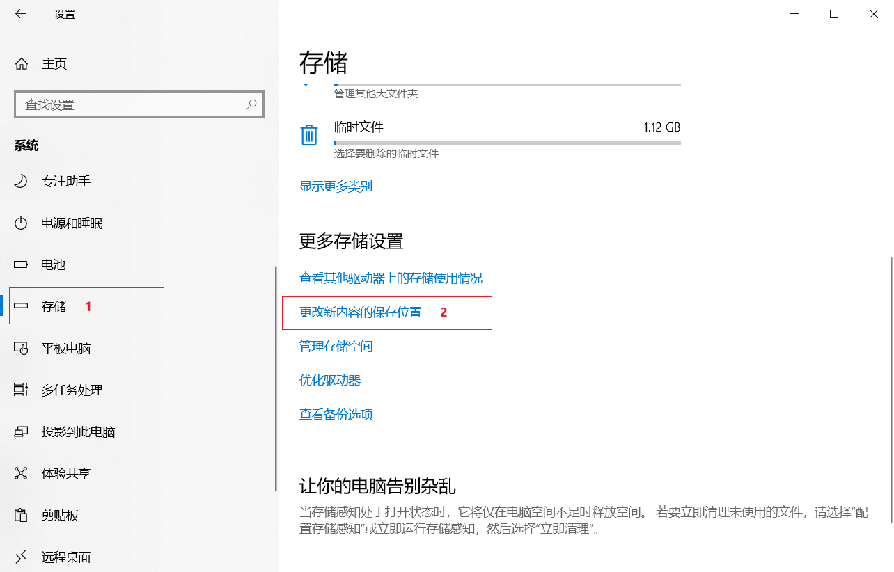

# Java技能

## Java基础

### 类型判断

```java
// 判断 [instance] 是否为 [AClass类型/AClass子类型]的[实例]
instance instanceof AClass

// 判断 [instance] 是否为 [AClass类型/AClass子类型]的[实例]
AClass.class.isInstance(instance)

// 判断 [AClass.class] 是否能被 [clazz] 赋值 → 判断 [AClass] 是否为 [Clazz]的[类型/父类型]
AClass.class.isAssignableFrom(clazz)
```

### clazz 和 instance 区别

```markdown
# clazz = SomeClass.class
[clazz]是根据[类元信息(存储结构为 C++ 的 Struct对象)] ，创建的[某个类]的[模板对象]
# instance = new SomeClass()  |  someClass = new SomeClass()
[instance]对象的[头指针]指向[Struct对象]，而[Struct对象]又对[堆中的clazz]进行了[引用]
所以，可以理解为[instance]是根据[clazz]创建的[具体对象(实例对象)]
# SomeClass.class = someClass.getClass()
```

### 泛型

#### [泛型\<T> 与 T 的用法](https://www.cnblogs.com/jpfss/p/9929108.html)

```tex
<T> T 表示返回值是一个泛型，传递啥，就返回啥类型的数据
而单独的 T 就是表示限制你传递的参数类型

以下案例中：
通过一个泛型的返回方式，获取每一个集合中的第一个数据
通过返回值 <T> T 和 T 的两种方法实现
```

```java
/*
	<T> T 用法
	  <T> 是标识符号，表示 T 是一个泛型
	  T 表示的是返回值，T是一个占位符，用来告诉编译器，这个东西先给我留着，等我编译的时候，告诉你。
*/
public class Demo {
    public static void main(String[] args) {
        Demo demo = new Demo();
        //获取string类型
        List<String> array = new ArrayList<String>();
        array.add("test");
        array.add("doub");
        String str = demo.getListFirst(array);
        System.out.println(str);

        //获取nums类型
        List<Integer> nums = new ArrayList<Integer>();
        nums.add(12);
        nums.add(13);

        Integer num = demo.getListFirst(nums);
        System.out.println(num);
    }

    /**
     * 这个<T> T可以传入任何类型的List
     * 参数T
     *     第一个 表示是泛型
     *     第二个 表示返回的是T类型的数据
     *     第三个 限制参数类型为T
     * @param data
     * @return
     */
    private <T> T getListFirst(List<T> data) {
        if (data == null || data.size() == 0) {
            return null;
        }
        return data.get(0);
    }
}

/*
	T 用法
	返回值，直接写T表示限制参数的类型，这种方法一般多用于共同操作一个类对象，然后获取里面的集合信息啥的。
*/
public class Demo2<T> {
    public static void main(String[] args) {
        //限制T 为String 类型
        Demo2<String> demo = new Demo2<String>();
        
        //获取string类型
        List<String> array = new ArrayList<String>();
        array.add("test");
        array.add("doub");
        String str = demo.getListFirst(array);
        System.out.println(str);
        
        //获取Integer类型 T 为Integer类型
        Demo2<Integer> demo2 = new Demo2<Integer>();
        List<Integer> nums = new ArrayList<Integer>();
        nums.add(12);
        nums.add(13);
        Integer num = demo2.getListFirst(nums);
        System.out.println(num);
    }

    /**
     * 这个只能传递T类型的数据
     * 返回值 就是Demo<T> 实例化传递的对象类型
     * @param data
     * @return
     */
    private T getListFirst(List<T> data) {
        if (data == null || data.size() == 0) {
            return null;
        }
        return data.get(0);
    }
}
```

#### [上界/下界 通配符](https://blog.csdn.net/qq_29951485/article/details/88068338)

```tex
# 上界通配符：泛型中 能放[T]及[T子类]
            不能往里存，只能往外取
<? extends T>

# 下界通配符：泛型中 能放[T]及[T父类]
                   get()方法部分失效，只能存放到Object对象里；set()方法正常
<? super T>
```

#### [T 和 ? 的区别](https://blog.csdn.net/gxflh/article/details/87875667)

```markdown
T → 表示不确定，但为同一种的类型，最常用的泛型表示方法
? → 表示不确定，可能不是用一种的类型，类似于通配符

K → 一般用于[键值对]中的[键]
V → 一般用于[键值对]中的[值]
只要不是? 作用都类似T
```

### [for(；；)](https://blog.csdn.net/qq_35890572/article/details/108659453)

```markdown
# java中的for(；；)
for(初始化; 判断条件; 执行语句)

for语句的语法规定，括号里面一定要有两个分号，分开三个句子。
第一个句子是初始化用的，如果没有初始化的必要，就视为空语句，加上分号；

第二个句子作为判断条件，如果没有判断条件，也视为空语句，后加一个分号。这种情况，会无限循环，相当于while(1)。如果for的执行部分，就是{}之间有break语句，可以退出；

第三个句子是执行部分执行完毕再执行的语句；无则视为空语句；此时不用再加分号。

如果三者都为空，那么表示没有初始化，没有判断条件，不执行语句。由没有判断条件，故为死循环，相当于while(true)。
```

```java
for (Iterator i$ = params.entrySet().iterator(); i$.hasNext(); queryObject.setParameter((String) entry.getKey(), entry.getValue())) {
    entry = (Map.Entry) i$.next();
}

for (Iterator<T> localIterator = objs.iterator(); localIterator.hasNext(); ) {
    T obj = localIterator.next();
    updateEntity((AuditEntity) obj, updateDate);
}
```

### if省略{}

[关于if省略{}时的一些问题](https://www.cnblogs.com/willamq/p/9554024.html)

```java
//在if语句中有这样的情况当条件成立时执行语句只有一句的时候我们通常可以省略花括号
int a = 0;
if(a == 0) a++;

//这样的情况显然是可以的但是有些情况我们需要特别注意（当if/else语句中嵌套if语句时，必须确保else语句匹配正确的if语句）例如
int i = 1, j = 1, k = 3, x = 4;
if(i == j)
    if(j == k)
        System.out.println("i 等于 k");
else if(k == x)
    System.out.println("i 等于 x");
else
    System.out.println("i 不等于 x");

//这个时候的else匹配不是我们想要的匹配在外层的，在javascript解析器中它被解析成(Java同理)
if (i == j) {
    if (j == k) {
        System.out.println("i 等于 k");
    } else if (k == x) {
        System.out.println("i 等于 x");
    } else {
        System.out.println("i 不等于 x");
    }
}

//然而我们想要的却是
if (i == j) {
    if (j == k) {
        System.out.println("i 等于 k");
    } else if (k == x) {
        System.out.println("i 等于 x");
    }
} else {
    System.out.println("i 不等于 x");
}
```

### [Object... 和  Object[]](https://blog.csdn.net/weixin_30357231/article/details/95545920)

```tex
Object... objects 和 Object[] objects 的区别

当形参为Object[] objects时数组时，调用该方法必须为一个数组
当形参为Object... objects时，调用就相当灵活了，可以不带参数，可以带一个参数或者多个参数，也可以带数组作为参数
```

### 正则表达式

#### 基本语法

```tex
https://www.jb51.net/article/73342.htm
https://www.w3cschool.cn/regexp/zoxa1pq7.html
https://www.runoob.com/regexp/regexp-tutorial.html
https://www.cnblogs.com/yirlin/archive/2006/04/12/373222.html
```

#### Java正则的不同

```markdown
# /正则表达式/
/是正则表达式分界符，两个/里面的内容是正则表达式
# Java的 / 表示字符串，不是特殊字符
直接写正则表达式内容，不用指定分解符了
# Java的 () 不能单独捕获里面内容，只能表示一个分组
js可以捕获成一个数组
```

### String常用方法

#### lastindexof()

该方法 >> 可返回一个指定的字符串值最后出现的位置，如果指定第二个参数 start，则在一个字符串中的指定位置从后向前搜索。

```tex
lastIndexOf() 方法有以下四种形式：
	public int lastIndexOf(int ch)
	从下标0开始（包括0）往后搜索，返回最后一次出现字符'ch'的索引。如果没有找到，返回-1。
	public int lastIndexOf(int ch, int fromIndex)
	从下标0开始（包括0）往后搜索到下标fromIndex（包括fromIndex），返回最后一次出现字符'ch'的索引。如果没有找到，返回-1。
	public int lastIndexOf(String str)
	从下标0开始（包括0）往后搜索，返回最后一次出现字符串'str'的【首字母】索引。如果没有找到，返回-1。
	public int lastIndexOf(String str, int fromIndex)
	从下标0开始（包括0）往后搜索到下标fromIndex（包括fromIndex。注：若fromIndex与后面【紧密连接】的【下标】【中的字符】能够匹配str，也算找到），返回最后一次出现字符串'str'的【首字母】索引。如果没有找到，返回-1。
参数：
	ch → 字符
	fromIndex → 能够搜索到的索引位置
	str → 要搜索的子字符串

stringObject.lastIndexOf(strValue,stop)
	strValue(必需)：规定需检索的字符串值			
	stop(可选的整数参数)：规定在字符串中停止检索的位置。它的合法取值是 0 到 stringObject.length - 1。如省略该参数，则检索到该字符串的结尾。

例如：
	String stringObject = "ababefgabm";
	//从下标0开始（包括0），往后搜索，查找最后一个出现字符串"ab"的下标位置。得到：7
	stringObject.lastIndexOf("ab");
	//搜索到下标7的位置（包括7。若7与后面紧密连接的下标中的字符能够匹配"ab"，也算找到），返回最后一次出现字符串"ab"的【首字母】索引。得到：7
	stringObject.lastIndexOf("ab", 7);
	//搜索到下标6的位置（包括6。若6与后面紧密连接的下标中的字符能够匹配"ab"，也算找到），返回最后一次出现字符串"ab"的【首字母】索引。得到：2
	stringObject.lastIndexOf("ab", 6);
```

#### substring()

该方法 >> 用于提取字符串中介于两个指定下标之间的字符。

```tex
方法：
	public String substring(int beginIndex)
	截取：从下标beginIndex开始（包括beginIndex）到最后一个下标（包括最后一个下标）之间的字符
	public String substring(int beginIndex, int endIndex)
	截取：从下标beginIndex开始（包括beginIndex）到下标endIndex（不包括endIndex）之间的字符
参数：
	beginIndex → 起始索引（包括）, 索引从 0 开始。
	endIndex → 结束索引（不包括）。

stringObject.substring(start,stop)
	start(必需)：一个非负的整数，规定要提取的子串的第一个字符在 stringObject 中的位置。
	stop(可选)：一个非负的整数，比要提取的子串的最后一个字符在 stringObject 中的位置多 1。如果省略该参数，那么返回的子串会一直到字符串的结尾。

例如：
	String stringObject = "ababefgabm";
	//截取：从下标3开始（包括3）到最后一个下标（包括最后一个下标）之间的字符。得到：befgabm
	stringObject.substring(3);
	//截取：从下标3开始（包括3）到下标9（不包括9）之间的字符。得到：befgab
	stringObject.substring(3,9);
```

#### split()

该方法 >> 用于分割字符串。

```tex
方法1：
	split("CharOrStr+")
	作用：以【>=这个】【字符(char)/字符串(str)】作为【分隔符】
方法2：
	split("str1|str2|str3|")
	作用：以【不同的】【字符(char1、char2、char3)/字符串(str1、str2、str3)】作为【分割符】
方法3：
	split("[char1char2char3]")
	作用：以【不同的】【字符(char1、char2、char3)】作为【分割符】

例1：
String dateStr = "---020--2-1---10----13-";
/* 以1个"-"符号作为分割 */
String[] splitArr = dateStr.split("-");
/* 以>=这个"-"符号作为分割 */
String[] splitArr2 = dateStr.split("-+");
System.out.println(Arrays.toString(splitArr));
System.out.println(Arrays.toString(splitArr2));
/* 以1个"--"字符串作为分割 */
String[] splitArr3 = dateStr.split("--");
/* 以>=这个"--"字符串作为分割 */
String[] splitArr4 = dateStr.split("--+");
System.out.println(Arrays.toString(splitArr3));
System.out.println(Arrays.toString(splitArr4));
结果：
[, , , 020, , 2, 1, , , 10, , , , 13]
[, 020, 2, 1, 10, 13]
[, -020, 2-1, -10, , 13-]
[, 020, 2-1, 10, 13-]

例2：
String str = "苹果;香蕉;;雪梨.火龙果/";
/* 符号"."为转义字符，需要用"\\"进行转义 */
String[] splitArr = str.split(";;|;|\\.|/");
System.out.println(Arrays.toString(splitArr));
结果：
[苹果, 香蕉, 雪梨, 火龙果]

例3：
String dateStr = "20- 21-. 02-21 /上午/ 09 23 24";
String[] splitArr = dateStr.split("[-./]");
System.out.println(Arrays.toString(splitArr));
结果：
[20,  21, ,  02, 21 , 上午,  09 23 24]
```

#### replace() 与 replaceAll()

[两者区别：](https://www.cnblogs.com/qiuhong10/p/8322158.html)

```tex
replace的参数是char和CharSequence，即可以支持字符的替换，也支持字符串的替换（CharSequence即字符串序列的意思,说白了也就是字符串）。
replaceAll的参数是regex，即基于规则表达式的替换，比如：可以通过replaceAll("\\d", "*")把一个字符串所有的数字字符都换成星号。

相同点：都是全部替换，即把源字符串中的某一字符或字符串全部换成指定的字符或字符串。
不同点：replaceAll支持正则表达式，因此会对参数进行解析（两个参数均是），如replaceAll("\\d", "*")，而replace则不会，replace("\\d","*")就是替换"\\d"的字符串，而不会解析为正则。

另外还有一个不同点：“\”在java中是一个转义字符，如System.out.println( "\\" ) ;只打印出一个"\"。
但是“\”也是正则表达式中的转义字符，需要用两个代表一个。
所以：\\\\被java转换成\\，\\又被正则表达式转换成\
因此：replaceAll替换“\”为"\\"，就要replaceAll("\\\\","\\\\\\\\")，而replace则replace("\\","\\\\")。

如果只想替换第一次出现的，可以使用replaceFirst()，这个方法也是基于规则表达式的替换，但与replaceAll()不同的是，只替换第一次出现的字符串。
```

### Calendar类

#### [基本使用和属性说明](https://blog.csdn.net/cqx13763055264/article/details/81088635)

```markdown
Calendar 的“年、月、日、星期、时、分、秒”这些信息，一共是17个字段。
我们使用Calendar，无非是就是使用这17个字段。它们的定义如下：
(字段0) public final static int ERA = 0;
说明：纪元。
取值：只能为0 或 1。0表示BC(“before Christ”,即公元前)，1表示AD(拉丁语“Anno Domini”,即公元)。

(字段1) public final static int YEAR = 1;
说明：年。

(字段2) public final static int MONTH = 2;
说明：月
取值：可以为，JANUARY, FEBRUARY, MARCH, APRIL, MAY, JUNE, JULY, AUGUST, SEPTEMBER, OCTOBER, NOVEMBER, DECEMBER, UNDECIMBER。
     其中第一个月是 JANUARY，它为 0。

(字段3) public final static int WEEK_OF_YEAR = 3;
(字段4) public final static int WEEK_OF_MONTH = 4;
说明：当前日期在本月中对应第几个星期。一个月中第一个星期的值为 1。

(字段5) public final static int DATE = 5;
说明：日。获取日期中某一天的值（其包含年月日，用来设计设置日期）

(字段5) public final static int DAY_OF_MONTH = 5;
说明：当前日期在本月中对应第几天，返回结果同DATE。（返回本月过了多少天）

(字段6) public final static int DAY_OF_YEAR = 6;
说明：当前日期在本年中对应第几天。（返回本年过了多少天）

(字段7) public final static int DAY_OF_WEEK = 7;
说明：当前日期是一周的第几天。（以【星期天：1】为开始，【星期六：7】为结束，返回当前过了几天）
取值：可以为，SUNDAY、MONDAY、TUESDAY、WEDNESDAY、THURSDAY、FRIDAY 和 SATURDAY。
     其中，SUNDAY为1，MONDAY为2，依次类推。

(字段8) public final static int DAY_OF_WEEK_IN_MONTH = 8;
说明：当前月中的第几个星期。

(字段9) public final static int AM_PM = 9;
说明：上午 还是 下午
取值：可以是AM 或 PM。AM为0,表示上午；PM为1,表示下午。

(字段10) public final static int HOUR = 10;
说明：指示一天中的第几小时。
HOUR 用于 12 小时制时钟 (0 - 11)。中午和午夜用 0 表示，不用 12 表示。

(字段11) public final static int HOUR_OF_DAY = 11;
说明：指示一天中的第几小时。
HOUR_OF_DAY 用于 24 小时制时钟。例如，在 10:04:15.250 PM 这一时刻，HOUR_OF_DAY 为 22。

(字段12) public final static int MINUTE = 12;
说明：一小时中的第几分钟。
例如，在 10:04:15.250 PM这一时刻，MINUTE 为 4。

(字段13) public final static int SECOND = 13;
说明：一分钟中的第几秒。
例如，在 10:04:15.250 PM 这一时刻，SECOND 为 15。

(字段14) public final static int MILLISECOND = 14;
说明：一秒中的第几毫秒。
例如，在 10:04:15.250 PM 这一时刻，MILLISECOND 为 250。

(字段15) public final static int ZONE_OFFSET = 15;
说明：毫秒为单位指示距 GMT 的大致偏移量。

(字段16) public final static int DST_OFFSET = 16;
说明：毫秒为单位指示夏令时的偏移量。

public final static int FIELD_COUNT = 17;
这17个字段是保存在int数组中。定义如下：

// 保存这17个字段的数组
protected int  fields[];
// 数组的定义函数
protected Calendar(TimeZone zone, Locale aLocale)
{
 // 初始化“fields数组”
 fields = new int[FIELD_COUNT];
 isSet = new boolean[FIELD_COUNT];
 stamp = new int[FIELD_COUNT];

 this.zone = zone;
 setWeekCountData(aLocale);
}

protected Calendar(TimeZone zone, Locale aLocale) 这是Calendar的构造函数。
它会被它的子类的构造函数调用到，从而新建“保存Calendar的17个字段数据”的数组。
```

#### [常用方法](https://blog.csdn.net/yx0628/article/details/79317440)

```java
// 使用默认时区和语言环境获得一个日历
Calendar cal = Calendar.getInstance();

//设为上个月最后一天
cal.set(Calendar.DATE,-1);
//设为当前月最后一天
cal.set(Calendar.DATE,0);
//设为当前月的1号
cal.set(Calendar.DATE,1);

//减一天，变为当前日期的上一天
cal.add(Calendar.DATE,-1);
//加一天，变为当前日期的下一天
cal.add(Calendar.DATE,1);

// 赋值时年月日时分秒常用的6个值，注意月份下标从0开始，所以取月份要+1
System.out.println("年:" + cal.get(Calendar.YEAR));
System.out.println("月:" + (cal.get(Calendar.MONTH) + 1));
System.out.println("日:" + cal.get(Calendar.DAY_OF_MONTH));
System.out.println("时:" + cal.get(Calendar.HOUR_OF_DAY));
System.out.println("分:" + cal.get(Calendar.MINUTE));
System.out.println("秒:" + cal.get(Calendar.SECOND));

/* 如果想设置为某个日期，可以一次设置年月日时分秒，由于月份下标从0开始赋值月份要-1 */
// cal.set(year, month, date, hourOfDay, minute, second);
cal.set(2021, 10, 2, 23, 59, 59);
// 或者6个字段分别进行设置，由于月份下标从0开始赋值月份要-1
cal.set(Calendar.YEAR, 2021);
//cal.set(Calendar.MONTH, 10);
cal.set(Calendar.MONTH, Calendar.NOVEMBER);//November下标为10
cal.set(Calendar.DAY_OF_MONTH, 2);
cal.set(Calendar.HOUR_OF_DAY, 23);
cal.set(Calendar.MINUTE, 59);
cal.set(Calendar.SECOND, 59);
// 输出设置的时间
System.out.println(cal.getTime());
```

### [匿名内部类、匿名对象](https://www.cnblogs.com/gobetter/p/13811689.html)

```java
/*
	如果接口的实现类（或者是父类的子类），只需要使用唯一的一次
	那么这种情况下就可以省略掉该类的定义，而改为使用【匿名内部类】
*/
//匿名内部类的定义格式：
接口名称 对象名 = new 接口名称() {
    //覆盖重写所有抽象方法
};

/* 对格式"new 接口名称() {...}"进行解析
	1) new代表创建对象的动作
	2) 接口名称就是匿名内部类需要实现哪个接口
	3) {...}才是匿名内部类的内容
*/

/* 另外还要注意几个问题
	1) 匿名内部类，在创建对象的时候，只能创建唯一一个
	   如果希望多次创建对象，而且类的内容一样化，就必须使用单独定义的实现类了（或者多次创建）
	2) 匿名对象，在【调用方法的时候】只能调用唯一一次
	   如果希望同一个对象调用多个方法，那么对象必须取个名字（或者多次调用）
	3) 匿名内部类是省略了【实现类/子类名称】，匿名对象省略了【对象名称】
	强调：匿名内部类和匿名对象名称不是一回事
*/

public class DemoMain {
    public static void main(String[] args) {
        //MyInterface obj = new MyInterfaceImpl();
        //obj.method();
        //MyInterface obj = new MyInterface();

        //使用匿名内部类,但不是匿名对象，对象名称就叫objA
        MyInterface objA = new MyInterface() {
            public void method() {
                System.out.println("匿名内部类实现了方法__");
            }
            public void method2() {
                System.out.println("匿名内部类实现了方法222__");
            }
        };
        objA.method();
        objA.method2();
        System.out.println("========================");

        //使用了匿名内部类，而且省略了匿名对象名称，也是匿名对象
        new MyInterface() {
            @Override
            public void method() {
                System.out.println("匿名内部类实现了方法__b");
            }
            public void method2() {
                System.out.println("匿名内部类实现了方法222__b");
            }
        }.method();
        //因为匿名对象无法调用第二次方法，需要在创建匿名内部类的匿名对象
        new MyInterface() {
            @Override
            public void method() {
                System.out.println("匿名内部类实现了方法__b");
            }
            public void method2() {
                System.out.println("匿名内部类实现了方法222__b");
            }
        }.method2();
    }
}

interface MyInterface {
    public abstract void method();//抽象方法
    public abstract void method2();
}
```

### [HashSet 如何保证元素不重复](https://www.cnblogs.com/jeremylai7/p/15596575.html)

HashSet 不重复主要add 方法实现，使用 add 方法找到是否存在元素，存在就不添加，不存在就添加。HashSet 主要是基于HashMap 实现的，HashMap 的key就是 HashSet 的元素，HashSet 基于hash 函数实现元素不重复。
首先看 add 方法：

```java
public boolean add(E e) {
    return map.put(e, PRESENT)==null;
}
```

HashMap 的put 方法，map 的 put 方法调用 putVal 方法。

```java
public V put(K key, V value) {
    return putVal(hash(key), key, value, false, true);
}
```

hash 方法就是计算hash值,和右移16位^做运算使得hash分布更均衡。

```java
static final int hash(Object key) {
    int h;
    return (key == null) ? 0 : (h = key.hashCode()) ^ (h >>> 16);
}
```

```java
/**
 * Implements Map.put and related methods.
 *
 * @param hash hash for key
 * @param key the key
 * @param value the value to put
 * @param onlyIfAbsent if true, don't change existing value
 * @param evict if false, the table is in creation mode.
 * @return previous value, or null if none
 */
final V putVal(int hash, K key, V value, boolean onlyIfAbsent,
               boolean evict) {
    Node<K,V>[] tab; Node<K,V> p; int n, i;
    //如果table 为null，table数组做扩容
    if ((tab = table) == null || (n = tab.length) == 0)
        n = (tab = resize()).length;
    //在tab数组的位置上找不到元素，直接添加元素
    if ((p = tab[i = (n - 1) & hash]) == null)
        tab[i] = newNode(hash, key, value, null);
    //在tab数组上存在元素
    else {
        Node<K,V> e; K k;
        //hash值一致，key也是一致的话，表示原来的位置的 key 和现在插入的 key 是一致的，直接替换
        if (p.hash == hash &&
            ((k = p.key) == key || (key != null && key.equals(k))))
            e = p;
        //value类型是TreeNode，引入红黑树，红黑树不存在，直接添加。存在则替换
        else if (p instanceof TreeNode)
            e = ((TreeNode<K,V>)p).putTreeVal(this, tab, hash, key, value);
        else {
            for (int binCount = 0; ; ++binCount) {
                if ((e = p.next) == null) {
                    p.next = newNode(hash, key, value, null);
                    if (binCount >= TREEIFY_THRESHOLD - 1) // -1 for 1st
                        treeifyBin(tab, hash);
                    break;
                }
                if (e.hash == hash &&
                    ((k = e.key) == key || (key != null && key.equals(k))))
                    break;
                p = e;
            }
        }
        if (e != null) { // existing mapping for key
            V oldValue = e.value;
            if (!onlyIfAbsent || oldValue == null)
                e.value = value;
            afterNodeAccess(e);
            return oldValue;
        }
    }
    ++modCount;
    if (++size > threshold)
        resize();
    afterNodeInsertion(evict);
    //不存在原来的 key,返回 null
    return null;
}
```

### #{}和 ${}的区别是什么

```tex
https://blog.csdn.net/qq_41026809/article/details/90523216
```

### [对象与实例的区别](https://blog.csdn.net/WMLWONDER/article/details/41680505)

```tex
# 说法1
例如：
Student是一个类， 
语句：
Student stu; //只是声明了一个引用，并不关联到特定的实例
Student stu = new Student();
上面语句实例化了一个Student对象，new Student()是调用类的构造函数产生实例，最后让引用和实例相关。
stu是【Student对象】或【实例】的【引用】，对象和实例的概念是相同的。

如果仅用：
Student s; //声明引用后，无法调用类的属性和方法，因为它并不和任何实例相关

# 说法2
Class c = Class.forName("className");
Object obj = c.newInstance();
c是类对象的引用
obj是实例对象的引用

# 说法3
对象是一个统称
可以分为【类对象】和【实例对象】
即：【Object.class】和【Object.class.newInstance()】
类对象是实例对象的模版
类似的概念有原类【metaclass】，是类的模版 
```

### HashMap头插法循环

```tex
https://www.bilibili.com/video/av459045712
```

### [访问修饰符](https://blog.csdn.net/m0_54189068/article/details/126711589)

|     修饰符      | Class | Package | Subclass | World |
| :-------------: | :---: | :-----: | :------: | :---: |
|     public      |   √   |    √    |    √     |   √   |
|    protected    |   √   |    √    |    √     |   ×   |
| package-private |   √   |    √    |    ×     |   ×   |
|     private     |   √   |    ×    |    ×     |   ×   |

```tex
public: 在所有类中都是可见的
protected: 仅在自己的包中、自己的子类中可见
package-private（没有修饰符）: 仅在自己的包中可见
private: 仅在自己的类中可见
```

### 反射问题

```java
private final int cycleNum = 10000000;

private int calculate() {
    return 1;
}

public void normalCal() {
    for (int i = 0; i < cycleNum; i++) {
        calculate();
    }
}

public void reflectedCal() {
    try {
        for (int i = 0; i < cycleNum; i++) {
            Method method = MybatisTest.class.getDeclaredMethod("calculate");
            method.invoke(this);
        }
    } catch (NoSuchMethodException | InvocationTargetException | IllegalAccessException e) {
        throw new RuntimeException(e);
    }
}

public void reflectedCal2() {
    try {
        Method method = MybatisTest.class.getDeclaredMethod("calculate");
        for (int i = 0; i < cycleNum; i++) {
            method.invoke(this);
        }
    } catch (NoSuchMethodException | InvocationTargetException | IllegalAccessException e) {
        throw new RuntimeException(e);
    }
}
```

| 循环次数 | 方法          | 耗时    |
| -------- | ------------- | ------- |
| cycleNum | normalCal     | 24 ms   |
| cycleNum | reflectedCal  | 4716 ms |
| cycleNum | reflectedCal2 | 964 ms  |

```markdown
# 由于上述只测试了[方法获取]和[方法调用]时[反射的性能]
考虑到还有其他功能，取大致性能差距 (4716/2) / 24 = 98.25 ≈ 100 倍

# 每次反射耗时
4716/2/cycleNum = 0.0002358 ms

# 按照[60~120 HZ]的[刷新率]
[一帧耗时]在[8.3~16.7 ms]左右 (在一帧内做的所有事情加起来的耗时，不能超过这个数值，才能确保不掉帧)
# 假设[一帧]内[所有时间]都让给[反射] 
8.3/0.0002358 = 35199.321458863 ≈ 35200 (大约做 35200 次反射，会掉帧)
# 当然不可能全留给反射，假设[10% 的时间]让给[反射]
8.3/10/0.0002358 ≈ 3520 (大约做 3520 次反射，会掉帧)

# 结论
反射虽然慢，正常用也没关系；但是在[循环]或者[高频繁调用]的场景中，还是要注意使用

# 注意
以上是测试结果是在[API 33]环境下
在 [API 19 & Dalvik(安卓 4.4 以下)、[API 18]、[API 15] 的环境下，反射性能分别下降 [20~300 倍]
即便取 [100倍]，3520/100 = 35 次，还是很容易掉帧的
在 [API 19 & ART(安卓 4.4 以上)] 的环境下，性能会提升4倍左右，所以高版本也可以适当的使用
```

### JVM

栈帧、操作数栈和局部变量表

```tex
https://zhuanlan.zhihu.com/p/45354152
```

理解Java中的静态域、代码块和内存区域图

```tex
https://blog.csdn.net/hxhaaj/article/details/81174743
```

## Java进阶

### Excel导出

关键字 >> POI导出excel：设置字体颜色、行高自适应、列宽自适应、锁住单元格、合并单元格

```tex
https://zzzgd.blog.csdn.net/article/details/80627175
```

### Url校验

关键字 >> Java中正则验证URL是否合法

```tex
https://www.cnblogs.com/gongqijundemao/p/11049785.html
```

### ES线上环境集群

相关公众号：铭毅天下Elasticsearch、dbaplus社群

关键字 >> 亿级日增量的ES线上环境集群部署，上干货！

```tex
https://mp.weixin.qq.com/s/8PjfMqZGDkOk_hv4iIaqNg
```

### 熔断/降级/缓存...

相关公众号：最代码

关键字 >> 三天撸完降级、限流、隔离、熔断、缓存......爽！

```tex
https://mp.weixin.qq.com/s/pyKEXE5mnXsjLmOHVrcghQ
```

### 分库分表/事务...

关键字 >> 3天，我把MySQL索引、锁、事务、分库分表撸干净了！

```tex
https://mp.weixin.qq.com/s/7DTGA7jv0XeGLaqYDce5Bg
```

### Java导出CSV文件

博客园：废物大师兄

```tex
https://www.cnblogs.com/cjsblog/p/9260421.html
```

具体用法

<a href="../document/02/Summary/test/CSVTest.java">CSVTest.java</a>

## JSP

```markdown
# Jsp之Taglib，自定义标签详解
https://blog.csdn.net/ITlanyue/article/details/118674805
* 标签接口介绍
JSP 所有的标签都实现了 javax.servlet.jsp.tagext.JspTag 接口；该接口的两个直接子接口如下：
1) SimpleTag ===> JSP2.0 新增加的接口（后文中统一称作简单标签）
2) Tag ===> 它是经典的、必须实现的接口，它有一个直接子接口就是IterationTag(后文中统一称作传统标签)
   Tag 接口有一个直接子接口 IterationTag (后文中统一称作传统标签)，该接口继承了 Tag 接口；
   Tag 接口有一个直接子接口 TagSupport，该接口实现了 Tag 接口；
   （TagSupport 接口有一个直接子接口 BodyTagSupport ；它允许带有 body 的标签）
```

## JDK

新特性

```markdown
# Java 11—Java 17特性详解
https://www.zhihuclub.com/178092.shtml

# JDK8,JDK11,JDK17,JDK21及中间版本主要更新特性
https://blog.csdn.net/ycsdn10/article/details/131872958

# Java 21 新功能展示
https://blog.csdn.net/u010398771/article/details/133127060

# Java新特性中的Preview功能如何运行和调试
https://zhuanlan.zhihu.com/p/659480150
```

## 封装工具类

如何优雅的判断一个对象的属性是否全部为空

```tex
https://blog.csdn.net/pony_maggie/article/details/102877834
```

<a href="../document/02/Summary/util/ObjectIsNullUitl.java">ObjectIsNullUitl.java</a>

## 常见错误

### [jdk-8以上版本不能使用jdk.internal.misc.Unsafe报错解决](https://www.jianshu.com/p/e3a82bae68b2)

#### 运行时添加参数

```tex
--add-opens java.base/jdk.internal.misc=ALL-UNNAMED
或者
--add-opens=java.base/jdk.internal.misc=ALL-UNNAMED
```

IDEA工具中

```tex
Run → Edit Configurations → Application → 引入Unsafe的类 → Modify potions → Add VM potions → 填写以上代码
```

#### 编译时添加参数

```tex
--add-exports=java.base/jdk.internal.misc=ALL-UNNAMED
```

pom.xml

```xml
<build>
    <plugins>
        <!-- Unsafe编译插件 -->
        <plugin>
            <groupId>org.apache.maven.plugins</groupId>
            <artifactId>maven-compiler-plugin</artifactId>
            <version>3.8.1</version>
            <configuration>
                <compilerArgument>--add-exports=java.base/jdk.internal.misc=ALL-UNNAMED</compilerArgument>
            </configuration>
        </plugin>
    </plugins>
</build>
```

### java命令行编译并执行

```markdown
# 编译
javac 类.java
# 编码GBK的不可映射字符
javac -encoding utf-8 类.java
# 注意：若 类1 引入了 类2 ，需要同时编译
javac -encoding utf-8 类1.java 类2.java

# 执行
java 类
# 找不到或无法加载主类
-- 方案1
去掉类中的[包名] package xxx.xxx...;
-- 方案2
创建与[包名]同样结构的[文件目录]，并进入[文件目录]的[上级文件夹]执行命令
java 包名.类
★例如: JDKFeature.class 文件在以下目录
D:\DevSpace\IdeaDoc\IdeaDaily\daily_practice\java-test\target\classes\common\new_feature\JDKFeature.class
cd D:\DevSpace\IdeaDoc\IdeaDaily\daily_practice\java-test\target\classes
java common.new_feature.JDKFeature

# 报错
Exception in thread "main" java.lang.UnsupportedClassVersionError: xxx/... has been compiled by a more recent version of the Java Runtime (class file version xx.xxx), this version of the Java Runtime only recognizes class file versions up to xx.x
# JVM无法识别由更高版本JDK编译的类文件 → 查看当前环境变量的JDK版本 是否对应 编译Java文件的JDK版本
java -version

# 报错
java.lang.UnsupportedClassVersionError: Preview features are not enabled for xxx/... (class file version xx.xxx). Try running with '--enable-preview'
# 启动时，添加新特性参数
java --enable-preview xxx.xxx
★例如
java --enable-preview common.new_feature.JDKFeature

# 显示
错误: 无法初始化主类 common.new_feature.JDKFeature
原因: java.lang.NoClassDefFoundError: cn/hutool/core/date/Week
# 添加所依赖[hutool jar包]的[文件路径]
java --enable-preview -cp "D:\DevSpace\IdeaDoc\IdeaDaily\daily_practice\java-test\target\classes;E:\DevDoc\maven\repository\cn\hutool\hutool-core\5.7.12\hutool-core-5.7.12.jar" common.new_feature.JDKFeature
```

# Spring使用

## 通配符 -> 包扫描

```xml
<!--
    假设有以下包结构:
    com.example
               .pac1
                    .service1.java
                    .pac_son1
                           .service_son1.java
               .pac2
                    .service2.java
               .service3.java
    com.example2
               .xxx
    com.example3
               .xxx
-->

<!--
    通配符 * -> 用于匹配任意数量的字符、空字符，在上下文中表示一级路径匹配
    如上结构: 将匹配 com.example [所有一级子包的类] 但是 [不包括 当前包下的类]
    最终注册: service1、service2
-->
<context:component-scan base-package="com.example.*" />

<!--
    通配符 ** -> 用于匹配任意数量的字符、空字符和子包，在上下文中表示多级路径匹配(可以递归地匹配多级路径)
    如上结构： 将匹配 com.example [当前包下的类] 以及 [遍历 所有子包的类]
    最终注册: service1、service_son1、service2、service3
-->
<context:component-scan base-package="com.example.**" />

<!--
	不加匹配符号 等价于 **
	但是比 ** 的范围更大，com.example2、com.example3、... 都会被扫描
-->
<context:component-scan base-package="com.example" />
```

## 参数返回与接收

```markdown
# Mybatis参数返回
* 可在sql语句中起别名，如下：
select o.USERNAME as \"UserName"\ form user_info as o

# 类对象处理
* 可在属性上面添加 @JsonProperty (com.fasterxml.jackson.annotation)，如下：
@TableField("USERNAME")
@JsonProperty("UserName")
private String username;

# 返回给前端的对象属性
【Map、List、对象】的【JSON格式】
* 需加 @ResponseBody 或者 @RestController(等于 @Controller 和 @ResponseBody)

# 后端接收属性
1) @QueryParam 和 @RequestParam
都是采用键值对的方式取值，方法名后面加 "?" 开始，多个参数用 "&" 拼接，格式为：
/getInfos?pageNum=1&pageSize=10
* 注解中有四个配置参数：
@RequestParam(name/value="param", required=true(默认)/false, defaultValue="xxx")
* 例如：
@RequestMapping("/getInfos")
@RequestParam(value = "pageNum", required=false, defaultValue = "1")

2) @PathParam 和 @PathVariable
都是通过路径映射取值，参数都用 "/" 按照约定的顺序拼接在方法后面，格式为：
/getInfos/1/10
* 注解中有三个配置参数：
@PathVariable(name/value="param", required=true(默认)/false)
* 例如：
@RequestMapping("/getInfos/{num}/{size}")
public String getInfos(@PathVariable("num", defaultValue = "1") Integer n, 
@PathVariable("size", defaultValue = "10") Integer s)

3) @RequestBody JsonObject jsonObj
来处理content-type不是默认的application/x-www-form-urlcoded编码的内容，比如：
application/json 或者 application/xml

4) @BeanParam
```

## [各种 JAR包 的作用](https://www.funyan.cn/p/2202.html)

```tex
spring.jar
是包含有完整发布模块的单个jar包。但是不包括mock.jar, aspects.jar, spring-portlet.jar, and spring-hibernate2.jar

spring-src.zip
就是所有的源代码压缩包

除了spring.jar文件，Spring 还包括有其它21个独立的jar包，各自包含着对应的Spring组件，用户可以根据自己的需要来选择组合自己的jar包，而不必引入整个spring.jar的所有类文件。

spring-core.jar
这个jar文件包含Spring框架基本的核心工具类。Spring其它组件要都要使用到这个包里的类，是其它组件的基本核心，当然你也可以在自己的应用系统中使用这些工具类。
外部依赖Commons Logging (Log4J)。

spring-beans.jar
这个jar文件是所有应用都要用到的，它包含访问配置文件、创建和管理bean以及进行Inversion of Control / Dependency Injection（IoC/DI）操作相关的所有类。如果应用只需基本的IoC/DI 支持，引入spring-core.jar 及spring-beans.jar文件就可以了。
外部依赖spring-core (CGLIB)。

spring-aop.jar
这个jar文件包含在应用中使用Spring的AOP特性时所需的类和源码级元数据支持。使用基于AOP的Spring特性，如声明型事务管理（Declarative Transaction Management），也要在应用里包含这个jar包。
外部依赖spring-core (spring-beans，AOP Alliance，CGLIB，Commons Attributes)。

spring-context.jar
这个jar文件为Spring核心提供了大量扩展。可以找到使用Spring ApplicationContext特性时所需的全部类，JDNI所需的全部类，instrumentation组件以及校验Validation方面的相关类。
外部依赖spring-beans (spring-aop)。

spring-dao.jar
这个jar文件包含Spring DAO、Spring Transaction 进行数据访问的所有类。为了使用声明型事务支持，还需在自己的应用里包含spring-aop.jar。
外部依赖spring-core (spring-aop，spring-context，JTA API)。

spring-jdbc.jar
这个jar文件包含对Spring 对JDBC 数据访问进行封装的所有类。
外部依赖spring-beans，spring-dao。

spring-support.jar
这个jar文件包含支持UI模版（Velocity，FreeMarker，JasperReports），邮件服务，脚本服务(JRuby)，缓存Cache（EHCache），任务计划Scheduling（uartz）方面的类。
外部依赖spring-context (spring-jdbc, Velocity, FreeMarker, JasperReports, BSH, Groovy, JRuby, Quartz, EHCache)

spring-web.jar
这个jar文件包含Web应用开发时，用到Spring 框架时所需的核心类，包括自动载入Web Application Context 特性的类、Struts 与JSF 集成类、文件上传的支持类、Filter 类和大量工具辅助类。
外部依赖spring-context, Servlet API (JSP API, JSTL, Commons FileUpload, COS)。

spring-webmvc.jar
这个jar文件包含Spring MVC框架相关的所有类。包括框架的Servlets，Web MVC框架，控制器和视图支持。当然，如果你的应用使用了独立的MVC 框架，则无需这个JAR 文件里的任何类。
外部依赖spring-web (spring-support，Tiles，iText，POI)。

spring-portlet.jar
spring自己实现的一个类似Spring MVC的框架。包括一个MVC框架和控制器。
外部依赖spring-web， Portlet API，(spring-webmvc)。

spring-struts.jar
Struts框架支持，可以更方便更容易的集成Struts框架。
外部依赖spring-web，Struts。

spring-remoting.jar
这个jar文件包含支持EJB、远程调用Remoting（RMI、Hessian、Burlap、Http Invoker、JAX-RPC）方面的类。
外部依赖spring-aop (spring-context，spring-web，Hessian，Burlap，JAX-RPC，EJB API)。

spring-jmx.jar
这个jar包提供了对JMX 1.0/1.2的支持类。
外部依赖spring-beans，spring-aop，JMX API。

spring-jms.jar
这个jar包提供了对JMS 1.0.2/1.1的支持类。
外部依赖spring-beans，spring-dao，JMS API。

spring-jca.jar
对JCA 1.0的支持。
外部依赖spring-beans，spring-dao， JCA API。

spring-jdo.jar
对JDO 1.0/2.0的支持。
外部依赖spring-jdbc，JDO API (spring-web)。

spring-jpa.jar
对JPA 1.0的支持。
外部依赖spring-jdbc，JPA API (spring-web)。

spring-hibernate2.jar
对hibernate 2.1的支持，已经不建议使用。
外部依赖spring-jdbc，Hibernate2 (spring-web)。

spring-hibernate3.jar
对Hibernate 3.0/3.1/3.2的支持。
外部依赖spring-jdbc，Hibernate3 (spring-web)。

spring-toplink.jar
对TopLink框架的支持。
外部依赖spring-jdbc，TopLink。

spring-ibatis.jar
对iBATIS SQL Maps的支持。
外部依赖spring-jdbc，iBATIS SQL Maps。

另外的两个包。
spring-mock.jar
这个jar文件包含Spring一整套mock类来辅助应用的测试。Spring 测试套件使用了其中大量mock类，这样测试就更加简单。模拟HttpServletRequest 和HttpServletResponse 类在Web 应用单元测试是很方便的。并且提供了对JUnit的支持。
外部依赖spring-core。

spring-aspects.jar
提供对AspectJ的支持，以便可以方便的将面向方面的功能集成进IDE中，比如Eclipse AJDT。
外部依赖WEAVER JARS (dist/weavers)

说明
spring-agent.jar
Spring的InstrumentationSavingAgent (为InstrumentationLoadTimeWeaver)，一个设备代理包，可以参考JDK1.5的Instrumentation功能获得更多信息。
外部依赖none (for use at JVM startup: “-javaagent:spring-agent.jar”)。

spring-tomcat-weaver.jar
扩展Tomcat的ClassLoader，使其可以使用instrumentation（设备）类。
外部依赖none (for deployment into Tomcat’s “server/lib” directory)。
```

## [beans.xml头部配置](https://blog.csdn.net/Beau_lb/article/details/115204248)

```xml
<?xml version="1.0" encoding="UTF-8"?>
<beans xmlns="http://www.springframework.org/schema/beans"
       xmlns:xsi="http://www.w3.org/2001/XMLSchema-instance"
       xmlns:aop="http://www.springframework.org/schema/aop"
       xmlns:tx="http://www.springframework.org/schema/tx"
       xmlns:p="http://www.springframework.org/schema/p"
       xmlns:util="http://www.springframework.org/schema/util"
       xmlns:context="http://www.springframework.org/schema/context"
       xmlns:mvc="http://www.springframework.org/schema/mvc"
       xsi:schemaLocation="http://www.springframework.org/schema/beans
        http://www.springframework.org/schema/beans/spring-beans.xsd
        http://www.springframework.org/schema/aop
        http://www.springframework.org/schema/aop/spring-aop.xsd
        http://www.springframework.org/schema/tx
        http://www.springframework.org/schema/tx/spring-tx.xsd
        http://www.springframework.org/schema/util
        http://www.springframework.org/schema/util/spring-util.xsd
        http://www.springframework.org/schema/context
        http://www.springframework.org/schema/context/spring-context.xsd
        http://www.springframework.org/schema/mvc
        http://www.springframework.org/schema/mvc/spring-mvc.xsd">

    //指定要扫描的包，这个包下面的注解就会生效
    <context:component-scan base-package="com.bean"/>
    <context:annotation-config/>
</beans>
```

## Spring配置数据源

[三种方式：dbcp,c3p0,jndi](https://blog.csdn.net/lushuaiyin/article/details/84180334)

## 定时器

使用spring+quartz配置多个定时任务

### 1 添加【执行类】与【任务】

配置org.springframework.scheduling.quartz.MethodInvokingJobDetailFactoryBean

```tex
https://www.cnblogs.com/shizhijie/p/8243934.html
```

```xml
<!-- 执行类 -->
<bean name="job1" class="com.quartz.demo.Job1Demo"/>
<bean name="job2" class="com.quartz.demo.Job2Demo"/>

<!-- 任务1配置 -->
<bean id="jobDetail_1" class="org.springframework.scheduling.quartz.MethodInvokingJobDetailFactoryBean">
	<!-- 执行的类 -->
	<property name="targetObject">
		<ref bean="job1" />
	</property>
	<!-- 类中的方法 -->
	<property name="targetMethod">
		<value>say</value>
	</property>
</bean>
<!-- 任务2配置 -->
<bean id="jobDetail_2" class="org.springframework.scheduling.quartz.MethodInvokingJobDetailFactoryBean">
	<!-- 执行的类 -->
    <property name="targetObject">
		<ref bean="job2" />
	</property>
    <!-- 类中的方法 -->
	<property name="targetMethod">
		<value>jump</value>
	</property>
</bean>
```

### 2 添加【触发器】

配置org.springframework.scheduling.quartz.CronTriggerBean

```tex
https://blog.csdn.net/dengsilinming/article/details/8259752
```

```xml
<!-- 触发任务1 -->
<bean id="cronTrigger_1" class="org.springframework.scheduling.quartz.CronTriggerBean">
	<property name="jobDetail">
		<ref bean="jobDetail_1" />
	</property>
	<!-- 每一秒执行一次 -->
	<property name="cronExpression">
		<value>0/1 * * * * ?</value>
	</property>
</bean>
<!-- 触发任务2 -->
<bean id="cronTrigger_2" class="org.springframework.scheduling.quartz.CronTriggerBean">
	<property name="jobDetail">
		<ref bean="jobDetail_2" />
	</property>
	<!-- 每2分钟执行一次 -->
	<property name="cronExpression">
		<value>0 0/2 * * * ?</value>
	</property>
</bean>
```

​	一个Quartz的CronTrigger表达式分为【七项】【子表达式】，其中【每一项】【以空格隔开】，从左到右分别是【秒，分，时，月的某天，月，星期的某天，年】，其中【年】【不是必须的】，也就是说【任何一个表达式】【最少需要六项】。如：0 0 12 ? * WED 表示每个星期三的12点执行，这里没有 "年" 这项。

| 字段名     | 必须 | 值的范围            | 特殊字符                  |
| :--------- | :--- | :------------------ | :------------------------ |
| 秒         | 是   | 0-59                | ,   -   *   /             |
| 分         | 是   | 0-59                | ,   -   *   /             |
| 时         | 是   | 0-23                | ,   -   *   /             |
| 月的某天   | 是   | 1-31                | ,   -   *   /   ?   L   W |
| 月         | 是   | 1-12  或  JAN-DEC   | ,   -   *   /             |
| 星期的某天 | 是   | 1-7                 | ,   -   *   /   ?   L   # |
| 年         | 否   | empty  或 1970-2099 | ,   -   *   /             |

示列："0 0/30 8-10 5,20 * ?"  表示 “每个月的5日和20日的8:00,8:30,9:00,9:30,10:00,10:30”
字符解释：
【 , 】与。表式 "," 两边的值都是需要执行的时间，如上例 "5,20"，每个月的5日与20日。
【 - 】表示值的范围。如上例 "8-10"，从8点开始到10结束，包括8点与10点。
【 * 】表式任意可合法的值。如上例 "*" 是处于月份的字段，所以代表1-12中的任意值，所以上例是指 “每个月”。
【 / 】增量。如上例是指从0分开始，每过30分钟取一次值。如果换成 "5/8" 就是从第5分钟开始每过8分钟取一次值：8:05,8:13,8:21,8:29等等。
【 ? 】不指定值。就是 "我也不知道" 的意思，只能出现在 "月的某天" 或 "星期的某天" 项中。在以下情况下使用：如上例如果指定值为星期一，那么可能会出现如4月5日不是星期一，这里就是不对应，有冲突，所以指定为 "?"，也就是说我也不知道是星期几，只要是5日与20日就行了，至于是星期几不管！
【 L 】最后的，last的意思，只能出现在 "月的某天" 或 "星期的某天" 项中。表示当前月或当前星期的最后一天，注意的是星期的最后一天为星期六。
【 W 】月中最接近指定日期的普通日（星期一到星期五），只能出现在 "月的某天"，如 "15W" 就是说当前月最接近15日的普通日，如果当月的15是星期三就是星期三，如果当月的15是星期六那么就是昨天也就是星期五，如果当月的15是星期天则为第二天也就是星期一。
【 # 】当前月的第N个星期X日，只能出现在 "星期的某天" 项中。如 "6#3" 就是说当前月的第三个星期五，注意 "1-7"，1=星期天，2=星期一，3=星期二 等等。

### 3 执行【触发器】

配置org.springframework.scheduling.quartz.SchedulerFactoryBean

```xml
<!-- 总配置 -->
<bean class="org.springframework.scheduling.quartz.SchedulerFactoryBean">
	<!-- 添加触发器 -->
	<property name="triggers">
		<list>
			<ref bean="cronTrigger_1" />
			<ref bean="cronTrigger_2" />  
		</list> 
	</property>
</bean>
```

## Spring注入

### Spring依赖注入三种方式

```tex
https://blog.csdn.net/fuhanghang/article/details/105382528
```

### SpringMVC 自定义方法参数注入

```tex
https://blog.csdn.net/Captain_J/article/details/53484746
```

### SpringMVC 依赖注入带参构造函数

```tex
https://blog.51cto.com/suyanzhu/1558488
```

## spring事务

```tex
百度贴吧帖主：阿里渣渣

关键字：12个场景导致spring事务失效，要牢记！！！

https://tieba.baidu.com/p/7537986154
```

```markdown
# 前言
对于从事java开发工作的同学来说，spring的事务肯定再熟悉不过了。
在某些业务场景下，如果一个请求中，需要同时写入多张表的数据。为了保证操作的原子性（要么同时成功，要么同时失败），避免数据不一致的情况，我们一般都会用到spring事务。
确实，spring事务用起来贼爽，就用一个简单的注解：@Transactional，就能轻松搞定事务。我猜大部分小伙伴也是这样用的，而且一直用一直爽。
但如果你使用不当，它也会坑你于无形。
今天我们就一起聊聊，事务失效的一些场景，说不定你已经中招了。不信，让我们一起看看。
```

### 一、事务不生效

#### 1.访问权限问题

```tex
众所周知，java的访问权限主要有四种：private、default、protected、public，它们的权限从左到右，依次变大。
但如果我们在开发过程中，把有某些事务方法，定义了错误的访问权限，就会导致事务功能出问题，例如：
@Service
public class UserService {
	@Transactional
	private void add(UserModel userModel) {
		saveData(userModel);
		updateData(userModel);
	}
}
我们可以看到add方法的访问权限被定义成了private，这样会导致事务失效，spring要求被代理方法必须是public的。
说白了，在AbstractFallbackTransactionAttributeSource类的computeTransactionAttribute方法中有个判断，如果目标方法不是public，则TransactionAttribute返回null，即不支持事务。


protected TransactionAttribute computeTransactionAttribute(Method method, @Nullable Class<?> targetClass) {
	// Don't allow no-public methods as required.
	if (allowPublicMethodsOnly() && !Modifier.isPublic(method.getModifiers())) {
		return null;
	}
	
	// The method may be on an interface, but we need attributes from the target class.
	// If the target class is null, the method will be unchanged.
	Method specificMethod = AopUtils.getMostSpecificMethod(method, targetClass);
	
	// First try is the method in the target class.
	TransactionAttribute txAttr = findTransactionAttribute(specificMethod);
	if (txAttr != null) {
		return txAttr;
	}
	
	// Second try is the transaction attribute on the target class.
	txAttr = findTransactionAttribute(specificMethod.getDeclaringClass());
	if (txAttr != null && ClassUtils.isUserLevelMethod(method)) {
		return txAttr;
	}
	
	if (specificMethod != method) {
		// Fallback is to look at the original method.
		txAttr = findTransactionAttribute(method);
		if (txAttr != null) {
			return txAttr;
		}
		// Last fallback is the class of the original method.
		txAttr = findTransactionAttribute(method.getDeclaringClass());
		if (txAttr != null && ClassUtils.isUserLevelMethod(method)) {
			return txAttr;
		}
	}
	return null;
}
也就是说，如果我们自定义的事务方法（即目标方法），它的访问权限不是public，而是private、default或protected的话，spring则不会提供事务功能。
```

#### 2.方法用final修饰

```tex
有时候，某个方法不想被子类重新，这时可以将该方法定义成final的。普通方法这样定义是没问题的，但如果将事务方法定义成final，例如：
@Service
public class UserService {
	@Transactional
	public final void add(UserModel userModel){
		saveData(userModel);
		updateData(userModel);
	}
}
我们可以看到add方法被定义成了final的，这样会导致事务失效。

为什么？
如果你看过spring事务的源码，可能会知道spring事务底层使用了aop，也就是通过jdk动态代理或者cglib，帮我们生成了代理类，在代理类中实现的事务功能。
但如果某个方法用final修饰了，那么在它的代理类中，就无法重写该方法，而添加事务功能。

注意：如果某个方法是static的，同样无法通过动态代理，变成事务方法。
```

#### 3.方法内部调用

```tex
有时候我们需要在某个Service类的某个方法中，调用另外一个事务方法，比如：
@Service
public class UserService {
	@Autowired
	private UserMapper userMapper;
	
	@Transactional
	public void add(UserModel userModel) {
		userMapper.insertUser(userModel);
		updateStatus(userModel);
	}
	
	@Transactional
	public void updateStatus(UserModel userModel) {
		doSameThing();
	}
}
我们看到在事务方法add中，直接调用事务方法updateStatus。从前面介绍的内容可以知道，updateStatus方法拥有事务的能力是因为spring aop生成代理了对象，但是这种方法直接调用了this对象的方法，所以updateStatus方法不会生成事务。

由此可见，在同一个类中的方法直接内部调用，会导致事务失效。

那么问题来了，如果有些场景，确实想在同一个类的某个方法中，调用它自己的另外一个方法，该怎么办呢？
```

##### 3.1 新加一个Service方法

```tex
这个方法非常简单，只需要新加一个Service方法，把@Transactional注解加到新Service方法上，把需要事务执行的代码移到新方法中。具体代码如下：
@Servcie
public class ServiceA {
	@Autowired
	prvate ServiceB serviceB;
	
	public void save(User user) {
		queryData1();
		queryData2();
		serviceB.doSave(user);
	}
}

@Servcie
public class ServiceB {
	@Transactional(rollbackFor=Exception.class)
	public void doSave(User user) {
		addData1();
		updateData2();
	}
}
```

##### 3.2 在该Service类中注入自己

```tex
如果不想再新加一个Service类，在该Service类中注入自己也是一种选择。具体代码如下：
@Servcie
public class ServiceA {
	@Autowired
	prvate ServiceA serviceA;
	
	public void save(User user) {
		queryData1();
		queryData2();
		serviceA.doSave(user);
	}
	
	@Transactional(rollbackFor=Exception.class)
	public void doSave(User user) {
		addData1();
		updateData2();
	}
}
可能有些人可能会有这样的疑问：这种做法会不会出现循环依赖问题？

答案：不会。
其实spring ioc内部的三级缓存保证了它，不会出现循环依赖问题。但有些坑，如果你想进一步了解循环依赖问题，可以看看我之前文章《spring：我是如何解决循环依赖的？》。
```

##### 3.3 通过AopContent类

```tex
在该Service类中使用AopContext.currentProxy()获取代理对象
上面的方法3.2确实可以解决问题，但是代码看起来并不直观，还可以通过在该Service类中使用AOPProxy获取代理对象，实现相同的功能。具体代码如下：
@Servcie
public class ServiceA {
	public void save(User user) {
		queryData1();
		queryData2();
		((ServiceA)AopContext.currentProxy()).doSave(user);
	}
	
	@Transactional(rollbackFor=Exception.class)
	public void doSave(User user) {
		addData1();
		updateData2();
	}
}
```

#### 4.未被spring管理

```tex
在我们平时开发过程中，有个细节很容易被忽略。即使用spring事务的前提是：对象要被spring管理，需要创建bean实例。
通常情况下，我们通过@Controller、@Service、@Component、@Repository等注解，可以自动实现bean实例化和依赖注入的功能。
当然创建bean实例的方法还有很多，有兴趣的小伙伴可以看看我之前写的另一篇文章《@Autowired的这些骚操作，你都知道吗？》

如果有一天，你匆匆忙忙的开发了一个Service类，但忘了加@Service注解，比如：
//@Service
public class UserService {
	@Transactional
	public void add(UserModel userModel) {
		saveData(userModel);
updateData(userModel);
	}
}
从上面的例子，我们可以看到UserService类没有加@Service注解，那么该类不会交给spring管理，所以它的add方法也不会生成事务。
```

#### 5.多线程调用

```tex
在实际项目开发中，多线程的使用场景还是挺多的。如果spring事务用在多线程场景中，会有问题吗？
@Slf4j
@Service
public class UserService {
	@Autowired
	private UserMapper userMapper;
	@Autowired
	private RoleService roleService;
	
	@Transactional
	public void add(UserModel userModel) throws Exception {
		userMapper.insertUser(userModel);
		new Thread(() -> {
			roleService.doOtherThing();
		}).start();
	}
}

@Service
public class RoleService {
	@Transactional
	public void doOtherThing() {
		System.out.println("保存role表数据");
	}
}
从上面的例子中，我们可以看到事务方法add中，调用了事务方法doOtherThing，但是事务方法doOtherThing是在另外一个线程中调用的。

这样会导致两个方法不在同一个线程中，获取到的数据库连接不一样，从而是两个不同的事务。如果想doOtherThing方法中抛了异常，add方法也回滚是不可能的。

如果看过spring事务源码的朋友，可能会知道spring的事务是通过数据库连接来实现的。当前线程中保存了一个map，key是数据源，value是数据库连接。
private static final ThreadLocal<Map<Object, Object>> resources = new NamedThreadLocal<>("Transactional resources");

我们说的同一个事务，其实是指同一个数据库连接，只有拥有同一个数据库连接才能同时提交和回滚。如果在不同的线程，拿到的数据库连接肯定是不一样的，所以是不同的事务。
```

#### 6.表不支持事务

```tex
周所周知，在mysql5之前，默认的数据库引擎是myisam。
它的好处就不用多说了：索引文件和数据文件是分开存储的，对于查多写少的单表操作，性能比innodb更好。

有些老项目中，可能还在用它。
在创建表的时候，只需要把ENGINE参数设置成MyISAM即可：
CREATE TABLE `category` (
	`id` bigint NOT NULL AUTO_INCREMENT,
	`one_category` varchar(20) COLLATE utf8mb4_bin DEFAULT NULL,
	`two_category` varchar(20) COLLATE utf8mb4_bin DEFAULT NULL,
	`three_category` varchar(20) COLLATE utf8mb4_bin DEFAULT NULL,
	`four_category` varchar(20) COLLATE utf8mb4_bin DEFAULT NULL,
	PRIMARY KEY (`id`)
) ENGINE=MyISAM AUTO_INCREMENT=4 DEFAULT CHARSET=utf8mb4 COLLATE=utf8mb4_bin;
myisam好用，但有个很致命的问题是：不支持事务。

如果只是单表操作还好，不会出现太大的问题。但如果需要跨多张表操作，由于其不支持事务，数据极有可能会出现不完整的情况。
此外，myisam还不支持行锁和外键。
所以在实际业务场景中，myisam使用的并不多。在mysql5以后，myisam已经逐渐退出了历史的舞台，取而代之的是innodb。

有时候我们在开发的过程中，发现某张表的事务一直都没有生效，那不一定是spring事务的锅，最好确认一下你使用的那张表，是否支持事务。
```

#### 7.未开启事务

```tex
有时候，事务没有生效的根本原因是没有开启事务。

你看到这句话可能会觉得好笑。
开启事务不是一个项目中，最最最基本的功能吗？
为什么还会没有开启事务？

没错，如果项目已经搭建好了，事务功能肯定是有的。
但如果你是在搭建项目demo的时候，只有一张表，而这张表的事务没有生效。那么会是什么原因造成的呢？
当然原因有很多，但没有开启事务，这个原因极其容易被忽略。

如果你使用的是springboot项目，那么你很幸运。因为springboot通过DataSourceTransactionManagerAutoConfiguration类，已经默默的帮你开启了事务。
你所要做的事情很简单，只需要配置spring.datasource相关参数即可。
但如果你使用的还是传统的spring项目，则需要在applicationContext.xml文件中，手动配置事务相关参数。如果忘了配置，事务肯定是不会生效的。

具体配置如下信息：
<!-- 配置事务管理器 -->
<bean class="org.springframework.jdbc.datasource.DataSourceTransactionManager" id="transactionManager">
<property name="dataSource" ref="dataSource"></property>
</bean>
<tx:advice id="advice" transaction-manager="transactionManager">
<tx:attributes>
<tx:method name="*" propagation="REQUIRED"/>
</tx:attributes>
</tx:advice>
<!-- 用切点把事务切进去 -->
<aop:config>
<aop:pointcut expression="execution(* com.susan.*.*(..))" id="pointcut"/>
<aop:advisor advice-ref="advice" pointcut-ref="pointcut"/>
</aop:config>

默默的说一句，如果在pointcut标签中的切入点匹配规则，配错了的话，有些类的事务也不会生效。
```

### 二、事务不回滚

#### 1.错误的传播特性

```tex
其实，我们在使用@Transactional注解时，是可以指定propagation参数的。
该参数的作用是指定事务的传播特性，spring目前支持7种传播特性：
	REQUIRED 如果当前上下文中存在事务，那么加入该事务，如果不存在事务，创建一个事务，这是默认的传播属性值。
	SUPPORTS 如果当前上下文存在事务，则支持事务加入事务，如果不存在事务，则使用非事务的方式执行。
	MANDATORY 如果当前上下文中存在事务，否则抛出异常。
	REQUIRES_NEW 每次都会新建一个事务，并且同时将上下文中的事务挂起，执行当前新建事务完成以后，上下文事务恢复再执行。
	NOT_SUPPORTED 如果当前上下文中存在事务，则挂起当前事务，然后新的方法在没有事务的环境中执行。
	NEVER 如果当前上下文中存在事务，则抛出异常，否则在无事务环境上执行代码。
	NESTED 如果当前上下文中存在事务，则嵌套事务执行，如果不存在事务，则新建事务。

如果我们在手动设置propagation参数的时候，把传播特性设置错了，比如：
@Service
public class UserService {
	@Transactional(propagation = Propagation.NEVER)
	public void add(UserModel userModel) {
		saveData(userModel);
		updateData(userModel);
	}
}
我们可以看到add方法的事务传播特性定义成了Propagation.NEVER，这种类型的传播特性不支持事务，如果有事务则会抛异常。

目前只有这三种传播特性才会创建新事务：REQUIRED，REQUIRES_NEW，NESTED。
```

#### 2.自己吞了异常

```tex
事务不会回滚，最常见的问题是：开发者在代码中手动try...catch了异常。比如：
@Slf4j
@Service
public class UserService {
	@Transactional
	public void add(UserModel userModel) {
		try {
			saveData(userModel);
			updateData(userModel);
		} catch (Exception e) {
			log.error(e.getMessage(), e);
		}
	}
}
这种情况下spring事务当然不会回滚，因为开发者自己捕获了异常，又没有手动抛出，换句话说就是把异常吞掉了。

如果想要spring事务能够正常回滚，必须抛出它能够处理的异常。如果没有抛异常，则spring认为程序是正常的。
```

#### 3.手动抛了别的异常

```tex
即使开发者没有手动捕获异常，但如果抛的异常不正确，spring事务也不会回滚。
@Slf4j
@Service
public class UserService {
	@Transactional
	public void add(UserModel userModel) throws Exception {
		try {
			saveData(userModel);
			updateData(userModel);
		} catch (Exception e) {
			log.error(e.getMessage(), e);
			throw new Exception(e);
		}
	}
}
上面的这种情况，开发人员自己捕获了异常，又手动抛出了异常：Exception，事务同样不会回滚。

因为spring事务，默认情况下只会回滚RuntimeException（运行时异常）和Error（错误），对于普通的Exception（非运行时异常），它不会回滚。
```

#### 4.自定义了回滚异常

```tex
在使用@Transactional注解声明事务时，有时我们想自定义回滚的异常，spring也是支持的。可以通过设置rollbackFor参数，来完成这个功能。

但如果这个参数的值设置错了，就会引出一些莫名其妙的问题，例如：
@Slf4j
@Service
public class UserService {
	@Transactional(rollbackFor = BusinessException.class)
	public void add(UserModel userModel) throws Exception {
		saveData(userModel);
		updateData(userModel);
	}
}
如果在执行上面这段代码，保存和更新数据时，程序报错了，抛了SqlException、DuplicateKeyException等异常。而BusinessException是我们自定义的异常，报错的异常不属于BusinessException，所以事务也不会回滚。

即使rollbackFor有默认值，但阿里巴巴开发者规范中，还是要求开发者重新指定该参数。

这是为什么呢？
因为如果使用默认值，一旦程序抛出了Exception，事务不会回滚，这会出现很大的bug。所以，建议一般情况下，将该参数设置成：Exception或Throwable。
```

#### 5.嵌套事务回滚多了

```tex
public class UserService {
	@Autowired
	private UserMapper userMapper;
	
	@Autowired
	private RoleService roleService;
	
	@Transactional
	public void add(UserModel userModel) throws Exception {
		userMapper.insertUser(userModel);
		roleService.doOtherThing();
	}
}

@Service
public class RoleService {
	@Transactional(propagation = Propagation.NESTED)
	public void doOtherThing() {
		System.out.println("保存role表数据");
	}
}
这种情况使用了嵌套的内部事务，原本是希望调用roleService.doOtherThing方法时，如果出现了异常，只回滚doOtherThing方法里的内容，不回滚 userMapper.insertUser里的内容，即回滚保存点。。但事实是，insertUser也回滚了。

why?
因为doOtherThing方法出现了异常，没有手动捕获，会继续往上抛，到外层add方法的代理方法中捕获了异常。所以，这种情况是直接回滚了整个事务，不只回滚单个保存点。

怎么样才能只回滚保存点呢？
@Slf4j
@Service
public class UserService {
	@Autowired
	private UserMapper userMapper;
	
	@Autowired
	private RoleService roleService;
	
	@Transactional
	public void add(UserModel userModel) throws Exception {
		userMapper.insertUser(userModel);
		try {
			roleService.doOtherThing();
		} catch (Exception e) {
			log.error(e.getMessage(), e);
		}
	}
}可以将内部嵌套事务放在try/catch中，并且不继续往上抛异常。这样就能保证，如果内部嵌套事务中出现异常，只回滚内部事务，而不影响外部事务。
```

### 三、其他

#### 1.大事务问题

```tex
在使用spring事务时，有个让人非常头疼的问题，就是大事务问题。

通常情况下，我们会在方法上@Transactional注解，填加事务功能，比如：
@Service
public class UserService {
	@Autowired
	private RoleService roleService;
	
	@Transactional
	public void add(UserModel userModel) throws Exception {
		query1();
		query2();
		query3();
		roleService.save(userModel);
		update(userModel);
	}
}

@Service
public class RoleService {
	@Autowired
	private RoleService roleService;
	
	@Transactional
	public void save(UserModel userModel) throws Exception {
		query4();
		query5();
		query6();
		saveData(userModel);
	}
}
但@Transactional注解，如果被加到方法上，有个缺点就是整个方法都包含在事务当中了。

上面的这个例子中，在UserService类中，其实只有这两行才需要事务：
roleService.save(userModel);
update(userModel);

在RoleService类中，只有这一行需要事务：
saveData(userModel);

现在的这种写法，会导致所有的query方法也被包含在同一个事务当中。
如果query方法非常多，调用层级很深，而且有部分查询方法比较耗时的话，会造成整个事务非常耗时，而从造成大事务问题。
关于大事务问题的危害，可以阅读一下我的另一篇文章《让人头痛的大事务问题到底要如何解决？》，上面有详细的讲解。
```

#### 2.编程式事务

```tex
上面聊的这些内容都是基于@Transactional注解的，主要说的是它的事务问题，我们把这种事务叫做：声明式事务。

其实，spring还提供了另外一种创建事务的方式，即通过手动编写代码实现的事务，我们把这种事务叫做：编程式事务。例如：
@Autowired
private TransactionTemplate transactionTemplate;
...
...
...
public void save(final User user) {
	queryData1();
	queryData2();
	transactionTemplate.execute((status) => {
		addData1();
		updateData2();
		return Boolean.TRUE;
	})
}
在spring中为了支持编程式事务，专门提供了一个类：TransactionTemplate，在它的execute方法中，就实现了事务的功能。

相较于@Transactional注解声明式事务，我更建议大家使用，基于TransactionTemplate的编程式事务。主要原因如下：
避免由于spring aop问题，导致事务失效的问题。
能够更小粒度的控制事务的范围，更直观。

建议在项目中少使用@Transactional注解开启事务。但并不是说一定不能用它，如果项目中有些业务逻辑比较简单，而且不经常变动，使用@Transactional注解开启事务开启事务也无妨，因为它更简单，开发效率更高，但是千万要小心事务失效的问题。
```

## 常用注解

### [@SuppressWarnings](https://blog.csdn.net/qq_43036466/article/details/121649652)

作用：忽略警告

```markdown
# 使用
@SuppressWarnings("")
@SuppressWarnings({})
@SuppressWarnings(value={})

# 示例
@SuppressWarnings("unchecked")
告诉编译器忽略 unchecked 警告信息，如使用List，ArrayList等未进行参数化产生的
警告信息。

@SuppressWarnings("serial")
如果编译器出现这样的警告信息：The serializable class WmailCalendar does not declare a static final serialVersionUID field of type long  使用这个注释将警告信息去掉。

@SuppressWarnings("deprecation")
如果使用了使用@Deprecated注释的方法，编译器将出现警告信息。 使用这个注释将警告信息去掉。

@SuppressWarnings("unchecked", "deprecation")
告诉编译器同时忽略unchecked和deprecation的警告信息。

@SuppressWarnings(value={"unchecked", "deprecation"})
等同于@SuppressWarnings("unchecked", "deprecation")
```

### [@Cacheable](https://www.cnblogs.com/yuluoxingkong/p/10143810.html)

作用：缓存

```tex
@Cacheable(value=“accountCache”)，这个注释的意思是，当调用这个方法的时候，会从一个名叫 accountCache 的缓存中查询，如果没有，则执行实际的方法（即查询数据库），并将执行的结果存入缓存中，否则返回缓存中的对象。这里的缓存中的 key 就是参数 userName，value 就是 Account 对象。“accountCache”缓存是在 spring*.xml 中定义的名称。
```

```java
@Cacheable(value = "page_user", unless = "#result=null", key ="T(String).valueOf(#page).concat('-').concat(#pageSize)")//由于page是int型,concat要求变量必须为String,所以强转一下
@Override
public List<SysUserEntity> page(String result, int page, int pageSize) {
    return userMapper.page(page,pageSize);
}
```

```java
import javax.persistence.EntityManager;
import javax.persistence.Query;
import org.slf4j.Logger;
import org.slf4j.LoggerFactory;

public class EmpInfoDaoImpl extends BaseDaoImpl implements EmpInfoDao {
    private Logger logger = LoggerFactory.getLogger(EmpInfoDaoImpl.class);
    private EntityManager entityManager;
    
    @Cacheable(value = "dictEntryCache", condition = "T(路径.类名.方法名('参数1','参数2'...))", key ="#beginDate + '_' + #endDate")
    @Override
    public List<Object[]> listObjects(String beginDate, String endDate) {
        List<Object[]> list = null;
        StringBuffer sb = new StringBuffer();
        sb.append("select count(1) num, t.name, t.age from");
        sb.append(" emp_info t");
        sb.append(" where t.is_delete = '0' and t.branch is not null");
        if (!"".equals(beginDate)) {
            sb.append(" and create_date >= trunc(to_date(:beginDate, 'yyyy-MM-dd'))");
        }
        if (!"".equals(endDate)) {
            sb.append(" and create_date <= trunc(to_date(:endDate, 'yyyy-MM-dd'))");
        }
        sb.append(" group by t.name");
        sb.append(" order by num desc");
        try {
            Query query = entityManager.createNativeQuery(sb.toString());
            if (!"".equals(beginDate)) {
                query.setParameter("beginDate", beginDate);
            }
            if (!"".equals(beginDate)) {
                query.setParameter("endDate", endDate);
            }
        } catch () {
            logger.error("员工信息统计异常：" + e.getMessage(), e);
        }
        list = query.getResultList();
        return list;
    }
}
```

## 常见问题

### Model、ModelMap、ModelAndView

[Spring中Model、ModelMap、ModelAndView理解和具体使用总结](https://blog.csdn.net/qq_21223653/article/details/81365770)

[spring mvc处理方法支持如下的返回方式：ModelAndView, Model, ModelMap, Map,View, String, void](https://www.iteye.com/blog/angie-2397274)

### BeanFactory和FactoryBean

```tex
https://blog.csdn.net/f641385712/article/details/85067006
https://blog.csdn.net/yy_diego/article/details/115710104
```

应用

```tex
https://blog.csdn.net/weixin_43810802/article/details/105907764
```

# SpringBoot

## 常见问题

File was loaded in the wrong encoding: 'UTF-8’

```tex
Editor | File Encodings → Global Encoding、Project Encoding、Default encoding for properties files → 设UTF-8
```

# [增删改查接口命名规范](https://blog.csdn.net/mingyuli/article/details/117197626)

## [阿里命名规范](https://blog.csdn.net/u010986518/article/details/86002428)

### 后端

#### Service/Dao 层命名规约

```tex
1) 获取单个对象的方法用 get 做前缀。
2) 获取多个对象的方法用 list 做前缀，复数形式结尾如：listObjects。
3) 获取统计值的方法用 count 做前缀。
4) 插入的方法用 save（推荐Service层）或 insert（推荐Dao层）做前缀。
5) 删除的方法用 remove（推荐Service层）或 delete（推荐Dao层）做前缀。
6) 修改的方法用 update 做前缀。
```

#### 领域模型命名规约

```markdown
# 【参考】领域模型
数据对象：xxxDO，xxx 即为数据表名。
数据传输对象：xxxDTO，xxx 为业务领域相关的名称。
展示对象：xxxVO，xxx 一般为网页名称。
POJO 是 DO/DTO/BO/VO 的统称，禁止命名成 xxxPOJO，禁止命名xxxPOJO。

# 【自我领域模型】
DO、DTO(数据库部分字段映射类)
BO(业务层数据结构，由多个DTO等构成)
VO(传给前端的数据结构)
QO(前端传后端的数据结构)
PO(持久化对象) → 它跟持久层(通常是关系型数据库)的数据结构形成一一对应的映射关系
```

### 前端

```tex
restfulCRUD：CRUD满足Rest风格
URI：/资源名称/资源标识	HTTP请求方式区分对资源CRUD操作
```

CRUD --- 员工列表，传统与现代命名规范-对比

|      | 普通CRUD (uri来区分操作) | RestfulCRUD         |
| ---- | ------------------------ | ------------------- |
| 查询 | getEmp                   | emp  →  GET         |
| 添加 | addEmp?xxx               | emp  →  POST        |
| 修改 | updateEmp?id=xxx&x=xxx   | emp/{id}  →  PUT    |
| 删除 | delete?id=1              | emp/{id}  →  DELETE |

restful 采用标准 CRUD --- 员工列表

| 试验功能                            | 请求URI | 请求方式 |
| ----------------------------------- | ------- | -------- |
| 查询所有员工                        | emps    | GET      |
| 查询某个员工 (来到修改页面)         | emp/1   | GET      |
| 来到添加页面                        | emp     | GET      |
| 添加员工                            | emp     | POST     |
| 来到修改页面 (查出员工进行信息回显) | emp/1   | GET      |
| 修改员工                            | emp     | PUT      |
| 删除员工                            | emp/1   | DELETE   |

## 自己常用规范

### Service 接口命名

```tex
save(推荐)/add

remove

modify

find/get
findById
findByXXX
findXXXList
```

### Dao 接口命名

```tex
insert
batchInsert

delete
deleteById

update
batchUpdate

select(获取单个对象-推荐)、count(数量查询)/query(获取多个对象-推荐)
selectOne
selectById
selectXXXList
```

# Mysql数据库

## 操作

### 处理 N/A 类型

```mysql
-- 如果查询的结果集为 N/A，则将返回 0
SELECT IFNULL(MIN(col), 0) FROM tb WHERE ...;
```

### replace函数

```mysql
/*将 col 列的 换行、回车 替换成空字符串
  chr(10) 为 换行
  chr(13) 为 回车
*/
update tb set col = replace(replace(col, char(10), ''), char(13), '');
```

## 4个基本特性

```markdown
# ACID
原子性(atomicity)		事务作为一个整体被执行，包含在其中的对数据库的操作要么全部被执行，要么都不执行
一致性(consistency)	事务应确保数据库的状态从一个一致状态转变为另一个一致状态
					  一致状态的含义是：数据库中的数据应满足完整性约束(如转账，账户余额改变，但总额不变)
隔离性(isolation)		多个事务并发执行时，一个事务的执行不应影响其他事务的执行
持久性(durability)		已被提交的事务对数据库的修改应该是永久性的
```

## [连接驱动](https://www.cnblogs.com/qubo520/p/8483595.html)

```tex
概述：
  com.mysql.jdbc.Driver是mysql-connector-java 5中的，
  而com.mysql.cj.jdbc.Driver是mysql-connector-java 6中的。

1、JDBC连接Mysql5需用com.mysql.jdbc.Driver，例如：
driverClassName=com.mysql.jdbc.Driver
url=jdbc:mysql://localhost:3306/test?useUnicode=true&characterEncoding=utf8&useSSL=false
username=root
password=root

2、JDBC连接Mysql6需用com.mysql.cj.jdbc.Driver，同时需要指定时区serverTimezone，例如：
driverClassName=com.mysql.cj.jdbc.Driver
url=jdbc:mysql://localhost:3306/test?serverTimezone=UTC&?useUnicode=true&characterEncoding=utf8&useSSL=false
username=root
password=root

3、设定时区时，serverTimezone=UTC比中国时间早8个小时，若在中国，可设置serverTimezone=Shanghai或者serverTimezone=Hongkong，例如：
driverClassName=com.mysql.cj.jdbc.Driver
url=jdbc:mysql://localhost:3306/test?serverTimezone=Shanghai&?useUnicode=true&characterEncoding=utf8&useSSL=false
username=root
password=root

4、如果mysql-connector-java用的6.0以上的，如：
<dependency>
    <groupId>mysql</groupId>
    <artifactId>mysql-connector-java</artifactId>
    <version>6.0.6</version>
</dependency>
但是你的driver用的还是com.mysql.jdbc.Driver就会报错，此时需要把com.mysql.jdbc.Driver改为com.mysql.cj.jdbc.Driver。
```

# Oracle数据库

## 操作

### dual表

#### [dual表详解](https://www.cnblogs.com/summary-2017/p/7737935.html)

```tex
dual是一个虚拟表，用来构成select的语法规则，oracle保证dual里面永远只有一条记录。我们可以用它来做很多事情，如下：
1) 查看当前用户，可以在 SQL Plus中执行下面语句 select user from dual;
2) 用来调用系统函数
	select to_char(sysdate,'yyyy-mm-dd hh24:mi:ss') from dual;--获得当前系统时间
	select SYS_CONTEXT('USERENV','TERMINAL') from dual;--获得主机名
	select SYS_CONTEXT('USERENV','language') from dual;--获得当前 locale
	select dbms_random.random from dual;--获得一个随机数
3) 得到序列的下一个值或当前值，用下面语句
	select your_sequence.nextval from dual;--获得序列your_sequence的下一个值
	select your_sequence.currval from dual;--获得序列your_sequence的当前值
4) 可以用做计算器 select 7*9 from dual;
```

#### [重建dual表](http://blog.chinaunix.net/uid-31396856-id-5817598.html)

```tex
如果dual表被误删除，或者损坏，重启oracle就会看到如下错误：
ORA-01092: ORACLE instance terminated. Disconnection forced
ORA-00942: table or view does not exist

这里我就不在去重现整个过程了，简单写下重建的方法mark。

step1：编辑参数文件加入如下参数
create pfile='/home/oracle/pfile.ora' from spfile
replication_dependency_tracking = FALSE
参数的作用时oracle启动过程中跳过dual表的错误，从而打开数据库。

step2:启动数据库
startup

step3:创建dual表
CREATE TABLE "SYS"."DUAL"
(
"DUMMY" VARCHAR2(1)
)
PCTFREE 10 PCTUSED 40 INITRANS 1 MAXTRANS 255 NOCOMPRESS LOGGING
STORAGE(
INITIAL 16384 NEXT 1048576 MINEXTENTS 1 MAXEXTENTS 2147483645
PCTINCREASE 0 FREELISTS 1 FREELIST GROUPS 1 BUFFER_POOL DEFAULT
)
TABLESPACE "SYSTEM"

Insert Into Dual Values ('X');
Commit;

step4:授权
grant select on sys.dual to public with grant option;
select count(*) from dual;

step5:重启数据库
shutdown immediate
create spfile from pfile='/home/oracle/pfile.ora'
startup

step6:检查
column OWNER format a15;
column OBJECT_NAME format a20;
select OWNER,OBJECT_NAME,OBJECT_TYPE,CREATED from dba_objects where object_name='DUAL';
step：测试验证
conn test/test
select sysdate from dual;

---The end
```

### 特殊符号

```tex
||  -->  连接作用：把多个字段的数据或者某些字符拼接到一起
```

### 日期函数

```tex
https://blog.csdn.net/qq_33459369/article/details/80305175
```

#### sysdate函数

##### sysdate作用

```tex
得到目前系统的时间

例如：select sysdate from dual;
```

##### sysdate -A/B/C/D

```tex
注意1：日期+1 就是加一天，日期-1 就是减一天
注意2：在【A/B】类型下
              若【B】的范围在【1~24】，A/B=A×24/B 单位为→小时
              若【B】的范围在【25~1440】，A/B=A×24×60/B 单位为→分钟
              若【B】的范围在【1441~86400】，A/B=A×24×60×60/B 单位为→秒
1) 如果是A/B类型，则表示往前推【n】小时，【A】表示【天数】，【B】表示【小时】
   例如：sysdate -3/12；此处A=3、B=12
   n的算法：先计算 3天 = 3×24 = 72小时，再用 72/12 = 6小时
   即 select sysdate -3/12 from dual 得出的时间是当前时间往前推6小时
   或者用 -6/24 也是往前推6小时

2) 如果是A/B/C类型，则表示往前推【m】分钟，【A】表示【天数】，【B】表示【小时】，【C】表示【分钟】
   例如：sysdate -1/24/60；此处A=1、B=24、C=60
   m的算法：先计算 A×24/B 得到需要往前推多少小时，假设 n = 1×24/24 = 1小时
   那么：m = n×60/C = 1×60/60 = 1分钟
   即 select sysdate -1/24/60 from dual 得出的时间是当前时间往前推1分钟
   或者用 -1/24×60 = -1/1440 也是往前推1分钟

3) 如果是A/B/C/D类型，则表示往前推【x】秒，【A】表示【天数】，【B】表示【小时】，【C】表示【分钟】，【D】表示【秒数】
   例如：sysdate -1/12/30/15；此处A=1、B=12、C=30、D=15
   x的算法：先计算 A×24×60/B/C 得到需要往前推多少分钟，假设 m = 1×24×60/12/30 = 4分钟
   那么：x = m×60/D = 4×60/15 = 16秒
   即 select sysdate -1/12/30/15 from dual 得出的时间是当前时间往前推16秒
   或者用 -16/24×60×60 = -16/86400 也是往前推16秒
```

#### date函数

```plsql
-- 默认支持 'xxxx-xx-xx' 格式
select date'2021-09-14' from dual;
```

#### to_date()函数

##### to_date()作用

```tex
https://blog.csdn.net/zoucui/article/details/79347286
```

###### Year

```tex
-- 以时间“2021-09-14 13:42:56”为例
y one digits 一位年		显示值:1
yy two digits 两位年		显示值:21
yyy three digits 三位年	显示值:021
yyyy four digits 四位年	显示值:2021
```

###### Month

```tex
-- 以时间“2021-09-14 13:42:56”为例
mm number 两位月				  显示值:09
mon abbreviated 当前月份(简写)	显示:9月;若是英文版,显示sep
month spelled out 当前月份(全写)	显示:9月;若是英文版,显示september
```

###### Day

```tex
-- 以时间“2021-09-14 13:42:56”为例
d number 当周第几天					  显示值:3
dd number 当月第几天					  显示值:14
ddd number 当年第几天				  显示值:257
dy abbreviated 当前日期为周几(简写)		显示:星期二;若是英文版,显示:tue
day spelled out 当前日期为周几(全写)		显示:星期二;若是英文版,显示:tuesday
ddspth spelled out 当月第几天序数		 显示:fourteenth
```

###### Hour

```tex
-- 以时间“2021-09-14 13:42:56”为例
hh two digits 12小时进制		显示值:01
hh24 two digits 24小时进制		显示值:13
```

######  Minute

```tex
-- 以时间“2021-09-14 13:42:56”为例
mi two digits 60进制			显示值:42
```

###### Second

```tex
-- 以时间“2021-09-14 13:42:56”为例
ss two digits 60进制			显示值:56
```

###### 其它

```tex
-- 以时间“2021-09-14 13:42:56”为例
Q digit 季度					显示值:3
WW digit 当年第几周			  显示值:37
W digit 当月第几周			  显示值:2
24小时格式下时间范围为： 0:00:00 - 23:59:59...
12小时格式下时间范围为： 1:00:00 - 12:59:59...
```

##### 基本查询

```plsql
-- 字符串转化为日期
select to_date('2021-09-14 13:58:15','yyyy-mm-dd hh24:mi:ss') from dual;
-- 将字段命名为：setTime(可省略as)
select to_date('2021-09-14 13:58:15','yyyy-mm-dd hh24:mi:ss') as setTime from dual;
```

##### 查询当前时间

```plsql
-- 当前时间函数：sysdate
select to_date(to_char(sysdate,'yyyy-mm-dd hh24:mi:ss'),'yyyy-mm-dd hh24:mi:ss') nowTime from dual;
```

#### to_char()

##### 基本查询

```plsql
-- 日期转化为字符串
select to_char(to_date('2021-09-14 13:58:15','yyyy-mm-dd hh24:mi:ss'),'yyyy-mm-dd hh24:mi:ss') from dual;
-- 将字段命名为：setTime(可省略as)
select to_char(to_date('2021-09-14 13:58:15','yyyy-mm-dd hh24:mi:ss'),'yyyy-mm-dd hh24:mi:ss') as setTime from dual;
```

##### 查询当前时间

```plsql
select to_char(sysdate,'yyyy-mm-dd hh24:mi:ss') nowTime from dual;
```

##### 查询年月日时分秒

```plsql
-- 获取时间的年
select to_char(sysdate,'yyyy') nowYear from dual;
-- 获取时间的月
select to_char(sysdate,'mm') nowMonth from dual;
-- 获取时间的日
select to_char(sysdate,'dd') nowDay from dual;
-- 获取时间的时
select to_char(sysdate,'hh24') nowHour from dual;
-- 获取时间的分
select to_char(sysdate,'mi') nowMinute from dual;
-- 获取时间的秒
select to_char(sysdate,'ss') nowSecond from dual;
```

```plsql
-- 获取时间的年
select to_char(to_date('2021-09-14 13:58:15','yyyy-mm-dd hh24:mi:ss'),'yyyy') nowYear from dual;
-- 获取时间的月
select to_char(to_date('2021-09-14 13:58:15','yyyy-mm-dd hh24:mi:ss'),'mm') nowMonth from dual;
-- 获取时间的日
select to_char(to_date('2021-09-14 13:58:15','yyyy-mm-dd hh24:mi:ss'),'dd') nowDay from dual;
-- 获取时间的时
select to_char(to_date('2021-09-14 13:58:15','yyyy-mm-dd hh24:mi:ss'),'hh24') nowHour from dual;
-- 获取时间的分
select to_char(to_date('2021-09-14 13:58:15','yyyy-mm-dd hh24:mi:ss'),'mi') nowMinute from dual;
-- 获取时间的秒
select to_char(to_date('2021-09-14 13:58:15','yyyy-mm-dd hh24:mi:ss'),'ss') nowSecond from dual;
```

##### 查询月份

查询当前：月份（默认英文）

```plsql
-- 月份简写
select to_char(sysdate,'mon') from dual;
-- 月份全写
select to_char(sysdate,'month') from dual;
```

查询当前：月份（显示中文【简体】）

```plsql
-- 英文格式
select to_char(sysdate,'mon','NLS_DATE_LANGUAGE = American') from dual;
select to_char(sysdate,'month','NLS_DATE_LANGUAGE = American') from dual;
-- 中文格式
select to_char(sysdate,'mon','NLS_DATE_LANGUAGE=''SIMPLIFIED CHINESE''') from dual;
select to_char(sysdate,'month','NLS_DATE_LANGUAGE=''SIMPLIFIED CHINESE''') from dual;
```

将【字符串转化为日期】，再将【日期转化为字符串】

```plsql
-- 月份简写
select to_char(to_date('2021-09-14 13:58:15','yyyy-mm-dd hh24:mi:ss'),'mon') from dual;
-- 月份全写
select to_char(to_date('2021-09-14 13:58:15','yyyy-mm-dd hh24:mi:ss'),'month') from dual;
```

```plsql
select to_char(to_date('2021-09-14 13:58:15','yyyy-mm-dd hh24:mi:ss'),'mon','NLS_DATE_LANGUAGE = ''SIMPLIFIED CHINESE''') from dual;
select to_char(to_date('2021-09-14 13:58:15','yyyy-mm-dd hh24:mi:ss'),'month','NLS_DATE_LANGUAGE = ''SIMPLIFIED CHINESE''') from dual;
```

##### 查询周数

查询当前日期为：周几（默认英文）

```plsql
-- 周几简写
select to_char(sysdate,'dy') from dual;
-- 周几全写
select to_char(sysdate,'day') from dual;
```

查询当前日期为：周几（显示中文【简体】）

```plsql
-- 英文格式
select to_char(sysdate,'dy','NLS_DATE_LANGUAGE = American') from dual;
select to_char(sysdate,'day','NLS_DATE_LANGUAGE = American') from dual;
-- 中文格式
select to_char(sysdate,'dy','NLS_DATE_LANGUAGE=''SIMPLIFIED CHINESE''') from dual;
select to_char(sysdate,'day','NLS_DATE_LANGUAGE=''SIMPLIFIED CHINESE''') from dual;
```

将【字符串转化为日期】，再将【日期转化为字符串】

```plsql
-- 周几简写
select to_char(to_date('2021-09-14 13:58:15','yyyy-mm-dd hh24:mi:ss'),'dy') from dual;
-- 周几全写
select to_char(to_date('2021-09-14 13:58:15','yyyy-mm-dd hh24:mi:ss'),'day') from dual;
```

```plsql
select to_char(to_date('2021-09-14 13:58:15','yyyy-mm-dd hh24:mi:ss'),'dy','NLS_DATE_LANGUAGE=''SIMPLIFIED CHINESE''') from dual;
select to_char(to_date('2021-09-14 13:58:15','yyyy-mm-dd hh24:mi:ss'),'day','NLS_DATE_LANGUAGE=''SIMPLIFIED CHINESE''') from dual;
```

##### ddspth

查询当前：年月日 及 当前月份第多少天（注：ddspth 大小写敏感）

```plsql
select to_char(sysdate,'year month day ddspth') from dual;
```

```plsql
select to_char(sysdate,'year month day DDSPTH') from dual;
```

### trunc()函数的用法

#### trunc()操作日期

```plsql
/* 日期 */
select trunc(sysdate) from dual; --2021/9/18（今天的日期为2013-01-06）
select trunc(sysdate,'yyyy') from dual; --2021/1/1（返回当年第一天）
select trunc(sysdate,'yy') from dual; --2021/1/1（返回当年第一天）
select trunc(sysdate,'mm') from dual; --2021/9/1（返回当月第一天）
select trunc(sysdate,'dd') from dual; --2021/9/18（返回当前年月日）
select trunc(sysdate,'d') from dual; --2021/9/12（返回当前星期的第一天 --> 星期天【星期的第一天为 --> 星期一】）
select trunc(sysdate,'hh') from dual; --2021/9/18 16:00:00（返回当前小时 --> 当前时间为16:42）
select trunc(sysdate,'mi') from dual; --2021/9/18 16:42:00（返回当前分钟 --> TRUNC()函数没有秒的精确）
```

#### trunc()操作数字

```tex
trunc(number,num_digits)
number --> 需要截尾取整的数字
num_digits --> 用于指定取整精度的数字。num_digits的默认值为0
trunc()函数截取时不进行四舍五入
```

```plsql
/* 数字 */
select trunc(123.458) from dual; --123
select trunc(123.458,0) from dual; --123
select trunc(123.458,1) from dual; --123.4
select trunc(123.458,-1) from dual; --120
select trunc(123.458,-4) from dual; --0
select trunc(123.458,4) from dual; --123.458
select trunc(123) from dual; --123
select trunc(123,1) from dual; --123
select trunc(123,-1) from dual; --120
```

### last_day函数

```plsql
/* 取当月最后一天(当前日期 时分秒) */
select last_day(sysdate) from dual;

/* 取当月【第一天(0时0分0秒)】到【最后一天(0时0分0秒)】的【信息】 */
select trunc(sysdate,'mm') MONTH_BEGIN,last_day(trunc(sysdate,'mm')) MONTH_END from dual;
  -- 方法1(搜索结果为日期格式)
select * from 表 where 时间列 between trunc(sysdate,'mm') and last_day(trunc(sysdate,'mm'));
  -- 方法2(搜索结果为字符串格式)
select to_char(sysdate,'yyyy-mm')||'-01' firstday,to_char(last_day(sysdate),'yyyy-mm-dd') lastday from dual

/* 取当月【第一天(0时0分0秒)】到【最后一天(最后一秒)】的【信息】 */
select trunc(sysdate,'mm') MONTH_BEGIN,last_day(trunc(sysdate,'mm')+1-1/86400) MONTH_END from dual;
  -- 方法(搜索结果为日期格式)
select * from 表 where 时间列 between trunc(sysdate,'mm') and last_day(trunc(sysdate,'mm')+1-1/86400);
```

### add_months函数

```plsql
/* 查询当前时间的上1个月 */
select add_months(sysdate,-1) LAST_MONTH from dual;

/* 查询当前时间的下1个月 */
select add_months(sysdate,1) NEXT_MONTH from dual;

/* 查询当前时间的上1年 */
select add_months(sysdate,-1*12) NEXT_MONTH from dual;

/* 查询当前时间的下2年 */
select add_months(sysdate,2*12) NEXT_MONTH from dual;
```

### 修改实例日期语言

设置为英文

```plsql
alter system set NLS_DATE_LANGUAGE = American
```

设置为中文

```plsql
alter session set NLS_DATE_LANGUAGE = 'SIMPLIFIED CHINESE';
```

### replace()函数

```tex
# 作用
用另外一个值来替代串中的某个值

# 语法
replace(char, search_string, replace_string)
1) 如果没有指定replace_string变量的值，那么当发现search_string变量的值时，就将其删除。
2) 输入可以为任何字符数据类型：CHAR、VARCHAR2、NCHAR、NVARCHAR2、CLOB或NCLOB。

例如：
select replace('0123456789','0','a') from dual; --a123456789
select replace('0123456789','0','') from dual;  --123456789
select replace('0123456789','0') from dual;     --123456789
```

### like() 与 regexp_like()

```tex
作用：都是模糊查询
区别：若查询多个条件时，用like()会很冗余
```

```plsql
-- 创建测试表
create table temp_cwh_test
(
 id varchar2(20),
 name varchar2(30)
);
-- 插入数据
insert into temp_cwh_test values(1,'黄盖');
insert into temp_cwh_test values(2,'吕布');
insert into temp_cwh_test values(3,'貂蝉');
insert into temp_cwh_test values(4,'鲁智深');
insert into temp_cwh_test values(5,'诸葛亮');
-- 查询
select * from temp_cwh_test;
```

```plsql
/*
	全模糊匹配：查询带有 xxx 的内容
	左模糊匹配：查询以 xxx 开头的内容
	右模糊匹配：查询以 xxx 结尾的内容
*/

/* like()
   全模糊匹配，在字符串左右都加 % ，如：%xxx%
   左模糊匹配，在字符串左边加 % ，如：%xxx
   右模糊匹配，在字符串右边加 % ，如：xxx%
*/
-- 查询的名字中带：布、貂、亮
select * from temp_cwh_test
where name like '%布%'
or name like '%亮%'
or name like '%貂%'
-- 查询以：貂、布、亮 开头的名字
select * from temp_cwh_test
where name like '%布'
or name like '%亮'
or name like '%貂'
-- 查询以：貂、布、亮 结尾的名字
select * from temp_cwh_test
where name like '布%'
or name like '亮%'
or name like '貂%'

/* regexp_like()
   全模糊匹配，括号两边没有符号 ，如：'(xxx|xxx|xxx)'
   左模糊匹配，括号左边有符号 ^ ，如：'^(xxx|xxx|xxx)'
   右模糊匹配，括号右边有符号 $ ，如：'(xxx|xxx|xxx)$'
*/
-- 查询的名字中带：布、貂、亮
select * from temp_cwh_test
where regexp_like(name, '(貂|布|亮)')
-- 查询以：貂、布、亮 开头的名字
select * from temp_cwh_test
where regexp_like(name, '^(貂|布|亮)')
-- 查询以：貂、布、亮 结尾的名字
select * from temp_cwh_test
where regexp_like(name, '(貂|布|亮)$')
```

### NVL()函数

```tex
作用：从两个表达式返回一个非 null 值。

语法：NVL(eExpression1, eExpression2)
参数：eExpression1, eExpression2
  eExpression1 和 eExpression2 可以是任意一种数据类型；
  如果 eExpression1 的计算结果为 null 值，则返回 eExpression2；
  如果 eExpression1 的计算结果不是 null 值，则返回 eExpression1；
  如果 eExpression1 与 eExpression2 的结果皆为 null 值，则返回 NULL。
返回值类型：字符型、日期型、日期时间型、数值型、货币型、逻辑型或 null 值

说明：在不支持 null 值或 null 值无关紧要的情况下，可以使用 NVL( ) 来移去计算或操作中的 null 值。
select nvl(a.name,'空的') as name from student a join school b on a.ID=b.ID
```

### union函数

使用说明

```markdown
1) 每条select语句有[相同数量的列]、[相同的数据类型]、[相同的字段顺序]
2) 某些字段没有可以用[空字符串代替]，如：select '' as culumnName from table
```

### commit 与 rollback

```tex
commit → 是一次性提交到数据库保存，不commit就不会真正存储到数据库中。
rollback → 是回滚操作，如果不commit就可以回滚到上一次操作。
```

### oracle中主键自增

```tex
http://www.blogjava.net/greenteazsh/archive/2008/04/13/192576.html
```

```plsql
/* 下面用一个例子来说明自增主键的创建 */
-- 1.建用户数据表
drop table dectuser;
create table dectuser(
    userid integer primary key, /* 主键，自动增加 */
    name varchar2(20),
    sex varchar2(2)
);
-- 2.创建自动增长序列
drop sequence dectuser_tb_seq;
create sequence dectuser_tb_seq minvalue 1 maxvalue 99999999
increment by 1 /* 步长为1 */
start with 1;
-- 3.创建触发器
create or replace trigger dectuser_tb_tri
before insert on dectuser /*触发条件：当向表dectuser执行插入操作时触发此触发器*/
for each row /*对每一行都检测是否触发*/
begin /*触发器开始*/
select dectuser_tb_seq.nextval into :new.userid from dual; /*触发器主题内容，即触发后执行的动作，在此是取得序列dectuser_tb_seq的下一个值插入到表dectuser中的userid字段中*/
end; /*退出sqlplus行编辑*/
-- 4.提交
commit;

/* 现在就完成了自增主键的设定，搞定！可以检测一下。 */
insert into dectuser(name,sex) values ('wang','女');
```

### Dependencies

创建函数

```plsql
-- 说明：CODENO,ITEMNO 为联合主键
CREATE OR REPLACE FUNCTION 数据库.getItemName(pCodeNo varchar, pItemNo varchar)
return varchar is pItemName varchar(200);
begin
	pItemName:='';
	select ITENNAME into pItemName
	from CODE_LIBRARY
	where CODENO=pCodeNo and ITEMNO=pItemNo;
	if pItemName is null then
		return pItemNo;
	else
		return pItemName;
	end if;
end;
```

### 表设计

#### 创建表

```plsql
-- 创建利益演示表
/*
create table exb_benefit_show(
    id number /* primary key */,
    product_code varchar2(20),
    get_period varchar2(20),
    age number(3),
    gender char(1),
    year_unit decimal(10,2),
    month_unit decimal(10,2),
    constraint pk_benefit_show_id primary key(id)
);
*/
create table exb_benefit_show(
    id number /* primary key */,
    product_code varchar2(20),
    get_period varchar2(20),
    age varchar2(3),
    gender varchar2(1),
    year_unit varchar2(10),
    month_unit varchar2(10),
    constraint pk_benefit_show_id primary key(id)
);

/* 插入注释 */
-- 表注释
comment on table exb_benefit_show is '养老金领取表';
-- 列注释
comment on column exb_benefit_show.id is '主键';
comment on column exb_benefit_show.product_code is '产品代码';
comment on column exb_benefit_show.get_period is '领取期限';
comment on column exb_benefit_show.age is '起始领取年龄';
comment on column exb_benefit_show.gender is '性别';
comment on column exb_benefit_show.year_unit is '年领';
comment on column exb_benefit_show.month_unit is '月领';
```

```plsql
-- 创建表之后指定：主键
alter table exb_benefit_show add constraint pk_benefit_show_id primary key(id);

-- 创建表之后指定：索引
create index index_benefit_show_productcode on exb_benefit_show(product_code);

-- 创建索引组合
create index index_benefit_show_codandeway on exb_benefit_show(product_code,get_period);
```

#### 查询表

```plsql
-- 查询表
select * from exb_benefit_show;
```

#### 删除表

```plsql
-- 删除表
drop table exb_benefit_show;
```

```plsql
-- 删除主键(约束)
alter table exb_benefit_show drop primary key;
-- 或者
alter table exb_benefit_show drop constraint pk_benefit_show_id;

-- 删除索引(约束)
drop index index_benefit_show_productcode;
-- 删除索引组合
drop index index_benefit_show_codandeway;
```

#### 插入表数据

```plsql
https://www.cnblogs.com/fighter007/p/8287780.html
-- 按字段类型插入(写出要添加的字段名，插入的类型与之对应)
insert into 表名(字段2,字段3,字段5,...) values('值2','值3','值5',...);
-- 插入完整表数据(可省略字段名，但是插入的类型要与字段设计的顺序对应)
insert into 表名 values('值1','值2','值3',...);

-- 例1
insert into exb_benefit_show(id,product_code,get_period,gender) values(seq_exb_benefit_show.nextval,'ysf_001','life_long','0');
-- 例2
insert into exb_benefit_show values(seq_exb_benefit_show.nextval,'ysf_002','life_long','60','0','553.21','47.35');
```

#### 修改表数据

```plsql
-- 修改表数据
update 表名 set 字段名='xxx' where 条件;
-- 修改多个字段值
update 表名
	set 字段1='值1', 字段2='值2', 字段3='值3', 字段n='值n'
where sid = 1;
-- 修改多个字段值，放法2
update 表名
set (字段1,字段2,字段3,字段n)=(select '值1','值2','值3','值n' from dual)
where sid = 1;

-- 例1
update exb_benefit_show set product_code='yyds_001' where id='1';
-- 例2
update exb_benefit_show
	set get_period='short_life',
	age='80',
	year_unit='999.27',
	month_unit='56.37'
where product_code = 'yyds_001';
-- 例3
update exb_benefit_show
	set (product_code,get_period,age,gender,year_unit,month_unit)
	=(select 'yyds_002','life_long','61','1','666.66','21.21' from dual)
where product_code = 'ysf_002';
```

#### 删除表数据

```plsql
-- 删除
delete from 表名 where 条件;
-- 提交
commit;

-- 例
delete from exb_benefit_show where product_code='yyds_001';
commit;
```

#### 删除表所有数据

```plsql
-- 清除表数据
truncate table 表名;

-- 例
truncate table exb_benefit_show;
```

#### 添加表字段

```plsql
-- 添加表字段
alter table 表名 add 字段名 字段类型;
alter table 表名 add(字段名 字段类型 默认值 是否为空);

-- 例
alter table exb_benefit_show add expend_code varchar2(5);
alter table exb_benefit_show add(expend_code varchar2(5) default '空' not null);
```

#### 修改表字段

```plsql
-- 修改表字段
alter table 表名 modify(字段名 字段类型 默认值 是否为空);

-- 例
alter table exb_benefit_show modify(product_code varchar2(21));
```

#### 修改表字段名

```plsql
-- 修改表字段名
alter table 表名 rename column 列名 to 新列名;

-- 例
alter table exb_benefit_show rename column expend_code to end_code;
```

#### 删除表字段

```plsql
-- 删除表字段
alter table 表名 drop column 字段名;

-- 例
alter table exb_benefit_show drop column end_code;
```

#### 根据表名查询数据库

```plsql
-- 显示当前用户能访问的所有表
select * from all_tables;
-- 显示数据库中的所有表，但是普通用户没有访问权限
select * from dba_tables;

-- 例
select * from all_tables where owner='SCOT';
select * from dba_tables where owner='SCOT';
```

### [函数](https://blog.csdn.net/liangmengbk/article/details/100178661)

#### 创建函数

```plsql
CREATE [OR REPLACE] FUNCTION function_name [
    (参数1 {IN | OUT | IN OUT} Type, 参数2 {IN | OUT | IN OUT} Type, ...)
]
RETURN return_type 
{IS | AS}
  声明部分,<类型.变量的说明>
BEGIN
  执行部分,函数体
EXCEPTION
  可选的异常错误处理部分
END;
```

##### 无参的函数

创建

```plsql
create or replace function first_func
return varchar2
is
begin
  dbms_output.put_line('我是函数');
  return 'hello everyone!!!';
end;
```

调用

```plsql
-- 方式1
declare ret varchar2(50);
begin
 ret := first_func;
 dbms_output.put_line(ret);
end;

-- 方式2
begin
  dbms_output.put_line(first_func);
end;
```

##### 有参的函数

创建

```plsql
--根据部门编号返回该部门的总工资
create or replace function second_func 
(v_deptno in VARCHAR2)

return number --定义返回值类型
is
  v_sumsal number; --声明变量
begin
  select sum(sal) into v_sumsal from emp where deptno = v_deptno;
  return v_sumsal;
exception
  when no_data_found 
    then dbms_output.put_line('没有此部门!');
  when others 
    then dbms_output.put_line(sqlerrm); --sqlerrm函数返回指定错误代码的错误信息
end;
```

调用

```plsql
declare v_sumsal number;
begin 
  v_sumsal := second_func('Java');
  dbms_output.put_line(v_sumsal); --打印结果
end;
```

#### 删除函数

```plsql
drop function 函数名称;
```

### 序列

#### 创建序列

```plsql
-- 创建主键序列
create sequence seq_exb_benefit_show
minvalue 1 --最小值
maxvalue 9999999999999999999999999999 --最大值
start with 1 --起始值
increment by 1 --增量
cache 20; --缓存
```

#### 查询序列

```plsql
-- 查询序列
select exb_benefit_show.nextval from dual

-- 查询用户下所有序列
select * from user_sequences;
select * from all_sequences;
select * from dba_sequences;
```

#### 修改序列

```plsql
-- 修改序列只能修改这几个值，不能修改初始值。序列创建，不写cycle的话，默认nocycle。
alter sequence seq_exb_benefit_show
nomaxvalue
increment by 10
nocache
cycle;
```

#### 删除序列

```plsql
-- 删除序列
drop sequence seq_exb_benefit_show;
```

### 索引

#### 创建索引

```plsql
-- 创建产品代码索引
create index product_code_index on exb_benefit_show (product_code)
tablespace lywx_data
pctfree 10
initrans 2
maxtrans 255
storage
(
    initial 64K
    next 1M
    minextents 1
    maxextents unlimited
);
```

#### 删除索引

```plsql
drop index product_code_index;
```

### 常见问题

#### Oracle禁用了表锁定

```plsql
-- 执行如下语句即可删除字段
ALTER TABLE 表名 ENABLE TABLE LOCK;
```

#### [平时使用oracle时，为什么会锁表](https://zhidao.baidu.com/question/685205382647959092.html)

```tex
数据库事务及隔离级别
隔离级别：脏读、幻读、一致读、不可重复读、更新丢失
1.脏读（Dirty Reads）：一个事务开始读取了某行数据但是另外一个事务已经更新了此数据但没有能够及时提交。这是相当危险很可能所有操作都被回滚
2.幻读（Phantom Reads）：也称为幻像（幻影）。事务在操作过程中进行两次查询，第二次查询结果包含了第一次查询中未出现的数据（这里并不要求两次查询SQL语句相同）这是因为在两次查询过程中有另外一个事务插入数据造成的
3.不可重复读（Non-repeatable Reads）：一个事务对同一行数据重复读取两次但是却得到了不同结果。例如在两次读取中途有另外一个事务对该行数据进行了修改并提交
4.两次更新问题（Second lost updates problem）：无法重复读取特例，有两个并发事务同时读取同一行数据然后其中一个对它进行修改提交而另一个也进行了修改提交这就会造成第一次写操作失效
5.更新丢失（Lost update）：两个事务都同时更新一行数据但是第二个事务却中途失败退出导致对数据两个修改都失效了这是系统没有执行任何锁操作因此并发事务并没有被隔离开

20、锁是什么？
锁：在所有的DBMS(数据库管理系统)中，锁是实现事务的关键，锁可以保证事务的完整性和并发性。与现实生活中锁一样，它可以使某些数据的拥有者，在某段时间内不能使用某些数据或数据结构。当然锁还分级别的。
锁分为行级锁和表锁。
行级锁：主要是在执行操作过程中，锁定指定的行。
主要的锁行语句有：insert、update、delete、select ....for update。
表锁：指在运行操作指令过程中，由用户指定锁定某张表。lock table XXX in mode share;
共享锁，排他锁，共享排它，行共享，行排他。
锁模式包括?
共享锁:（读取）操作创建的锁。其他用户可以并发读取数据，但任何事物都不能获取数据上的排它锁，直到已释放所有共享锁。
排他锁（X锁）：对数据A加上排他锁后，则其他事务不能再对A加任任何类型的封锁。获准排他锁的事务既能读数据，又能修改数据。
更新锁:更新 (U) 锁可以防止通常形式的死锁。如果两个事务获得了资源上的共享模式锁，然后试图同时更新数据，则两个事务需都要转换共享锁为排它 (X) 锁，并且每个事务都等待另一个事务释放共享模式锁，因此发生死锁。
若要避免这种潜 在的死锁问题，请使用更新 (U) 锁。一次只有一个事务可以获得资源的更新 (U) 锁。如果事务修改资源，则更新 (U) 锁转换为排它 (X) 锁。否则，锁转换为共享锁。
锁的粒度主要有以下几种类型：
行锁： 粒度最小，并发性最高
页锁：一次锁定一页。25个行锁可升级为一个页锁。
表锁：粒度大，并发性低
数据库锁：控制整个数据库操作
乐观锁：乐观锁假设认为数据一般情况下不会造成冲突，所以在数据进行提交更新的时候，才会正式对数据的冲突与否进行检测，如果发现冲突了，则让返回用户错误的信息，让用户决定如何去做。一般的实现乐观锁的方式就是记录数据版本。
悲观锁：每次去拿数据的时候都认为别人会修改，所以每次在拿数据的时候都会上锁，这样别人想拿这个数据就会block直到它拿到锁。传统的关系型数据库里边就用到了很多这种锁机制，比如行锁,表锁,读锁,写锁等，都是在做操作之前先上锁。

20、数据库的乐观锁和悲观锁是什么？ oracle 是行级锁
数据库管理系统（DBMS）中，并发控制的任务是：确保在多个事务同时存取同一数据时，不破坏事务的隔离性和统一性以及数据库的统一性。
悲观锁：假定会发生并发冲突，屏蔽一切可能违反数据完整性的操作
乐观锁：假设不会发生并发冲突，只在提交操作时检查是否违反数据完整性。

21、悲观锁和乐观锁的区别，怎么实现
悲观锁：一段执行逻辑加上悲观锁,不同线程同时执行时,只能有一个线程执行,其他的线程在入口处等待,直到锁被释放。
乐观锁：一段执行逻辑加上乐观锁,不同线程同时执行时,可以同时进入执行,在最后更新数据的时候要检查这些数据是否被其他线程修改了(版本和执行初是否相同),没有修改则进行更新,否则放弃本次操作。
```

```tex
简单地说，锁是为了保证数据的一致性，锁不止存在于oracle，其他数据库一样有，只不过机制上可能大相径庭。

至于什么样的操作会锁表，其实锁的种类很多，你所说的锁表大概说的是行级锁——也就是事务锁吧。比如一个update语句，被update的行上会有锁——能阻塞其他事务对这些行进行修改的锁，虽然这时候这张表上也有表级锁，但这个表级锁并不影响其他事务对表中的其他行进行修改，只是会阻碍对这张表的DDL操作。
```

#### 数据库表update时被锁

```tex
https://blog.csdn.net/Wyanmei/article/details/84395344
https://zhidao.baidu.com/question/554214381238382492.html
https://blog.csdn.net/nuoyuezuo/article/details/94612952
```

#### 解锁步骤

```plsql
-- 找出被锁住的表
select se.sid sid, se.serial#, se.machine, lo.oracle_username,
       lo.os_user_name, ao.object_name, lo.locked_mode
from v$locked_object lo, dba_objects ao, v$session se
where ao.object_id=lo.object_id and lo.session_id=se.sid;
-- 删除锁
alter system kill session 'sid,serial#';
```

```plsql
-- 查看被锁住的表
select l.session_id sid, s.serial#, p.spid,
       c.object_name, l.oracle_username, l.os_user_name
from v$process p, v$session s, v$locked_object l, all_objects c
where p.addr=s.paddr and s.process=l.process and c.object_id=l.object_id;
-- 锁表原因
select l.session_id sid,s.serial#,l.locked_mode,l.oracle_username,
       l.os_user_name,s.user#,s.machine,s.terminal,a.sql_text,a.action
from v$session s,v$locked_object l,v$sqlarea a
where l.session_id=s.sid and s.prev_sql_addr=a.address
order by s.sid,s.serial#;
-- 结束锁表进程
alter system kill session 'sid,serial#';
```

#### 批量解锁

```tex
https://blog.csdn.net/csdn_zp89/article/details/80736532
https://www.jb51.cc/oracle/797849.html
```

#### [NVARCHR2字符集不匹配](https://blog.csdn.net/wangrui606/article/details/108001268)

```plsql
-- typeno NVARCHAR2时，会报错
SELECT 
  serialno,(
  	CASE typeno
  	  WHEN '002' THEN '开户申请'
  	  WHEN '003' THEN '变更申请'
  	  WHEN '003' THEN '销户申请'
  	  ELSE ''
  	END
  ) AS applytype,description 
FROM product_info;
-- 该方法也不会报错，但是需要将字段加在每一个条件上
SELECT 
  serialno,(
  	CASE
  	  WHEN typeno='002' THEN '开户申请'
  	  WHEN typeno='003' THEN '变更申请'
  	  WHEN typeno='003' THEN '销户申请'
  	  ELSE ''
  	END
  ) AS applytype,description 
FROM product_info;

/**
 * 解决办法1
 * 用[to_char()]函数,将[NVARCHAR2]转成[VARCHAR]
 */
SELECT 
  serialno,(
  	CASE to_char(typeno)
  	  WHEN '002' THEN '开户申请'
  	  WHEN '003' THEN '变更申请'
  	  WHEN '003' THEN '销户申请'
  	  ELSE ''
  	END
  ) AS applytype,description 
FROM product_info;
  
/**
 * 解决办法2
 * 或者 在[前面]加[N]，将字符转成[UNICODE]
 * 注意：N要紧挨着条件值
 */
SELECT 
  serialno,(
  	CASE typeno
  	  WHEN N'002' THEN '开户申请'
  	  WHEN N'003' THEN '变更申请'
  	  WHEN N'003' THEN '销户申请'
  	  ELSE ''
  	END
  ) AS applytype,description 
FROM product_info;
```

#### ORA-01031: 权限不足

```plsql
https://www.cnblogs.com/haimishasha/p/5394901.html
```

#### [ORA-12154：TNS：无法解析指定的连接标识符](https://www.cnblogs.com/yzyqqhr/p/5720774.html)

```tex
关于Oracle默认用户名system密码不正确登录不上解决方案
如果可以登录任意的一个用户可以通过一下方法来知道当前有哪些用户。
select distinct owner from all_objects 查看当前用户。

如果你在安装的时候没有设置密码的话
oracle有三个默认的用户名和密码
1.用户名:sys 密码:change_on_install
2.用户名:system 密码:manager
3.用户名:scott 密码:tiger

或者可能你在安装的时候设置了符合Oracle校验规则的密码，但是在登录的时候密码不正确，可能是你在安装时的字符集设置的原因。

解决方案：
1.使用sysdba账号 登陆后 可以修改其他账号密码           
运行 cmd 按如下输入命令 sqlplus / as sysdba ---------以sys登陆 超级用户（sysdba）
2.解除锁定账号
alter user 用户名 account unlock; --------- 解除锁定(必须带“;”号)
以system用户名为例，即命令为alter user system account unlock;
3.为该账户设置新密码
alter user 用户名 identified by 密码; -------------修改密码（密码加不加双引号均可，必须带“;”号）
以用户名system密码dhee为例，即命令为alter user system identified by dhee;
然后用你改好的密码登陆。
```

#### [ORA-28002: 7 天之后口令将过期](https://blog.csdn.net/qq_43307934/article/details/84828285)

```plsql
/* 列出数据库账户profile */
SELECT username,profile FROM dba_users;
 
/* 查看相应profile账户的密码有效期设置 */
SELECT * FROM dba_profiles s WHERE s.profile='DEFAULT' AND resource_name='PASSWORD_LIFE_TIME';
 
/* 修改相应profile的密码有效期为无限制 */
ALTER PROFILE DEFAULT LIMIT PASSWORD_LIFE_TIME UNLIMITED;
 
/* 以上操作后，已经提示ORA-28002警告的账户仍需要修改密码
 * 语法如下：
 * ALTER USER 用户 IDENTIFIED BY 密码 account unlock;
 */
ALTER USER xxw IDENTIFIED BY 123456 account unlock;
```

#### [恢复数据](https://blog.csdn.net/qq_25170493/article/details/86351391)

```plsql
--注意：恢复的时间点与当前时间节点表结构需要一致，truncate的数据无法恢复
 
--1.创建临时表保存该时间节点表的数据
create table temp_table  --临时表
as select * from original_table --原表
as of timestamp to_timestamp('2022-01-07 16:00:00','yyyy-mm-dd hh24:mi:ss') --恢复的时间点
 
--2.删除原表当前数据
delete from original_table --删除原表数据
 
--3.从临时表插入数据到原表
--这样表内的数据就还原到你需要恢复的那个时间节点了
insert into original_table SELECT * FROM temp_table --还原数据
 
--4.删除临时表
drop table temp_table --删除临时表
 
--当然，我们在操作数据库的时候还是需要谨慎
--在批量执行update之前先做个备份是有必要的
```

```tex
https://blog.csdn.net/jungeCSND/article/details/106115023
```

```plsql
-- 通过以下sql就可以查询出多少分钟之前的数据
--test为需要恢复数据的表名 ，10表示十分钟，30则表示30分钟之前的，1440表示一天有1440分钟。
select * from test as of timestamp sysdate - 10/1440

-- 如果精确到某段时间点，则可以用以下sql查询
SELECT * FROM test AS OF TIMESTAMP TO_DATE('2022-01-07 16:00:00','yyyy-mm-dd hh24:mi:ss');

-- 后边都可以接 where 条件进行筛选，如：
SELECT * FROM test AS OF TIMESTAMP TO_DATE('2022-01-07 16:00:00','yyyy-mm-dd hh24:mi:ss') where test.id<'100';

-- 然后获取的数据可以通过 insert into select 等语句恢复
insert into test select * from test of timestamp sysdate-10/1440;

--1、创建临时表保存该时间节点表的数据
create table tem_table --临时表
as select * from ori_table --原表
as of timestamp sysdate - 10/1440 --恢复的时间点

--2、删除原表当前数据
delete from ori_table --删除原表数据

--3、从临时表插入数据到原表
--这样表内的数据就还原到你需要恢复的那个时间节点了
insert into ori_table SELECT * FROM tem_table --还原数据

--4、删除临时表
drop table tem_table --删除临时表
```

```tex
https://blog.csdn.net/qq_41454044/article/details/121290224
```

```plsql
-- 查询这个时间点的数据，看是否是自己需要的数据
select * from tablename as of timestamp to_timestamp('2022-01-07 16:00:00','yyyy-MM-dd hh24:mi:ss')

-- 执行这条语句把数据恢复到这个时间点
flashback table tablename to timestamp to_timestamp('2022-01-07 16:00:00','yyyy-MM-dd hh24:mi:ss')

-- 报错处理
alter table tablename enable row movement
```

## [Oracle实例名,数据库名](https://www.cnblogs.com/lcword/p/9573055.html)

```plsql
-- 查看数据库名称
select name from v$database;

-- 查看实例名称
select instance_name from v$instance;
```

[jdbc:oracle:thin:@192.168.3.98:1521:orcl（详解）](https://www.cnblogs.com/qingxinblog/p/4043173.html)

# MongoDB

## GeoJSON

```json
// 地理信息数据
{
  "_id": {
    "$oid": "676cbd6c7d41a464b14fbc89"
  },
  "location": {
    "type": "Point",
    "coordinates": [
      121.6329563323266,
      31.245654257876705
    ]
  },
  "precise": 1,
  "confidence": 0,
  "comprehension": 100,
  "level": "地产小区",
  "localName": "上海市浦东新区金葵新城西区10号"
}
```

## mongoimport

```markdown
# 导入JSON文件
mongoimport --db your_database --collection your_collection --file your_geojson_file.json --jsonArray
```

# Redis

## Lua脚本

```lua
-- 原子增加计数器
local counter_key = KEYS[1]
local increment_by = tonumber(ARGV[1])

local current_value = tonumber(redis.call('GET', counter_key)) or 0
local new_value = current_value + increment_by

redis.call('SET', counter_key, new_value)

return new_value
```

```markdown
# 说明
KEYS[1]用于获取Lua脚本执行时传递的第一个键的名称，这里是counter
ARGV[1]用于获取Lua脚本执行时传递的第一个参数，这里是要增加的数量
redis.call('GET', counter_key)用于获取当前计数器的值，如果不存在则默认为0
redis.call('SET', counter_key, new_value)用于设置新的计数器值
最后，Lua脚本返回更新后的计数器值
```

## 命令执行

```lua
EVAL "local counter_key = KEYS[1] local increment_by = tonumber(ARGV[1]) local current_value = tonumber(redis.call('GET', counter_key)) or 0 local new_value = current_value + increment_by redis.call('SET', counter_key, new_value) return new_value" 1 counter 10
```

```markdown
# 说明
EVAL后面跟着Lua脚本本身
1表示Lua脚本有一个KEYS参数（即counter）
counter是要修改的Redis键
10是要增加的数量
```

## 执行方式

### EVAL

```markdown
# 说明
使用EVAL命令时，需要将完整的Lua脚本作为参数传递给Redis服务器
Redis会接收并直接执行这段Lua脚本
这种方式适用于每次执行Lua脚本时传递脚本文本本身，特别是在开发和测试阶段常用

# 示例1
EVAL "local key = 'hello' return redis.call('GET', key)" 0
这里的0表示没有KEYS参数传递给Lua脚本，因为没有Redis键被引用

# 示例2
EVAL "for i = 1, 999 do redis.call('DEL', 'rs:testStringM:key_'..i) end" 0
.. 表示连接[字符串]和[变量]
```

### EVALSHA

```markdown
# 说明
使用EVALSHA命令时，首先需要将Lua脚本传递给Redis服务器
Redis会对脚本进行SHA1哈希处理，并将其存储在一个内部脚本缓存中
当再次执行相同的Lua脚本时，可以直接通过该脚本的SHA1哈希值来执行，而无需每次传递完整的Lua脚本文本
这种方式能够减少网络带宽和服务器的负载，特别是在生产环境中频繁执行相同Lua脚本时效果显著

# 示例
EVALSHA "ee3d7a47c03d613cedd912b96709d390859e21af" 0
这里的 "ee3d7a47c03d613cedd912b96709d390859e21af" 是之前传递给Redis并缓存的Lua脚本的SHA1哈希值
```

### SCRIPT LOAD

```markdown
# 说明
使用SCRIPT LOAD命令加载Lua脚本并获取其SHA1哈希值

# 示例
SCRIPT LOAD "local key = 'hello' return redis.call('GET', key)"
```

# 前端

## HTML

### 快速生成html模板

```tex
输入[!] → 按[Tab]
```

### [快速创建多个标签](https://blog.csdn.net/shenxianhui1995/article/details/121695223)

```tex
输入[语句]后，按[Tab]，如下表示给[ul]创建[6个][li子标签]
ul>li*6 按[Tab]
```

#### 子操作符 >

```html
<!-- 语句 -->
ul>li

<!-- 效果如下 -->
<ul>
  <li></li>
</ul>
```

#### 并列操作符 +

```html
<!-- 语句 -->
div+span

<!-- 效果如下 -->
<div></div>
<span></span>
```

#### 上级操作符 ^

```html
<!-- 语句 -->
div>h1^span

<!-- 效果如下 -->
<div>
  <h1></h1>
</div>
<span></span>
```

```html
<!-- 语句 -->
div>ul>li>i^^span

<!-- 效果如下 -->
<div>
  <ul>
    <li><i></i></li>
  </ul>
  <span></span>
</div>
```

#### 重复操作符 *

```html
<!-- 语句 -->
ul>li*3

<!-- 效果如下 -->
<ul>
  <li></li>
  <li></li>
  <li></li>
</ul>
```

#### 分组操作符 ()

```html
<!-- 语句 -->
div>(p>span)*2

<!-- 效果如下 -->
<div>
  <p><span></span></p>
  <p><span></span></p>
</div>
```

#### 属性操作

##### 选择器 #id .class

```html
<!-- 语句 -->
div#header+div.main+div#footer

<!-- 效果如下 -->
<div id="header"></div>
<div class="main"></div>
<div id="footer"></div>
```

##### 属性值 [key=value]

```html
<!-- 语句 -->
a[title=test target=_blank name=paragraph]

<!-- 效果如下 -->
<a href="" title="test" target="_blank" name="paragraph"></a>
```

##### 数列值 $

```html
<!-- 语句 -->
h$.title$*5

<!-- 效果如下 -->
<h1 class="title1"></h1>
<h2 class="title2"></h2>
<h3 class="title3"></h3>
<h4 class="title4"></h4>
<h5 class="title5"></h5>
```

```html
<!-- 语句 -->
h$.title$$*5

<!-- 效果如下 -->
<h1 class="title01"></h1>
<h2 class="title02"></h2>
<h3 class="title03"></h3>
<h4 class="title04"></h4>
<h5 class="title05"></h5>
```

##### 数列操作符 @

```html
<!-- 语句 -->
h$@-*3
h$@-1*3

<!-- 效果如下(从1开始，倒序输出3行) -->
<h3></h3>
<h2></h2>
<h1></h1>
```

```html
<!-- 语句 -->
h$@-2*3

<!-- 效果如下(从2开始，倒序输出3行) -->
<h4></h4>
<h3></h3>
<h2></h2>
```

```html
<!-- 语句 -->
h$@2*3

<!-- 效果如下(从2开始，正序输出3行) -->
<h2></h2>
<h3></h3>
<h4></h4>
```

#### 字符操作 {}

```html
<!-- 语句 -->
span{文本内容}

<!-- 效果如下 -->
<span>文本内容</span>
```

#### 可省略标签的元素

##### div

```html
<!-- 语句 -->
.header+.footer
等价于
div.header+div.footer

<!-- 效果如下 -->
<div class="header"></div>
<div class="footer"></div>
```

##### li

```html
<!-- 语句 -->
ul>.item*3
等价于
ul>li.item*3

<!-- 效果如下 -->
<ul>
  <li class="item"></li>
  <li class="item"></li>
  <li class="item"></li>
</ul>
```

##### tr td

```html
<!-- 语句 -->
table>(.row>.col-h*3)+(.row*2>.col-d*3)
等价于
table>(tr.row>td.col-h*3)+(tr.row*2>td.col-d*3)

<!-- 效果如下 -->
<table>
  <tr class="row">
    <td class="col-h"></td>
    <td class="col-h"></td>
    <td class="col-h"></td>
  </tr>
  <tr class="row">
    <td class="col-d"></td>
    <td class="col-d"></td>
    <td class="col-d"></td>
  </tr>
  <tr class="row">
    <td class="col-d"></td>
    <td class="col-d"></td>
    <td class="col-d"></td>
  </tr>
</table>

注：要创建th的话，th不能省略
<!-- 语句 -->
table>(.row>th.col-h*3)+(.row*2>.col-d*3)
等价于
table>(tr.row>th.col-h*3)+(tr.row*2>td.col-d*3)

<!-- 效果如下 -->
<table>
    <tr class="row">
        <th class="col-h"></th>
        <th class="col-h"></th>
        <th class="col-h"></th>
    </tr>
    <tr class="row">
        <td class="col-d"></td>
        <td class="col-d"></td>
        <td class="col-d"></td>
    </tr>
    <tr class="row">
        <td class="col-d"></td>
        <td class="col-d"></td>
        <td class="col-d"></td>
    </tr>
</table>
```

###### tr th td 区别

```tex
1. 定义不同
   tr是一种HTML语言标签，代表HTML表格中的一行
   th是定义表格内的表头单元格
   td是代表HTML表格中的一个单元格

2. 用法不同
   tr是双标签，以：<tr>开始，</tr>结束
   th是双标签，为：表头单元格，包含表头信息
   td是双标签，为：标准单元格，包含数据

3. 关系不同
   一组<tr>将建立一行，里面可以嵌套<th>或<td>
   一组<th>标签将建立一个单元格，表示行中的一个列，需要嵌套在<tr>中间
   一组<td>标签将建立一个单元格，表示行中的一个列，需要嵌套在<tr>中间

4. 文字字体不同
   th元素内部的文本，通常会呈现为居中的粗体文本
   td元素内的文本，通常是左对齐的普通文本
```

## CSS教程

```tex
https://www.runoob.com/css/css-tutorial.html
```

### [CSS参考手册](https://www.runoob.com/cssref/css-reference.html)

CSS选择器

```tex
https://www.runoob.com/cssref/css-selectors.html
```

```tex
.class		 -->  选择所有class="intro"的元素
#id		     -->  选择所有id="firstname"的元素
*		     -->  选择所有元素
:last-child  -->  选择器匹配属于其父元素的最后一个子元素的每个元素
```

### [CSS基本语法](https://blog.csdn.net/mk1843109092/article/details/100056891)

定义方法

```css
选择器 {属性:值; 属性:值; 属性:值;}
选择器是将样式和页面元素关联起来的名称，属性是希望设置的样式属性每个属性有一个或多个值。

示例: demo.css
div{
    width:200px;
    height:200px;
    background-color:red;
}
```

### [html中引入css](https://blog.csdn.net/weixin_41561168/article/details/123290267)

#### 外部样式(外联式)

通过link标签，链接到外部样式表到页面中

```html
<!--
	./  为同级目录
	../ 为上级目录
	注：目录前不加符号，默认为同级目录
-->
<link rel="stylesheet" type="text/css" href="文件名.css">
<link type="text/css" href="./文件名.css">
<link type="text/css" href="../目录/文件名.css">
```

#### 内部样式(内联式)

通过style标签，在网页上创建嵌入的样式表

```html
<style rel="stylesheet" type="text/css">
    div{
        width:100px;
        height:100px;
        color:red
    }
    ......
</style>
```

#### 行内样式(行内式)

通过标签的style属性，在标签上直接写样式

```html
<div style="width:100px; height:100px; color:red">
	......
</div>
```

示例 → <a href="../document/02/Summary/css/baseRef/reference.html">reference.html</a>

### @import引入css

<a href="../document/02/Summary/css/@import/portCss.html">portCss.html</a>

```tex
@import './css/custom.css';
```

### [基本选择器](https://www.php.cn/css-tutorial-412659.html)

#### ID 选择器

```tex
ID选择器的名称为元素的ID值，它可以针对一个元素进行样式设置，需要注意的是ID名称在一个HTML页面必须唯一，在设置前必须加上标识符"#"。

语法说明：ID选择器名称的第一个字符不能使用数字，ID选择器名不允许有空格，选择器名前的"#"是ID选择器的标识，不可以省略，另外ID选择器区分大小写。
```

```css
/* 语法 */
#ID {
	属性1: 属性值1;
	属性2: 属性值2;
	...
}
```

#### 类 选择器

```tex
针对多个元素具有相同样式的情况，不建议使用ID选择器和元素选择器，建议使用类选择器。

类选择器也是一种基本选择器，类选择器的名称为元素的class属性值，一个类名在HTML页面中可以重复出现多次。此外，类选择器名前面必须加上"."作为标识符。

语法说明：类选择器名称的第一个字符不能使用数字，且前面的"."是类选择器的标识，不可以省略。

另外一个元素可以有多个class属性值，中间用空格分隔。
```

```css
/* 语法 */
.类 {
	属性1: 属性值1;
	属性2: 属性值2;
	...
}
```

#### 元素(标签) 选择器

```tex
元素选择器就是直接用HTML标签作为选择器，一个HTML标签对应一个元素选择器，在W3C标准中，元素选择器又称为类型选择器。

网页中的任何一个HTML标签都可以作为相应的元素选择器的分类，设置的样式对整个网页的该类元素有效。
```

```css
/* 语法 */
元素 {
	属性1: 属性值1;
	属性2: 属性值2;
	...
}
```

#### 通配符(全局) 选择器

```tex
设置所有标签使用同一样式。
```

```css
/* 语法 */
* {
	属性1: 属性值1;
	属性2: 属性值2;
	...
}
```

#### 元素.类、元素#ID 组合选择器

##### div.a (元素.类)

```html
<!-- 将<div>中 class=a 的标签选中 -->
<style>
    div.a{color: green}
</style>

<div class="a">hello world</div>
<div class="b">hi swift</div>
<!-- 这个例子中，hello world 字体是绿色 -->
```

#####  h3#girl (元素#ID)

```html
<!-- 将<h3>中 id=x 的标签选中 -->
<style>
    h3#x{color: red}
</style>

<h3 id="x">
    <p class="y">hei</p>
    <p class="z">beauty</p>
</h3>
<!-- 这个例子中，hei 和 beauty 字体是红色 -->
```

### [层级(组合/复合) 选择器](https://zhuanlan.zhihu.com/p/147475502)

组合选择符[【space(空格)】【>】【+】【~】](https://www.runoob.com/css/css-combinators.html)

#### 后代 选择器

```css
/* 语法 */
元素1 元素2{
	属性1: 属性值1;
	属性2: 属性值2;
	...
}
/* 将【元素1】下，【子元素】为【元素2】及【孙子集元素】为【元素2】的【元素】选中 (包括子标签和孙子集标签) */
```

```html
<!--
    div span
    将<div>标签下，子标签为<span>及孙子集标签为<span>的标签选中 (包括子标签和孙子集标签)
-->
<style>
    div span{
        color: pink;
        font-size: 11px;
        display: block; /* 设为块级元素 */
        margin: 0 auto; /* 上下边距为0，左右居中 */
        text-align: center;
    }
</style>

<div>
    <p>
        <span> Hello World! </span>
    </p>
    <span> Study Css </span>
    <br>
    <span>
        <p> Well Done </p>
    </span>
</div>
<!-- 上面的例子中，所有的 span 里的字体都为粉色 -->
```

#### 子元素 选择器

```css
/* 语法 */
元素1>元素2{
	属性1: 属性值1;
	属性2: 属性值2;
	...
}
/* 仅将【元素1】下，【子元素】为【元素2】的【元素】选中 (不包括孙子集标签) */
```

```html
<!--
    div>span
    仅将<div>标签下，子标签为<span>的标签选中 (不包括孙子集标签)
-->
<style>
    div>span{color:red;}
</style>

<div>
    <p>
        <span> Hello World! </span>
    </p>
    <span> Study Css </span>
    <br>
    <span> Well Done </span>
</div>
<!-- 上面的例子中，Study Css 和 Well Done 为红色 -->
```

嵌套扩展：

```css
/* 子元素样式 */
ul {
   margin-top: 50px;
}

ul>li {
   color: #d3333378;
   margin-bottom: 20px;
}

/* 嵌套语法[& → 代表上一级选择器]，等同于上述代码 */
ul {
   margin-top: 50px;

   &>li {
      color: #d3333378;
      margin-bottom: 20px;
   }
}
```

#### 相邻兄弟 选择器

```css
/* 语法 */
元素1+元素2{
	属性1: 属性值1;
	属性2: 属性值2;
	...
}
/* 将【元素1】后面紧跟着的第一个、且与之同级的【元素2】选中 (必须是紧邻且同级的标签；若不同级，则不生效) */
```

```html
<!--
    div+p
    将<div>后面紧跟着的第一个、且与之同级的<p>标签选中 (必须是紧邻且同级的标签；若不同级，则不生效)
-->
<style>
	div + p{color: blue;}
</style>

<div>hello</div>
<p>beautiful</p>
<p>world</p>

<div>hi</div>
<span>
    <p>swift</p>
</span>

<div>hei</div>
<p>beauty</p>
<!-- 这个例子中，beautiful 和 beauty 是蓝色 -->
```

#### 普通兄弟 选择器

```css
/* 语法 */
元素1~元素2{
	属性1: 属性值1;
	属性2: 属性值2;
	...
}
/* 将【元素1】后面所有同级的【元素2】选中 (两个元素为同级元素) */
```

```html
<!--
    div~p
    将<div>后面所有同级的<p>标签选中 (两个标签为同级标签)
-->
<style>
	div~p{color: orange;}
</style>

<div>hello</div>
<p>beautiful</p>
<span>
    <p>colorful</p>
</span>
<p>world</p>
<!-- 这个例子中，beautiful 和 world 是橙色 -->
```

#### 群组(并集) 选择器

```css
/* 语法 */
元素1,元素2{
	属性1: 属性值1;
	属性2: 属性值2;
	...
}

/* 注意 */
元素1、元素2中间用英文逗号隔开
并集选择器通常用于集体声明，为多组标签定义相同的样式
```

将<p>和<span>选中

```html
<style>
    p,span{color: green}
</style>
<p>驾驶、行驶</p>
<span>记分查询</span>
<!-- 这个例子中，p 和 span 字体是绿色！-->
```

### [伪类/伪元素 选择器](https://blog.csdn.net/qq_27674439/article/details/90608220)

#### 伪类 选择器

```tex
伪类：存在文档树(DOM)文档中，逻辑上存在但在文档树(DOM)中却无须标识的“幽灵”分类，通常用于给元素某些特定状态添加样式。

伪类典型的应用就是为超链接添加未访问、访问过后、悬停和活动四种链接状态。

从效果上看，存在伪类对应的类名，但实际上并没有这个类名，因此称之为伪类。
```

```css
选择器:伪类名{
	属性1: 属性值1;
	属性2: 属性值2;
	...
}
```

| 属性              | 描述                                                         | CSS  |
| ----------------- | ------------------------------------------------------------ | ---- |
| :link             | 向未被访问的链接添加样式                                     | 1    |
| :visited          | 向已被访问的链接添加样式                                     | 1    |
| :hover            | 当鼠标悬浮在元素上方时，向元素添加样式                       | 1    |
| :active           | 向被激活的元素添加样式                                       | 1    |
| :focus            | 向拥有键盘输入焦点的元素添加样式                             | 2    |
| :lang             | 向lang指定语言的元素添加样式                                 | 2    |
| :first-child      | 向元素的第一个子元素添加样式                                 | 2    |
| :last-child       | 向元素的最后一个子元素添加样式                               | 3    |
| :only-child       | 向元素仅有的一个子元素添加样式，元素有多个子元素不会匹配     | 3    |
| :nth-child        | 匹配元素的第n个子元素                                        | 3    |
| :nth-last-child   | 匹配元素的倒数第n个子元素                                    | 3    |
| :first-of-type    | 向元素的第一个兄弟元素添加样式                               | 3    |
| :last-of-type     | 向元素的最后一个兄弟元素添加样式                             | 3    |
| :only-of-type     | 向元素仅有的一个兄弟元素添加样式，元素有多个兄弟元素不会匹配 | 3    |
| :nth-of-type      | 匹配元素的第n个兄弟元素                                      | 3    |
| :nth-last-of-type | 匹配元素的倒数第n个兄弟元素                                  | 3    |
| :empty            | 匹配没有任何子元素（包括text节点）的元素                     | 3    |
| :checked          | 匹配用户界面上处于选中状态的元素（用于input type为radio与checkbox时） | 3    |
| :enabled          | 匹配用户界面上处于可用状态的元素                             | 3    |
| :disabled         | 匹配用户界面上处于禁用状态的元素                             | 3    |
| :target           | 匹配相关URL指向的元素                                        | 3    |
| :not              | 匹配不含有not指定选择符的元素                                | 3    |
| :root             | 匹配元素在文档的根元素                                       | 3    |
| @page:first       | 设置页面容器第一页使用的样式（仅用于@page规则）              | 2    |
| @page:left        | 设置页面容器位于装订线左边的所有页面使用的样式（仅用于@page规则） | 2    |
| @page:right       | 设置页面容器位于装订线右边的所有页面使用的样式（仅用于@page规则） | 2    |

#### 伪元素 选择器

```tex
伪元素(伪对象)：不存在在DOM文档中，是虚拟的元素，是创建新元素。代表某个元素的子元素，这个子元素虽然在逻辑上存在，但却并不实际存在于DOM中。
```

```css
选择器::伪元素名{
	属性1: 属性值1;
	属性2: 属性值2;
	...
}
可以省略一个 :
选择器:伪元素名{
	属性1: 属性值1;
	属性2: 属性值2;
	...
}
```

| 属性           | 描述                         | CSS  |
| -------------- | ---------------------------- | ---- |
| ::first-letter | 向对象内的首字母添加特殊样式 | 1    |
| ::first-line   | 向对象内的首行添加特殊样式   | 1    |
| ::before       | 在对象之前添加的内容         | 2    |
| ::after        | 在对象之后添加的内容         | 2    |
| ::placeholder  | 设置对象文字占位符的样式     | 3    |
| ::selection    | 设置对象被选择时的颜色       | 3    |

#### [伪类和伪元素的区别](https://segmentfault.com/a/1190000000484493)

##### 示例

```tex
这里用伪类 :first-child 和 伪元素 ::first-letter 来进行比较
```

```html
<!-- 伪类 -->
<style>
    p>i:first-child {color: red}
</style>
<p>
    <i>first</i>
    <i>second</i>
</p>
<!-- 如果不使用伪类，希望达到上述效果，可以这样做 -->
<style>
    .first-child {color: red}
</style>
<p>
    <i class="first-child">first</i>
    <i>second</i>
</p>


<!-- 伪元素 -->
<style>
    p::first-letter {color: red}
</style>
<p>I am stephen lee.</p>
<!-- 如果不使用伪元素，希望达到上述效果，可以这样做 -->
<style>
    .first-letter {color: red}
</style>
<p><span class='first-letter'>I</span> am stephen lee.</p>
```

##### 总结

```tex
伪类的效果可以通过添加一个实际的类来达到，而伪元素的效果则需要通过添加一个实际的元素才能达到，这也是为什么他们一个称为伪类，一个称为伪元素的原因。

伪元素和伪类之所以这么容易混淆，是因为他们的效果类似而且写法相仿，但实际上css3为了区分两者，已经明确规定了伪类用1个冒号来表示，而伪元素则用2个冒号来表示。

但因为兼容性的问题，所以现在大部分还是统一的单冒号，但是抛开兼容性的问题，我们在书写时应该尽可能养成好习惯，区分两者。
```

### [属性 选择器](https://www.runoob.com/css/css-attribute-selectors.html)

```tex
具有特定属性的HTML元素样式不仅仅是class和id。

注意：IE7和IE8需声明!DOCTYPE才支持属性选择器！IE6和更低的版本不支持属性选择器。
```

```css
/* 语法 */
[属性名]{
	属性1: 属性值1;
	属性2: 属性值2;
	...
}
```

#### 示例1

```html
<!-- 属性选择器 -->
<style>
    [custom] {
        color:blue;
    }
</style>
<div>
    <p custom="one">古木无人径</p>
    <p custom="two">深山何处钟</p>
    <p custom="three">溪影入星辰</p>
</div>
```

#### 示例2

```html
<!-- 属性和值选择器 -->
<style>
    [title=one] {
        color:blue;
        border:5px solid green;
    }
</style>
<div>
    <p title="one">古木无人径</p>
    <p title="two">深山何处钟</p>
    <p title="three">溪影入星辰</p>
</div>
```

#### 示例3

```html
<!-- 属性和值的选择器→多值(以空格分开的的字词，其中包含指定val的元素) -->
<style>
    [title~=hello] {
        color:pink;
    }
</style>
<div>
    <h1 title="hello world">Hello world</h1>
	<p title="student">Hello CSS students!</p>
</div>
<div>
    <p title="student hello">Hello CSS students!</p>
</div>
```

```html
<!-- 属性和值的选择器→多值(以指定val开头，并用连接符"-"连接字符串的元素) -->
<style>
    [lang|=zh] {
        color:blue;
    }
</style>
<div>
    <h2>将适用:</h2>
    <p lang="zh">Hello!</p>
    <p lang="zh-CN">Hi!</p>
    <p lang="zh-HK">Ello!</p>
    <hr>
    <h2>将不适用:</h2>
    <p lang="us">Hi!</p>
    <p lang="no">Hei!</p>
</div>
```

#### 示例4

```html
<!-- 表单样式，属性选择器样式无需使用class或id的形式 -->
<style>
input[type="text"]
{
	width:150px;
	display:block;
	margin-bottom:10px;
	background-color:yellow;
}
input[type="button"]
{
	width:120px;
	margin-left:35px;
	display:block;
}
</style>
<form name="input" action="demo-form.php" method="get">
    Firstname:<input type="text" name="fname" value="Peter" size="20">
    Lastname:<input type="text" name="lname" value="Griffin" size="20">
    <input type="button" value="Example Button">
</form>
```

#### 属性选择符

[【~】【|】【^】【$】【*】](http://www.w3chtml.com/css3/selectors/attribute)

| Properties<br/>属性 | CSS Version<br/>版本 | Inherit From Parent<br/>继承性 | Description<br/>简介                                         |
| ------------------- | -------------------- | ------------------------------ | ------------------------------------------------------------ |
| E[att]              | CSS2                 | 无                             | CSS2 属性选择符 E[att]，选择具有att属性的E元素               |
| E[att="val"]        | CSS2                 | 无                             | CSS2 属性选择符 E[att="val"]，选择具有att属性且属性值等于val的E元素 |
| E[att~="val"]       | CSS2                 | 无                             | CSS2 属性选择符 E[att~="val"]，选择具有att属性且属性值为以空格分隔的字词列表，其中一个等于val的E元素 |
| E[att\|="val"]      | CSS2                 | 无                             | CSS2 属性选择符 E[att\|="val"]，选择具有att属性且属性值为以val开头并用连接符"-"分隔字符串的E元素 |
| E[att^="val"]       | CSS3                 | 无                             | CSS3 属性选择符 E[att^="val"]，选择具有att属性且属性值为以val开头的字符串的E元素 |
| E[att\$="val"]      | CSS3                 | 无                             | CSS3 属性选择符 E[att\$="val"]，选择具有att属性且属性值为以val结尾的字符串的E元素 |
| E[att*="val"]       | CSS3                 | 无                             | CSS3 属性选择符 E[att*="val"]，选择具有att属性且属性值为包含val的字符串的E元素 |

### [选择器的优先级](https://www.cnblogs.com/zxjwlh/p/6213239.html)

```tex
https://blog.csdn.net/weixin_51767880/article/details/109437134
```

#### 优先级顺序

```tex
!important(属性后加上) > 行内样式(标签里的style) > ID选择器 > 类/属性/伪类选择器 > 元素/伪元素选择器 > 通配符选择器 > 继承 > 浏览器默认属性
```

#### 优先级规则

```tex
选择器的权重值表述为4个部分，用0,0,0,0表示。
通配符*的权重为0,0,0,0
元素(标签)选择器、伪元素选择器的权重为0,0,0,1
类选择器、属性选择器、伪类选择器的权重为 0,0,1,0
id选择器的权重为0,1,0,0
行内样式的权重为1,0,0,0
!imporatant的权重为∞

权重大的选择器覆盖权重小的选择器
同样权重的选择器，后面的覆盖前面的
层叠选择器按照权重相加的结果，大的覆盖小的
!imporatant的权重最大的 只要加上就没得抢了
```

### [CSS选择器补充](https://www.cnblogs.com/zxjwlh/p/6213239.html)

【div p】【div>p】【div+p】【div~p】【p,span】【div.a】的用法和区别

```tex
https://blog.csdn.net/Guoyu1_/article/details/86591290
```

## JavaScript

### JavaScript教程

```tex
https://www.runoob.com/js/js-tutorial.html
```

### JavaScript参考手册

```tex
https://www.runoob.com/jsref/jsref-tutorial.html
```

### [html中引入js](https://blog.csdn.net/qq_41416856/article/details/84874350)

#### 外部引入(链接式)

```html
<!-- 绝对路径 -->
<script type="text/javascript" src="/项目名称/resources下的文件目录/xxx.js"></script>
<script type="text/javascript" src="/resources下的文件目录/xxx.js"></script>
<!-- 相对路径 -->
<script type="text/javascript" src="./xxx.js"></script> <!--  ./  表示当前目录  -->
<script type="text/javascript" src="../目录/xxx.js"></script> <!--  ../ 表示上级目录  -->
```

#### 内部引入(嵌入式)

```html
<script type="text/javascript">js代码</script>
```

#### 行内引入(行内式)

```html
<input type="button" value="点我试试" onclick="javascript:alert('我是行内引入方式');">
```

### import引入js

<a href="../document/02/Summary/JS/import/module.html">module.html</a>

```tex
import xxx/{xxx} from './js/user.js';
```

CORS 策略阻止

方式1

```tex
在 VS Code，用 Live Server 插件的在线方式打开
```

方式2

```markdown
# 安装
npm install anywhere -g
# 运行
anywhere
# 访问 Running at 后面的地址
```

### document写入js

(也可用其写入css)

#### 方式1

```js
document.write("<script src='/绝对路径/xxx.js'></script>");
```

#### 方式2

```js
const customScript = document.createElement("script");
customScript.setAttribute("src", "/绝对路径/xxx.js");
document.head.appendChild(customScript);
```

#### 方式3

```js
var baseUrl = window.location.protocol + '//' + window.location.host;
include_js(baseUrl + "/绝对路径/xxx.js");
function include_js(file, target) {
    let js;
    if (target === undefined) {
        target = self;
    }
    const html_doc = target.document.getElementsByTagName('head')[0];
    js = target.document.createElement('script');
    js.setAttribute('type', 'text/javascript');
    js.setAttribute('src', file);
    html_doc.appendChild(js);
}
```

### 引入说明

```markdown
# 只要【一个html/js】引入【某个JS】，【这个JS】声明的【函数(方法)】可以在【该html】引入的【其他JS】中使用，如：
【login.html】中引入了【common.js】和【check.js】
【common.js】中声明了方法【function getInfo(param){...}】
【check.js】可以直接只用【getInfo(param)】方法

# 注意事项
若自定义的 script 使用到了需要引入的 js，需要将引入的 js 放在自定义 script 上方 (js从上到下扫描)
```

### [function(){…}();](https://blog.csdn.net/Cherishlife_/article/details/87457490)

```markdown
# 两种JavaScript立即执行函数的常见写法
(function(){…})();
(function(){…}()); //推荐方式
!function(){…}();
var func = function(){…}();
```

### [x:function(){}](https://blog.csdn.net/the_fool_/article/details/80074662)

```tex
x:function(){} → 这代表一个对象的函数
例如：
var obj = {
    p1:0,

    p2:'xxx',

    f1:function(param1,param2){
        实现
    }

    f2:function(){
        实现
    }
}
其中：obj表示js中的一个对象
p1，p2表示obj的属性，后边的值是对他们的初始化
f1，f2表示obj的函数


function(){} 是匿名函数。
a:function(){} 外部一定有一对{}，是Map的一个元素，a作为键名，匿名函数作为键值
如 var s = {a: function() {}, b: "xxx"};
调用时：
函数：s.a() 或 s['a']()
其他：s.b 或 s['b']
```

### [fn与fn()的区别](https://www.cnblogs.com/qlqwjy/p/7159749.html)

js调用函数时候 [只写函数名字] 与 [加括号] 的区别：fn 与 fn() 的区别

```html
<!-- 经常见插件里面函数调用的时候只写个函数名字，不写函数参数，甚至连括号也不写，比如说: -->
<!DOCTYPE html>
<html lang="en">
    <head>
        <meta charset="UTF-8">
        <title>fn与fn()的区别</title>
    </head>

    <body>
        <p style="text-align: center"> 函数：加括号与不加括号 </p>
    </body>
</html>
<script type="text/javascript">
    function a1(){
        alert('a');
        return '1';
    };

    window.onload = function() {
        //不加括号代表取函数所有部分
        alert(a1);
        alert('a1结束');

        //加括号代表取的是函数体部分
        alert(a1());
    };
</script>
<!-- 效果如下: -->
```


```markdown
# 可以看出：
只写函数名字相当于取函数所有部分，包括声明；例如：
btn.onclick = a1;
等价于
btn.onclick = function a1() {
	alert('a');
	return '1';
};

写函数括号就代表调用函数，类似于Java中的函数调用；加上圆括号的目的是迫使在处理JavaScript代码的时候强制将括号内的表达式(expression)转化为对象，而不是作为语句(statement)来执行。
```

### \$(#id) 和 \$(id) 的区别

```markdown
$(id) 这样写只有一个可能，id是变量，不然就报错
$(#id) 用来代替doucment.getElementById()函数，即通过ID获取元素。比如你页面有<div id="aa">1111</div>,$("#aa"),这样获取的就是这个id=aa div对象。
```

### [$.extend()](https://developer.aliyun.com/article/982926)

将[一个/多个]对象的内容合并到第一个对象，目标对象(target)将被修改，并且将通过$.extend()返回

```javascript
jquery.extend(target, [object1], [object2], ..., [objectN]);
```

★如果只有一个参数提供给$.extend()，这意味着目标参数被省略

```tex
jquery.extend(object1);
```

当提供两个或多个对象给$.extend()，则第一个参数为目标对象(target)

```tex
jquery.extend(target, object1, ...);
```

如果想保留原对象，可以通过传递一个空对象作为目标对象(target)

```javascript
jquery.extend({}, object1, object2);
```

★在默认情况下，通过$.extend()合并操作不是递归的

```javascript
var object1 = {
  apple: 0,
  banana: { weight: 52, price: 100 },
  cherry: 97
};
var object2 = {
  banana: { price: 200 },
  durian: 100
};

// 如果第一个对象的属性本身是一个对象或数组，那么它将完全用第二个对象相同的key重写一个属性
$extend(target, object1);
// Merge object2 into object1
$.extend(object1, object2);
console.log(JSON.stringify(object1));
// {"apple":0,"banana":{"price":200},"cherry":97,"durian":100}

// 如果将 true 作为该函数的第一个参数，那么会在对象上进行递归的合并
$extend(true, target, object1);
// Merge object2 into object1, recursively
$extend(true, object1, object2);
console.log(JSON.stringify(object1));
// {"apple":0,"banana":{"weight":52,"price":200},"cherry":97,"durian":100}
```

### script标签位置

[参考1](https://blog.csdn.net/weixin_45832482/article/details/123289919
)、[参考2](https://blog.csdn.net/ybdesire/article/details/49284699)、[参考3](https://blog.csdn.net/weixin_47316183/article/details/109443119)

```tex
1) 当script标签放在head标签里时，浏览器解析HTML，解析到script标签时，会先下载完所有script，再往下解析其他的HTML。在浏览器下载js时，是不能多个js一起下载的，且浏览器下载js时，会阻塞解析其他的HTML。因此，将script标签放在头部，会使网页内容呈现滞后，用户体验差。
2) 将script标签放在body尾部，浏览器会先解析完整个HTML页面，再下载js，这样的话，如果js执行出错了，最起码页面中的元素还可以加载出来，因为DOM文档是从上往下的顺序执行的。 但是对于一些高度依赖于js的网页，这样就会显得很慢。
3) script标签放在body闭合标签之后，和放在body闭合标签之前的打印结果是一样的，但是从HTML2.0起，放在body闭标签之后就是不合标准的。之所以浏览器不会报错，是因为如果在body标签之后再出现script或任何元素的开始标签，都是prase error（语法错误），浏览器会忽略之前的</body>，即视作仍旧在body内部，所以实际效果和写在body闭合标签之前是没有区别的。
```

边解析页面边下载js

```html
<!--
	async表示异步脚本，告诉浏览器立即下载文件，但不应妨碍页面中别的操作
	属性为async的脚本并不按照先后顺序执行，因此需要保证该属性引入的脚本之间没有依赖关系
-->
<script type="text/javascript" src="文件名.js" async></script>

<!-- defer表示延迟脚本，脚本会被延迟到整个页面都解析完后运行，相当于立即下载，延迟执行 -->
<script type="text/javascript" src="文件名.js" defer></script>
```

### [自定义html标签](https://www.jianshu.com/p/5d91fbb0c7d6)

<a href="../document/02/Summary/JS/创建&注册&使用-自定义标签.html">创建&注册&使用-自定义标签</a>

### [==、===、!=、!==](http://c.biancheng.net/view/5461.html)

| 等值检测运算符 | 说明                                                       |
| -------------- | ---------------------------------------------------------- |
| ==（相等）     | 比较两个操作数的值是否相等                                 |
| !=（不相等）   | 比较两个操作数的值是否不相等                               |
| ===（全等）    | 比较两个操作数的值是否相等，同时检测它们的类型是否相同     |
| !==（不全等）  | 比较两个操作数的值是否不相等，同时检测它们的类型是否不相同 |

```tex
在相等运算中，应注意以下几个问题：
	如果操作数是布尔值，则先转换为数值，其中 false 转为 0，true 转换为 1。
	如果一个操作数是字符串，另一个操作数是数字，则先尝试把字符串转换为数字。
	如果一个操作数是字符串，另一个操作数是对象，则先尝试把对象转换为字符串。
	如果一个操作数是数字，另一个操作数是对象，则先尝试把对象转换为数字。
	如果两个操作数都是对象，则比较引用地址。如果引用地址相同，则相等；否则不等。
```

#### 示例1

```javascript
console.log("1" == 1);  //返回true。字符串("1")被转换为数字(1)
console.log(true == 1);  //返回true。true被转换为1
console.log(false == 0);  //返回true。false被转换为0
console.log(false == "0");  //返回true。false被转换为0，"0"被转换成数字
console.log(null == 0);  //返回false
console.log(undefined == 0);  //返回false
console.log(undefined == null);  //返回true
console.log(NaN == "NaN");  //返回false
console.log(NaN == 1);  //返回false
console.log(NaN == NaN);  //返回false
console.log(NaN != NaN);  //返回true
/* NaN与任何值都不相等，包括它自己。null 和 undefined 值相等，但是它们是不同类型的数据。在相等比较中，null 和 undefined 不允许被转换为其他类型的值。 */
```

#### 示例2

```javascript
/* 下面两个变量的值是相等的 */
var a = "abc" + "d";
var b = "a" + "bcd";
console.log(a == b);  //返回true
```

#### 示例3

```markdown
数值和布尔值的相等比较运算效率比较高，而字符串需要逐个字符进行比较，相等比较运算效率比较低。
在全等运算中，应注意以下几个问题：
	如果两个操作数都是简单的值，则只要值相等，类型相同，就全等。
	如果一个操作数是简单的值，另一个操作数是复合型对象，则不全等。
	如果两个操作数都是复合型对象，则比较引用地址是否相同。
```

```javascript
/* 下面是特殊操作数的全等比较 */
console.log(null === undefined);  //返回false
console.log(0 === "0");  //返回false
console.log(0 === false);  //返回false
```

```javascript
/* 对于简单的值，只要类型相同、值相等，它们就是全等，不考虑表达式运算的过程变化，也不用考虑变量的引用地址 */
var a = "1" + 1;
var b = "11";
console.log(a ===b);  //返回true
```

```javascript
/* 数值与复合型对象的全等比较 */
var a = 5;  //定义数字5
var b = "5";  //定义字符串“5”对象
console.log(a === b);  //返回false
```

```javascript
/* 下面是两个对象的比较，由于它们都引用了相同的地址，所以返回 true */
var a = {};
var b = a;
console.log(a === b);  //返回true
```

```javascript
/* 下面两个对象虽然结构相同，但是地址不同，所以不全等 */
var a = {};
var b = {};
console.log(a === b);  //返回false
```

```javascript
/* 对于复合型对象，主要比较引用的地址，不比较对象的值 */
var a = new String("abcd");  //定义字符串“abcd”对象
var b = new String("abcd");  //定义字符串“abcd”对象
console.log(a === b);  //返回false
console.log(a == b);  //返回false
/* 在上面示例中，两个对象的值相等，但是引用地址不同，所以它们既不想等，也不全等。因此，对于复合型对象来说，相等==和全等===运算的结果是相同的 */
```

#### 示例4

```javascript
/* 表达式（a>b || a==b）与表达式（a>=b）并不完全相等 */
var a = 1;
var b = 2;
console.log((a > b || a == b) == (a >= b));  //返回true，此时似乎相等
```

```javascript
/* 如果为变量 a 和 b 分别赋值 null 和 undefined，则返回值 false，说明这两个表达式并非完全等价 */
var a = null;
var b = undefined;
console.log((a > b || a == b) == (a >= b));  //返回false，表达式的值并非相等
```

#### [== 与 ===](https://www.cnblogs.com/nelson-hu/p/7922731.html)

```javascript
/*	简单来说：== 代表相同，=== 代表严格相同
	当进行==比较时候，先检查两个操作数数据类型：
					如果相同，则进行===比较；
					如果不同，则愿意为你进行一次类型转换，转换成相同类型后再进行比较。
	而进行===比较时，如果类型不同，直接就是false
	
	例如：
		操作数1 == 操作数2 && 操作数1 === 操作数2
	比较过程：
		双等号 ==
			(1) 如果两个值类型相同，再进行三个等号(===)的比较
			(2) 如果两个值类型不同，也有可能相等，需根据以下规则进行类型转换在比较
				Ⅰ) 如果一个是null，一个是undefined，那么相等
				Ⅱ) 如果一个是字符串，一个是数值，把字符串转换成数值之后再进行比较
		三等号 ===
			(1) 如果类型不同，就一定不相等
			(2) 如果两个都是数值，并且是同一个值，那么相等
			    如果其中至少一个是NaN，那么不相等【判断一个值是否是NaN，只能使用isNaN()来判断】
			(3) 如果两个都是字符串，每个位置的字符都一样，那么相等，否则不相等
			(4) 如果两个值都是true，或是false，那么相等
			(5) 如果两个值都引用同一个对象或者函数，那么相等，否则不相等
			(6) 如果两个值都是null，或是undefined，那么相等
*/
```

#### [!= 与 !==](https://zhidao.baidu.com/question/467153011.html) 

```tex
同理 == 与 ===
```

```markdown
1、比较过程上的区别
	!= 比较时，若类型不同，会偿试转换类型
	!== 只有相同类型才会比较

2、比较结果上的区别
	!=返回同类型值比较结果
	!== 不同类型不比较，且无结果，同类型才比较

3、举例
	var num = 1;
	var str = '1';
	var test = 1;
	test !== num  //false test与num类型相同，其值也相同，非运算肯定是false
	num != str  //false == 的非运算
	num !== str  //true  num 与 str类型不同 意味着其两者不等，非运算自然是true
```

```markdown
扩展：
== 和 != 比较若类型不同，先偿试转换类型，再作值比较，最后返回值比较结果
而=== 和 !== 只有在相同类型下,才会比较其值

== equality 等同，=== identity 恒等
== 两边值类型不同的时候，要先进行类型转换，再比较

===，不做类型转换，类型不同的一定不等

“=”：这个表示赋值，不是表示运算符
“==”：表示等于(值)
“===”：表示全等于(类型和值)
```

### [! 与 !!](https://blog.csdn.net/qq_29913805/article/details/86687134)

```javascript
/* js中的!一般做取反用，取反获得true的有：
    !null=true
    !undefined=true
    !''=true
    !0=true
    !false=true
    !true=false
*/
window.onload = function() {
    var a = null;
    var b = undefined;
    var c = '';
    var d = 0;
    var e = false;
    var f = true;
    alert("a=" + a + "，!a=" + !a);
    alert("b=" + b + "，!b=" + !b);
    alert("c=" + c + "，!c=" + !c);
    alert("d=" + d + "，!d=" + !d);
    alert("e=" + e + "，!e=" + !e);
    alert("f=" + f + "，!f=" + !f);
}
```

```javascript
/* js中的!!常用做类型非空判断 */
window.onload = function() {
    var a = "0";
    // 判断【a不为空】且【a不等于false】且【a不等于0】
    if(!!a) {
        alert("first(a=\"" + a + "\")，【a不为空 且 a不为0 且 a不为false】");
    }
    // !!处理等价于以下代码
    if(a!=null && typeof(a)!=undefined && a!='' && a!==0 && a!==false) {
        alert("second(a=\"" + a + "\")，【a不为空 且 a不为0 且 a不为false】");
    }

    var b = "0";
    // 判断【b为空】或【b等于false】或【b等于0】
    if(!b) {
        alert("first(b=" + b + ")，【b为空 或 b为0 或 b为false】");
    }
    // !处理等价于以下代码
    if(b==null || typeof(b)==undefined || b=='' || b===0 || b===false) {
        alert("second(b=" + b + ")，【b为空 或 b为0 或 b为false】");
    }
}
```

### +变量

```javascript
// 变量前面加“+”，表示将其转换为“Number”类型
var value = 999; var distance = 0.1;
if (+value >= distance) { // === Number(value) >= distance
console.log(value)
}
```

### 常见错误

Syntax error on tokens, delete these tokens

```markdown
原因：存在中文字符或者符号（包括空格）；单引号、双引号不匹配；复制的代码有一部门空格没有删除
解决方案：删除错误提示部分，重新输入。（简单粗暴，直接有效）
```


## jQuery

### jQuery教程

```tex
https://www.runoob.com/jquery/jquery-tutorial.html
```

### jQuery选择器

```tex
https://www.runoob.com/jquery/jquery-selectors.html
```

### 引入方式

```tex
同 JavaScript
```

### 保存方式

进入[官网](https://releases.jquery.com)，选择一种文件(未压缩，缩小，苗条，苗条缩小) → 复制并打开 src 中的地址 → 另存为 js 文件


### $(dollar符号)

```markdown
# jQuery中的 $ 代表获取的意思
* 举例
//id选择器
document.getElemenById("id"); 等价于 $("#id");
//类选择器
document.getElementsByClassName(".className"); 等价于 $(".className");
//标签选择器
document.getElementsByTagName("tagName"); 等价于 $("tagName");
//属性选择器
document.querySelectorAll("E[att='val']"); 等价于 $("E[att='val']");

* 具体用法
$("想要获取的元素[#id名]/[.class名]/...")
```

```tex
$就是jQuery的别称,而jQuery就是jQuery库提供的一个函数。
$.ajax(options)这样的使用，等同jQuery.ajax(options)这个函数的作用是根据()里的参数进行查找和选择html文档中的元素
函数作用之一就是GetElementByID的代替，但()内不仅可以是ID，还可以是各类选择器
```

```tex
https://blog.csdn.net/weixin_38132111/article/details/80229668
```

```tex
jquery中加$是什么意思

$ 是 JQuery 常用的一个回传函数，定义为 "选取" 英文是 selector 的缩写

例子：
$.function(); 
就是 选取 JQuery 定义的 function() 执行

$('input')
就是 选取 HTML 当中全部的 input 标签

$('#abc')
就是 选取 HTML 当中 ID 名称为 abc 的物件

$.fn.testing = function() {}
就是 选取 JQuery 内核函数 fn (函数) 回传给 testing 这个名称、定义为一个功能 function()
```

### 常用方法

#### 点击事件

[$(selector).click() 和 $(selector).on('click', function(){}) 的区别](https://blog.csdn.net/qq_40315045/article/details/102712955)

1.  $(选择器).click(function(){})  →  <a href="../document/02/Summary/JQuery/click1.html">click1</a>

```markdown
当选中的选择器被点击时触发回调函数fn()，只针对与页面已存在的选择器。
```

2.  $(选择器).on('click', function(){})  →  <a href="../document/02/Summary/JQuery/click2.html">click2</a>

```markdown
$().on() 方法包含很多事件，点击、双击等事件。和$().click()的用法一样，最大的区别(即优点)是：如果动态创建的元素，在该选择器选中范围内，可以触发回调函数。
(支持动态绑定元素，即页面上元素有添加或变化后仍可绑定，前提是'选择器'须是目标绑定元素的父元素)
```

#### 回调函数

监听下拉列表框变化 → <a href="../document/02/Summary/JQuery/callBack.html">callBack</a>

#### 链式调用

一次执行多个方法 → <a href="../document/02/Summary/JQuery/chainCall.html">chainCall</a>

#### 选择语法

```js
// 选择class=btn下的a及其所有子标签
$('.btn').find('a').css('color', 'red');
$('.btn a').css('color', 'green');
// 选择class=btn下的一个a标签
$('.btn a:eq(1)').css('color', 'blue');
```

## Ajax

### [jQuery中$.ajax()方法参数解析](https://www.cnblogs.com/lsqbk/p/10259106.html)

```tex
$.ajax({
	url:'test.do',
	data:{id:123,name:'xiaoming'},
	type:'post',
	dataType:'json',
	success:function(data){
		alter(data);//弹窗
  		//TODO ........
	},
	
	error:function(data){
		alter(data);//弹窗
		//TODO ........
	}
});
```

```markdown
1) url：要求为String类型的参数，（默认为当前页地址）发送请求的地址。
2) type：要求为String类型的参数，请求方式（post或get）默认为get。注意其他http请求方法，例如put和delete也可以使用，但仅部分浏览器支持。
3) timeout：要求为Number类型的参数，设置请求超时时间（毫秒）。此设置将覆盖$.ajaxSetup()方法的全局设置。
4) async：要求为Boolean类型的参数，默认设置为true，所有请求均为异步请求。 如果需要发送同步请求，请将此选项设置为false。注意，同步请求将锁住浏览器，用户其他操作必须等 待请求完成才可以执行。
5) cache：要求为Boolean类型的参数，默认为true（当dataType为script时，默认为false）。设置为false将不会从浏览器缓存中加载请求信息。
6) data：要求为Object或String类型的参数，发送到服务器的数据。如果已经不是字符串，将自动转换为字符串格式。get请求中将附加在url后。防止这种自动转换，可以查看processData选项。对象必须为key/value格式，例如{foo1:"bar1",foo2:"bar2"}转换为&foo1=bar1&foo2=bar2。如果是数组，jQuery将自动为不同值对应同一个名称。例如{foo:["bar1","bar2"]}转换为&foo=bar1&foo=bar2。
7) dataType：要求为String类型的参数，预期服务器返回的数据类型。如果不指定，jQuery将自动根据http包mime信息返回responseXML或responseText，并作为回调函数参数传递。
可用的类型如下：
	xml：返回XML文档，可用jQuery处理。
	html：返回纯文本HTML信息；包含的script标签会在插入DOM时执行。
	script：返回纯文本JavaScript代码。不会自动缓存结果。除非设置了cache参数。注意在远程请求时（不在同一个域下），所有post请求都将转为get请求。
	json：返回JSON数据。
	jsonp：JSONP格式。使用SONP形式调用函数时，例如myurl?callback=?，jQuery将自动替换后一个  “?”为正确的函数名，以执行回调函数。
	text：返回纯文本字符串。
8) beforeSend：要求为Function类型的参数，发送请求前可以修改XMLHttpRequest对象的函数，例如添加自定义HTTP头。在beforeSend中如果返回false可以取消本次ajax请求。XMLHttpRequest对象是惟一的参数。
	function(XMLHttpRequest){
		this;//调用本次ajax请求时传递的options参数
	}
9) complete：要求为Function类型的参数，请求完成后调用的回调函数（请求成功或失败时均调用）。
参数：XMLHttpRequest对象和一个描述成功请求类型的字符串。
	function(XMLHttpRequest, textStatus){
		this;//调用本次ajax请求时传递的options参数
	}
10) success：要求为Function类型的参数，请求成功后调用的回调函数，有两个参数。
	Ⅰ) 由服务器返回，并根据dataType参数进行处理后的数据。
	Ⅱ) 描述状态的字符串。
	function(data, textStatus){
		//data可能是xmlDoc、jsonObj、html、text等等
		this;//调用本次ajax请求时传递的options参数
11) error：要求为Function类型的参数，请求失败时被调用的函数。该函数有3个参数，即XMLHttpRequest对象、错误信息、捕获的错误对象(可选)。ajax事件函数如下：
	function(XMLHttpRequest, textStatus, errorThrown){
		//通常情况下textStatus和errorThrown只有其中一个包含信息
		this; //调用本次ajax请求时传递的options参数
	}
12) contentType：要求为String类型的参数，当发送信息至服务器时，内容编码类型默认为"application/x-www-form-urlencoded"。该默认值适合大多数应用场合。             
13) dataFilter：要求为Function类型的参数，给Ajax返回的原始数据进行预处理的函数。提供data和type两个参数。data是Ajax返回的原始数据，type是调用jQuery.ajax时提供的dataType参数。函数返回的值将由jQuery进一步处理。
	 function(data, type){
	 	//返回处理后的数据
	 	return data;
	 }
14) dataFilter：要求为Function类型的参数，给Ajax返回的原始数据进行预处理的函数。提供data和type两个参数。data是Ajax返回的原始数据，type是调用jQuery.ajax时提供的dataType参数。函数返回的值将由jQuery进一步处理。
	function(data, type){
		//返回处理后的数据
		return data;
	}
15) global：要求为Boolean类型的参数，默认为true。表示是否触发全局ajax事件。设置为false将不会触发全局ajax事件，ajaxStart或ajaxStop可用于控制各种ajax事件。
16) ifModified：要求为Boolean类型的参数，默认为false。仅在服务器数据改变时获取新数据。服务器数据改变判断的依据是Last-Modified头信息。默认值是false，即忽略头信息。
17) jsonp：要求为String类型的参数，在一个jsonp请求中重写回调函数的名字。该值用来替代在"callback=?"这种GET或POST请求中URL参数里的"callback"部分，例如 {jsonp:'onJsonPLoad'}会导致将"onJsonPLoad=?"传给服务器。      
18) username：要求为String类型的参数，用于响应HTTP访问认证请求的用户名。
19) password：要求为String类型的参数，用于响应HTTP访问认证请求的密码。
20) processData：要求为Boolean类型的参数，默认为true。默认情况下，发送的数据将被转换为对象（从技术角度来讲并非字符串）以配合默认内容类型"application/x-www-form-urlencoded"。如果要发送DOM树信息或者其他不希望转换的信息，请设置为false。           
21) scriptCharset：要求为String类型的参数，只有当请求时dataType为"jsonp"或者"script"，并且type是GET时才会用于强制修改字符集(charset)。通常在本地和远程的内容编码不同时使用。
案例代码：
	$(function(){
		$('#send').click(function(){
			$.ajax({
				type: "GET",
				url: "test.json",
				data: {username:$("#username").val(), content:$("#content").val()},
				dataType: "json",
				success: function(data){
					$('#resText').empty();   //清空resText里面的所有内容
					var html = '';
					$.each(data, function(commentIndex, comment){
						html += '<div class="comment"><h6>' + comment['username']
							 + ':</h6><p class="para"' + comment['content']
							 + '</p></div>';
					});
					$('#resText').html(html);
				}
			});
		});
	});
22) $.each()函数：$.each()函数不同于jQuery对象的each()方法，它是一个全局函数，不操作jQuery对象，而是以一个数组或者对象作为第1个参数，以一个回调函数作为第2个参数。回调函数拥有两个参数：第1个为对象的成员或数组的索引，第2个为对应变量或内容。
```

###  serialize() 方法

```tex
https://www.w3school.com.cn/jquery/ajax_serialize.asp
```

```markdown
# 创建以标准 URL 编码表示的文本字符串
语法：$(selector).serialize()
```

## JavaScript、jQuery、Ajax

### [区别与联系](https://www.cnblogs.com/thomasbc/p/6650119.html)

```tex
1. JS是一门前端语言。
2. Ajax是一门技术，它提供了异步更新的机制，使用客户端与服务器间交换数据而非整个页面文档，实现页面的局部更新。
3. jQuery是一个框架，它对JS进行了封装，使其更方便使用。jQuery使得JS与Ajax的使用更方便
 
关系比喻：
若把js比作木头，那么jQuery就是木板（半成品）
jQuery与Ajax都是js的一个框架，各有各的功能，若js是父亲的话，jQuery与Ajax就是两个儿子 
```

## Vue、Axios

### 区别与联系

```markdown
# 与js相比
Vue使用Axios → 类似于jQuery的Ajax

# 与java相比
Node.js 相当于 JDK
Chrome V8引擎 相当于 JVM
vue-cli 相当于 maven
```

### [@代表src目录](https://www.jb51.net/article/254828.htm)

```markdown
# 导入
import Layout from '/src/layout'

# 用@来替换(需要配置，才能实现该效果)
import Layout from '@/layout'
```

#### vue cli3及之后的配置

方式1

```markdown
# 位置：项目根目录/jsconfig.js
{ 
  "compilerOptions": {
    "baseUrl": "./",
    "paths": {
        "@/*": ["src/*"]
    }
  },
  // @ 不能在以下目录的文件中使用
  "exclude": ["node_modules", "dist"]
}
```

方式2

```markdown
# 位置：项目根目录/vue.config.js

# 2.1 配置 → chainWebpack
'use strict'
const path = require('path')
const resolve = dir => path.join(__dirname, dir)
 
module.exports = {
    chainWebpack: config => {
        config.resolve.alias
            .set('@', resolve('src'))
    }
}

# 2.2 配置 → configureWebpack
'use strict'
const path = require('path')
const resolve = dir => path.join(__dirname, dir)
 
module.exports = {
  configureWebpack: {
    name: 'vue Element Admin',
    resolve: {
      alias: {
        '@': resolve('src')
      }
    }
  }
}
```

#### vue cli2的配置

```markdown
# 位置：项目根目录/config/webpack.base.conf
resolve: {
    extensions: ['.js', '.vue', '.json'],
    alias: {
        'vue$': 'vue/dist/vue.esm.js',
        '@': resolve('src'),
        '#': resolve('statis')
    }
}
```

### [$router路由](https://blog.csdn.net/weixin_47239395/article/details/119675176)

push()和replace()跳转

```markdown
this.$router.push()和this.$router.replace()用法一致

1.  不带参数
this.$router.push('/login')         //this.$router.replace('/login')
this.$router.push({name:'login'})   //this.$router.replace({name:'login'})
this.$router.push({path:'/login'})   //this.$router.replace({path:'login'})

2.  带参数-query传参
this.$router.push({name:'login',query: {key:'xiong'}})  //this.$router.replace({name:'login',query: {key:'xiong'}})
this.$router.push({path:'/login',query: {key:'xiong'}})
//this.$router.replace({path:'/login',query: {key:'xiong'}})

 接收:  this.$route.query.key//注意这里是$route,不要写成$router
 
3. params传参
this.$router.push({name:'login',params: {key:'xiong'}})
// 路由需要配置 path: "/home/:key" 或者 path: "/home:key" ,
// 不配置path ,第一次可请求,刷新页面key会消失
// 配置path,刷新页面key会保留
接收: this.$route.params.key


query/params区别
query类似 get, 跳转之后页面 url后面会拼接参数,类似?key=xiong&val=22, 非重要性的可以这样传, 密码之类还是用params刷新页面id还在
params类似 post, 跳转之后页面 url后面不会拼接参数 , 但是刷新页面id 会消失
query可以重复访问同一个路由；params重复访问同一个路由会报错
```

this.$router.go(n)

```markdown
this.$router.push()
跳转到指定路径，history栈中添加一个记录，点击后退会返回到上一个页面
this.$router.replace()
跳转到指定路径，history栈中没有记录，点击返回跳转到上上个页面
```

### $emit的用法

```tex
https://blog.csdn.net/sllailcp/article/details/78595077
```

### 常见错误

[Uncaught (in promise)](https://blog.csdn.net/weixin_46721670/article/details/127054288) 

```markdown
# before
new Promise((resolve, reject) => {});
Promise.reject(error);
# after
new Promise((resolve, reject) => {}).catch(e => {});
Promise.reject(error).catch(e => console.log(e));
```

[2046 Uncaught (in promise) NavigationDuplicated: Avoided redundant navigation to current location](https://blog.csdn.net/Code_King006/article/details/129996364)

```markdown
# 解决办法1
switchTab(path) {
   if (this.$router.path == path) return
   this.$router.push(path)
}

# 解决办法2
this.$router.push(path).catch(err => {})

# 解决办法3
import VueRouter from 'vue-router';
//保存原型对象的Push
let originPush = VueRouter.prototype.push
let originReplace = VueRouter.prototype.replace
//重写push方法
VueRouter.prototype.push = function (location, res, rej) {
  if (res && rej) {
    originPush.call(this, location, res, rej)
  }
  else {
    originPush.call(this, location, () => { }, () => { })
  }
}
//重写replace方法
VueRouter.prototype.replace = function (location, res, rej) {
  if (res && rej) {
    originReplace.call(this, location, res, rej)
  }
  else {
    originReplace.call(this, location, () => { }, () => { })
  }
}
注：如果时params方式导致的，可用query方式代替
```

## this 与 箭头函数

[this 相关1](https://blog.csdn.net/weixin_44806635/article/details/119777219)、[this 相关2](https://blog.csdn.net/acoolgiser/article/details/89511979)、[vue中的this](https://www.cnblogs.com/shary-blue/p/14308485.html)

```markdown
1、箭头函数中的this是定义函数的时候绑定，而不是在执行函数的时候绑定。
2、箭头函数中，this指向的固定化，并不是因为箭头函数内部有绑定this的机制，实际原因是箭头函数根本没有自己的this，导致内部的this就是外层代码块的this。正是因为它没有this，所以也就不能用作构造函数。
3、箭头函数中的this是在定义函数的时候绑定：
var x=11;
var obj={
	x:22,
	say:()=>{
		console.log(this.x);
	}
}
4、所谓的定义时候绑定，就是this是继承自父执行上下文的this，比如这里的箭头函数中的this.x，箭头函数本身与say平级以key：value的形式，也就是箭头函数本身所在的对象为obj，而obj的父执行上下文就是window，因此这里的this.x实际上表示的是window.x，因此输出的是11.
5、例子中箭头函数本身是在getAge方法中定义，因此，getAge方法的父执行上下文是obj(真实原因是只有obj可以调用该方法)，因此这里的this指向则为obj对象。
var obj={
	birth:1990,
	getAge:function(){
		var b=this.birth;//1990
		var fn=()=>new Date().getFullYear()-this.birth;//this指向obj对象
		return fn();
	}
};
obj.getAge();//28
注：对于普通函数（包括匿名函数），this指的是直接的调用者，在非严格模式下，如果没有直接调用者，this指的是window
```

## AngularJS

### AngularJS教程

```tex
https://www.runoob.com/angularjs/angularjs-tutorial.html
```

### AngularJS参考手册

```tex
https://www.runoob.com/angularjs/angularjs-reference.html
```

#### 模块

```tex
https://www.runoob.com/angularjs/angularjs-modules.html
```

#### 依赖注入

```tex
https://www.runoob.com/angularjs/angularjs-dependency-injection.html
```

#### 引入方式

```tex
同 JavaScript
```

## debug & debugger

### 浏览器断点调试

详情参考：常用工具 → 浏览器 → Google Chrome → <a href="../01_工具网站/常用工具.md##-前端调试">前端调试</a>

### 代码中断点调试

需要手写：debugger

```markdown
# 要在所需调试的代码前面，输入：
debugger;

# 需要手动删除debugger; 或者注释掉
//debugger;

# 注意
请求待处理：注意sql事务修改提交、回滚、锁表
注意缓存，如：@Cacheable
```

## 跨域问题

[跨域请求cookie丢失问题](https://blog.csdn.net/qq_37788558/article/details/104484888)

```tex
# 参考链接：
https://blog.csdn.net/weixin_46146313/article/details/117707199

# 低于91版本解决方案
方法1
1) 输入 chrome://flags
2) 搜索 SameSite
   将 SameSite By Default Cookies
      Enable removing SameSite=None cookies
   设置为 DISABLED
方法2
1) 输入 chrome://flags/#same-site-by-default-cookies
	   chrome://flags/#cookies-without-same-site-must-be-secure
2) 将这两个设置为 DISABLED

# 高于91版本解决方案
1) 打开Chrome快捷方式的属性
2) 在[目标]后 添加 
--disable-features=SameSiteByDefaultCookies
   或者
--flag-switches-begin --disable-features=SameSiteByDefaultCookies,CookiesWithoutSameSiteMustBeSecure --flag-switches-end
3) 注意！！！一定要关闭所有浏览器，目标后一定要添加几个空格
```

普通文件跨域问题

```tex
# 错误
Access to XMLHttpRequest at 'file:///D:/xxxx.json' from origin 'null'

# 参考链接：
https://blog.csdn.net/begefefsef/article/details/126098501

1) 打开Chrome快捷方式的属性
2) 在[目标]后 添加 
--allow-file-access-from-files
注意：只能打开快捷方式
```

## 远程系统策略

```tex
1) 以管理员身份运行[Windows PowerShell]
2) set-ExecutionPolicy RemoteSigned → 输入 Y
3) 在想要运行的文件目录命令行中，输入 anywhere
4) 复制输出的地址即可访问
```

# Office

## Word Mobile

```tex
暂无
```

## Excel Mobile

### 函数

#### CONCAT

同：[CONCATENATE](#CONCATENATE)

```tex
=CONCAT("insert into 表名(列名1, 列名2) values('",Excel列1,"','",Excel列2,"');")
```

#### CONCATENATE

文本函数：将两个或多个文本字符串联接为一个字符串（现在由CONCAT替换）

```tex
=CONCATENATE("insert into 表名(列名1, 列名2) values('",Excel列1,"','",Excel列2,"');")
```


若有多行数据需要赋值这种格式

##### 方法1：

可以选中当前格式列，在右下角边缘按住鼠标左键不松，往下拖动；拖动到想要的行，然后松开左键，即可复制当前格式数据。


##### 方法2：

选中当前格式列，按 Ctrl+Shift+↓(或↑) 选中所有内容，再按 Ctrl+D 复制格式

##### 方法3：

选中当前格式列，鼠标点击右侧下拉栏并拖动到想要的行，Shift+鼠标左键来选择内容，然后 Ctrl+D 复制格式

### 添加下拉栏

```tex
选中一个 单元格 → 点击 数据 → 下拉列表 → 点击 ✚可以添加多行内容
```


## PowerPoint Mobile

```tex
暂无
```

# Windows

```markdown
# 符号说明
正斜杠 /	表示除法
反斜杠 \	表示目录
```

## Win11

### 分组推荐


### 手机分组


### [无法创建文本文档](https://product.pconline.com.cn/itbk/software/dnyw/1524/15244157.html)

注册文件：<a href="../document/02/Summary/exe/txtFile.reg">txtFile.reg</a>

注意：执行文件中的[引号]要为[英文字符]，注册完之后[重启电脑]

### 搜索图标样式设置

方式1

```tex
右击[底部任务栏] → 点击[任务栏设置] → 任务栏项[搜索] → 更改搜索样式
```

方式2(废弃)

```markdown
# 1 从GitHub上下载工具
https://github.com/thebookisclosed/ViVe/tags

# 2 以管理员身份进入[dos界面] → 进入解压目录
cd C:\Tools\ViVeTool-v0.3.2

# 3 切换样式
  样式1 → 短按钮，带有放大镜和"搜索"字样
         vivetool /enable /id:42038001 /variant:1
  样式2 → 小图标，放大镜配地球仪
         vivetool /enable /id:42038001 /variant:3
  样式3 → 长按钮，带有放大镜和"搜索Web"字样
         vivetool /enable /id:42038001 /variant:5
  恢复旧样式(原版图标，放大镜)
         vivetool /disable /id:42038001
         vivetool /enable /id:42038001 /variant:2
  查询样式状态
         vivetool /query /id:42038001
```

## 命令与快捷键

### 开始中的命令

```tex
1) [Win + X] 可查看有哪些开始命令，然后再 [按键] 进入所需程序
2) 右击[开始菜单]，直接 [点击] 进入所需程序
```

### 调出安全窗口

```tex
Ctrl + Alt + Delete
```

### 任务管理器

```tex
Ctrl + Shift + Esc
```

### 打开终端

[powershell 和 cmd 区别](https://worktile.com/kb/p/52260)

```markdown
# 系统内建的基本命令行工具 → 使用的是DOS命令集
[Win + R] → 输入 cmd

# 自身特有的cmdlet命令集 → 更方便地对系统对象进行操作
[Win + R] → 输入 powershell
```

### 控制面板

```tex
[Win + R] → 输入 control

[Win + S] → 输入 control → 应用 → 控制面板

Win → 输入 kongzhi
```

### 管理员身份运行

```markdown
# 以终端为例
1) Win → 输入[cmd/powershell] → 右击[命令提示符/Windows PowerShell] → 点击[以管理员身份运行]
2) [Win + S] → 输入[cmd/powershell] → 右击[命令提示符/Windows PowerShell] → 点击[以管理员身份运行]
3) 打开任务管理器 → 点击[运行新任务] → 输入[cmd/powershell] → 勾选[以系统管理权限创建此任务] → 确定
```

### 查看/杀死 进程

```dos
1) netstat [查看本地连接信息]
   netstat /? [查询该命令参数信息]

2) tasklist [显示本地或远程机器上当前运行的进程列表]
   tasklist /? [查询该命令参数信息]

3) taskkill [按照 进程IP(PID)/映像名称 终止任务]
   taskkill /? [查询该命令参数信息]
```

```markdown
# 查看端口占用
netstat -ano|findstr 8080(port)

# 查看端口占用
tasklist|findstr 19784(pid)

# 强制关闭进程
taskkill /im java.exe(映像名称) /f /t
或者
taskkill /pid 19784(pid) /f
```

### 网络测试

```markdown
# 检测网络连通性、测量网络延迟和判断网络丢包率
ping ip/域名

# 远程登录和操作远程主机，测试特定服务端口的连通性
telnet ip port
```

### 进入目录

#### 方法1

```tex
1) [Win + R] → 输入 cmd
2) 输入 磁盘:
   如 → E:
3) 输入 cd 目录
   如 → cd E:\Program Files\Java\jdk1.8.0_271\bin
```


#### 方法2

```tex
进入目录导航栏，输入 cmd
```


### 常用目录

```bash
# 用户主目录
cd %UserProfile%
-- C:\Users\用户名

# 应用程序数据
cd %AppData%
-- C:\Users\用户名\AppData\Roaming

# 应用程序本地数据
cd %LocalAppData%
-- C:\Users\用户名\AppData\Local

# 临时文件夹
cd %TEMP%
cd %TMP%
-- C:\Users\用户名\AppData\Local\Temp

# 启动文件夹
%SystemRoot%
-- C:\Windows

# 系统文件夹
%SystemRoot%\system32
-- C:\Windows\System32

# 查看所有文件，包括隐藏文件
dir /a
# 删除文件
del 文件名
```

### 查看注册表

```tex
[Win + R] → 输入 regedit
```

### 配置系统环境变量

```tex
[Win + R] → 输入[sysdm.cpl] → 点击 高级 → 环境变量(N)
或者
Win → 搜索[huanjing] → 点击[编辑系统环境变量] → 高级 → 环境变量(N)

注意：一般[exe文件]在[\bin目录]下，[命令]是[.exe的前缀名]
也有不是bin目录下的，如：D:\Program Files\Python\Python39\Scripts → pip.exe
cmd
pip --version
```

### 查找文件位置

```markdown
# 文件夹
  /s		[递归搜索 当前目录及其所有子目录]
  /b		[以空格式显示，不显示标题信息或摘要，只显示目录/文件的完整路径]
  /ad		[只显示目录(a) 和 目录的属性(d)，不显示文件]
  *xxx*		[包含 "xxx" 的文件夹]
dir /s /b /ad "Windows"
dir /s /b /ad D:\*IdeaDoc*

# exe执行文件
where exe的前缀名
-- 例如
where javac
D:\Program Files\Java\graalvm-ee-java8-21.3.7\bin\javac.exe
```

### 打开资源管理器

```tex
Win + E
```

### 快速显示桌面

```markdown
# win10
右击【底部任务栏】 →  点击【显示桌面】(也可直接按S)
# 或者
Win + D

# win11
Win + D
```


### 快速删除文件

```markdown
# 放进回收站
Ctrl + D

# 直接删除
Shift + Delete + Y
```

### 强制删除文件

```tex
# 参考链接：
https://baijiahao.baidu.com/s?id=1713202023434182891&wfr=spider&for=pc
https://blog.csdn.net/ahanwhite/article/details/89505096
```

### 剪贴板历史记录

```markdown
# 打开
Win + V

# 关闭
Win + A → 点击 所有设置 → 系统 → 剪贴板 → 点击关闭
```

## 功能设置

### [修改[主机、用户]名](https://blog.csdn.net/2302_79084172/article/details/131657427)

```markdown
# 主机名
[Win + X] + Y → 重命名这台电脑 → 下一页 → 立即重启
# 或者
编辑系统环境变量 → 计算机名 → 更改(C) → 确定 → 重启电脑

# 用户名
cmd → 以管理员身份运行
输入 net user administrator /active:yes (打开Administrator账户)
win → 用户 → Administrator
切换到管理员用户登录 → 地址栏 → 输入 C:\Users → 修改[用户名文件夹] (如：hasagi)
打开[注册表]
在 计算机\ 后面输入 HKEY_LOCAL_MACHINE\SOFTWARE\Microsoft\Windows NT\CurrentVersion\ProfileList → 按 Enter
点击 S-1-5-21-xxx → 找到[名称]为[ProfileImagePath]，[值]为[C:\Users\xxx]的[可扩充字符串值]
双击 修改[数值数据] (C:\Users\hasagi)
切换至原账户 → cmd → 以管理员身份运行
输入 net user administrator /active:no (关闭Administrator账户)
进入 地址栏 → 输入 C:\Users → 删除 Administrator(文件夹)
编辑系统环境变量 → 高级 → 环境变量(N) → 修改[OneDrive、OneDriveConsumer]的[变量值] (C:\Users\hasagi\OneDrive、...)
# 或者
控制面板 → 用户账户 → 更改帐户名称 → 更改名称 → 重启电脑
```

### [关闭自动添加到快速访问](https://blog.csdn.net/Vincent_zhang1949/article/details/104524621)

```tex
1) 打开注册表
2) 进入以下目录
   计算机\HKEY_CLASSES_ROOT\CLSID\{679f85cb-0220-4080-b29b-5540cc05aab6}\ShellFolder
3) 右击ShellFolder设置权限，为用户Adminstrators添加完全控制权限
4) 修改该目录下Attributes的数据值：默认a0100000，修改为a0600000
5) 重启资源管理器
```

若修改Attributes报错

```tex
1) 在[无法修改键值]的[文件夹]上右键 → 点击[权限]
2) 在[xxx的权限]窗口，点击[高级]
3) 在[xxx的高级安全设置]窗口，[所有者]右侧，点击[更改]
4) 在[选择用户或组]窗口，点击[高级] → 在[一般查询]右侧，点击[立即查找] → 在[搜索结果]中，选中[当前使用的用户账户]
   注：不知道用户，可打开[任务管理器] → 点击[用户] → 将[用户名]拿去搜索
5) 点击[确定] → 在[选择用户和组]界面点击[确定] → 在[安全设置]界面点击[确定]
5) 回到[xxx的权限]界面 → 在[组或用户名]中选中[刚更改的用户账户] → 在[Users的权限]中勾选[(允许)完全控制] → 点击[确定]
以上操作完成之后，重新修改
```

### 删除休眠文件

```tex
以管理员身份运行[命令提示符]
	→ powercfg -h off 可直接关闭休眠功能删除所有休眠文件
	→ powercfg -h on 开启睡眠功能
```

### 更改打开方式

```tex
右击[文件] → 点击[属性] → 常规[打开方式]右侧 → 点击[更改]
```

### 添加工具栏

```tex
右击【底部任务栏】 → 悬浮到【工具栏】 → 点击【新建工具栏】  → 选择 想要添加的文件夹

# 删除添加的工具栏
右击【底部任务栏】 → 悬浮到【工具栏】 → 点击 添加的文件夹(即可取消勾选，不让其展示在底部任务栏)
```

### 关闭搜索框

```tex
右击[任务栏] → 搜索 → 取消勾选[显示搜索框]
```

### 桌面图标设置

右击桌面空闲处，点击【个性化】；找到【主题】，点击【桌面图标设置】，勾选想要展示的【桌面图标】


### 磁盘存储设置

```markdown
# win10
[Win + I] → 点击 系统 → 存储 → 管理存储空间

# win11
[Win + I] → 点击 系统 → 存储 → 高级存储设置 → 保存新内容的地方
```




### [卸载/重装 OneDrive](https://blog.csdn.net/hehehe326/article/details/120438343)

一、卸载

  方法 1：电脑 | 属性 | 系统 | 存储 | 安装应用 → 卸载

  方法 2：借助工具 OneDrive-Uninstalle (卸载)

```markdown
# Git地址
https://github.com/TERRAOperative/OneDrive-Uninstaller

# 镜像资源
https://gitcode.net/mirrors/terraoperative/onedrive-uninstaller?utm_source=csdn_github_accelerator
```

二、重装

  方法 1：官网下载最新版本 OneDrive，安装即可

  方法 2：借助工具 Uninstall-Reinstall-OneDrive (一键卸载与重装)

```markdown
# 官网
https://www.microsoft.com/zh-cn/microsoft-365/onedrive/download

# Git
https://github.com/WorkPixels/Uninstall-Reinstall-OneDrive
# 镜像资源
https://gitcode.net/mirrors/workpixels/uninstall-reinstall-onedrive?utm_source=csdn_github_accelerator

重装过程中可能遇到的问题：提示已经安装了 OneDrive
说明：未卸载干净；
解决：交替执行 1 中的两种卸载方法（甚至可以混合 2 中的卸载脚本），直至在控制面版中卸载的时候，提示大意：“OneDrive 程序无效，是否需要从程序列表删除？”，此时即真正卸载干净。随后，即可执行 2 中的重装方法（推荐方法 2）
```

三、重置、修复 Onedrive 

```markdown
# cmd 依次运行：
%localappdata%\Microsoft\OneDrive\onedrive.exe /reset
%localappdata%\Microsoft\OneDrive\onedrive.exe
```

## 常见问题

### Windows PowerShell 编码

| 代码页 | 编码类型 | 适用场景             |
| ------ | -------- | -------------------- |
| 65001  | UTF-8    | 多语言支持、现代程序 |
| 936    | GBK      | 简体中文默认         |
| 437    | OEM 美国 | 英文系统默认         |

#### 当前会话

```bash
# 默认为[GBK]编码
chcp 936
# 设置[UTF8]
chcp 65001
```

#### 永久生效(不推荐)

```bash
# PowerShell 输入
$PROFILE
# 输出如下(如果文件不存在，创建它)
C:\Users\Viski\Documents\WindowsPowerShell\Microsoft.PowerShell_profile.ps1
if (-not (Test-Path $PROFILE)) { New-Item -Path $PROFILE -ItemType File -Force }
# 编辑 $PROFILE 文件，添加以下内容(只配置 [chcp 代码页] 就可以生效了)
/* [UTF8] */
chcp 65001
[Console]::OutputEncoding = [System.Text.Encoding]::UTF8
$OutputEncoding = [System.Text.Encoding]::UTF8
/* [GBK] */
chcp 936
[Console]::OutputEncoding = [System.Text.Encoding]::GetEncoding("GBK")
$OutputEncoding = [System.Text.Encoding]::GetEncoding("GBK")
# 重启 PowerShell
# 注意：如果 PowerShell 是 Windows PowerShell 5.1，可能需要额外的权限允许执行脚本
Set-ExecutionPolicy -Scope CurrentUser -ExecutionPolicy RemoteSigned
# 版本查看
$PSVersionTable
$PSVersionTable.PSVersion
Get-Host | Select-Object Version
```

### Command 编码

#### 当前会话

```tex
同上
```

#### 永久生效(不推荐)

```markdown
# [Win + R]
输入 regedit
# 导航到路径
\HKEY_LOCAL_MACHINE\SOFTWARE\Microsoft\Command Processor
# 右键右侧空白处
新建一个 字符串值(REG_SZ) 名为 Autorun
# 双击 Autorun
设置值为 chcp 65001
# 重启 CMD 生效
```

### 开放端口

```markdown
控制面板 → 系统和安全 → Windows Defender 防火墙 → 高级设置
  → 入站规则 → 新建规则 → 端口(O)
                               → 下一步(页)
                                           [√] TCP
                                           [√] 特定本地端口(S): 16620
                               → 下一步(页)
                                           允许连接(A)
                               → 下一步(页)
                                           [√] 域(D)
                                           [√] 专用(P)
                                           [√] 共用(U)
                               → 下一步(页)
                                           名称(N): crmeb
  → 出站规则 → 新建规则 → 端口(O)
                               同上
```

### exe图标空白

```markdown
# 打开任务管理器
Ctrl + Shift + Esc

# 搜索[Windows 资源管理器]
右击 → 重新启动
```

### win打不开

```tex
打开任务管理器 → 重启[Windows 资源管理器]
```

### 输入法消失

```markdown
# 任务管理器 → 关闭以下进程
ctfmon.exe
再重按[shift]唤醒
```

### 操作无法完成因为其中的文件夹或文件已在另一个程序中打开

打开 任务管理器 → 性能 → 打开资源监视器 → 在【关联的句柄】的【搜索栏中】输入【想要结束的内容】


### 结束进程后，电脑黑屏

打开 任务管理器 → 文件 → 运行新任务 → 输入explorer → 确定


### 您需要来自 SYSTEM 的权限才能对此文件夹进行更改

```tex
https://jingyan.baidu.com/article/e9fb46e179f76d7521f76605.html
```

解决步骤：

```tex
1) 右击要删除的文件夹 → 点击【属性】 → 【安全】 → 【编辑】
```


```tex
2) 找到当前用户 → 【勾选“完全控制”】
   然后尝试删除文件夹
```


```tex
3) 若不能删除文件夹，回到【安全】选项 → 点击【高级】 → 【更改】
   将所有者(system) 改成 当前登陆的用户(Users)
```


```tex
4) 点击【高级】→【立即查找】→【找到当前登陆用户(Users)】→【确定】→【勾选“替换子容器和对象的所有者”】→【应用】→【确定】
   还是删除不了，可以把当前文件窗口关掉，然后重新进入删除
```


### 无internet,安全（但是能上网）

```tex
https://www.bilibili.com/read/cv5292887
```

原理：是每当连网后，系统会自动向微软的dns.msftncsi.com发出请求，然后返回一个NCSI.txt的值，这一值如果正确时，则确认为已连网。而Win10最近的版本中，这个返回服务器和值有了新变化并反映为6个注册表项中。这些变化因国内部分运行商的网络重定向，不能得到正确的反馈，因此出现实际能上网却显示为无internet的问题。

下图中第一张图是出错的注册表项：


下图中第二张是之前正确的注册表项：


解决：将被选中的项，(双击左键)改回为上图中所显示的值，EnableActiveProbing仍恢复为1，重启系统后，网络即能恢复正常。

```tex
ActiveWebProbeContent		Microsoft NCSI
ActiveWebProbeContentV6		Microsoft NCSI
ActiveWebProbeHost			www.msftncsi.com
ActiveWebProbeHostV6		ipv6.msftncsi.com
ActiveWebProbePath			ncsi.txt
ActiveWebProbePathV6		ncsi.txt
...
EnableActiveProbing			1
```

注册表项具体在：Win+R → regedit

计算机\HKEY_LOCAL_MACHINE\SYSTEM\CurrentControlSet\Services\NlaSvc\Parameters\Internet

### 指令引用的0x0000000内存。该内存不能为read

```tex
https://jingyan.baidu.com/article/6f2f55a1b8ecb6b5b93e6c00.html
```


```tex
https://zhidao.baidu.com/question/233632096.html
for %1 in (%windir%\system32\*.ocx) do regsvr32 /s %1
粘贴，回车，再输入：
for %1 in (%windir%\system32\*.dll) do regsvr32.exe /s %1
回车。直到屏幕滚动停止为止，重启电脑。
```

### 无法设置默认保存位置。该操作未成功完成。请稍后再试一次。错误代码为0x80070002 (如果你需要的话)。

```tex
【步骤一】《删除临时文件》 
1、停止Windows Update服务 
2、右键单击【开始】菜单-【设置】-【系统】-【储存】 
3、选择系统磁盘，一般是C盘 
4、点击下方的【临时文件】 
5、点击【删除临时文件】按钮 
6、重新启动 Windows Update 服务 
7、再次尝试检查 Windows 更新 

【步骤二】重启.NET服务： 
1、点击【开始】按钮，找到【运行】 
2、输入optionalfeatures，按回车 
3、打开【Windows功能】，取消勾选【.NET Framework 3.5 (包括 .NET 2.0 或 3.0)】 
4、重启电脑 
5、重复步骤1-3，重新勾选【.NET Framework 3.5 (包括 .NET 2.0 或 3.0)】 
6、重启电脑，看看效果 

【步骤三】重启Windows更新服务 
1、以管理员身份运行[命令提示符]
2、依次逐一输入下面命令(可小心复制贴上)： 
SC config wuauserv start= auto
SC config bits start= auto
SC config cryptsvc start= auto
SC config trustedinstaller start= auto
SC config wuauserv type=share
net stop wuauserv
net stop cryptSvc
net stop bits
net stop msiserver
ren C:\Windows\SoftwareDistribution SoftwareDistribution.oldold
ren C:\Windows\System32\catroot2 catroot2.oldold
net start wuauserv
net start cryptSvc
net start bits
net start msiserver
netsh winsock reset
3、重启机器，再看看效果
```

## 文件垃圾

```markdown
# IDEA 服务文件 (可删除之前的版本)
C:\Users\Viski\AppData\Local\JetBrains\IntelliJIdeaxxx.x
```

# Linux

```markdown
# 符号说明
正斜杠 /	代表根目录
反斜杠 \	代表转义字符
```

## [包管理工具](https://blog.csdn.net/mathewsking/article/details/8211273)

### # RedHat 系列

```markdown
# Redhat、Centos、Fedora 等
使用【rpm】包，命令是【rpm -参数】，包管理工具【yum、dnf】
```

### # Debian 系列

```markdown
#  Debian、Ubuntu 等
使用【deb】包，命令是【dpkg -参数】，包管理工具【apt-get】
```

## 环境变量

<a href="../01_工具网站/常用网站.md# > 和 >> 的区别">echo 命令</a>

```shell
# 确定使用的 Shell
echo $SHELL

# /bin/bash
表示使用的是 Bash
适用于 大多数Linux发行版、登录Shell、macOS
# /bin/zsh
表示使用的是 Zsh
适用于 Z-Shell、macOS(从 macOS Catalina 10.15 开始，默认使用 Zsh 作为系统 Shell)

# [追加内容] 到 [环境变量]
echo 'export PATH=$PATH:/python/v3.9.8/bin' >> /etc/profile
echo -e '\n export PATH=$PATH:/python/v3.9.8/bin' >> ~/.bash_profile

# 修改完成后，运行以下命令以使更改立即生效，而不必重新打开终端
source /etc/profile
```

### # 全局配置

| Shell 类型 | 全局配置文件                   | 加载时机                                       |
| ---------- | ------------------------------ | ---------------------------------------------- |
| Bash       | /etc/profile                   | 登录 Shell（例如通过终端或 SSH 登录时加载）    |
|            | /etc/bash.bashrc（Linux 特有） | 非登录 Shell（例如新开一个 Bash 会话时加载）   |
| Zsh        | /etc/zprofile（登录 Shell）    | 登录 Shell（类似 `/etc/profile` 的作用）       |
|            | /etc/zshrc（非登录 Shell）     | 非登录 Shell（类似 `~/.bashrc` 的作用）        |
|            | /etc/zshenv（所有 Zsh 会话）   | 无论登录与否都会加载（通常只用于全局环境变量） |
| Dash       | /etc/profile                   | 登录 Shell（通常是 POSIX 兼容 Shell）          |
| Ksh        | /etc/profile                   | 登录 Shell                                     |
| Tcsh       | /etc/csh.cshrc                 | 每次启动 Tcsh 会话时加载（无论登录与否）       |
|            | /etc/csh.login                 | 仅在登录 Shell 会话时加载                      |
|            | /etc/csh.logout                | 用户退出登录会话时加载                         |

### # 非全局配置

| 加载时机 | 全局配置文件          | 加载时机                                    |
| -------- | --------------------- | ------------------------------------------- |
| Bash     | ~/.bash_profile       | 登录 Shell（优先加载此文件）                |
|          | ~/.bash_login         | 登录 Shell（如果 `~/.bash_profile` 不存在） |
|          | ~/.profile            | 登录 Shell（如果前两个文件都不存在时加载）  |
|          | ~/.bashrc             | 非登录 Shell                                |
| Zsh      | ~/.zshenv             | 每次启动 Zsh 时加载（无论登录与否）         |
|          | ~/.zprofile           | 登录 Shell（类似于 `~/.bash_profile`）      |
|          | ~/.zshrc              | 非登录 Shell                                |
|          | ~/.zlogin             | 登录 Shell（在 `~/.zprofile` 之后加载）     |
|          | ~/.zlogout            | 用户退出 Shell 会话时加载                   |
| Dash     | ~/.profile            | 登录 Shell（没有更复杂的配置文件机制）      |
| Ksh      | ~/.profile            | 登录 Shell                                  |
| Tcsh     | ~/.tcshrc 或 ~/.cshrc | 每次 Tcsh 会话启动时加载                    |
|          | ~/.login              | 登录 Shell                                  |
|          | ~/.logout             | 用户退出 Shell 会话时加载                   |

## 常用命令

```markdown
# 重启网络服务
service network restart

# 重启虚拟机
reboot
```

### 查看版本信息

```bash
# 通用
cat /etc/os-release

# 特定
-- CentOS
cat /etc/centos-release
hostnamectl
-- Red Hat
cat /etc/redhat-release
-- Ubuntu、Debian、CentOS(较新版本 → 7以后，安装命令 sudo yum install redhat-lsb)
lsb_release -a
```

### 查看和关闭进程

```markdown
# 查看进程(pid) → 返回nohup启动的所有相关进程
ps -ef | grep "进程名(关键词)"
ps -aux | grep "关键词"

# 进程相关信息 → pid为每一行的第二列id编码，表示的是该进程的父进程
	-t 表示显示TCP端口
	-u 表示显示UDP端口
	-l 表示仅显示监听状态的端口
	-n 表示显示数字形式的地址和端口号
	-p 表示显示监听端口的进程号和进程名称
netstat -tulnp | grep pid

# 关闭进程
-- 这会发送 SIGKILL 信号给指定的进程。这个信号是无法被捕获或忽略的，它会立即终止目标进程，但也可能导致数据损坏或其他问题
kill -9 pid
-- 这是通过指定信号编号（9）来发送信号给进程。同样，它发送的是 SIGKILL 信号，效果与上述命令(为该命令简写)相同
kill -s 9 pid
-- 会发送 SIGQUIT 信号给指定的进程。该信号请求进程优雅地退出，通常会生成一个 core dump 文件（如果允许）以用于调试
kill -quit pid
-- 会发送 SIGTERM 信号给指定的进程。是一个默认的终止信号，请求目标进程正常退出。大多数程序会捕获该信号，并在退出前进行清理工作
kill -term pid
```

### 编辑网卡配置

```markdown
# CentOS7 版本
vi /etc/sysconfig/network-scripts/ifcfg-ens33
-- 将[BOOTPROTO]从[dhcp]改成[static]
   设置一个固定的ip地址
   添加 GATEWAY(x.x.x.1 可能被 VMware 占用为 NAT 网关)
   配置子网掩码位数 PREFIX=24 → 相当于 NETMASK=255.255.255.0 (可省略)
   添加 DNS1、DNS2... (若只设置 DNS=GATEWAY IP 本地连接速度更快)
BOOTPROTO="static"
IPADDR=192.168.90.61
GATEWAY=192.168.90.2
#PREFIX=24
DNS1=114.114.114.114
DNS2=8.8.8.8
-- 重启网络服务
systemctl restart network
-- 或者
service network restart

# CentOS9 之后
vi /etc/NetworkManager/system-connections/ens160.nmconnection
-- 静态IP 配置
   添加 address1、dns(有多个，用逗号隔开)
   将[method]从[auto]改成[manual]
[ipv4]
address1=192.168.90.91/24,192.168.90.2
dns=114.114.114.114,8.8.8.8
method=manual
[ipv6]
addr-gen-mode=eui64
method=auto
-- 重载网络配置
nmcli connection reload
-- 应用更改
nmcli connection up /etc/NetworkManager/system-connections/ens160.nmconnection
# 添加DNS服务器
vi /etc/resolv.conf
# Generated by NetworkManager
search localdomain
#nameserver 192.168.90.2
nameserver 8.8.8.8
nameserver 114.114.114.114
```

### 主机重命名

```markdown
# vi | vim
vi /etc/hostname

# CentOS7 之后
hostnamectl set-hostname newname

# 重启网络服务
如上

# 注意：修改完主机名后，需要将[新的主机名]与[主机的IP地址]进行映射
vi /etc/hosts
192.168.90.91   newname
```

### [防火墙相关操作](https://blog.csdn.net/qq_41812034/article/details/123129311)

```markdown
# 查看防火墙状态
systemctl status firewalld
# 开启防火墙
systemctl start firewalld
# 关闭防火墙
systemctl stop firewalld
# 重启防火墙服务
systemctl restart firewalld

# 防火墙服务 设置开机[自动运行]
systemctl enable firewalld
# 防火墙服务 取消开机[自动运行]
systemctl disable firewalld
# 防火墙服务 自动运行[状态]
systemctl is-enabled firewalld

# 打开防火墙端口
1) 示例打开8848端口
firewall-cmd --zone=public --add-port=8848/tcp --permanent
# 打开[8848]到[8850]的[所有端口]
firewall-cmd --zone=public --add-port=8848-8850/tcp --permanent
2) 防火墙重新加载配置，重启防火墙
firewall-cmd --reload
3) 查询端口是否打开
firewall-cmd --query-port=8848/tcp

# 检查防火墙设置
iptables -L -n
```

## 文件|目录(文件夹)

### 权限设置

```markdown
# 对应权限
  -rw------- (600)		只有拥有者有读写权限
  -rw-r--r-- (644)		只有拥有者有读写权限；而属组用户和其他用户只有读权限
  -rw-rw-rw- (666)		所有用户都有文件读、写权限
  -rwx------ (700)		只有拥有者有读、写、执行权限
  -rwx--x--x (711)		拥有者有读、写、执行权限；而属组用户和其他用户只有执行权限
  -rwxr-xr-x (755)		拥有者有读、写、执行权限；而属组用户和其他用户只有读、执行权限
  -rwxrwxrwx (777)		所有用户都有读、写、执行权限

# 授权命令
chmod 666 file

# -R 表示递归地修改目录或文件的权限
chmod -R 777 目录名
```

### 进入[目录]

```bash
# cd directory
-- 进入 Docker 的数据卷存储目录
cd /var/lib/docker/volumes
```

### 列出[文件/目录]详情

```bash
# ls --help
  -l 表示会显示文件的权限、所有者、所属组和大小等信息
  -h 以KB、MB等为单位进行显示
  -r 默认情况下 ls 按字母顺序排序，加 -r 选项后，排序结果会反转
ls [args] file/directory
```

### 列出当前[目录]

```bash
# 获取当前工作目录
pwd
# 获取当前目录的真实路径
readlink -f .
# 显示当前目录的详细信息
stat .
# 显示目录栈，包含当前目录 → 仅适用于 bash 和 zsh
dirs
```

### 查找[文件]的[目录]

```bash
# find [args] file
  /				[表示要从根目录开始搜索]
  -type f		[只找文件]
  -type d		[只找目录(文件夹)]
  -name			通配符匹配(通配符 * 匹配任意长度的字符（包括空字符）)
  *xxx			[以 xxx 结尾]
  xxx*			[以 xxx 开头]
  *xxx*			[包含 xxx]
  -regex		正则表达式匹配(在正则中 .* 等效于通配符 *)
  xxx$			[恰好以 xxx 结尾]
  2>/dev/null	[将错误消息(如权限不足)重定向到空设备]
find / -type f -name 'kibana.yml'
find / -type d -name 'redis-cluster'
find / -type d -name '*mongo*' 2>/dev/null
find / -type d -name '*redis.conf' 2>/dev/null
find / -type d -regex '.*redis.conf$' 2>/dev/null

# 可执行文件
-- 方式1
  -m		[只查找说明文件]
  -b		[只查找二进制文件]
whereis -m ls
whereis -b mongod

-- 方式2
which mongod

-- 方式3
type mongod
```

### [目录]软连接

#### 查看

```bash
# ls [args] 软连接
-- 查看[python(可执行文件)]的[链接]
ls -l /usr/bin/python
-- 显示
/usr/bin/python -> python2

-- [python2]的[链接]
ls -l /usr/bin/python2
-- 显示
/usr/bin/python2 -> python2.7

-- [python2.7]的[链接]
ls -lh /usr/bin/python2.7
-- 显示(没有 -> 就表明当前不是某个可执行程序的链接，是真正的执行文件)
/usr/bin/python2.7

-- 查看[python3]的[链接]
ls -l /usr/bin/python3
-- 显示
/usr/bin/python3 -> /python/v3.9.8//bin/python3

-- [/python/v3.9.8/bin/python3]的[链接]
ls -l /python/v3.9.8//bin/python3
-- 显示
/python/v3.9.8//bin/python3 -> python3.9

-- [/python/v3.9.8/bin/python3.9]的[链接]
ls -lh /python/v3.9.8//bin/python3.9
-- 显示(真正的执行文件)
/python/v3.9.8//bin/python3.9
```

#### 创建

```bash
# ln --help
  -s 创建符号链接(软连接)
     没有参数，创建硬链接

-- 删除旧的软链接
sudo rm /usr/bin/python

-- 创建新的软链接
sudo ln -s /python/v3.9.8/bin/python3.9 /usr/bin/python
```

### [文件]外部操作

#### 拷贝 & 远程拷贝

```bash
# 复制
cp 源路径文件(source) 目标路径(target)
# 参数
  -a(--archive)			相当于-dR，用于保留链接、文件属性，并复制目录下的所有内容
  -i(--interactive)		在覆盖目标文件之前给出提示，要求用户确认是否覆盖
  -s(--symbolic-link)	对源文件建立符号链接，而非复制文件
  -r(--recursive)		递归地复制目录
  -f(--force)			如果目标文件已存在，不询问直接覆盖
  -H					跟随命令行里的符号链接
  -n(--no-clobber)		不要覆盖已存在的文件
  --backup[=control]	为每个存在的目标文件进行备份，备份文件的后缀为"~"
  --preserve[=属性列表]   保留指定的文件属性，如模式、所有权、时间戳等
  /*					表示目录下所有文件
cp -a /source/data/A.md ./
cp -a /source/data/* ./
cp -a /source/data ./

# rsync 可用于远程文件复制
rsync 源路径文件 目标路径
# 参数
  -a 表示
  -v 表示详细模式，会输出更多信息
  -z 表示压缩模式，对数据进行压缩后传输
rsync -avz 源路径文件 url
```

#### 重命名 & 移动

```bash
# 重命名
mv 源文件名(source) 新文件名(target)
# 移动
mv 源文件 文件夹/

# 参数
  -f 表示新文件名已经存在，需要覆盖它
mv -f /source/data/a.txt /source/data/newa.txt
mv -f /source/data/* ./
mv -f /source/data ./newdata
```

#### 打包 & 解压

```bash
# 参数
  -c 建立一个压缩文件的参数指令(create 的意思)
  -x 解开一个压缩文件的参数指令
  -t 查看 tarfile 里面的文件
     注意：在参数的下达中， c/x/t 仅能存在一个！不可同时存在！因为不可能同时 压缩&(解压/查看)
  -z 是否同时具有 gzip 的属性 亦 是否需要用 gzip 压缩
  -j 是否同时具有 bzip2 的属性 亦 是否需要用 bzip2 压缩
  -v 压缩的过程中显示文件(不建议用在背景执行过程)
  -f 使用档名
     注意：在 f 之后要立即接档名！不要再加参数！
     例如使用 [tar -zcvfP tfile sfile] 就是错误的写法，要写成 [tar -zcvPf tfile sfile] 才对
  -p 使用原文件的原来属性(属性不会依据使用者而变)
  -P 可以使用绝对路径来压缩
  -N 比后面接的日期(yyyy/mm/dd)还要新的文件，才会被打包进新建的文件中
  --exclude FILE 在压缩的过程中，不要将 FILE 打包

# tar包(不压缩)
-- 打包
tar -cvf data.tar /test/data
-- 列出
tar -tvf data.tar
-- 解压
tar -xvf data.tar
# tar包(压缩 → .gz)
-- 打包
tar -czvf data.tar.gz /test/data
-- 列出
tar -tvf data.tar.gz
-- 解压
tar -xzvf data.tar.gz
```

#### 删除

```bash
# 参数
  -f(--force)			强制删除文件或目录，不提示用户确认，也不显示错误信息(例如：当文件不存在时)
  -i(--interactive)		在删除每个文件或目录之前，提示用户确认。系统会显示文件或目录的名称，并询问用户是否真的要删除它
  -r(--recursive)		递归地删除目录及其内容，包括子目录和子目录中的文件(如果不使用这个参数，rm 命令将只能删除空目录)
  -d(--directory)		直接删除空目录，而不受保护(这个参数与 -r 一起使用来删除非空目录)
  -v(--verbose)			显示详细的输出信息，包括每个被删除的文件或目录的名称
  --preserve-root		不删除根目录(默认行为)
  --no-preserve-root	允许命令递归操作 / 根目录(极其危险，不建议使用)
rm -rf /test/data
rm -rf /test/*data*
```

### [文件]内部操作

```markdown
# 修改文件
-- vi(系统自带命令)
vi file
-- vim(vi的增强版 → 支持 语法高亮、多级撤销、代码补全 等功能 → 需要手动安装)
vim file
```

### vi/vim[文件]

```markdown
# 模式
命令模式：Esc
编辑模式：a/i/...

# 插入模式
a 在光标后
A 在本行结尾
i 在光标前
I 在本行开头
o 在本行之后新增一行
O 在本行之前新增一行
s 删除当前字符，并进入插入模式
S 删除当前行中的所有文本，并进入插入模式

# 方向键
H(←) J(↓) K(↑) L(→)

# 复制
复制当前行
  yy
择代码块并复制
  v H y
  v L y
  ...

# 粘贴
  p

# 删除
删除当前行
  dd
删除多行(如：删除当前行及其下的5行)
  5dd
择代码块并删除
  v J d
  v k d
  ...
块级删除
  di" di( di{  → 如 di" 表示删除双引号里面的内容
  da" da( da{  → 如 da( 表示删除小括号及其里面的内容
  ci/ca 和 di/da 作用一致，但是删除后会即进入 插入模式

# jump
1. f字符 → 查找[当前行，当前光标后] → [是否存在某个字符]，若存在光标就会自动移动过去
2. $ 跳转到行尾，^ 跳转到行首
3. % 括号匹配跳转 () [] {}
   注：光标需要在括号内部
4. n* 跳转到当前光标后第n个相同的单词
   如：2* 跳转到当前光标后第2个相同的单词
5. n[h/j/k/l] 移动n个[字符/行数]
   如：10h 向左移动10个字符；3j 向下移动3行
6. G 移动到最后一行，gg 移动到第一行
7. H 移动到当前页的第一行，M 移动到编辑器的中部，L 移动到当前页的最后一行
8. nw 移动到[后面]的[第n个单词]的[开始位置]
   如：5w 移动到[后面]的[第5个单词]的[开始位置]
   e 移动到下一个单词末尾
   b 移动到上一个单词的开头

# 搜索关键字
1) 搜索
/关键字
2) 继续搜索(按 Enter)
n → 寻找下一个
N → 寻找上一个
```

## Docker相关

```markdown
# 前置概念
物理机		现实存在的机器
虚拟机		在物理机内存上，创建了一个虚拟的机器系统(如：VMware)

# 宿主机 → 被依赖的机器
[物理机]是[虚拟机]的[宿主机]
[虚拟机]是[容器]的[宿主机]
```

### 操作镜像

```markdown
# 拉取镜像
docker pull 镜像name:tag

# 查看所有镜像
docker images -a

# 查看某个镜像详情 → 包括每个镜像的仓库名、标签（版本号）、镜像ID、创建时间和大小
docker inspect 镜像id

# 打标签
docker tag 镜像name:oldTag 镜像name:newTag
-- 或者
docker tag 镜像id 镜像name:newTag

# 重命名
docker tag 镜像oldName:tag 镜像newName:tag
-- 或者
docker tag 镜像id 镜像newName:tag

# 删除镜像(以下命令是 删除 nginx镜像)
docker rmi -f nginx
```

### 操作容器

创建实例参考：[安装Redis → 四、启动命令](../01_工具网站/常用网站.md#安装Redis)

#### 外部操作

```bash
# 创建容器
docker run [OPTIONS] IMAGE [COMMAND] [ARG...]
★ 常用 [OPTIONS]
  -d			后台运行容器并打印容器ID
  -i			以交互模式运行容器(通常与 -t 同时使用)
  -t			分配一个伪终端(通常与 -i 同时使用)
  --name		为容器指定一个名称
  -p			发布容器的端口到主机
  				★ hostPort:containerPort
  -v			挂载一个目录或文件
  				★ 宿主机路径:容器路径
  --restart		Docker的重启策略
  				★ --restart=always/no
  --privileged	给予容器额外的权限，允许它访问宿主机上的设备，以及执行一些需要更高权限的操作
  				★ --privileged=true/false
★ [COMMAND]
docker run -it image:latest /bin/bash
★ [ARG] 用于为 [COMMAND] 提供参数；具体由对应容器需要执行的命令决定
docker run -d --name myNginx -p 80:80 nginx /bin/bash -c "echo 'Hello from Nginx!'"

# 查看所有容器
docker ps -a

# 重命名
docker rename 容器name 容器newName

# 启动
docker start 容器id

# 重启
docker restart 容器id

# 停止
docker stop 容器id

# 开启[自动运行]
docker update --restart=always 容器id

# 关闭[自动运行]
docker update --restart=no 容器id

# 查看启动日志
docker logs 容器id
```

##### [内部]到[外部]复制

```markdown
# 从[容器内部]复制文件到[宿主机 指定目录]
docker cp -a 容器id:/目录/文件 指定目录

# -a 保留文件的元数据( ./ 表示当前目录)
docker cp -a 容器id:/目录 ./
```

##### [外部]到[内部]复制

```markdown
# 从[宿主机 指定目录]复制文件到[容器内部]
docker cp -a 指定目录 容器id:/目录/文件

# 复制文件夹全部内容
docker cp -a ./ 容器id:/目录
```

#### 内部操作

```markdown
# 前提：进入容器内部
docker exec -it 容器id/容器name bash
或者
docker exec -it 容器id/容器name /bin/bash

# 退出
exit
```

##### [vim 安装](../01_工具网站/常用网站.md#apt-get)

```tex
Alt + 左击[AptGetUpdate]
```

##### cat 安装

```tex
apt-get install -y coreutils
```

##### [时间不正确](https://blog.csdn.net/Vonco/article/details/126955175)

```markdown
1) 复制主机localtime到容器
docker cp /etc/localtime  容器id:/etc/localtime
-- 如果报错
Error response from daemon: Error processing tar file(exit status 1): invalid symlink "/etc/localtime" -> "../usr/share/zoneinfo/Asia/Shanghai"

2) 重新执行
docker cp /usr/share/zoneinfo/Asia/Shanghai 容器id:/etc/localtime

3) 重启docker服务
docker restart 容器id

4) 进入容器
docker exec -it 容器id bash

5) 查看时间是否正确
date
```

#### 容器安装信息

```markdown
# 安装目录
docker inspect -f '{{.Mounts}}' 容器id/容器名
-- 如 mysql 的安装信息
docker inspect -f '{{.Mounts}}' mysql
-- ro 挂载为只读模式
-- rw 可读写模式
-- rprivate 多个容器间共享挂载的内容，但对挂载的内容的更改是私有的，不会影响到其他的容器
[{bind  /宿主机的路径 /容器内的路径  rw true rprivate} {bind xxx}]
[{bind  /etc/localtime     /etc/localtime     ro false rprivate}]
```

#### [容器挂载信息](https://blog.csdn.net/weixin_46030885/article/details/128786505)

```markdown
# 挂载目录
docker inspect --format "{{.Config.Volumes}}" 容器id/容器名

# 物理主机挂载目录
docker inspect 容器id | grep Mounts -A 50
```

#### 容器IP

```markdown
# IPAddress
docker inspect --format '{{range .NetworkSettings.Networks}}{{.IPAddress}}{{end}}' 容器id/容器名

# 搜索 "Networks" → "IPAddress"
docker inspect 容器id/容器名
```

#### 删除容器

```markdown
# rm容器删除举例
-- 删除nginx容器，并解除与nginx容器关联的卷
docker rm -v nginx
-- 移除容器A对容器B的连接db
docker rm -l db
-- 删除容器db01和db02
docker rm -f db01 db02

# 删除所有不用的数据卷
docker volume prune
```

#### 常见问题

```bash
# 容器无法启动，需要查看容器日志
docker logs 容器id/容器名
```

## 卸载安装的软件

```markdown
# 查看相关的软件包
yum list installed | grep 软件包名称

# 卸载相关的包
sudo yum remove \
软件包名称1 \
软件包名称2 \

# 手动删除残留的配置文件和数据
sudo find / -name "与软件相关的文件名"
sudo grep -r "与软件相关的字符串" /etc

# 删除符号链接
通常它们位于
/usr/bin
/usr/sbin
/usr/local/bin
/usr/local/sbin
等目录

# 清除残留项和依赖
sudo yum autoremove

# 验证卸载是否彻底
rpm -qa | grep 软件包名称
```

## vmware--tools

安装

```tex
1) 点击 虚拟机 → 重新安装 Vmware Tools
2) 打开 Vmware Tools 驱动 → 复制 VMwareTools-10.3.23-16594550.tar.gz 到任意文件夹
3) 开始安装
   tar -zxvf VMwareTools-10.3.23-16594550.tar.gz
   cd vmware-tools-distrib
   sudo ./vmware-install.pl
   reboot
```

卸载

```tex
1) 查看卸载目录
  sudo find / -name 'vmware-uninstall-tools.pl'
  /tools/vmware-tools-distrib/bin/vmware-uninstall-tools.pl
2) 进入该目录，执行命令
  sudo ./vmware-uninstall-tools.pl
```

# 计算机网络

## 子网掩码

```markdown
# 定义
[子网掩码]中的[1需要连续]，如下
11111111 11111111 11111110 00000000
若第[22位]为[1]，则后面[只能]为[0]，如下
11111111 11111111 11111100 00000000

# 作用
判断两个IP地址 是否在同一个网络(网段) → 需要借助掩码进行 & 操作，如下：
192.168.1.1			IP地址1
255.255.252.0		子网掩码
192.168.2.1			IP地址2
以下判断 → 两个IP 在同一网段
192.168.00000001.00000001  ↓ = 192.168.0.0
255.255.11111100.00000000  &
192.168.00000010.00000001  ↑ = 192.168.0.0

192.168.1.1			IP地址1
255.255.252.0		子网掩码
192.168.2.1			IP地址2
以下判断 → 两个IP 不在同一网段
192.168.00000001.00000001  ↓ = 192.168.0.0
255.255.11111100.00000000  &
192.168.00000100.00000001  ↑ = 192.168.4.0
```

## 网络 和 广播

```markdown
# 定义
网络地址 → 第一个网络号
广播地址 → 发送广播时目的IP
网络地址/广播地址 → 不能使用(不能分配主机)

# 规律0
子网掩码 → 255.255.255.0
网络地址 → 192.168.0.0
广播地址 → 192.168.0.255
# 此时
192.168.0.1 ~ 192.168.0.254 为 [可分配]给[主机]的[地址]

# 规律1
子网掩码 → 255.255.254.0
网络地址 → 192.168.0.0
广播地址 → 192.168.1.255
# 此时
192.168.0.1 ~ 192.168.1.254 为 [可分配]给[主机]的[地址]
# 由于可分配地址范围扩大
192.168.0.255、192.168.1.0 都能使用

# 规律2
子网掩码 → 255.255.252.0
网络地址 → 192.168.0.0
广播地址 → 192.168.3.255

# 规律3
子网掩码 → 255.255.248.0
网络地址 → 192.168.0.0
广播地址 → 192.168.7.255

......

# 规律7
子网掩码 → 255.255.0.0
网络地址 → 192.168.0.0
广播地址 → 192.168.255.255
```

## IP/掩码

```markdown
# 作用
确定[可分配]给[主机]的[IP范围]

# 举例
192.168.13.21/16			IP地址/掩码位数
192.168.13.21				IP地址
11111111.11111111.0.0		16位掩码
255.255.0.0					子网掩码
# 网络地址
192.168.13.21 & 255.255.0.0 = 192.168.0.0
# 广播地址
192.168.255.255
# 可用的主机地址范围
192.168.0.1 ~ 192.168.255.254
```

## 问题

```markdown
# 问题：以下两个IP地址在同一网段吗
192.168.1.8/24
192.168.1.50/23

1) 192.168.1.8/24
192.168.1.8			网络地址计算
255.255.255.0		子网掩码为
# 网络地址
192.168.00000001.00001000
&
255.255.11111111.00000000
= 192.168.1.0

2) 192.168.1.50/23
192.168.00000001.00110010
&
255.255.11111110.00000000
= 192.168.0.0

# 综上：两个IP地址在同一网段
```

# 通用总结

```markdown
# 根目录
-- Linux
cd /
会进入[所有文件]的[顶层目录]
-- Windows
cd \
会进入某个[驱动器内部磁盘]的[顶层目录]
-- Java
java代码[查找]的[/ 或者 \]以[.idea文件]为[顶层目录]
-- JavaScript、CSS
也是以项目为准

# 上级目录
-- Linux
cd ../
-- Windows
cd ..\

# 当前目录
-- Linux
cd ./
-- Windows
cd .\

# 注意
虽然规范如此，但是[正斜杠]、[反斜杠]是[通用]的，不同系统[都能识别]
```

