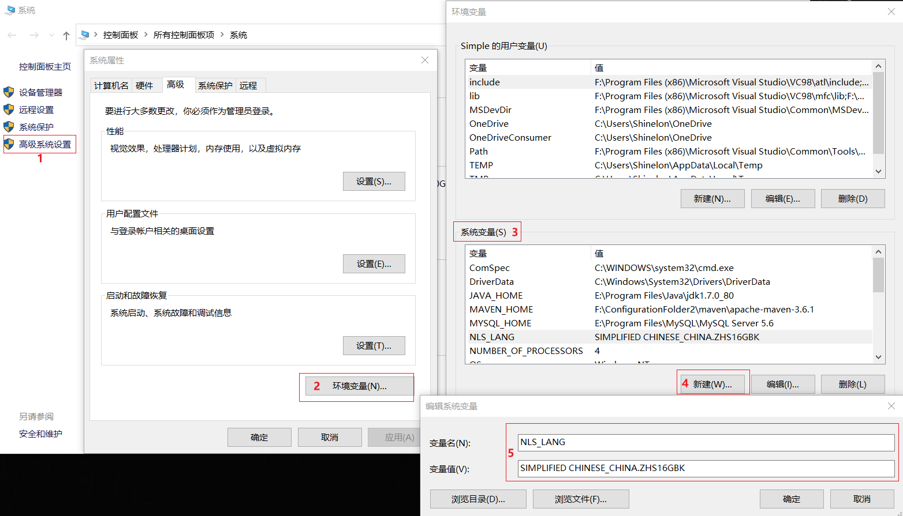
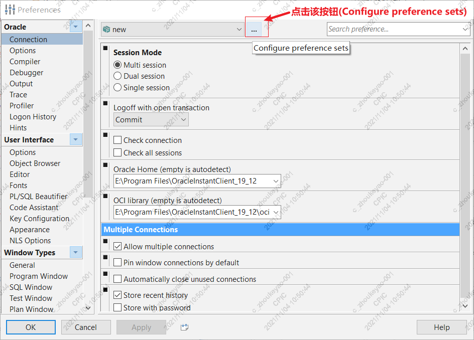
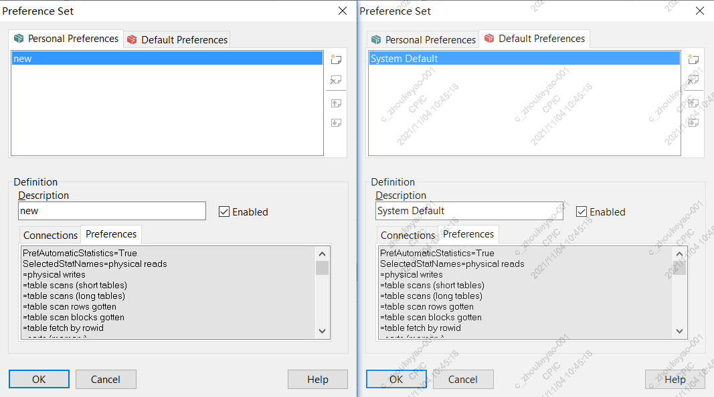
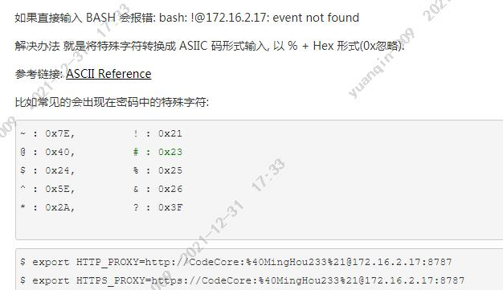

# PLSQL

## 快捷键/执行命令

```plsql
/* 查看SQL语句的索引命中情况及CPU占用 */
-- 方法1：
选中Sql语句，点击tool → explain plan  或者  按F5
-- 方法2
explain plan for 要执行的Sql语句;
commit;
select * from table(DBMS_XPLAN.display);
```

## 编码与设置

### 乱码问题

```tex
https://www.cnblogs.com/cang12138/p/6233539.html
https://zhidao.baidu.com/question/752263377558515532.html
```

```tex
高级系统设置 → 环境变量 → 系统变量 → 新建
变量名(N): NLS_LANG
变量名(V): SIMPLIFIED CHINESE_CHINA.ZHS16GBK
之后重启PLSQL(不生效直接重启电脑)
```



### 查询数据库字符集

```plsql
-- 默认：AMERICAN_AMERICA.AL32UTF8
select userenv('language') from dual;
```

### 服务器和客户端的字符集

```plsql
select * from nls_database_parameters;
select * from nls_instance_parameters;
select * from nls_session_parameters;

select * from v$nls_parameters;
/*
	默认：
		NLS_LANGUAGE：AMERICAN
		NLS_CHARACTERSET：AL32UTF8
*/
select * from v$nls_parameters t where t.PARAMETER='NLS_LANGUAGE' or t.PARAMETER='NLS_CHARACTERSET';
```

## 常见问题

### 具有相同定义的首选集

```tex
You have preferencesets with the same definition, this might not work correct.
```

#### 解决步骤1：

```tex
Tools(高版本：Configure) → Preferences → Tools → Configure preference sets
```



#### 解决步骤2：

```tex
取消 Personal Preference 或 Default Preference 其中一个 Enable 的勾选
```



# shell脚本

```tex
xxx -c  -->  可以让 bash 将一个字串作为完整的命令来执行，这样就可以将xxx的影响范围扩展到整条命令
```

```tex
特殊字符注意事项：
```



# Hibernate搭建

## 依赖文件

<a href="../document/02/Integration/pom.xml">pom.xml</a>

## Entity创建

### 基本实体类

<a href="../document/02/Integration/entity/BaseEntity.java">BaseEntity.java</a>

### 扩展实体类

<a href="../document/02/Integration/entity/AuditEntity.java">AuditEntity.java</a>

### 分页查询实体类

<a href="../document/02/Integration/entity/PageResult.java">PageResult.java</a>

## BaseDAO创建

```markdown
# 参考网址
https://www.cnblogs.com/hoobey/p/7825461.html
https://blog.51cto.com/u_13665344/2153555
```

### interface

<a href="../document/02/Integration/dao/BaseDao.java">BaseDao.java</a>

### implements

<a href="../document/02/Integration/dao/impl/BaseDaoImpl.java">BaseDaoImpl.java</a>

## [Hibernate+JPA ](https://www.cnblogs.com/tian830937/p/4811828.html)

```markdown
# Hibernate+JPA 介绍
近年来ORM(Object-Relational Mapping)对象关系映射，即实体对象和数据库表的映射)技术市场人声音鼎沸，异常热闹， Sun在充分吸收现有的优秀ORM框架设计思想的基础上，制定了新的JPA(Java Persistence API)规范。JPA Java Persistence API，是Java EE 5的标准ORM接口，也是ejb3规范的一部分。

那么什么是JPA呢？JPA是通过JDK5.0注解或XML描述对象-关系表的映射关系，并将运行期实体对象持久化到数据库中去。

# Hibernate与JPA的关系及其实现机制
JPA和Hibernate之间的关系，可以简单的理解为JPA是标准接口，Hibernate是实现。那么Hibernate是如何实现与JPA 的这种关系的呢。Hibernate主要是通过三个组件来实现的，即：hibernate-annotation、hibernate-entitymanager、hibernate-core。

hibernate-annotation是Hibernate支持annotation方式配置的基础，它包括了标准的JPA annotation以及Hibernate自身特殊功能的annotation。

hibernate-core是Hibernate的核心实现，提供了Hibernate所有的核心功能。

hibernate-entitymanager实现了标准的JPA，可以把它看成hibernate-core和JPA之间的适配器，它并不直接提供ORM的功能，而是对hibernate-core进行封装，使得Hibernate符合JPA的规范。
```

### JPA注解元数据形式

#### 实体类

<a href="../document/02/Integration/entity/info/User.java">User.java</a>

### XML元数据形式

#### 实体类

<a href="../document/02/Integration/entity/info/Production.java">Production.java</a>

#### 实体.orm.xml

<a href="../document/02/Integration/resources/entity/info/data-info.orm.xml">data-info.orm.xml</a>

### 数据源.xml

<a href="../document/02/Integration/resources/META-INF/persistence-oracle.xml">persistence-oracle.xml</a>

### BaseDAOImpl继承使用

#### interface

<a href="../document/02/Integration/dao/inter/UserInfoDao.java">UserInfoDao.java</a>

<a href="../document/02/Integration/dao/inter/ProductInfoDao.java">ProductInfoDao.java</a>

#### implements

<a href="../document/02/Integration/dao/impl/business/UserInfoDaoImpl.java">UserInfoDaoImpl.java</a>

<a href="../document/02/Integration/dao/impl/business/ProductInfoDaoImpl.java">ProductInfoDaoImpl.java</a>

## 使用操作小结

### 操作数据库

```tex
baseRepository.getBySql
this.nativeQuerySql
```

```java
//查询方式1
StringBuilder sql = new StringBuilder();
String nameVal = "小明", sexVal = "男";
sql.append("select * from customer_info as c where c.name = :nameKey and c.sex = :sexKey");
Query query = this.getEntityManager().createNativeQuery(sql);
query.setParameter("nameKey", nameVal);
query.setParameter("sexKey", sexVal);
List list = query.getResultList();
//查询方式2
StringBuilder sql = new StringBuilder();
String nameVal = "小明", sexVal = "男";
sql.append("select * from customer_info as c where c.name = ? and c.sex = ?");
Query query = this.getEntityManager().createNativeQuery(sql);
query.setParameter(1, nameVal);//注：下标从1开始
query.setParameter(2, sexVal);
List list = query.getResultList();

//操作多张表时，注意把表分开拼接；如：
StringBuilder sql = new StringBuilder();
sql.append("select t1.column1 from table1 t1");
sql.append(" ,t2.column2 from table2 t2");
sql.append(" ,t3.column3 from table3 t3");
```

### 对count()函数的处理

```tex
Hibernate执行SQL语句的count函数返回BigDecimal类型
```

[处理BigDecimal字段， java.math.BigDecimal cannot be cast to [Ljava.lang.Object;](https://blog.csdn.net/xiaojieblog/article/details/13504501)

```tex
原因：
	持久层类封装的查询方法，其规定泛型为Object[]数组类型，但是实际查询的返回的是BigDecimal类型
	如：查询方法规定泛型List<Object[]>，但有count(1)查询语句，Hibernate对其查询的值处理成BigDecimal类型
	所以获取Object[]时候，BigDecimal不能转换为数组类型，导致报错
```

### 保存方法

```tex
Hibernate 执行保存SQL语句时，必须以save开头；如：saveOrderInfoById；若用findOrderInfoById，里面的保存操作不会成功
```

### sql使用

```java
StringBuffer sql = new StringBuffer();
this.nativeQuerySql(sql.toString(), params);
this.nativeUpdateSql;
this.nativeQueryCountSql;

StringBuffer sb = new StringBuffer();
Query query = entityManager.createQuery(sql.toString());
query.setPparameter("key", value)
entityManager.createNativeQuery;
```

## 常用注解

### @Temporal()

```tex
数据库的字段类型有date、time、datetime
而Temporal注解的作用就是帮Java的Date类型进行格式化，一共有三种注解值：
　　第一种：@Temporal(TemporalType.DATE)——>实体类会封装成日期“yyyy-MM-dd”的 Date类型。
　　第二种：@Temporal(TemporalType.TIME)——>实体类会封装成时间“hh-MM-ss”的 Date类型。
　　第三种：@Temporal(TemporalType.TIMESTAMP)——>实体类会封装成完整的时间“yyyy-MM-dd hh:MM:ss”的 Date类型。

注解方式有两种：
(1)写在字段上
@Temporal(TemporalType.TIMESTAMP)
private Date birthday;

(2)写在getXxx方法上
@Temporal(TemporalType.DATE)
@Column(name = "birthday", length = 10)
public Date getBirthday() {
return this.birthday;
}
```

# 项目搭建

## Oracle数据连接

### c3p0 + properties + xml

#### data-config.properties

```properties
#-------- SIT --------#
# jdbc:oracle:thin@ip地址:端口号:实例名
database.driverClass = oracle.jdbc.OracleDriver
database.jdbcUrl = jdbc:oracle:thin:@29.157.123:16123:sxthddb
database.user = lywx
database.password = CSpa2s_is
```

#### data-config.xml

```xml
<?xml version="1.0" encoding="UTF-8"?>
<beans xmlns="http://www.springframework.org/schema/beans"
       xmlns:xsi="http://www.w3.org/2001/XMLSchema-instance"
       xmlns:util="http://www.springframework.org/schema/util"
       xsi:schemaLocation="http://www.springframework.org/schema/beans
        http://www.springframework.org/schema/beans/spring-beans-3.0.xsd
        http://www.springframework.org/schema/util
        http://www.springframework.org/schema/util/spring-util-3.0.xsd">
    <description>数据源配置</description>

    <!--
        还可用其他方法导入data-config.properties
        注意：以下导入方式，不能使用 ${}的EL表达式，只能使用 #{}的EL表达式
    -->
    <util:properties id="sourceConfig" location="classpath:data-config.properties"/>

    <bean id="dataSource" class="com.mchange.v2.c3p0.ComboPooledDataSource" destroy-method="close">
        <!-- 配置连接池属性 -->
        <property name="driverClass" value="#{sourceConfig['database.driver']}"></property>
        <property name="jdbcUrl" value="#{sourceConfig['database.jdbc']}"></property>
        <property name="user" value="#{sourceConfig['database.user']}"></property>
        <property name="password" value="#{sourceConfig['database.pwd']}"></property>

        <!-- c3p0连接池的私有属性 -->
        <property name="initialPoolSize" value="1"></property>
        <property name="minPoolSize" value="1"></property>
        <property name="maxPoolSize" value="2"></property>

        <!-- 关闭连接后不自动commit -->
        <property name="autoCommitOnClose" value="false"/>

        <!-- 获取连接超时时间 -->
        <property name="checkoutTimeout" value="10000"/>

        <!-- 当获取连接失败重试次数 -->
        <property name="acquireRetryAttempts" value="2"/>
    </bean>
</beans>
```

其他配置方式

##### data-config1.xml

```xml
<?xml version="1.0" encoding="UTF-8"?>
<beans xmlns="http://www.springframework.org/schema/beans"
       xmlns:xsi="http://www.w3.org/2001/XMLSchema-instance"
       xsi:schemaLocation="http://www.springframework.org/schema/beans
        http://www.springframework.org/schema/beans/spring-beans-3.0.xsd">
    <description>数据源配置</description>

    <!-- bean注入data-config.properties -->
    <bean id="propertyConfigurer" class="org.springframework.beans.factory.config.PropertyOverrideConfigurer">
        <!--
            <property name="location" value="classpath:data-config.properties"/>
            若value后省略了 “classpath:” ，则路径前面要有符号 “/”，如下：
        -->
        <property name="location" value="/data-config.properties"/>

        <!--
            如果路径前没加符号 “/”，则找不到配置文件中的属性，如下：
            <property name="location" value="data-config.properties"/>
        -->

        <!--
            value配置多个文件形式
            <property name="locations">
                <list>
                    <value>classpath:data-config.properties</value>
                    <value>/data-config2.properties</value>
                </list>
            </property>
        -->
    </bean>

    <bean id="dataSource" class="com.mchange.v2.c3p0.ComboPooledDataSource" destroy-method="close">
        <!-- 配置连接池属性 -->
        <property name="driverClass" value="${database.driver}"/>
        <property name="jdbcUrl" value="${database.jdbc}"/>
        <property name="user" value="${database.user}"/>
        <property name="password" value="${database.pwd}"/>

        <!-- c3p0连接池的私有属性 -->
        <property name="initialPoolSize" value="10"></property>
        <property name="minPoolSize" value="10"/>
        <property name="maxPoolSize" value="30"/>

        <!-- 关闭连接后不自动commit -->
        <property name="autoCommitOnClose" value="false"/>

        <!-- 获取连接超时时间 -->
        <property name="checkoutTimeout" value="10000"/>

        <!-- 当获取连接失败重试次数 -->
        <property name="acquireRetryAttempts" value="2"/>
    </bean>
</beans>
```

##### data-config2.xml

```xml
<?xml version="1.0" encoding="UTF-8"?>
<beans xmlns="http://www.springframework.org/schema/beans"
       xmlns:xsi="http://www.w3.org/2001/XMLSchema-instance"
       xmlns:context="http://www.springframework.org/schema/context"
       xsi:schemaLocation="http://www.springframework.org/schema/beans
        http://www.springframework.org/schema/beans/spring-beans-3.0.xsd">
    <description>数据源配置</description>

    <!-- 导入data-config.properties -->
    <context:property-placeholder location="classpath:data-config.properties"/>

    <bean id="dataSource" class="com.mchange.v2.c3p0.ComboPooledDataSource" destroy-method="close">
        <!-- 配置连接池属性 -->
        <property name="driverClass" value="${database.driver}"/>
        <property name="jdbcUrl" value="${database.jdbc}"/>
        <property name="user" value="${database.user}"/>
        <property name="password" value="${database.pwd}"/>

        <!-- c3p0连接池的私有属性 -->
        <property name="initialPoolSize" value="10"></property>
        <property name="minPoolSize" value="10"/>
        <property name="maxPoolSize" value="30"/>

        <!-- 关闭连接后不自动commit -->
        <property name="autoCommitOnClose" value="false"/>

        <!-- 获取连接超时时间 -->
        <property name="checkoutTimeout" value="10000"/>

        <!-- 当获取连接失败重试次数 -->
        <property name="acquireRetryAttempts" value="2"/>
    </bean>
</beans>
```

### jndi + properties + xml

#### data-config.properties

```properties
# jdbc connection
application.dataSource = java:comp/env/jdbc/lywo

# log config
log.development = false
log.appname = java-test
log.outdri = /applog/test
```

#### data-config.xml

```xml
<?xml version="1.0" encoding="UTF-8"?>
<beans xmlns="http://www.springframework.org/schema/beans"
       xmlns:xsi="http://www.w3.org/2001/XMLSchema-instance"
       xmlns:util="http://www.springframework.org/schema/util"
       xsi:schemaLocation="http://www.springframework.org/schema/beans
        http://www.springframework.org/schema/beans/spring-beans-3.0.xsd
        http://www.springframework.org/schema/util
        http://www.springframework.org/schema/util/spring-util-3.0.xsd">
    <description>数据源配置</description>

    <!--
        还可用其他方法导入data-config.properties
        注意：以下导入方式，不能使用 ${}的EL表达式，只能使用 #{}的EL表达式
    -->
    <util:properties id="sourceConfig" location="classpath:data-config.properties"/>

    <!-- Spring为此专门提供引用JNDI资源的JndiObjectFactoryBean类 -->
    <bean id="dataSource" class="org.springframework.jndi.JndiObjectFactoryBean">
        <property name="jndiName" value="#{sourceConfig['application.dataSource']}">
        </property>
    </bean>
</beans>
```

其他配置方式

##### data-config1.xml

```xml
<?xml version="1.0" encoding="UTF-8"?>
<beans xmlns="http://www.springframework.org/schema/beans"
       xmlns:xsi="http://www.w3.org/2001/XMLSchema-instance"
       xsi:schemaLocation="http://www.springframework.org/schema/beans
        http://www.springframework.org/schema/beans/spring-beans-3.0.xsd">
    <description>数据源配置</description>

    <!-- bean注入data-config.properties -->
    <bean id="propertyConfigurer" class="org.springframework.beans.factory.config.PropertyOverrideConfigurer">
        <property name="locations">
            <list>
                <value>classpath:data-config.properties</value>
            </list>
        </property>
    </bean>

    <!-- Spring为此专门提供引用JNDI资源的JndiObjectFactoryBean类 -->
    <bean id="dataSource" class="org.springframework.jndi.JndiObjectFactoryBean">
        <property name="jndiName" value="${application.dataSource}"/>
    </bean>
</beans>
```

##### data-config2.xml

```xml
<?xml version="1.0" encoding="UTF-8"?>
<beans xmlns="http://www.springframework.org/schema/beans"
       xmlns:xsi="http://www.w3.org/2001/XMLSchema-instance"
       xmlns:context="http://www.springframework.org/schema/context"
       xsi:schemaLocation="http://www.springframework.org/schema/beans
        http://www.springframework.org/schema/beans/spring-beans-3.0.xsd">
    <description>数据源配置</description>

    <!-- 导入data-config.properties -->
    <context:property-placeholder location="classpath:data-config.properties"/>

    <!-- Spring为此专门提供引用JNDI资源的JndiObjectFactoryBean类 -->
    <bean id="dataSource" class="org.springframework.jndi.JndiObjectFactoryBean">
        <property name="jndiName" value="${application.dataSource}"/>
    </bean>
</beans>
```

##### data-config3.xml

```xml
<?xml version="1.0" encoding="UTF-8"?>
<beans xmlns="http://www.springframework.org/schema/beans"
       xmlns:xsi="http://www.w3.org/2001/XMLSchema-instance"
       xmlns:context="http://www.springframework.org/schema/context"
       xsi:schemaLocation="http://www.springframework.org/schema/beans
        http://www.springframework.org/schema/beans/spring-beans-3.0.xsd">
    <description>数据源配置</description>

    <!-- 导入data-config.properties -->
    <context:property-placeholder location="classpath:data-config.properties"/>

    <!-- Spring为此专门提供引用JNDI资源的JndiObjectFactoryBean类 -->
    <bean id="dataSource" class="org.springframework.jndi.JndiObjectFactoryBean" scope="singleton">
        <property name="jndiName" value="jdbc/crmservicedb"/>
        <property name="resourceRef" value="true"/>
    </bean>
</beans>
```

### [classpath和classpath*区别](https://www.cnblogs.com/EasonJim/p/6709314.html)

```tex
# 区别
classpath: 只会到你的class路径中查找找文件。
classpath*: 不仅包含class路径，还包括jar文件中（class路径）进行查找。

# 注意
用classpath*: 需要遍历所有的classpath，所以加载速度是很慢的；
因此，在规划的时候，应该尽可能规划好资源文件所在的路径，尽量避免使用classpath*:。

# classpath*: 的使用
当项目中有多个classpath路径，并同时加载多个classpath路径下（此种情况多数不会遇到）的文件，*就发挥了作用，如果不加*，则表示仅仅加载第一个classpath路径。
```

## applicationContext.xml

```xml
<?xml version="1.0" encoding="UTF-8"?>
<beans xmlns="http://www.springframework.org/schema/beans"
       xmlns:xsi="http://www.w3.org/2001/XMLSchema-instance"
       xmlns:context="http://www.springframework.org/schema/context"
       xmlns:lang="http://www.springframework.org/schema/lang"
       xsi:schemaLocation="http://www.springframework.org/schema/beans http://www.springframework.org/schema/beans/spring-beans-3.0.xsd
        http://www.springframework.org/schema/context http://www.springframework.org/schema/context/spring-context-3.0.xsd
        http://www.springframework.org/schema/lang http://www.springframework.org/schema/lang/spring-lang-3.0.xsd">

    <!-- common start -->
    <import resource="beans/common/data-config.xml"/>
    <!-- common end -->
</beans>
```

# Redis

[开机自动启动(Linux)](https://blog.csdn.net/m0_51527921/article/details/122169482)

[windows 下 redis 开机自启动](https://www.csdn.net/tags/Mtzakg4sNDI0NTItYmxvZwO0O0OO0O0O.html)

```tex
1) 在redis的目录下执行（执行后就作为windows服务了）
redis-server --service-install redis.windows.conf

2) 安装好后需要手动启动redis
redis-server --service-start

3)停止服务
redis-server --service-stop

4)卸载redis服务
redis-server --service-uninstall

注：可按 Win + S → 搜索 “服务” → 右击 Redis → 点击 属性 → 在 常规中，修改启动类型
```

# Zookeeper

[windows 下 zookeeper 服务相关操作](http://t.zoukankan.com/qingjiawen-p-14323387.html)

[windows 下 zookeeper 开机自启动](https://blog.csdn.net/corruptwww/article/details/124082735)

```tex
1) 下载zookeeper服务插件（zip包）
http://archive.apache.org/dist/commons/daemon/binaries/windows

2) 解压后把prunmgr.exe、prunsrv.exe复制到zookeeper的bin路径下

3) 新建一个install.bat文件，用于注册服务

4) 新建一个zkServerStop.cmd文件，用于停止服务

5) 为Zookeeper配置环境变量
   ZOOKEEPER_HOME      取zookeeper安装目录
   ZOOKEEPER_SERVICE   zookeeper_service(服务名称)

6) 双击install.bat即可安装服务，再去服务里面启动即可

7) 删除服务：
     管理员身份打开[命令提示符]
     sc delete zookeeper_service(服务名称)
   
   如果刷新服务还在：
     Win + R → 输入 regedit → 依次打开 HKEY_LOCAL_MACHINE\SYSTEM\ControlSet001\Services
     找到对应的服务名，如：zookeeper_service → 右键删除 → 重启电脑

注：可以直接 Win + S，搜索 “服务” 打开
```

<a href="../document/02/Integration/Zookeeper/prunmgr.exe">prunmgr.exe</a>、<a href="../document/02/Integration/Zookeeper/prunsrv.exe">prunsrv.exe</a>、<a href="../document/02/Integration/Zookeeper/install.bat">install.bat</a>、<a href="../document/02/Integration/Zookeeper/zkServerStop.cmd">zkServerStop.cmd</a>

# 其他技能

使用Redis

## Java JDBC H2 内存数据库示例

```tex
https://blog.csdn.net/weixin_32864391/article/details/114568725
```

## 什么是埋点

```tex
https://blog.csdn.net/weixin_40106836/article/details/95490497
```

```tex
数据生产-数据采集-数据处理-数据分析和挖掘-数据驱动/用户反馈-产品优化/迭代。

数据采集，顾名思义采集相应的数据，是整个数据流的起点，采集的全不全、对不对，直接决定数据广度和质量，影响后续所有的环节。

在数据采集失效性、完整性不好的公司，经常会有业务方发现数据发生的大幅度变化，追其所以时发现是数据采集的问。而另一方面，采集什么数据才能有效的得到数据分析结论，才能有效的进行推荐，就需要提前规划埋点。

当前数据采集普遍遇到的几个问题：
	实时性，对于工具性产品在无网条件下的数据，无法实时上报；
	完整性，由于用户隐私协议&欧盟通用数据保护条例的，部分数据无法采集；
	异常，android_id、idfa、idfv 随版本升级变化或无法获取。
```

## token自动续期

```tex
redis
access_token + refresh_token 实现续期
```

## [log4j与slf4j的区别和使用](https://www.jianshu.com/p/7f787e3797a3)

```tex
log4j（ log for java ）（4 同 for）
Apache的一个开源项目，可以灵活地记录日志信息，我们可以通过Log4j的配置文件灵活配置日志的记录格式、记录级别、输出格式，而不需要修改已有的日志记录代码。

slf4j：simple log facade for java -> 简单日志门面
slf4j不是具体的日志解决方案，它只服务于各种各样的日志系统。按照官方的说法，SLF4J是一个用于日志系统的简单Facade，允许最终用户在部署其应用时使用其所希望的日志系统。

可以将log4j看成是一个完整的日志库，而slf4j是一个日志库的规范接口。
```

## 待解决

```tex
为什么一看到联谊  脑子里想象的画面全是互相问对方掌握什么技术  springcloud核心组件会不会用  redis 数据库 mq是否熟练掌握 有没有高并发项目经历 能不能手写冒泡排序
```

# 待分类

```markdown
# 流程图工具
PowerDesigner

# GAMES101-现代计算机图形学入门
https://zhuanlan.zhihu.com/p/360537273

# MySql 性能书籍
高性能mysql第三版
MySQL技术内幕

# JVM
深入理解Java虚拟机: JVM高级特性与最佳...
# 一网打尽各种常量池(processon笔记 - 司马老师)
processon.com/diagraming/5eb502630791290fe04d9461
```

