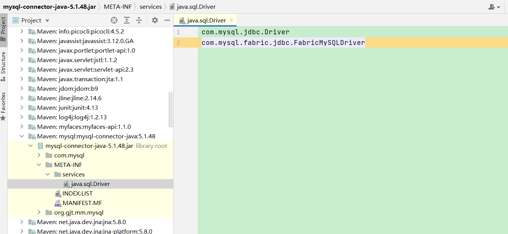
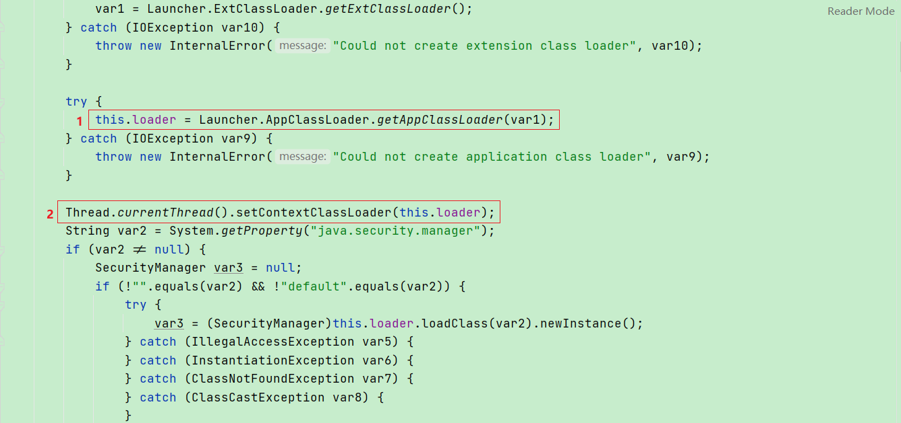

# [浅谈双亲委派机制的缺陷及打破双亲委派机制](https://zhuanlan.zhihu.com/p/185612299)

```tex
# 双亲委派机制时JVM类加载的默认使用的机制，其原理是:当一个类加载器收到类加载任务时，会先交给自己的父加载器去完成，因此最终加载任务都会传递到最顶层的BootstrapClassLoader，只有当父加载器无法完成加载任务时，才会尝试自己来加载。按照由父级到子集的顺序，类加载器主要包含以下几个：
  1) BootstrapClassLoader(启动类加载器)：主要负责加载核心的类库(JVM_HOME/lib目录下的：java.lang.*等)；构造ExtClassLoader和APPClassLoader。
  2) ExtClassLoader(拓展类加载器)：主要负责加载jre/lib/ext目录下的一些扩展的jar。
  3) AppletClassLoader(系统类加载器)：主要负责加载应用程序的主函数类。
  4) 自定义类加载器：主要负责加载应用程序的主函数类。

# 了解类加载器的基本原理和基本概念之后，进入我们今天的主题：
双亲委派机制有什么缺陷？
如何打破双亲委派机制？
```

```markdown
问题1：通过双亲委派机制的原理可以得出一下结论：由于BootstrapClassloader是顶级类加载器，BootstrapClassloader无法委派AppClassLoader来加载类，也就是说BootstrapClassloader中加载的类中无法使用由AppClassLoader加载的类。可能绝大部分情况这个不算是问题，因为BootstrapClassloader加载的都是基础类，供AppClassLoader加载的类调用的类。但是万事万物都不是绝对的比如经典的JAVA SPI机制。

首先我们先了解下JAVA SPI机制：
SPI的全名为Service Provider Interface，主要是应用于厂商自定义组件或插件中。在java.util.ServiceLoader的文档里有比较详细的介绍。简单的总结下java SPI机制的思想：我们系统里抽象的各个模块，往往有很多不同的实现方案，比如日志模块、xml解析模块、jdbc模块等方案。面向的对象的设计里，我们一般推荐模块之间基于接口编程，模块之间不对实现类进行硬编码。一旦代码里涉及具体的实现类，就违反了可拔插的原则，如果需要替换一种实现，就需要修改代码。为了实现在模块装配的时候能不在程序里动态指明，这就需要一种服务发现机制。 Java SPI就是提供这样的一个机制：为某个接口寻找服务实现的机制。有点类似IOC的思想，就是将装配的控制权移到程序之外，在模块化设计中这个机制尤其重要。SPI具体约定：Java SPI的具体约定为：当服务的提供者提供了服务接口的一种实现之后，在jar包的META-INF/services/目录里同时创建一个以服务接口命名的文件。该文件里就是实现该服务接口的具体实现类。而当外部程序装配这个模块的时候，就能通过该jar包META-INF/services/里的配置文件找到具体的实现类名，并装载实例化，完成模块的注入。基于这样一个约定就能很好的找到服务接口的实现类，而不需要再代码里制定。jdk提供服务实现查找的一个工具类：java.util.ServiceLoader。
```

以 mysql-connector-java-5.1.48 java包说明SPI机制：



```tex
以上截图展示了SPI使用的三要素：
  1) 实现类的java包位置要放在主程序的classpath中；
  2) 在实现类的jar包的META-INF/services目录下创建一个以“接口全限定名”为命名的文件，内容为实现类的全限定名；
  3) 主程序通过java.util.ServiceLoder动态装载实现模块，它通过扫描META-INF/services目录下的配置文件找到实现类的全限定名，把类加载到JVM；
  这就引申出来我们对双亲委派机制的缺陷的讨论，接口：java.sql.Driver，定义在java.sql包中，包所在的位置是：jdk\jre\lib\rt.jar中，java.sql包中还提供了其它相应的类和接口比如管理驱动的类:DriverManager类，很明显java.sql包是由BootstrapClassloader加载器加载的；而接口的实现类com.mysql.jdbc.Driver是由第三方实现的类库，由AppClassLoader加载器进行加载的，我们的问题是DriverManager再获取链接的时候必然要加载到com.mysql.jdbc.Driver类，这就是由BootstrapClassloader加载的类使用了由AppClassLoader加载的类，很明显和双亲委托机制的原理相悖，那它是怎么解决这个问题的？这就引申了我们第二个问题：如何打破双亲委派机制？
```

首先看下手动获取数据库连接的代码：

```java
// 加载Class到AppClassLoader（系统类加载器），然后注册驱动类
// Class.forName("com.mysql.jdbc.Driver").newInstance(); 
String url = "jdbc:mysql://localhost:3306/testdb";    
// 通过java库获取数据库连接
Connection conn = java.sql.DriverManager.getConnection(url, "name", "password"); 
```

```tex
我们很惊喜的发现：加载JDBC驱动程序实现的代码Class.forName("com.mysql.jdbc.Driver").newInstance();被注释掉，代码依然能够正常运行，这很奇怪, 继续查看DriverManager.getConnection(url,"name","password");重点就是DriverManager类的静态代码块，我们都是知道调用类的静态方法会初始化该类，然后执行该类静态代码块，DriverManager的静态代码块如下：
```

```java
static {
    loadInitialDrivers();
    println("JDBC DriverManager initialized");
}
```

继续查看 loadInitialDrivers(); 如下：

```java
private static void loadInitialDrivers() {
    String drivers;
    try {
        drivers = AccessController.doPrivileged(new PrivilegedAction<String>() {
            public String run() {
                //获取环境变量中jdbc.drivers的列表
                return System.getProperty("jdbc.drivers");
            }
        });
    } catch (Exception ex) {
        drivers = null;
    }
    // If the driver is packaged as a Service Provider, load it.
    // Get all the drivers through the classloader
    // exposed as a java.sql.Driver.class service.
    // ServiceLoader.load() replaces the sun.misc.Providers()
    //如果按照spi的约定在jar包中的META-INF/services设置了文件,将会加载为服务
    AccessController.doPrivileged(new PrivilegedAction<Void>() {
        public Void run() {
            ServiceLoader<Driver> loadedDrivers = ServiceLoader.load(Driver.class);
            Iterator<Driver> driversIterator = loadedDrivers.iterator();
            /* Load these drivers, so that they can be instantiated.
             * It may be the case that the driver class may not be there
             * i.e. there may be a packaged driver with the service class
             * as implementation of java.sql.Driver but the actual class
             * may be missing. In that case a java.util.ServiceConfigurationError
             * will be thrown at runtime by the VM trying to locate
             * and load the service.
             *
             * Adding a try catch block to catch those runtime errors
             * if driver not available in classpath but it's
             * packaged as service and that service is there in classpath.
             */
            try{
                while(driversIterator.hasNext()) {
                    //依次加载所有驱动
                    driversIterator.next();
                }
            } catch(Throwable t) {
                // Do nothing
            }
            return null;
        }
    });
    
    println("DriverManager.initialize: jdbc.drivers = " + drivers);
    //如果环境变量中没有设置的驱动程序,就可以结束了
    //否则就将环境变量中的驱动程序加载一下
    if (drivers == null || drivers.equals("")) {
        return;
    }
    String[] driversList = drivers.split(":");
    println("number of Drivers:" + driversList.length);
    for (String aDriver : driversList) {
        try {
            println("DriverManager.Initialize: loading " + aDriver);
            Class.forName(aDriver, true, ClassLoader.getSystemClassLoader());
        } catch (Exception ex) {
            println("DriverManager.Initialize: load failed: " + ex);
        }
    }
}
------------------------------------------------------------------------------------
 public static <S> ServiceLoader<S> load(Class<S> service) {
    ClassLoader cl = Thread.currentThread().getContextClassLoader();
    return ServiceLoader.load(service, cl);
}
```

```tex
对于以上源码有几点说明：
  1) 我们前文提过JAVA SPI使用的扫描服务实现类的工具类是ServiceLoader，很凑巧我们在源码中发现了这个方法，这说明DriverManager.getConnection()方法在被调用的时候就已经从classpath中去加载由第三方实现的java.sql.Driver接口的实现类了。继续查看ServiceLoader.load(Driver.class);方法发现类加载器使用的是线程上下文类加载器，这是打破双亲委托机制的关键。
  2) 按照loadedDrivers.iterator()->next()->nextService()调用连查看源码最终发现c = Class.forName(cn, false, loader);这个方法是文章开头的Class.forName()被注释掉但是文章仍然能够继续运行的关键。因为在DriverManager中的初始化代码中已经注册过了。
  但在这里我有一个疑问1：既然驱动类已经已经在ServiceLoader.load(Driver.class)方法中被加载过了，为什么在Class.forName(cn, false, loader);方法中注册驱动类的时候还要传递一个类加载器的参数，这样做由什么意义？但是我们可以大胆的推测loader一定不是启动类加载器，因为启动类加载器没法加载classpath下的类。
  3) loadInitialDrivers()加载里两个位置的驱动程序(代码中已有注释)，环境变量中jdbc.drivers的列表和类路径下符合SPI规范的jar包，前者使用的是Class.forName(aDriver,true,ClassLoader.getSystemClassLoader());进行加载，而类加载器使用的是：ClassLoader.getSystemClassLoader();后者使用的是load(Driver.class)方法中的线程上下文类加载器。接下来我们看下ClassLoader.getSystemClassLoader();源码，按照ClassLoader.getSystemClassLoader()->initSystemClassLoader();>scl= l.getClassLoader()发现ClassLoader.getSystemClassLoader()的返回值是类Launcher的一个成员变量并且在Launcher的构造方法中进行初始化，最终的返回值是this.loader = Launcher.AppClassLoader.getAppClassLoader(var1);应用类加载器(查看下方截图1处代码)。
  在这里我有一个疑问2：Class.forName(aDriver,true,ClassLoader.getSystemClassLoader())；这段代码所在类的类加载器是启动类加载器，但是代码中使用了应用类加载器，这样可以使用吗？如果可以那在启动类加载器加载的类中使用应用类的时候直接指定应用类加载器去加载就可以了，为什么还要使用线程上下文类加载器？
```

```tex
以上两个疑问后续解决，不影响我们对如何打破双亲委托机制的讨论，现在我们已经知道，在DriverManager中去加载SPI中配置的java.sql.Driver接口的实现类使用的是线程上下文类加载器。ContextClassLoader默认存放了AppClassLoader的引用(查看下方截图2处代码)，由于它是在运行时被放在了线程中，所以不管当前程序处于何处（BootstrapClassLoader或是ExtClassLoader等），在任何需要的时候都可以用Thread.currentThread().getContextClassLoader()取出应用程序类加载器来完成加载类的操作,简单来说：在BootstrapClassLoader或ExtClassLoader加载的类A中如果使用到AppClassLoader类加载器加载的类B，由于双亲委托机制不能向下委托，那可以在类A中通过线上线程上下文类加载器获得AppClassLoader，从而去加载类B，这不是委托，说白了这是作弊，也是JVM为了解决双亲委托机制的缺陷不得已的操作！
```



```tex
拓展：

简单介绍一下Class.forName(); 这个方法由两个作用：

1) 装载一个类并对其进行实例化
2) 使用的类加载器默认是当前类加载器，但是可以为之传递一个加载器

源码如下：
```

```java
public static Class<?> forName(String className)
                throws ClassNotFoundException {
    Class<?> caller = Reflection.getCallerClass();
    return forName0(className, true, ClassLoader.getClassLoader(caller), caller);
}
------------------------------------------------------------------------------------------
public static Class<?> forName(String name, boolean initialize, ClassLoader loader)
        throws ClassNotFoundException {
    Class<?> caller = null;
    SecurityManager sm = System.getSecurityManager();
    if (sm != null) {
        // Reflective call to get caller class is only needed if a security manager
        // is present.  Avoid the overhead of making this call otherwise.
        caller = Reflection.getCallerClass();
        if (sun.misc.VM.isSystemDomainLoader(loader)) {
            ClassLoader ccl = ClassLoader.getClassLoader(caller);
            if (!sun.misc.VM.isSystemDomainLoader(ccl)) {
                sm.checkPermission(SecurityConstants.GET_CLASSLOADER_PERMISSION);
            }
        }
    }
    return forName0(name, initialize, loader, caller);
}
```

# [类加载器及其对应的加载路径](https://blog.csdn.net/CurryXu/article/details/81632065)

