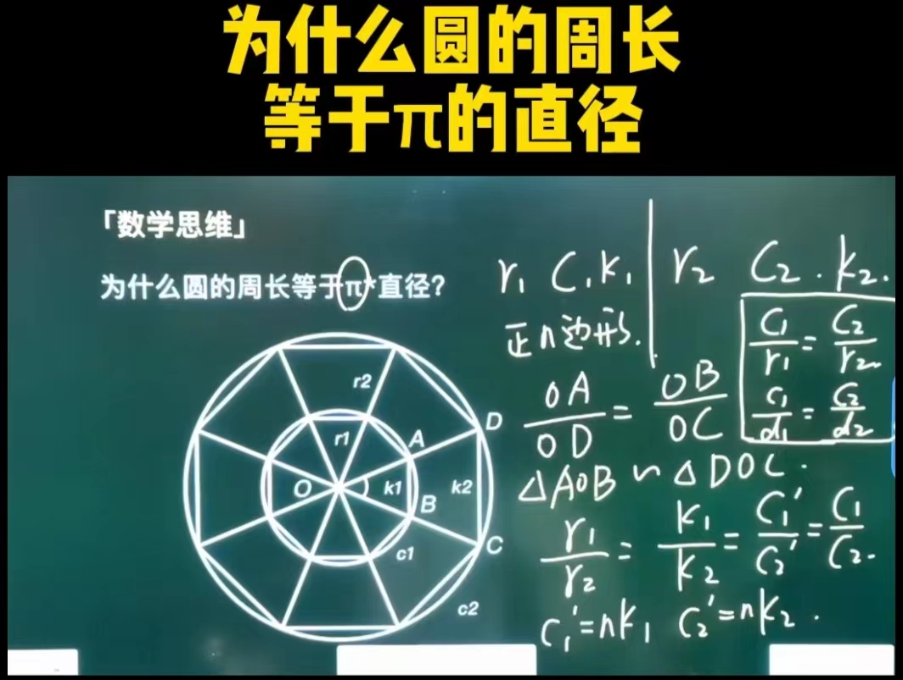

# 数的奥义

## # 进制

### * 二进制

```markdown
# 假设用8位表示  →  满2 向前进1位
0000 0000  →  0
0000 0001  →  1   =  0  + 1  =  0  + 2º  =  2º
0000 0010  →  2   =  2º + 1  =  2º + 2º  =  2(2º)  =  2¹
0000 0011  →  3   =  2¹ + 1  =  2¹ + 2º
0000 0100  →  4   =  2¹ + 2  =  2¹ + 2¹  =  2(2¹)  =  2²
0000 0101  →  5   =  2² + 1  =  2² + 2º
0000 0110  →  6   =  2² + 2  =  2² + 2¹
0000 0111  →  7   =  2² + 3  =  2² + 2¹ + 2º
0000 1000  →  8   =  2² + 4  =  2² + 2²  =  2(2²)  =  2³
...
0001 0000  →  16  =  8 + 8  =  2³ + 2³  =  2(2³)  =  2⁴
...
0010 0000  →  32  =  2⁴ + 2⁴  =  2(2⁴)  =  2⁵
...
0100 0000  →  64  =  2(2⁵)  =  2⁶
...
1000 0000  →  128 =  2⁷
...
1 0000 0000  =  2⁸
10 0000 0000  =  2⁹
# 假设[从右到左]数，[1]在第[n]位，有[n-1]个[0]
1000 .... 0000  =  2^(n - 1)
# [n]位能表示的最大值  →  [所有]位上的[数字]为[1]
1111 .... 1111  =  1 0000 .... 0000 - 1  =  2ⁿ - 1
# [8]位所表示的最大值
1111 1111  =  1 0000 0000 - 1  =  2⁸ - 1 = 255
```

#### 原码

```markdown
# 定义
[原码]就是[本身]所[表示的码值]简称[表示码]
如下
0000 0001 原码 0000 0001
1000 0001 原码 1000 0001
```

#### 反码

```markdown
# 注意
∵ [反码]其实是[方便推导]出[原码]和[补码]之间的[位置关系]
∴ [反码]实际[不参与运算]
∴ [不需要推导]与[原码]之间[位置关系]的[表示码]就[不需要反码]
```

#### 补码

##### 定义

```markdown
# 概念
[正数]
  [没有]反码
  [补码]=[原码]
[负数]
  [反码] → [原码]的[符号位]保持[不变]、[数字位]需要[取反]
  [补码] → [反码]的[符号位]保持[不变]、[数字位]需要[+1]
[位数范围]内[最小]的[负数]
  [没有]反码
  [补码]=[原码]
```

##### 证明

```markdown
# 假设用8位[无符号位]表示
∵ 1111 1111  =  255  [一共]能表示[256]个[数字] → [0 ~ 255]
∴ 如果[全部位置]都表示[正数] → 则[没有]考虑[负数]的[表达方式]
∴ 为了[表示负数] → 需要抽取[一个位置]作为[符号位]
∴ 表示[正数]的[范围] → [0000 0000  ~  0111 1111] 即 [0   ~   127]
∴ 表示[负数]的[范围] → [1000 0000  ~  1111 1111] 即 [-0  ~  -127]
# 在数学中[0 和 -0]都表示[0] → 由上述可知 → 在[有符号位]标识[负数]的情况下 → 浪费了[1000 0000]这个[表示码]
∵ 比 -127 小一位的数字为 -128
∴ 在[不浪费]的情况下 → 将[1000 0000]作为[-128]的[表示位]

# 假设用8位[有符号位]表示
∵ [1000 0000] = [-128]
∴ 表示[正数]的[范围] → [0000 0000  ~  0111 1111] 即 [ 0  ~  127 ]
∴ 表示[负数]的[范围] → [1000 0000  ~  1111 1111] 即 [-128  -1  ~  -127]
∵ 为了进行[取模运算] → [1000 0000  ~  0111 1111]表示的值[必须连续] 即 [-128  -127  ~  -1  ~  0  ~  127]
此时 [-128  ~  -1]
对位 [0   ~   127]
达成 [取模条件]
# 由上述可知
∵ [需要推导]与[原码]之间[位置关系]的 [表示码] 为 [-127  ~  -1]
   [不需要推导]与[原码]之间[位置关系]的 [表示码] 为 [-128]和[0  ~  127]
∴ [-127  ~  -1] 需要 [反码]
   [-128]和[0  ~  127] 不需要 [反码]

# 取模运算 → X mod Y → X/Y → X 除以 Y 的余数
0   mod   128  =  0    这个位置可表示  -128
1   mod   128  =  1    这个位置可表示  -127
2   mod   128  =  2    这个位置可表示  -126
...
127 mod   128  =  127  这个位置可表示  -1
# [有符号位]时 → [原码]和[补码]的[位置关系]
[原码]是[1111 1111]的[补码]为[1000 0001]
[原码]是[1111 1110]的[补码]为[1000 0010]
[原码]是[1111 1101]的[补码]为[1000 0011]
...
[原码]是[1000 0011]的[补码]为[1111 1101]
[原码]是[1000 0010]的[补码]为[1111 1110]
[原码]是[1000 0001]的[补码]为[1111 1111]
# 若想在[保留符号位]的情况下 → 只对[数字位]进行[加法运算]
∵ 每个[原码]+[补码] = -128 为 [1 1000 0000]
∵ 每个[原码]+[反码] = -127 为 [1 111 1111]
∴ 每个[原码]+[反码+1] = -128 为 [1 1000 0000]
∴ [补码]=[反码+1]
```

##### 综上

```markdown
# 如下 -127
1111 1111 (原码)
1000 0000 (反码)
1000 0001 (补码)
# 如下 -128
1 1000 0000 (原码)
1 0111 1111 (反码)
1 1000 0000 (补码)
# 如果强行用[反码]来[推导]出[原码]和[补码]的[位置关系]
∵ 在8个表示位的前提下
[原码] 1 1000 0000 高位可舍去 → 1000 0000 依然可表示 [-128]
[反码] 1 0111 1111 高位不能舍 → 0111 1111 已经表示了 [127]
[补码] 1 1000 0000 高位可舍去 → 1000 0000 依然可表示 [-128] 且等于 [原码]
∴ [位数范围]内[最小]的[负数]就[不需要反码]且[反码]=[原码]

# 加法运算 → 以 -3 为例
[无补码]
  3 + (-)3 = 0000 0011 + 1000 0011
           = 0000 0011 + (-)0000 0011
           = M + -(M) = 0
  4 + (-)3 = 0000 0100 + 1000 0011
           = 0000 0100 + (-)0000 0011
           = 0000 0100 - 0000 0011
           = 0000 0001 = 1
  2 + (-)3 = 0000 0010 + 1000 0011
           = 0000 0010 + (-)0000 0011
           = -(0000 0011 - 0000 0010)
           = -(0000 0001)
           = 1000 0001 = -1
[有补码]
  3 + (-)3 = 0000 0011 + 1000 0011
           = 0000 0011 + 1111 1101
           = (1) 0000 0000
           = (溢出舍去) 0000 0000 = 0
  4 + (-)3 = 0000 0100 + 1000 0011
           = 0000 0100 + 1111 1101
           = (1) 0000 0001
           = (溢出舍去) 0000 0001 = 1
  2 + (-)3 = 0000 0010 + 1000 0011
           = 0000 0010 + 1111 1101
           = (未溢出) 1111 1111 = -1
```

### * 十进制

```markdown
# 假设用4位表示  →  满10 向前进1位
0000  →  0
0001  →  1  =  10º
....
0009  →  9  =  10¹ - 1
0010  →  10  =  10¹
0011  →  11  =  10¹ + 1
...
0019  →  19  =  10¹ + 9
0020  →  20  =  10¹ + 10  =  10¹ + 10¹  =  2(10¹)
...
0030  →  20  =  10¹ + 10¹ + 10¹  =  3(10¹)
...
0100  →  100  =  10¹ + 10¹ + 10¹ + 10¹ + 10¹ + 10¹ + 10¹ + 10¹ + 10¹ + 10¹ = 10(10¹)  =  10²
...
1000  →  1000  =  10² + 10² + 10² + 10² + 10² + 10² + 10² + 10² + 10² + 10² = 10(10²)  =  10³
```

### * 十六进制

```markdown
# 假设用4位表示  →  满16 向前进1位  →  0 1 2 3 4 5 6 7 8 9 A B C D E F
0000  →  0
0001  →  1  =  16º
....
0009  →  9
000A  →  10
000B  →  11
000C  →  12
000D  →  13
000E  →  14
000F  →  15
0010  →  16  =  16¹
....
001F  →  31  =  16¹ + F
0020  →  32  =  16¹ + 16¹  =  2(16¹)
....
0030  →  48  =  16¹ + 16¹ + 16¹  =  3(16¹)
....
0100  →  256  =  16¹ + 16¹ + 16¹ + 16¹ + 16¹ + 16¹ + 16¹ + 16¹ + 16¹ + 16¹ + 16¹ + 16¹ + 16¹ + 16¹ + 16¹ + 16¹  =  16(16¹)  =  16²
....
01CD  →  461  =  16² + 12(16¹) + 13(16º)
....
1000  →  4096  =  16(16²)  =  16³
```

## # 类型

### 实数

```markdown
# 定义
  有理数 -> 可以用[整数]或[两个整数的比值(分数)]表现出来
    整数: -2、-1、0、1、2、3 ...
    分数: -1/2、2/3、4/5 ... (整数也可看作分母为1的分数)
  无理数 -> 不能用[分数]表现出来(可由多个分数相加或相减，求逼近值)
    无限不循环的数: π、e
```

### 虚数i

```markdown
■ 定义 (i)² = -1
X² = -1 则 x = i
  将i逆时针旋转90°= -1  即 X² = -1
  再逆时针旋转90°= -i   即 X³ = -i
  再逆时针旋转90°= 1    即 X⁴ = 1
1) 复数
a + bi 则 a为实部，b为虚部
注意：复数具有无序性，不能比较大小
2) 复平面(虚轴与实轴构成的平面)
▲ 复数的模(有大小，有方向)来表示
|Z| = √a²+b²
Z = a + bi
复数与实轴正方向的夹角为辐角：规定逆时针为正，顺时针为负
▲ 共轭复数(两个实部相等，虚部互为相反数)
Z1 = a + bi
Z2 = a - bi
▲ 复数加减
规则：实部与虚部各自加减
```

### 极限

```markdown
■ 0﹡∞ 结果不能确定 = ⊥(无效符号)
f1(x) = 1/x  当 x → +∞ 时，f(x) = 0
f2(x) = 1/x² 当 x → +∞ 时，f(x) = 0
f3(x) = x    当 x → +∞ 时，f(x) = +∞
f4(x) = x²   当 x → +∞ 时，f(x) = +∞
f5(x) = -X³  当 x → +∞ 时，f(x) = +∞
lim[x → +∞] 时
  f1(x)﹡f3(x) = 1   f1(x)﹡f4(x) = +∞
  f2(x)﹡f3(x) = 0   f2(x)﹡f4(x) = -∞
由此可得 (0)无穷小量﹡无穷大量(∞)，结果由它们的阶数决定
  0 可以由任意一个f(x)在 (x → n) 时, f(x) = 0
  ∞ 可以由任意一个g(x)在 (x → n) 时, g(x) = ∞
  阶数大的去掉阶数小的，剩下的阶来确定一个结果
# 个人对 lim 的理解
lim 描述的是[自变量 趋向于 某个值]的情况下[变量(函数) 的 极限值]
则 lim[n → +∞]f(n) = 极限值
∴ [=]对应的是[极限值]
# 个人对 0 和 ∞ 的理解
  0 是一个[无穷小量]的[集合]
  ∞ 是一个[无穷大量]的[集合]
∴ 也可以认为[无穷小量]是[0的一部分]
           [无穷大量]是[∞的一部分]
# 补充
任何数 - 自身 = 0 从这点看，好像 0 又不是一个集合
```

### 0.999999...无限循环 = 1

```markdown
# 原理证明
将 0.9...无限循环 逐个相加
  0.999999...999...             0.999999...999...
  0.999999...999...             0.999999...999...
  0.999999...999...             0.999999...999...
  0.999999...999...             0.999999...999...
  0.999999...999...             0.999999...999...
  0.999999...999...             0.999999...999...
  0.999999...999...             0.999999...999...
  0.999999...999...             0.999999...999...
+ 0.999999...999...           + 0.999999...999...
+ 0.999999...999...           ____________________
____________________         = 8.999999...999...
= 9.999999...999...           = 8.999999...无限循环
= 9.999999...无限循环          = 0.9...无限循环﹡9
= 0.9...无限循环﹡10
∴ (0.9...﹡10) - (0.9...﹡9) = 9.999999... - 8.999999... = 1
   0.9...无限循环 = 1

# 公式证明
设 A = 0.9...无限循环
∵ 0.9...无限循环﹡10 = 9.9...无限循环 = 9 + 0.9...无限循环
∴ 10A = 9 + A
   9A = 9
则 A = 1 = 0.9...无限循环

# 分数证明
0.333333... = 1/3
0.999999... = 1/3 * 3 = 3/3 = 1

# lim 和 极限
已知 1 - lim[x → +∞] (1/x)
即为 0.999999... = 1
∴ 1 - lim[x → +∞] (1/x) = 1
∴ lim[x → +∞] (1/x) = 0
由此可见 lim[x → +∞] (1/x) 完全等于0，而不是仅仅趋近于0
综上所述 [无穷小量]在[非标准分析]的情况下是[0的构成元素]
```

## # 起源

```markdown
# 自然常数e
起源：伯努利计算复利
lim[(n=1) → (+∞)] (1 + 1/n)^n = e = 2.71828...

# 自然常数π
无论圆多大，周长和直径的比例总是相同，这个比值标志为π，证明如下图所示
画两个同心圆：小圆半径r1周长c1、大圆半径r2周长c2
做两个圆的内接n多边形：周长c1' c2'
OA/OD = OB/OC 且 夹角相等
根据三角形相似定理，可得 ΔA0B ∽ △DOC
则 r1/r2 = k1/k2
∵ c1' = n﹡k1   c2' = n﹡k2 且 n → ∞ 时，n多边形周长=圆周长
∴ r1/r2 = k1/k2 = c1'/c2' = c1/c2
∴ c1/r1 = c2/r2 即 c1/d1 = c2/d2 = π
∴ S = π﹡d
```



# 日常整理

## # 负号

```markdown
■ 证明1：m﹡(-n) = (-m)﹡n
∵ 2﹡(-3) = 2 个 (-3) = 2 x (-1 + -1 + -1)
又 (-2)﹡3 = 3 个 (-2) = 3 x (-1 + -1)
∴ 2﹡(-3) = (-2)﹡3

■ 证明2：-n = (-1)﹡n
∵ -2 = (-1) + (-1) = 2 个 (-1) = 2﹡(-1)
∴ -2 = (-1)﹡2
或者由 证明1 得：1﹡(-n) = (-1)﹡n
∴ -n = (-1)﹡n

■ 负号本质: 表示相反的意思
2      从0(原点) 右移2个单位
-2     从0(原点) 左移2个单位
-(-2)  从0(原点) 右移2个单位
∵ -(-2) = 2 = (-1)﹡(-2)
∴ 负负得正
```

## # 次方

```markdown
# 定义
m^n = n 个 m
# 例子
2³ = 3 个 2 = 2 × 2 × 2 = 8
# 则有
2⁴ / 2³ = 4 个 2 / 3 个 2 = 1 个 2 = 2¹ = 2^(4-3)
2¹ × 2² = 1 个 2 × 2 个 2 = 3 个 2 = 2³ = 2^(1+2)

■ 证明：任何一个数的0次方 = 1
2⁴ / 2⁴ = 2^(4-4) = 2º = 1
```

## # 阶乘

```markdown
# 0!=1 & 1!=1
∵ n! = n﹡(n-1)﹡(n-2)﹡(n-3)﹡...﹡1
则 (n-1)! = (n-1)﹡(n-2)﹡(n-3)﹡...﹡1
∴ n!/(n-1)! = n
即 n!/n = (n-1)!
∴ 2!/2 = (2-1)! => 2﹡1/2 = 1!
即 1! = 1
∴ 1!/1 = (1-1)! => 1/1 = 0!
即 0! = 1
```

## # 斜率

```markdown
# 定义
设 f(x) = kx + C (k≠0)
随机取两点 (x1,y1)、(x2,y2)，带入f(x)可得
y1 = k(x1) + C
y2 = k(x2) + C
y2 - y1 = k(x2) - k(x1) = k(x2 - x1)
(y2 - y1)/(x2 - x1) = k
将函数f(x)在两点变化量的比值k定义为斜率
```

## # 导数

```markdown
# Delta（大写Δ，小写δ），表示可随机变化的量
■ 以 f(x) = y = x² 为例，对任意一点(x,y)，加上变化量形成点(x+Δx,y+Δy)
则 f(x+Δx) = y+Δy 即 Δy = f(x+Δx)-y = f(x+Δx)-f(x)
且 两点所围成得直线斜率为 (y+Δy - y)/(x+Δx - x) = Δy/Δx 令其为 u(x)
∵ 两点连成一条直线，当Δx趋向无线小时，直线斜率就可以表示出某点的斜率
令 Δx = dx 和 Δy = dy
代入 Δy = f(x+Δx)-f(x) 得 dy = f(x+dx)-f(x)
∴ u(x) = Δy/Δx = f(x+dx)-f(x)/dx
将 f(x) = x² 代入 u(x) 得 u(x) = (x+dx)²-(x)²/dx = [(x² + 2x﹡dx + (dx)²) - x²]/dx
即 (2x﹡dx + (dx)²)/dx = 2x + dx = 2x
∴ u(x) = 2x 表示 f(x) = x² 下，任意一点x的斜率
■ 以 f(x) = a^x 为例
f'(x) = lim(Δx→0) f(x+Δx)-f(x)/Δx
      = lim(Δx→0) a^(x+Δx)-a^x/Δx = lim(Δx→0) a^x﹡a^Δx-a^x/Δx
      = lim(Δx→0) a^x(a^Δx-1)/Δx
设 a^Δx-1 = m 则 a^Δx = m + 1 即 Δx = loga(m + 1)
f'(x) = lim(m→0) a^x﹡m/loga(m + 1)
      = lim(m→0) a^x﹡m/[ln(m + 1)/ln(a)]  换底公式
      = lim(m→0) a^x﹡ln(a)/[(1/m)﹡ln(m + 1)]
      = lim(m→0) a^x﹡ln(a)/ln(1 + m)^(1/m) = a^x﹡ln(a)/ln(e) = a^x﹡ln(a)
同理 (e^x)' = e^x﹡ln(e) =  e^x
```

# 相关公式

## # 上帝公式

```markdown
# 杨辉三角
                    1                     
                  1   1                   
                1   2   1                 
              1   3   3   1               
            1   4   6   4   1             
          1   5   10   10   5   1           
        1   6   15   20   15   6   1         
      1   7   21   35   35   21   7   1       
    1   8   28   56   70   56   28   8   1     
■ 相关性质
 1) 最外层数字始终是1
 2) 第二层是自然数列
 3) 第三层是三角数列
 4) 三角数列从第一个开始，两两相加，可得方数数列
    如 1+3=4=2²、3+6=9=3²、6+10=16=4²
 5) 每一行的数字之和，是2的指数增长
    如 1+1=2=2¹、1+2+1=4=2²、1+3+3+1=8=2³
 6) 包含斐波那契数列
 7) 每行数字左右对称，由外向内逐渐变大
 8) 除了第二层自然数列，其他数列都没有素数(质数)
 9) 被特定数整数的数字，形成了分形结构
    如 将所有被2(或3)整数的数字涂上颜色，观察形状
 10) 二项式n次方展开的系数，对应着第n+1行的每一个数

# 欧拉公式
e^(ix) = (cosx + i﹡sinx)
```

## # 高等公式

```markdown
# 泰勒级数
■ 假设有两个函数 g(x) 和 f(x)
如果两个函数相等，那么它们的n阶导数也相等，即：
g'(x) = f'(x)
g''(x) = f''(x)
g'n(x) = f'n(x)
▲ 假设 f(x) 可以展开幂级数的和
则 f(x) = a0 + a1﹡x + a2﹡x² + a3﹡x³ + ...                    <1>
取 x = 0，则 f(0) = a0 + a1﹡0 + a2﹡0² + a3﹡0³ + ... = a0
∴ f(0) = a0
对 <1> 式两边求导
则 f'(x) = 0 + a1 + 2﹡a2﹡x + 3﹡a3﹡x² + 4﹡a4﹡x³ + ...       <2>
∴ f'(0) = 0 + a1 + 2﹡a2﹡0 + 3﹡a3﹡0² + 4﹡a4﹡0³ + ... = a1
对 <2> 式两边求导
则 f''(x) = 0 + 2﹡a2 + 2﹡3﹡a3﹡x + 3﹡4﹡a4﹡x² + ...
∴ f''(0) = 0 + 2﹡a2 + 2﹡3﹡a3﹡0 + 3﹡4﹡a4﹡0² + ... = 2﹡a2
同理 f'n(0) = 2﹡3﹡...﹡n﹡an 即 f'n(0) = n!﹡an  =>  an = f'n(0)/n!
泰勒(在x=0处)展开
  f(x) = f(0) + f'(0)/1!﹡x + f''(0)/2!﹡x² + f'''(0)/3!﹡x³ + ... 
即 ∑(n=0,+∞) f'n(0)/n!﹡x^n
▲ 常见展开式
e^x = 1 + x + x²/2! + x³/3! + x⁴/4! + x⁵/5! + ...
cosx = 1 + (i﹡x)²/2! + (i﹡x)⁴/4! + ...
i﹡sinx = ix + (i﹡x)³/3! + (i﹡x)⁵/5! + ...
▲ 相加得到欧拉公式
cosx + i﹡sinx = 1 + ix + (i﹡x)²/2! + (i﹡x)³/3! + (i﹡x)⁴/4! + (i﹡x)⁵/5! + ... = e^(ix)

# 泰勒中值定理

# 二项式定理
(a+b)ⁿ = C(n,0)a^n + C(n,1)a^(n-1)b + ... + C(n,r)a^(n-r)b^r + ... + C(n,n)b^n
■ 二项式系数和(对于任意变量的a、b，都有相应变换的系数使之成立)
令 a = b = 1，则可以消除系数后面的变量，且原式 (a+b)ⁿ = (1+1)ⁿ
∴ C(n,0) + C(n,1) + ... + C(n,n)  = 2ⁿ
详情[系数]可参考[杨辉三角 -> 性质10]
```

## # 不等式

```markdown
# 基本不等式
(a+b)/2 ≧ √ab
等号成立条件：当且仅当 a = b 时

# 柯西不等式
1) 一般形式
∑(i=1,n) ai²﹡∑(i=1,n) bi² ≥ [∑(i=1,n) ai﹡bi]²
等号成立条件：a1/b1 = a2/b2 = ... = an/bn 或 ai,bi(i=1,2,3,...,n)中有至少一方全为零
2) 二维形式
(a² + b²)(c² + d²) ≥ (ac + bd)² 公式变形 (ac + bd) ≤ √(a² + b²)(c² + d²)
等号成立条件：当且仅当 ad = bc (即 a/c = b/d) 时
3) 三角形式
√(a² + b²) + √(c² + d²) ≥ √(a + c)² + (b + d)²
等号成立条件：ad = bc 且 ac-bd ≤ 0 (即 a/c = b/d)
x) 一般形式推广 -> 卡尔松不等式(暂不记录)

# 闵可夫斯基不等式

# 权方和不等式
```

## # 开方

```markdown
# 传统平方根
设有一个数为 x，a²最接近x，其中(a² < x)
则 x = a² + b (a远大于b)
∴ x - a² = b  =>  (√x - a)(√x + a) = b  =>  √x = a + b/(a+√x)
将 √x 一次带入  =>  √x = a + b/(a+【a + b/(a+√x)】) = a + b/(2a+【b/(a+√x)】)
将 √x 二次带入  =>  √x = a + b/(a+【a + b/(a+【a + b/(a+√x)】)】) = a + b/(2a+【b/2a+【b/(a+√x)】】)
...
可以持续迭代下去
以 √114 为例，可知 a = 10，b = 14
取小数点后一位，将 √x 一次带入  =>  10 + 14/(2﹡10 + 【14/(10+√144)】) 由于 2﹡10 远大于后面的数，可舍去
所以 一次带入 √114 = 10 + 14/(2﹡10) = 10.7
同理 二次带入 √114 = 10 + 14/(2﹡10 + 【14/2﹡10】) = 10.676328... ≈ 10.67 (保留两位，三次带入保留三位)

# 海伦迭代法
1) 假设变量 X² = S
令 X = X0 + E0  由此可知：当 E0 → 0 时，X0 → X
则 X² = (X0 + E0)² = S
X0² + (2X0﹡E0) + E0² = S
(2X0﹡E0) + E0² = E0(2X0 + E0) = S - X0²
E0 = (S - X0²) / (2X0 + E0)
   ≈ (S - X0²) / (2X0)  由此可知：分母约掉了E0，对E0趋向少了点，但主要是让 E0 → 0 多迭代几次即可
                                 X0 → X 时，E0 → (S-X²) / (2x) = 0，所以当 E0 越大时，X0 离 X 越远
Ei = (S - Xi²) / (2Xi + Ei)
   ≈ (S - Xi²) / (2Xi)
2) 迭代步骤
求1次X可得
X1 = X0 + E0
求2次X可得
X2 = X1 + E1
求(i+1)次X可得
X(i+1) = Xi + Ei
3) 迭代(i+1)次后，X的近似值
X(i+1) = Xi + Ei
       = Xi + [(S - Xi²) / (2Xi)]
       = (Xi² + S) / 2Xi
       = (S/Xi + Xi) / 2

# 巴克沙利迭代法
Ai = (S - Xi²) / 2Xi
Ei = (S - Xi²) / (2Xi + Ei) ≈ [(S - Xi²) / 2Xi] - [Ai² / 2(Xi + Ai)] = [Ai] - [Ai² / 2(Xi + Ai)]
   = X(i+1) = Xi + Ei = [Xi + Ai] - [Ai² / 2(Xi + Ai)]

# 牛顿迭代法
```

## # 求和

```markdown
# 左邻右舍列差法
1﹡2 + 2﹡3 + 3﹡4 + ... + n﹡(n+1)
上式 = [1﹡2 + 2﹡3 + 3﹡4 + ... + n﹡(n+1)]﹡3 ÷ 3
= [1﹡2﹡(3-0) + 2﹡3﹡(4-1) + 3﹡4﹡(5-2) + ... + n﹡(n+1)﹡[(n+2)-(n-1)]] ÷ 3
= [1﹡2﹡3 - 2﹡3﹡1 + 2﹡3﹡4 - 3﹡4﹡2 + 3﹡4﹡5 + ... + (n-1)﹡n﹡(n+1) - n﹡(n+1)﹡(n-1) + n﹡(n+1)﹡(n+2)]÷3
= [n﹡(n+1)﹡(n+2)]/3
×3原理
如看第二项 2﹡3，需要将其拆分成两项：1﹡2﹡3 和 2﹡3﹡4，公因式 2﹡3
第一项 1﹡2 再﹡3 即可减去 第二项差分的第一项，正好提取公因式 2﹡3﹡(4-1) = 2﹡3﹡3，可看出都大了3倍
得到 1﹡2﹡3 + 2﹡3﹡4 - 2﹡3﹡1 即 1﹡2﹡3 - 2﹡3﹡1 + 2﹡3﹡4 = 2﹡3﹡4
此时只剩 2﹡3﹡4，后面的 3﹡4 同理进行拆分，依次类推，到最后只剩下 n﹡(n+1)﹡(n+2)，由于都扩大了3倍，再 ÷ 3 即可

# 自然数平方和
1² + 2² + 3² + ... + n²
上式 = [1﹡(2-1)] + [2﹡(3-1)] + [3﹡(4-1)] + ... + [n﹡((n+1)-1)]
= (1﹡2 - 1﹡1) + (2﹡3 - 2﹡1) + (3﹡4 - 3﹡1) + ... + [n﹡(n+1) - n﹡1]
= [1﹡2 + 2﹡3 + 3﹡4 + ... + n﹡(n+1)] - (1 + 2 + 3 + ... + n)
= n(n+1)(n+2)/3 - n(n+1)/2 = n(n+1)﹡[2(n+2)-3]/6
= n(n+1)(2n+1)/6
```

# [希腊字母](https://baike.baidu.com/item/%E5%B8%8C%E8%85%8A%E5%AD%97%E6%AF%8D)

```markdown
# 伽马(Gamma)
Γ/γ

# 德尔塔(Delta)
Δ/δ

# 艾普西隆(Epsilon)
Ε/ε/ϵ

# 西塔(Theta)
Θ/θ

# 拉姆达(Lambda)
Λ/λ

# 谬(Miu)
Μ/μ

# 柯西(kxi/Xi)
Ξ/ξ

# 派(Pi)
Π/π

# 西格玛(Sigma)
Σ/σ/ς

# 套(Tau)
Τ/τ

# 宇普西龙(Upsilon)
Υ/υ

# 斐(fai/Phi)
Φ/φ

# 普西(puxi/Psi)
Ψ/ψ

# 欧米伽(oumiga/Omega)
 Ω/ω

# 闭合路径积分/环积分(Contour integral / Closed line integral)
∮
```

