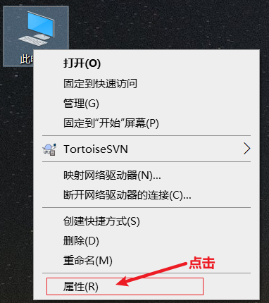
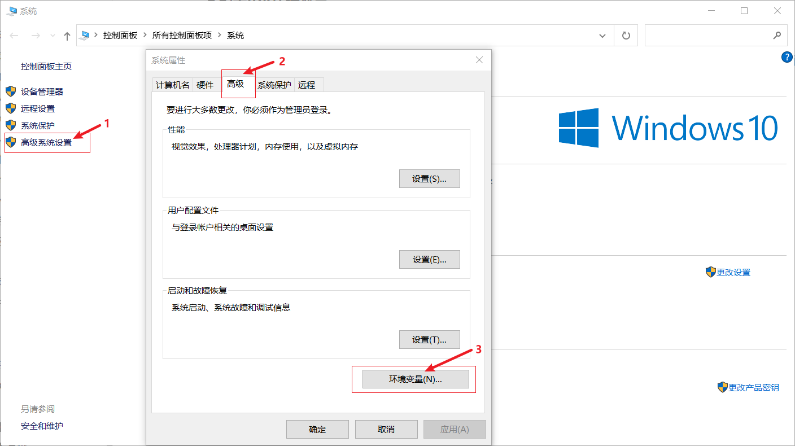
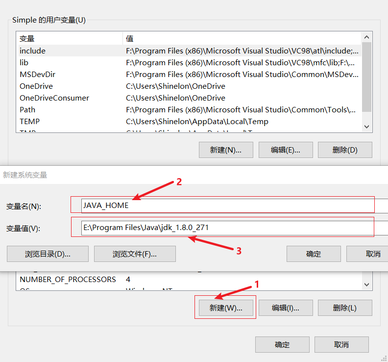
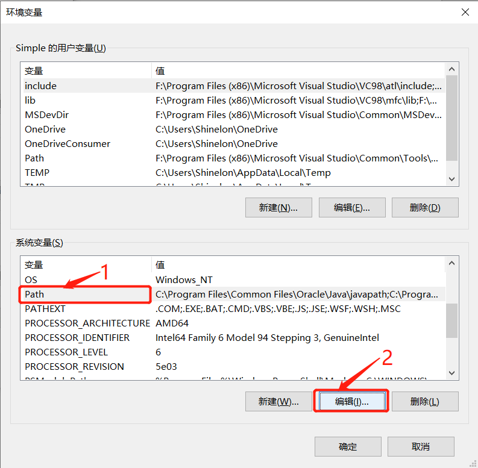
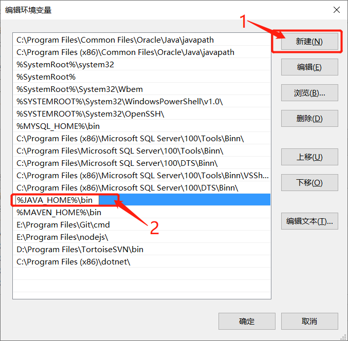
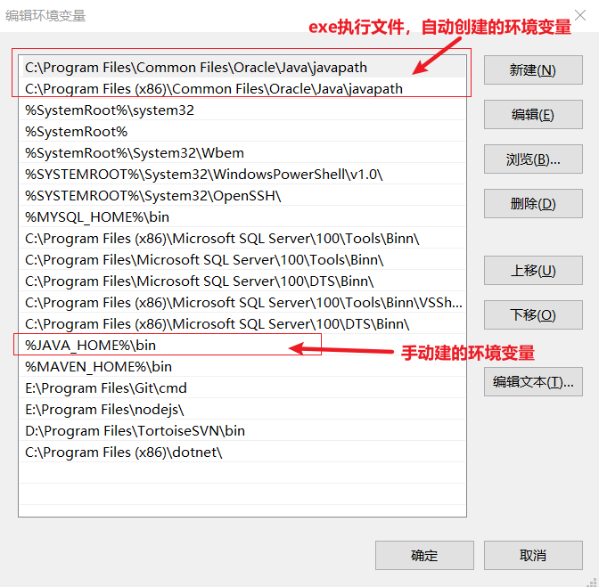
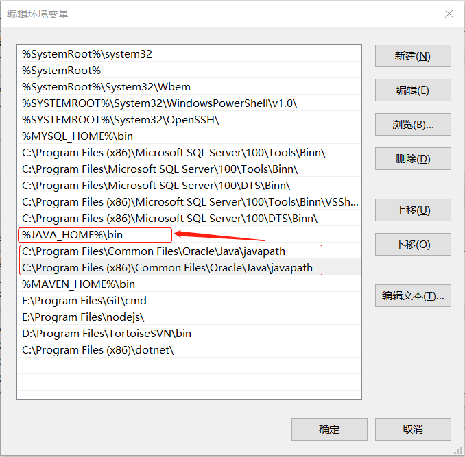

#### * 配置JDK环境变量

```tex
1) 右击【此电脑】→点击【属性】（或 Win+Pause Break），点击【高级系统设置】→【高级】→【环境变量】
2) 在【系统变量】中点击【新建】→添加【变量名：JAVA_HOME】、【变量值：jdk安装路径(E:\Program Files\Java\jdk_1.8.0_271)】
3) 找到【Path】，点击【编辑】→【新建：%JAVA_HOME%\bin】
```











#### * JDK常见问题

```markdown
# JDK更换版本不生效
原因1：C:\Windows\System32 目录下的环境变量 优先级高于 JAVA_HOME 设置的环境变量
解决办法：
  在dos窗口下输入：
    where java
  显示：
    E:\Program Files\Java\corretto-15.0.2\bin\java.exe
    C:\Program Files (x86)\Common Files\Oracle\Java\javapath\java.exe
    C:\Windows\System32\java.exe
  删除：
    C:\Windows\System32 下的 java.exe、avaw.exe、javaws.exe 
    C:\Program Files (x86)\Common Files\Oracle\Java 下的 javapath文件

原因2：exe执行文件【自动创建的环境变量】在【手动配置的环境变量】上面
解决办法：将【自动创建的环境变量】【下移】至【手动配置的环境变量】下方；或者删除【自动创建的环境变量】及其【路径下的文件】
```





