#### * Oracle数据库

```tex
https://www.oracle.com/database/technologies/oracle-database-software-downloads.html
```

##### 安装步骤

[新版本参考](https://blog.csdn.net/weixin_44841225/article/details/100782269)、[老版本参考](https://blog.csdn.net/weixin_40709965/article/details/107351065)

```markdown
注意事项1：安装过程中，出现【无法将用户添加到组】、【暂挂】的情况，不要取消；点击继续，安装程序会将其自动到注册表中
注意事项2：安装第七步，进度到42%时，会卡住；不要退出，最多1小时左右，就直接从42%到100%了；安装日志是在不断更新的
```

下载完成后，需要解压（如果下载是两部分，须解压在同一个文件夹下）

点击文件中的setup.exe文件，进行安装

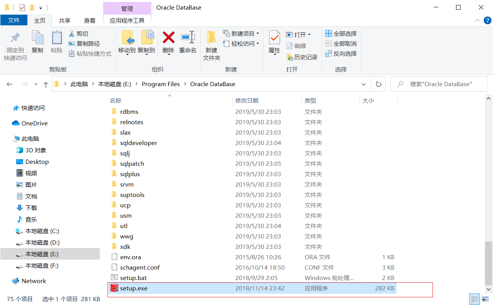

创建并配置单实例数据库 → 下一步

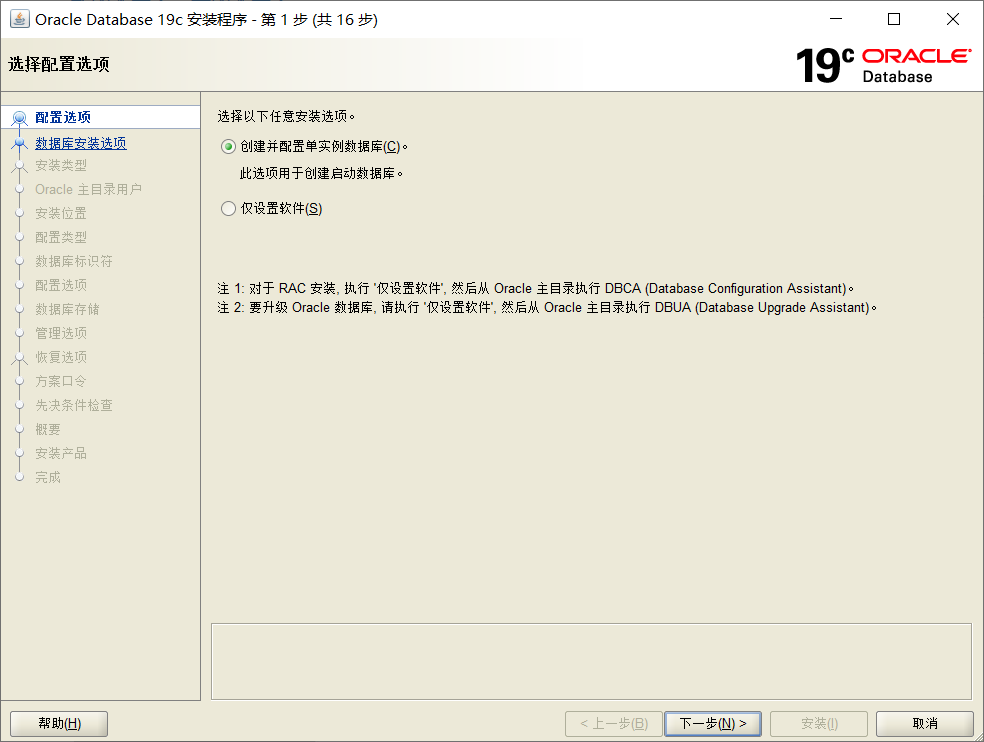

桌面类 → 下一步

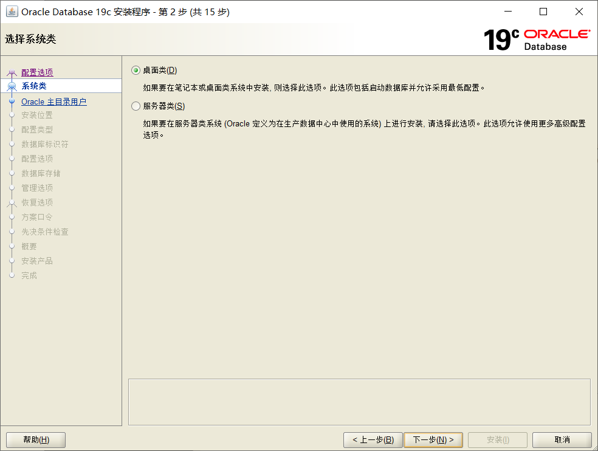

创建新Windows用户 → 输入 用户名、口令 → 下一步 (若出现 “口令不符合 Oracle 建议标准” 弹窗，点击 “是” 继续)

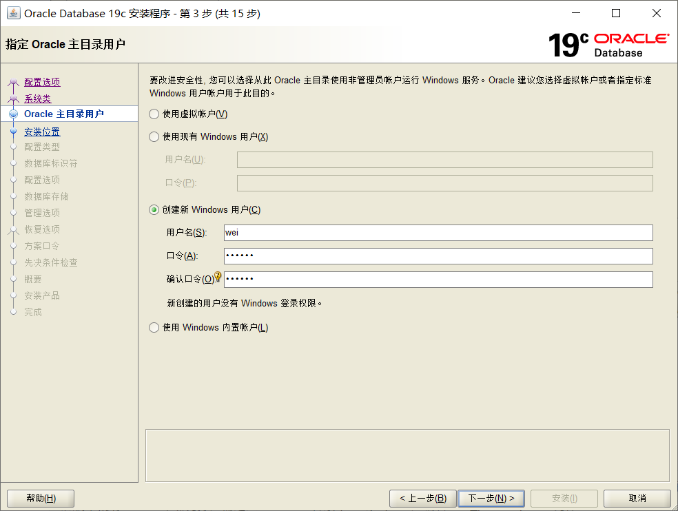

选择 Oracle 基目录 (不要和 Oracle 主目录相同) → 操作系统区域设置 (ZHS16GBK) → 输入 口令 → 下一步

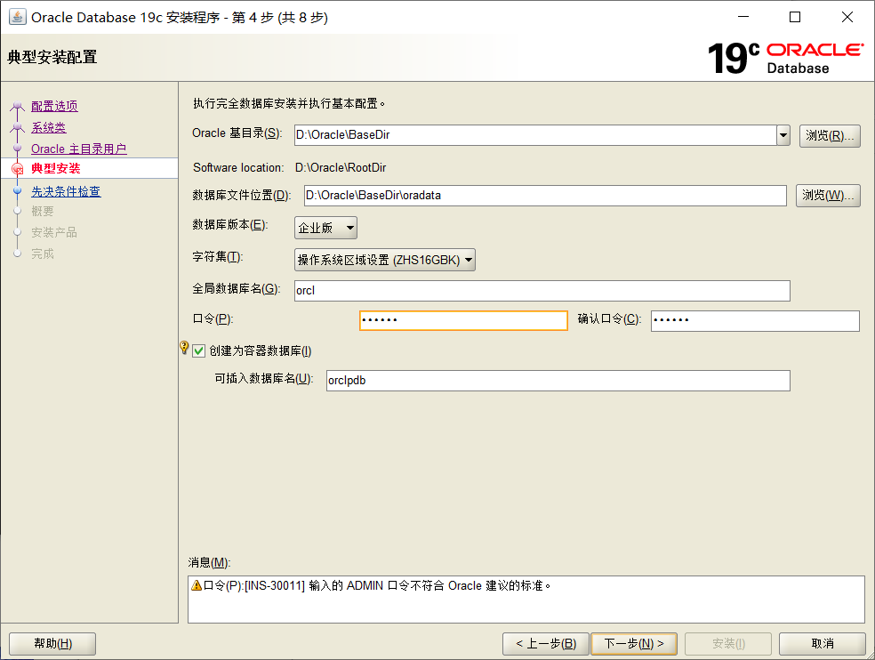

等待 先决条件检查；若出现 “无法将 xxx 安装用户添加到 %2% 组” 情况，一直点击 继续 并 等待，安装程序会将其自动到注册表中

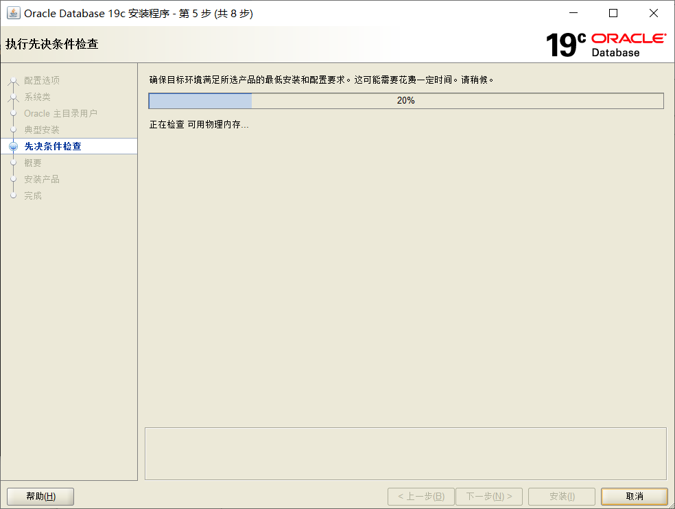

检查完之后，点击 安装

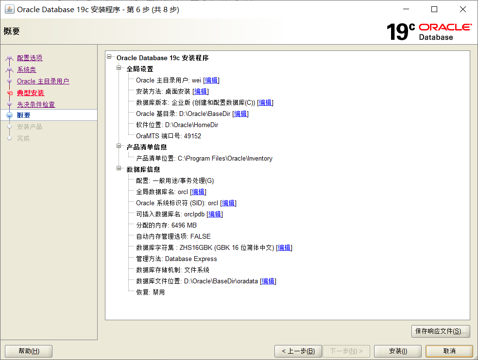

等待安装；这一步会卡在42%，不要退出，大概一个多小时就直接从42%到100%了；安装日志是在不断更新的

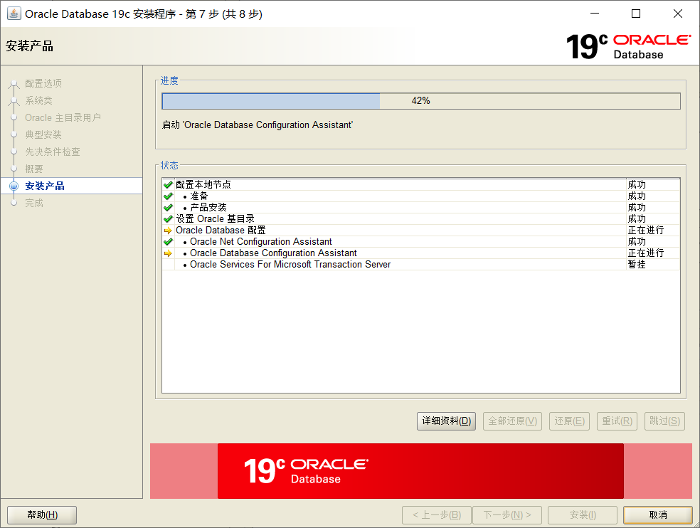

安装完成，点击 关闭

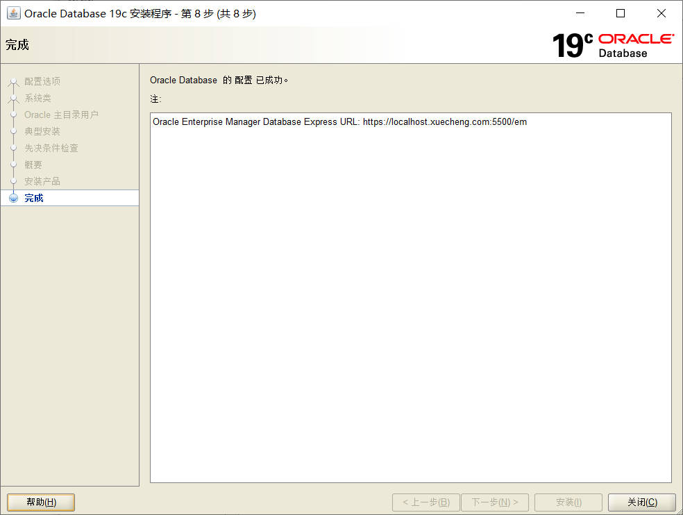

##### [创建用户、角色、授权](https://blog.csdn.net/zhao05164313/article/details/124172838)

```dos
/* 首先登录 sys 用户 */
cmd输入：
		sqlplus
		sys/orcl as sysdba
```

```plsql
/* 一、创建用户 */
create user 用户名 identified by 口令(即密码);
-- 创建 用户(xxw)，密码(123)
create user xxw identified by 123;

/* 二、更改用户 */
alter user 用户名 identified by 口令(改变的密码);
-- 更改 用户(xxw)的密码为：123456
alter user xxw identified by 123456;

/* 三、删除用户 */
drop user 用户名;
-- 删除用户：xxw
drop user xxw;
/* 若用户拥有对象，则不能直接删除，否则将返回一个错误值 
   指定关键字cascade,可删除用户所有的对象，然后再删除用户 */
drop user 用户名 cascade;
-- 例子：
drop user xxw cascade;

/* 四、授权角色
   3种标准角色：connect、resource、dba
   1) connect role(连接角色)
      --临时用户，特指不需要建表的用户，通常只赋予他们connect role.
      --connect是使用oracle简单权限，这种权限只对其他用户的表有访问权限，
        包括select/insert/update和delete等.
      --拥有connect role 的用户还能够创建表、视图、序列(sequence)、簇(cluster)、同义词(synonym)、
        回话(session) 和其他 数据的链(link).
   2) resource role(资源角色)
      --更可靠和正式的数据库用户可以授予resource role.
      --resource提供给用户另外的权限以创建他们自己的表、序列、过程(procedure)、触发器(trigger)、
        索引(index) 和 簇(cluster).
   3) dba role(数据库管理员角色)
      --dba role拥有所有的系统权限
      --包括无限制的空间限额和给其他用户授予各种权限的能力.system由dba用户拥有 */
-- 授权命令
grant connect,resource,dba to 用户名;
-- 例子：
grant connect,resource to xxw;

-- 撤销权限
revoke connect,resource,dba from 用户名;
-- 例子：
revoke connect,resource from xxw;

/* 五、创建/授权/删除角色
   除了前面讲到的三种系统角色：connect、resource、dba，用户还可以在oracle创建自己的role
   用户创建的role可以由表或系统权限或两者的组合构成.为了创建role，用户必须具有create role系统权限 */
-- 1.创建角色
create role 角色名;
-- 例子：
create role testRole;

-- 2.授权角色
grant select on class to 角色名;
-- 列子：
grant select on class to testRole;
-- 注：现在，拥有testRole角色的所有用户都具有对class表的select查询权限

-- 3.删除角色
drop role 角色名;
-- 例子：
drop role testRole;
-- 注：与testRole角色相关的权限将从数据库全部删除
```

##### [创建表空间](https://blog.csdn.net/u010438126/article/details/126243492)

```plsql
 /**
此空间是用来进行数据存储的（表、function、存储过程等），所以是实际物理存储区域。
主要用途是在数据库进行排序运算[如创建索引、order by及group by、distinct、union/intersect/minus/、sort-merge及join、analyze命令]、
管理索引[如创建索 引、IMP进行数据导入]、访问视图等操作时提供临时的运算空间，当运算完成之后系统会自动清理。
**/

/* 创建临时表空间 */
create temporary tablespace ods_temp
-- 数据存放的位置
tempfile 'D:\app\admin\oradata\orcl\ods_temp.dbf'
-- 初始空间50M
size 50m
-- 每次扩大50M
autoextend on next 50m 
-- 最大可以扩大到 20280M 如果想扩大至无限：unlimited 
maxsize 20480m
extent management local;

/* 创建数据表空间 */
CREATE TABLESPACE ODS_DATA NOLOGGING
-- 数据存放的位置
DATAFILE 'D:\app\admin\oradata\orcl\ods_data.dbf' 
-- 初始空间50M
size 50M
-- 每次扩大50M
AUTOEXTEND ON next 50M
-- 最大可以扩大到 20280M 如果想扩大至无限：unlimited 
maxsize 20480M
extent management local;

/* 创建用户 并 指定表空间 */
CREATE USER ods IDENTIFIED BY 123456
PROFILE DEFAULT
DEFAULT TABLESPACE ODS_DATA
ACCOUNT UNLOCK;
 /* 用户授权 */
GRANT connect,resource,dba TO ods;
GRANT create session TO ods;
```

##### [卸载须知](https://blog.csdn.net/qq_38469291/article/details/79568790)

```markdown
# 以下内容需要删除
注册表：Win + R → regedit
HKEY_LOCAL_MACHINE\SOFTWARE > ORACLE
HKEY_LOCAL_MACHINE\SYSTEM\CurrentControlSet\Services > ORACLExxx 全删
HKEY_LOCAL_MACHINE\SYSTEM\CurrentControlSet\Services\EventLog\Application > ORACLExxx 全删

环境变量：Win + R → sysdm.cpl → 点击 高级 → 环境变量(N)
找到 系统变量(S) → 点击 Path → 编辑(I) → 删除 Oracle根目录、基目录
删除手动配置的：ORACLE_HOME、TNS_ADMIN、NLS_LANG

磁盘：
Oracle根目录、基目录
C:\Program Files\Oracle\Inventory 目录下的inventory.xml
C:\Program Files (x86)\Oracle\Inventory 目录下的inventory.xml

本地用户和组(打开命令：Win + R → lusrmgr.msc)
右击 此电脑 → 点击 管理 → 本地用户和组
                                  → 用户 → 删除添加的用户
                                  → 组 → 删除ORA_xxx
注意：如果没有 本地用户和组；打开用户账户(Win + R → netplwiz)删除

服务和应用程序(打开命令：Win + R → services.msc)
右击 此电脑 → 点击 管理 → 服务和应用程序
                                  → 服务 → 删除ORA_xxx
注意：如果服务中无法删除；则以 管理员身份 打开 命令窗口
     输入：
         sc delete OracleJobSchedulerORCL
         sc delete OracleOraDB19Home1MTSRecoveryService
         sc delete OracleOraDB19Home1TNSListener
         sc delete OracleRemExecServiceV2
         sc delete OracleServiceORCL
         sc delete OracleVssWriterORCL

临时文件：
C:\Users\Shinelon\AppData\Local\Temp

开始屏幕文件：
C:\ProgramData\Microsoft\Windows\Start Menu\Programs > Oracle - OraDBxxx
```

##### 安装问题

###### 环境配置问题

安装过程中，可能出现环境不满足最低要求；[解决办法，如下：](https://blog.csdn.net/weixin_40709965/article/details/107350806)

```markdown
比较新的oracle database，其cvu_prereq.xml配置在 oracle目录\cv\cvdata 中，默认有Win10环境配置
旧版本没有Win10环境支持，需进入 oracle目录\stage\cvu，编辑cvu_prereq.xml文件
在文件的指定位置，添加如下内容：
```

```xml
<OPERATING_SYSTEM RELEASE="6.2">
    <VERSION VALUE="3"/>
    <ARCHITECTURE VALUE="64-bit"/>
    <NAME VALUE="Windows 10"/>
    <ENV_VAR_LIST>
        <ENV_VAR NAME="PATH" MAX_LENGTH="1023" />
    </ENV_VAR_LIST>
</OPERATING_SYSTEM>
```

```tex
根据电脑情况，ARCHITECTURE VALUE 改为 64-bit 或 32-bit
添加完之后，保存文件；再次安装，流程正常，不再提示不满足要求
```

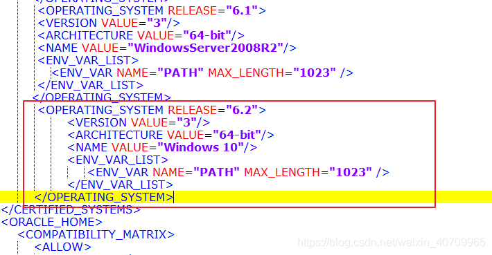

###### exe执行问题

exe可执行文件，运行会闪退；解决办法，如下：

```markdown
安装包所在路径不能带空格，否则setup.exe不能执行
如：setup.exe在文件夹D:\Oracle Database下，则不能运行；在D:\OracleDatabase文件夹下，可以运行
```

###### [无法将用户添加到操作系统组](https://blog.csdn.net/ui466327/article/details/86831115)

```markdown
查看 C:\Program Files\Oracle\Inventory\logs\InstallActionsxxxPM 下的日志文件 installActionsxxx.log
Win + R → 输入 lusrmgr.msc
```

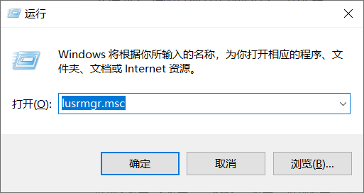

```tex
点击 用户 → 右击 添加的用户 → 点击 隶属于 → 添加 → 高级 → 立即查找 → 添加相关ORA_xxx
```

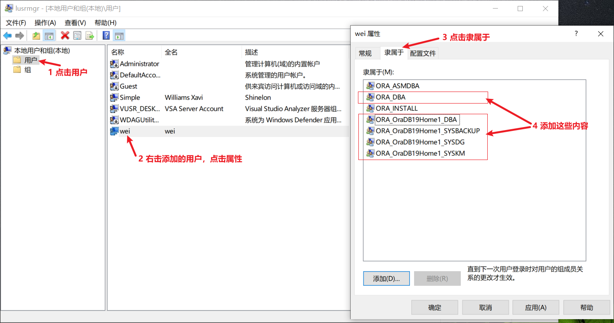

#### * Oracle客户端

```tex
https://www.oracle.com/database/technologies/instant-client/downloads.html
```

Oracle客户端中文官网

```tex
https://www.oracle.com/cn/database/technologies/instant-client/downloads.html
```
