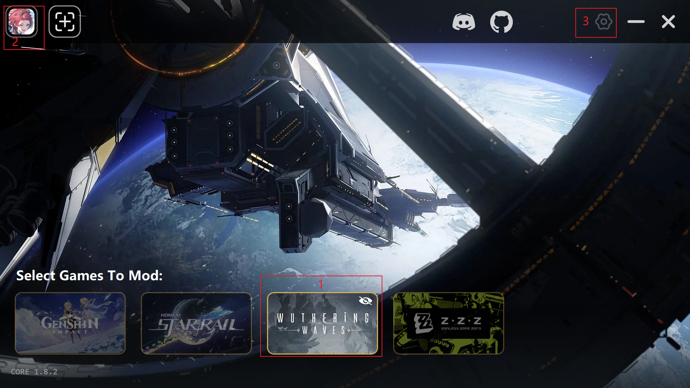

# Common

```markdown
# 游戏风格
ACT(Action Game)					动作游戏
AVG(Adventure Game)					冒险游戏(也称 ADV)
ARPG(Action Role Playing Game)		动作角色扮演
FPS(First Person Shooter)			第一人称射击
FTG(Fighting Game)					格斗游戏
QSP(Quest Soft Player)				互动叙事游戏
RPG(Role Playing Game)				角色扮演
RTS(Real Time Strategy)				即时策略
SLG(Simulation Game)				模拟游戏
STG(Shooting Game)					射击游戏
TPS(Third Person Shooter)			第三人称射击

# 推荐指数
★number
```

## 【ACT】

### [赛博朋克2077]

#### # 详情介绍

原作:  [Cyberpunk 2077](https://store.steampowered.com/app/1091500/_2077/)

发行:  [CD PROJEKT RED](https://store.steampowered.com/publisher/CDPR)

```markdown
# [玩法] → [可玩性]
[动态-3D] → [★待定]

# 文件保存目录
暂无
```

#### [V2.21](https://steamzg.com/22319/)  |  [阿里](https://www.alipan.com/s/RC8FkehqYZL?p=6666)

```markdown
# 百度网盘
https://pan.baidu.com/s/1LSPhwYSU-793inFxwrZ2_A?pwd=6666
```

#### 攻略

```markdown
暂无
```

### [底特律：化身为人]

#### # 详情介绍

原作:  [Detroit: Become Human](https://store.steampowered.com/app/1222140/)

发行:  [Quantic Dream](https://store.steampowered.com/publisher/QUANTICDREAM)

```markdown
# [玩法] → [可玩性]
[动态-3D] → [★待定]

# 文件保存目录
暂无
```

#### [V20230928](https://steamzg.com/6072/)  |  [阿里](https://www.alipan.com/s/4WkV887XHkH?p=6666)

```markdown
# 百度网盘
https://pan.baidu.com/s/1ze3by2_GyiQs0Q3E-FhHKg?pwd=6666
```

#### 攻略

```markdown
暂无
```

### [鸣潮] (需联网)

#### # 详情介绍

原作:  [Wuthering Waves](https://store.steampowered.com/app/3513350/Wuthering_Waves/)

发行:  [KURO GAMES](https://store.steampowered.com/search/?developer=KURO%20GAMES)

```markdown
# [玩法] → [可玩性]
[动态-3D] → [★3]

# 截图目录
.\Client\Saved\ScreenShot
```

#### # 安装步骤

[Official](https://wutheringwaves.kurogames.com/) | [XXMI-Launcher](https://github.com/SpectrumQT/XXMI-Launcher/tags)

```markdown
# 官网安装程序
-- 程序
WutheringWaves_overseas_setup_2.1.1.0.exe
-- 程序路径
.\Install\Wuthering Waves
-- 游戏路径
.\Start\Wuthering Waves Game

# XXMI-Launcher
-- 程序
XXMI-Launcher-Installer-Online-v1.8.2.msi
-- 程序路径
.\Config

# XXMI-Launcher 设置
-- General
.\Start\Wuthering Waves Game
-- WWMI
.\WWMI

# 模组管理工具
-- 压缩包
JASM-稳定版-自带驱动更新至最新.rar
-- 工具路径
.\Config_Mod\JASM-稳定版
-- 程序
JASM - Just Another Skin Manager.exe
-- 右上角目标(完成之后可在 → 设置 → 游戏 → 选择游戏：[WuWa] → 进行更换)
Wuthering Waves
-- 3dMigoto 文件夹选择器
.\WWMI
```



#### # 账号信息

```markdown
# 账密
linhanxavi@gmail.com
what.0414
# 特征码
801444739
# 名字
Viski
```

#### [V2.3](https://t.me/huangyou_A/62755)  |  [TG](#黄油派对|每日全天候营业)

```markdown
# 注意
只是版本魔改绅士整合包，需要在官网下载游戏本体配合整合包使用
```

#### 攻略

```markdown
暂无
```

## 【AVG】

### [辐射 4]

#### # 详情介绍

原作:  [Fallout 4](https://store.steampowered.com/app/1174180/Red_Dead_Redemption_2/)

发行:  [Bethesda Softworks](https://store.steampowered.com/publisher/bethesda)

```markdown
# [玩法] → [可玩性]
[动态-3D] → [★待定]

# 文件保存目录
暂无
```

#### [V1.10.984](https://steamzg.com/24285/)  |  [阿里](https://www.alipan.com/s/wugBoZRXa6J?p=6666)

```markdown
# 百度网盘
https://pan.baidu.com/s/1GfV6iW-P2DflOK5fjw6njg?pwd=6666
```

#### [V待定](https://steamzg.com/25259/)  |  [阿里](https://www.alipan.com/s/y96qp5QM58m?p=6666)

```markdown
# 百度网盘
https://pan.baidu.com/s/1ycwT4g7vVxI0qMWbafXUhQ?pwd=6666
```

#### 攻略

```markdown
暂无
```

### [荒野大镖客2]

#### # 详情介绍

原作:  [Red Dead Redemption 2](https://store.steampowered.com/app/377160/Fallout_4/)

发行:  [Rockstar Games](https://store.steampowered.com/developer/rockstargames)

```markdown
# [玩法] → [可玩性]
[动态-3D] → [★待定]

# 文件保存目录
暂无
```

#### [V1491.50](https://steamzg.com/14946/)  |  [阿里](https://www.alipan.com/s/npL4WrpgNYR?p=6666)

```markdown
# 百度网盘
https://pan.baidu.com/s/11FNkRQHhkVK8D2S6smCzKg?pwd=6666
```

#### 攻略

```markdown
暂无
```

## 【RPG】

### [博德之门3]

#### # 详情介绍

原作:  [Baldur's Gate 3](https://store.steampowered.com/app/1086940/Baldurs_Gate_3/)

发行:  [Larian Studios](https://store.steampowered.com/developer/larianstudios)

```markdown
# [玩法] → [可玩性]
[动态-3D] → [★待定]

# 文件保存目录
%UserProfile%\AppData\Local\Larian Studios\Baldur's Gate 3
```

#### [V4.1.1.6848561](https://steamzg.com/21659/)  |  [磁力](magnet:?xt=urn:btih:e1788213b1a4ac84d4cbc6e1b7feaf7daec572bc)

```markdown
# 夸克网盘
https://pan.quark.cn/s/931e0ecb362a
```

#### [V4.1.1.6805605](https://acgxj.com/XJ09659/)  |  [度盘](https://pan.baidu.com/s/1h4DS5y5rWX32p6NWkAgRaA?pwd=6666)

```markdown
# 夸克网盘
https://pan.quark.cn/s/cfabfbdc9bef
```

#### 攻略

```markdown
暂无
```

### [艾尔登法环]

#### # 详情介绍2

作品:  艾尔登法环 黑夜君临

原作:  [ELDEN RING NIGHTREIGN](https://store.steampowered.com/app/2622380/)

作者:  [FromSoftware Inc](https://store.steampowered.com/curator/45188208)

发行:  [Bandai Namco Entertainment](https://store.steampowered.com/publisher/BANDAINAMCO)

```markdown
# [玩法] → [可玩性]
[动态-3D] → [★待定]

# 文件保存目录
暂无
```

#### [V1.01.4](https://steamzg.com/14946/)  |  [阿里](https://www.alipan.com/s/QV1yQ7ZTtQM?p=6666)

```markdown
# 百度网盘
https://pan.baidu.com/s/1zWECPL09F2Qgx-L9A2_IYA?pwd=6666
```

#### # 详情介绍1

作品:  艾尔登法环 黄金树幽影

原作:  [ELDEN RING SHADOW OF THE ERDTREE](https://store.steampowered.com/app/2778580/)

作者:  同上

发行:  同上

```markdown
同上
```

#### [V1.16.0](https://steamzg.com/15351/)  |  [阿里](https://www.alipan.com/s/r45ipAVDCvf?p=6666)

```markdown
# 百度网盘
https://pan.baidu.com/s/1UTi14ORwJ47Z1xYv3fgrvw?pwd=6666
```

#### 攻略

```markdown
暂无
```

### [塞尔达传说：荒野之息]

#### # 详情介绍

原作:  [The Legend of Zelda: Breath of the wild](https://zelda.nintendo.com/)

发行:  [Nintendo](https://store.nintendo.com.hk/70010000009367)

```markdown
# [玩法] → [可玩性]
[动态-3D] → [★待定]

# 文件保存目录
暂无
```

#### [V1.6.0](https://steamzg.com/4224/)  |  [阿里](https://www.alipan.com/s/SKGfUaWfo2S?p=6666)

```markdown
# 百度网盘
https://pan.baidu.com/s/1iNICSOAxImoF2dTStFr9YQ?pwd=6666
```

#### 攻略

```markdown
暂无
```

## 【SLG】

### [隔离区：最后的检查]

#### # 详情介绍

原作:  [Quarantine Zone: The Last Check](https://store.steampowered.com/app/3419520/Quarantine_Zone_The_Last_Check/)

发行:  [Brigada Games](https://store.steampowered.com/search/?publisher=Brigada%20Games)

```markdown
# [玩法] → [可玩性]
[动态-3D] → [★3]

# 文件保存目录
暂无
```

#### ver0.8

```markdown
# Steam
测试免费下载
```

#### 攻略

```markdown
暂无
```

# SoftEroticism

## 【ACT】

### [致命解药]

#### # 详情介绍

原作:  [The Killing Antidote](https://store.steampowered.com/app/2254890/)

作者:  Johnny & Naux

发行:  [MetalStar Studio](https://store.steampowered.com/search/?publisher=MetalStar%20Studio)

```markdown
# [玩法] → [可玩性]
[动态-3D] → [★5]

# 截图目录
%UserProfile%\AppData\Local\TheKillingAntidote\Screenshots
# 文件保存目录
%UserProfile%\AppData\Local\TheKillingAntidote\Saved\SaveGames
```

#### [V0.5.3.2a](https://t.me/baoshanyouxi1/1150)  |  [夸克](https://pan.quark.cn/s/d78ed3bf4f99)

```markdown
# 夸克网盘(鱼于鱼)
文件/Game/致命解药 v0.5.3.2a 全MOD
```

#### [V0.5.3.2a](https://steamzg.com/48698/)  |  [阿里](https://www.alipan.com/s/LCdnuX7GtuE?p=6666)

```markdown
# 阿里云盘
全部文件/Game/致命解药 v0.5.3.2a
```

#### [V0.5.3.1](https://t.me/c/1620029174/19447)  |  [TG](#『雨夜凉亭』ACG频道)

```markdown
# 夸克网盘(鱼于鱼)
文件/Game/致命解药 v0.5.3.1
```

#### [V0.5.2.3](https://www.ns211.com/15224.html)  |  [夸克](https://pan.quark.cn/s/84cbece63d38)

```markdown
# 夸克网盘(鱼于鱼)
文件/Game/致命解药 v0.5.2.3
```

#### [V0.5.2.2](https://t.me/ElysiumButter/30850)  |  [TG](#小黑的炸鸡游戏屋)

#### 攻略

<a href="攻略文档\致命解药.md">致命解药</a>

## 【AVG】

### [毁了的护士]

#### # 详情介绍

原作:  [Ruined Nurse](https://store.steampowered.com/app/2785280/)

发行:  [eTIRUe](https://store.steampowered.com/developer/eTIRUe)

```markdown
# [玩法] → [可玩性]
[动态-3D] → [★4]

# 文件保存目录
%UserProfile%\AppData\Local\RuinedNurse\Saved
```

#### [V1.4.2](https://steamzg.com/50674/)  |  [阿里](https://www.alipan.com/s/1pKgZr4oSX8?p=6666)

```markdown
# 夸克网盘(鱼于鱼)
文件/Game/毁了的护士 v1.4.2
```

#### 攻略

[全收集通关](https://www.bilibili.com/video/BV1kRzRYwEr6/)

```markdown
# 密码
-- 骨骼(本手足头)
6175
-- 房间(右侧英文)
301 → Karie
302 → Daniele
304 → Alex
305 → E
306 → Rachael
307 → Sam
-- 门后图像
手电筒 记事本 怀表 臂章
-- 光碟图像
输血 听诊器 注射器 刷牙
-- 卡牌
方块7  红心8  梅花3  黑桃0
```

### [深渊学校]

#### # 详情介绍

原作:  [Abyss School](https://store.steampowered.com/app/2473710/)

发行:  [eTIRUe](https://store.steampowered.com/developer/eTIRUe)

```markdown
# [玩法] → [可玩性]
[动态-3D] → [★3]

# 文件保存目录
%UserProfile%\AppData\Local\AbyssSchool\Saved
```

#### [V1.6.9](https://steamzg.com/42100/)  |  [阿里](https://www.alipan.com/s/dqnkNXNyZh6?p=6666)

```markdown
# 夸克网盘(鱼于鱼)
文件/Game/深渊学校 v1.6.9
```

#### [V1.6.6](https://t.me/ciyuanbiGG/46251)  |  [度盘](https://pan.baidu.com/s/1q87fxo3wdfp2WVLlVNo9PQ?pwd=1set)

```markdown
# 夸克网盘(鱼于鱼)
文件/Game/深渊学校 v1.6.6
```

#### 攻略

[全流程](https://www.bilibili.com/video/BV1NH4y1Y7G2) | [全流程](https://www.bilibili.com/video/BV1vU421o76J)

```markdown
暂无
```

### [吸血鬼大厦]

#### # 详情介绍

别名:  吸血鬼宅邸

原作:  [Vampire Mansion](https://store.steampowered.com/app/2280520/)

发行:  [eTIRUe](https://store.steampowered.com/developer/eTIRUe)

```markdown
# [玩法] → [可玩性]
[动态-3D] → [★3]

# 文件保存目录
%UserProfile%\AppData\Local\VampireMansion\Saved
```

#### [V1.5.3](https://steamzg.com/43938/)  |  [阿里](https://www.alipan.com/s/f5d5jDwMPqN?p=6666)

```markdown
# 夸克网盘(鱼于鱼)
文件/Game/吸血鬼大厦 v1.5.3
```

#### 攻略

[普通模式](https://www.bilibili.com/video/BV1FPwpe4EDj) | [困难模式](https://www.bilibili.com/video/BV1kRwheWEsm)

```markdown
暂无
```

### [黑暗海妖]

#### # 详情介绍

原作:  [Dark Siren](https://store.steampowered.com/app/1575450/)

发行:  [eTIRUe](https://store.steampowered.com/developer/eTIRUe)

```markdown
# [玩法] → [可玩性]
[动态-3D] → [★3]

# 文件保存目录
%UserProfile%\AppData\Local\DarkSiren\Saved
```

#### [V1.32.2](https://steamzg.com/49924/)  |  [阿里](https://www.alipan.com/s/QJnDppVGrNu?p=6666)

```markdown
# 夸克网盘(鱼于鱼)
文件/Game/黑暗海妖 v1.32.2
```

#### 攻略

[普通模式](https://www.bilibili.com/video/BV1ggCHYZESF) | [通关全集](https://www.bilibili.com/video/BV13s4y1c7Ly)

```markdown
暂无
```

## 【SLG】

### [放学后的缩小大冒险]

#### # 详情介绍

原作:  After School Shrinking Adventure

发行:  待定

```markdown
# [玩法] → [可玩性]
[动态-3D] → [★2]

# 文件保存目录
%UserProfile%\AppData\Local\AfterSchool\Saved
```

#### [V0.2.2](https://t.me/farrslgrpg/12809)  |  [TG](#Farr的黄油（游）仓库SLG.RPG.ADV.3D)

#### 攻略

```markdown
暂无
```

### [罪恶尖塔]

#### # 详情介绍

原作:  [Sin Spire](https://store.steampowered.com/app/3221770/Sin_Spire/)

发行:  [Krasue Games](https://store.steampowered.com/search/?developer=Krasue%20Games)

```markdown
# [玩法] → [可玩性]
[动态-3D] → [★2]

# 文件保存目录
%UserProfile%\AppData\Local\SinSpire\Saved
```

#### [V0.0.5](https://www.2gouacg.com/%e3%80%903d-act-%e4%b8%ad%e6%96%87-%e6%81%90%e6%80%96%e3%80%91%e7%bd%aa%e6%81%b6%e5%b0%96%e5%a1%94-sin-spire-ver0-0-5-%e5%ae%98%e6%96%b9%e4%b8%ad%e6%96%87%e7%89%88-%e7%99%be%e5%ba%a6uc-890m/)  |  [度盘](https://pan.baidu.com/s/1s9xs0lbPPe1cwBqrZeoTOw?pwd=xwmh&unzip=twodog)

```markdown
# 百度网盘(weskix)
全部文件/Game/罪恶尖塔 v0.0.5
```

#### 攻略

```markdown
暂无
```

### [家庭派对]

#### # 详情介绍

原作:  [House Party](https://store.steampowered.com/app/611790/House_Party/)

发行:  [Eek! Games](https://store.steampowered.com/developer/eekgames)

```markdown
# [玩法] → [可玩性]
[动态-3D] → [★待定]

# 文件保存目录
暂无
```

#### [V1.4.0](https://t.me/huangyou_A/48774)  |  [TG](#黄油派对|每日全天候营业)

#### 攻略

```markdown
暂无
```

# Butter

## 【AVG】

### [美少女万华镜]

#### # 详情介绍

原作:  [美少女万华镜-理与迷宮的少女](https://store.steampowered.com/app/1310990/)

作者:  [ωstar](https://store.steampowered.com/developer/seikei_production)

发行:  [Seikei Production](https://store.steampowered.com/publisher/seikei_production)

```markdown
# [玩法] → [可玩性]
[2D] → [★待定]
# [CG] → [质量]
[2D] → [★3]

# 文件保存目录
暂无
```

#### [合集1](https://t.me/Zhzbzx/9238)  |  [TG](#黄油中心)

#### [合集2](https://t.me/c/1819412809/2215)  |  [TG](#陌上花开轻烟阁)

#### 攻略

```markdown
暂无
```

## 【RPG】

### [纳迪亚之宝]

#### # 详情介绍

原作:  [Treasure of Nadia](https://store.steampowered.com/app/1737100/Treasure_of_Nadia/)

发行:  [NLT Media](https://store.steampowered.com/search/?developer=NLT%20Media)

```markdown
# [玩法] → [可玩性]
[2D] → [★3]
# [CG] → [质量]
[3D] → [★4]

# 文件保存目录
%UserProfile%\AppData\Local\User Data
```

#### [V1.0112](https://steamzg.com/13137/)  |  [阿里](https://www.aliyundrive.com/s/f6pCsFKwdiD?p=2222)

```markdown
# 百度网盘
https://pan.baidu.com/s/1DNDHuWCk7xcq-g2ZYpDwYw?pwd=2222
```

#### 攻略

[古庙解谜](https://www.bilibili.com/video/BV17m4y1Z7tQ)

```markdown
暂无
```

### [重时:余火再燃]

#### # 详情介绍2

原作:  余火再燃-天彩乱

作者:  [boosty](https://boosty.to/sweetsworkshopgames)

发行:  [引力圈](https://app.unifans.io/c/sweetworkshop)

```markdown
# [玩法] → [可玩性]
[2D] → [★2]
# [CG] → [质量]
[3D] → [★5]

# 文件保存目录
.\www\save
```

#### [V2025.05.15](https://t.me/huangyou_A/58729)  |  [TG](#黄油派对|每日全天候营业)

#### # 详情介绍1

原作:  余火再燃 鸿图琦

发行:  [甜食工坊](https://app.unifans.io/c/sweetworkshop)

```markdown
同上
```

#### [ver25.03.15](https://t.me/Zhzbzx/15227)  |  [TG](#ACG便利贴(免费黄油))

#### 攻略

```markdown
暂无
```

### [我的幸福人生]

#### # 详情介绍

原作:  My Happy Life

发行:  [BlueFish](https://www.patreon.com/BlueFishGames)

```markdown
# [玩法] → [可玩性]
[2D] → [★2]
# [CG] → [质量]
[3D] → [★5]

# 文件保存目录
暂无
```

#### [V1.5](https://t.me/huangyou_A/55760)  |  [TG](#黄油派对|每日全天候营业)

#### [ver1.4.1](https://t.me/LspGame/990)  |  [TG](#黄油分享)

#### [ver1.4](https://t.me/Zhzbzx/13957)  |  [TG](#ACG便利贴(免费黄油))

#### 攻略

```markdown
暂无
```

### [爱巢]

#### # 详情介绍

作者:  SUO速

```markdown
# [玩法] → [可玩性]
[2D] → [★2]
# [CG] → [质量]
[2D+] → [★3]

# 文件保存目录
.\www\save
```

#### [合集](https://t.me/Zhzbzx/11099)  |  [TG](#ACG便利贴(免费黄油))

#### [V2.3 (D+N)](https://t.me/Zhzbzx/774)  |  [TG](#ACG便利贴(免费黄油))

#### 攻略

```markdown
暂无
```

### [颠覆]

#### # 详情介绍

原作:  SUBVERSE

发行:  [StudioFOW](https://store.steampowered.com/agecheck/app/1034140)

```markdown
# [玩法] → [可玩性]
[静态-3D] → [★2]
# [CG] → [质量]
[3D] → [★3]

# 文件保存目录
%UserProfile%\AppData\Local\Subverse\Saved\SaveGames
```

#### [ver8.4](https://t.me/Zhzbzx/8738)  |  [TG](#ACG便利贴(免费黄油))

#### 攻略

```markdown
暂无
```

### [永恒世界]

#### # 详情介绍

原作:  Eternum

作者:  [Caribdis](https://www.patreon.com/onceinalifetime)

发行:  [Eternum](https://caribdis.itch.io/eternum)

```markdown
# [玩法] → [可玩性]
[静态-3D] → [★2]
# [CG] → [质量]
[3D] → [★4]

# 文件保存目录
%UserProfile%\AppData\Roaming\RenPy\Eternum-1610153667
```

#### [ver0.8.5](https://t.me/LspGame/995)  |  [TG](#黄油分享)

#### 攻略

```markdown
暂无
```

### [哥布林杀手]

#### # 详情介绍

原作:  Goblin Layer

发行:  [parodos](https://itch.io/profile/parodos)

```markdown
# [玩法] → [可玩性]
[2D] → [★3]
# [CG] → [质量]
[3D] → [★3]

# 文件保存目录
.\www\save
```

#### [ver0.573](https://t.me/Zhzbzx/16327)  |  [TG](#ACG便利贴(免费黄油))

#### 攻略

```markdown
暂无
```

### [绯月仙行录]

#### # 详情介绍

作者:  [蓝月虫](https://www.patreon.com/LanYC)

```markdown
# [玩法] → [可玩性]
[2D] → [★2]
# [CG] → [质量]
[2D] → [★2]

# 文件保存目录
.\save
.\data
```

#### [ver0.628](https://t.me/Zhzbzx/13168)  |  [TG](#ACG便利贴(免费黄油))

#### [V0.515A](https://t.me/Zhzbzx/8262)  |  [TG](#ACG便利贴(免费黄油))

#### 攻略

<a href="攻略文档\绯月修仙录.md">绯月修仙录</a>

### [合欢宗女修传]

#### # 详情介绍

作者:  [月亮龙](https://www.patreon.com/yuelianglong)

```markdown
# [玩法] → [可玩性]
[2D] → [★1]
# [CG] → [质量]
[2D] → [★1]

# 文件保存目录
.\save
.\data
```

#### [V0.17](https://t.me/yuyeweimian/12899)  |  [TG](#『雨夜凉亭』ACG频道)

#### 攻略

<a href="攻略文档\合欢宗女修传.md">合欢宗女修传</a>

## 【SLG】

### [隔壁的女主播]

#### # 详情介绍

原作:  [隔壁的女主播](https://store.steampowered.com/app/1997410/)

作者:  18cmSam | UVKen

发行:  [Playmeow](https://store.steampowered.com/publisher/playmeow) | [ACG creator](https://store.steampowered.com/curator/43525890) | [Playmeow News](https://store.steampowered.com/curator/45434844)

```markdown
# [玩法] → [可玩性]
[动态-3D] → [★待定]
# [CG] → [质量]
[3D] → [★5]

# 文件保存目录
暂无
```

#### [V待定](https://t.me/farrslgrpg/29074)  |  [TG](#Farr的黄油（游）仓库SLG.RPG.ADV.3D)

#### 攻略

```markdown
暂无
```

### [性趣探测器]

#### # 详情介绍

原作:  [Fetish Locator](https://store.steampowered.com/app/1360980/Fetish_Locator_Week_One/)

发行:  [ViNovella Games](https://store.steampowered.com/developer/ViNovellaGames)

```markdown
# [玩法] → [可玩性]
[动态-3D] → [★待定]
# [CG] → [质量]
[3D] → [★3]

# 文件保存目录
暂无
```

#### [合集](https://t.me/Zhzbzx/12998)  |  [TG](#ACG便利贴(免费黄油))

#### 攻略

```markdown
暂无
```

### [半老徐娘]

#### # 详情介绍2

原作:  [MILFs of Sunville - Season 2](https://store.steampowered.com/app/2294730/MILFs_of_Sunville__Season_2/)

发行:  [L7team](https://store.steampowered.com/publisher/L7team)

```markdown
# [玩法] → [可玩性]
[动态-3D] → [★待定]
# [CG] → [质量]
[3D] → [★3]

# 文件保存目录
暂无
```

#### [V93](https://t.me/c/1678540823/12775)  |  [TG](#黄油中心)

#### # 详情介绍1

原作:  [MILFs of Sunville - Season 1](https://store.steampowered.com/app/1794470/MILFs_of_Sunville__Season_1/)

发行:  同上

```markdown
同上
```

#### [V10](https://t.me/c/1678540823/12691)  |  [TG](#黄油中心)

#### 攻略

```markdown
暂无
```

### [新生也疯狂]

#### # 详情介绍

原作:  [FreshWomen](https://store.steampowered.com/app/1350650/1/)

发行:  [OppaiMan](https://store.steampowered.com/publisher/Oppai-Man)

```markdown
# [玩法] → [可玩性]
[动态-3D] → [★待定]
# [CG] → [质量]
[3D] → [★4]

# 文件保存目录
暂无
```

#### [合集](https://t.me/Zhzbzx/15928)  |  [TG](#ACG便利贴(免费黄油))

#### 攻略

```markdown
暂无
```

### [欲望回声]

#### # 详情介绍3

原作:  [Lust Theory Season 3](https://store.steampowered.com/app/2749380/Lust_Theory_Season_3/)

发行:  [Inceton Games](https://store.steampowered.com/curator/40147129)

```markdown
# [玩法] → [可玩性]
[动态-3D] → [★待定]
# [CG] → [质量]
[3D] → [★4]

# 文件保存目录
暂无
```

#### [V0.6.0](https://t.me/huangyou_A/42777)  |  [TG](#黄油派对|每日全天候营业)

#### # 详情介绍2

原作:  [Lust Theory Season 2](https://store.steampowered.com/app/1754870/Lust_Theory_Season_2/)

发行:  同上

```markdown
同上
```

#### [V待定](https://t.me/perfectlife_official/1790)  |  [TG](#Perfect Life CLUB)

#### # 详情介绍1

原作:  [Lust Theory - Season 1](https://store.steampowered.com/app/1607130/Lust_Theory__Season_1/)

发行:  同上

```markdown
同上
```

#### [V2.5.4](https://t.me/c/1620029174/9955)  |  [TG](#『雨夜凉亭』ACG频道)

#### 攻略

```markdown
暂无
```

### [我的大学生活]

#### # 详情介绍

原作:  [Being a DIK - Season 3](https://store.steampowered.com/app/1807120/Being_a_DIK__Season_3/)

发行:  [Dr PinkCake](https://store.steampowered.com/search/?developer=Dr%20PinkCake)

```markdown
# [玩法] → [可玩性]
[动态-3D] → [★待定]
# [CG] → [质量]
[3D] → [★4]

# 文件保存目录
暂无
```

#### [V0.11.1](https://t.me/c/1678540823/14736)  |  [TG](#黄油中心)

#### 攻略

```markdown
暂无
```

### [堕落玩偶]

#### # 详情介绍

原作:  [Operation Lovecraft: Fallen Doll](https://store.steampowered.com/app/1685960/)

发行:  [Project Helius](https://store.steampowered.com/search/?developer=Project%20Helius)

```markdown
# [玩法] → [可玩性]
[动态-3D] → [★待定]
# [CG] → [质量]
[3D] → [★3]

# 文件保存目录
暂无
```

#### [V0.4.9](https://t.me/huangyou_A/2987)  |  [TG](#黄油派对|每日全天候营业)

#### 攻略

```markdown
暂无
```

### [最后的希望]

#### # 详情介绍

原作:  [Last Hope](https://store.steampowered.com/app/2650630/)

发行:  [PoolsideGames](https://www.patreon.com/PoolsideGames) | [DreamBigGames](https://store.steampowered.com/developer/DreamBigGames)

```markdown
# [玩法] → [可玩性]
[动态-3D] → [★5]
# [CG] → [质量]
[3D] → [★4]

# 文件保存目录
%UserProfile%\AppData\Local\LastHope\Saved\SaveGames
```

#### V1.0196

```markdown
# Torrent
-- Last_Hope-v1.0196.zip
magnet:?xt=urn:btih:863B2A12CE23DA2694FE3267BCA67380DAB2D6F9
```

#### [V1.0165](https://t.me/Zhzbzx/14751)  |  [TG](#ACG便利贴(免费黄油))

#### 攻略

```markdown
# 葡萄酒
医疗湾(Med Bay)
飞行甲板(Flight Deck) → 通讯器左侧 → 椅子左扶手

# 集体过夜
盖亚全弄满
```

### [特工17]

#### # 详情介绍

原作:  Agent17

发行:  [HEXATAIL](https://www.patreon.com/hexatail)

```markdown
# [玩法] → [可玩性]
[静态-3D] → [★4]
# [CG] → [质量]
[3D] → [★5]

# 文件保存目录
%UserProfile%\AppData\Roaming\RenPy\Agent17-1589840340
.\game\saves
```

#### [ver0.25.9](https://t.me/Zhzbzx/15289)  |  [TG](#ACG便利贴(免费黄油))

#### 攻略

<a href="攻略文档\特工17.md">特工17</a>

### [极品采花郎]

#### # 详情介绍

原作:  [极品采花郎](https://store.steampowered.com/app/2897760/)

发行:  [蠑螈](https://store.steampowered.com/search/?publisher=%E8%A0%91%E8%9E%88) | Salamander Interactive

```markdown
# [玩法] → [可玩性]
[动态-3D] → [★4]
# [CG] → [质量]
[3D] → [★3]

# 文件保存目录
%UserProfile%\AppData\LocalLow\Salamander\RE
```

#### [V1.3.7](https://t.me/farrslgrpg/27826)  |  [TG](#Farr的黄油（游）仓库SLG.RPG.ADV.3D)

#### 攻略

```markdown
暂无
```

### [隔壁的美艳人妻]

#### # 详情介绍

原作:  [The Wife Next Door](https://store.steampowered.com/app/2710480/)

作者:  [雪山雞白郎 (SnowGBL)](https://store.steampowered.com/curator/44790486)

发行:  [Playmeow](https://store.steampowered.com/publisher/playmeow)

```markdown
# [玩法] → [可玩性]
[静态-3D] → [★3]
# [CG] → [质量]
[3D] → [★3]

# 文件保存目录
.\TheWifeNextDoor_Data\SaveData
```

#### [V1.3.21](https://t.me/huangyou_A/57941)  |  [TG](#黄油派对|每日全天候营业)

#### 攻略

```markdown
暂无
```

### [爱情挑战]

#### # 详情介绍

作品:  雪山别墅与三个妹子的做爱假期

原作:  [Love Challenge](https://store.steampowered.com/app/2334130/)

作者:  [雪山雞白郎 (SnowGBL)](https://store.steampowered.com/curator/44790486)

发行:  [Playmeow](https://store.steampowered.com/publisher/playmeow)

```markdown
# [玩法] → [可玩性]
[静态-3D] → [★2]
# [CG] → [质量]
[3D] → [★3]

# 文件保存目录
.\LoveChallenge_Data
```

#### [V1.5.5](https://t.me/farrslgrpg/26977)  |  [TG](#Farr的黄油（游）仓库SLG.RPG.ADV.3D)

#### 攻略

```markdown
暂无
```

### [跨界]

#### # 详情介绍

原作:  CrossRealms

发行:  [DuskDuck](https://www.patreon.com/DuskDuck)

```markdown
# [玩法] → [可玩性]
[静态-3D] → [★2]
# [CG] → [质量]
[3D] → [★3]

# 文件保存目录
暂无
```

#### [ver0.3.0](https://t.me/Zhzbzx/16099)  |  [TG](#ACG便利贴(免费黄油))

### [欧派奥德赛]

#### # 详情介绍

原作:  OppaiOdyssey

发行:  [Cryoxxx](https://www.patreon.com/OppaiOdyssey)

```markdown
# [玩法] → [可玩性]
[静态-3D] → [★3]
# [CG] → [质量]
[3D] → [★3]

# 文件保存目录
暂无
```

#### [ver0.4.5](https://t.me/Zhzbzx/14670)  |  [TG](#ACG便利贴(免费黄油))

#### 攻略

```markdown
暂无
```

### [莉莉的情欲迷宫]

#### # 详情介绍

原作:  [Lily’s Labyrinth of Lust](https://store.steampowered.com/app/2866440/Lilys_Labyrinth_of_Lust/)

发行:  [Erommersion](https://www.patreon.com/erommersion/posts) | [Erommersion](https://store.steampowered.com/search/?publisher=Erommersion%20Studios)

```markdown
# [玩法] → [可玩性]
[动态-3D] → [★2]
# [CG] → [质量]
[3D] → [★3]

# 文件保存目录
暂无
```

#### [V0.8.5](https://t.me/yuyeweimian/14339)  |  [TG](#『雨夜凉亭』ACG频道)

#### 攻略

```markdown
暂无
```

### [神秘别墅]

#### # 详情介绍

原作:  The Mystery Villa

作者:  [DX_Games](https://www.patreon.com/DX_Games)

```markdown
# [玩法] → [可玩性]
[静态-3D] → [★1]
# [CG] → [质量]
[3D] → [★4]

# 文件保存目录
.\game\saves
```

#### [Ep.8](https://t.me/perfectlife_official/10888)  |  [TG](#Perfect Life CLUB)

#### 攻略

```markdown
暂无
```

### [稻荷:乡村生活]

#### # 详情介绍

原作:  [Inari](https://store.steampowered.com/app/2639100/Inari/)

发行:  [HimitsuCP](https://www.dlsite.com/maniax/work/=/product_id/RJ01129998.html)

```markdown
# [玩法] → [可玩性]
[2D] → [★2]
# [CG] → [质量]
[2D] → [★1]

# 文件保存目录
%UserProfile%\AppData\LocalLow\HimitsuCP\Inari\Utage\SaveScenario
.\SaveDir
```

#### [V1.5.12](https://t.me/PerfectLife_Channel/11713)  |  [TG](#Perfect Life CLUB)

#### [V1.5.10 (完结)](https://t.me/PerfectLife_Channel/11296)  |  [TG](#Perfect Life CLUB)

#### [V1.3.2](https://t.me/Zhzbzx/9262)  |  [TG](#ACG便利贴(免费黄油))

#### 攻略

```markdown
暂无
```

### [恶魔合约：孵化器]

#### # 详情介绍

原作:  [Incubus](https://store.steampowered.com/app/1973080/Incubus/)

发行:  [HimitsuCP](https://store.steampowered.com/search/?publisher=HimitsuCP)

```markdown
# [玩法] → [可玩性]
[2D] → [★2]
# [CG] → [质量]
[2D] → [★1]

# 文件保存目录
%UserProfile%\AppData\LocalLow\HimitsuCP\Incubus\Utage\Save
%UserProfile%\AppData\LocalLow\HimitsuCP\Incubus\saveData
```

#### [V24.12.11](https://t.me/huangyou_A/16133)  |  [TG](#黄油派对|每日全天候营业)

#### [V1.1.0](https://t.me/lifanhuangyouxi/7193)  |  [TG](#里番 黄油聚集地)

#### V1.0.1

```markdown
暂无
```

#### 攻略

```markdown
暂无
```

## 【QSP】

### [亚洲之子]

#### # 详情介绍

原作:  Son Of Asia (SOA)

发行:  [SonOfAll](https://www.patreon.com/SonOfAll)

```markdown
# [玩法] → [可玩性]
[2D] → [★3]
# [CG] → [质量]
[日本作品] → [★4]

# 文件保存目录
%UserProfile%\Documents\Сохранения игр Quest Navigator
```

#### [V60.0e](https://t.me/Zhzbzx/7749)  |  [TG](#ACG便利贴(免费黄油))

#### [ver60FF](https://t.me/Zhzbzx/8182)  |  [TG](#ACG便利贴(免费黄油))

#### 攻略

<a href="攻略文档\亚洲之子.md">亚洲之子</a>

### [就是个混蛋]

#### # 详情介绍

原作:  Son of a Bitch (SOB)

发行:  [SonOfAll](https://www.patreon.com/SonOfAll)

```markdown
# [玩法] → [可玩性]
[2D] → [★3]
# [CG] → [质量]
[欧美作品] → [暂未探索]

# 文件保存目录
暂无
```

#### [V0.30](https://t.me/Zhzbzx/6658)  |  [TG](#ACG便利贴(免费黄油))

#### 攻略

```markdown
暂无
```

## 【Based on VAM】

### [AI少女]

#### # 详情介绍2

作品:  AI少女-璇玑公主

原作:  [AI＊Shoujo/AI＊少女](https://store.steampowered.com/app/1250650/AIShoujoAI/)

发行:  [ILLUSION](https://store.steampowered.com/search/?publisher=ILLUSION)

```markdown
# [玩法] → [可玩性]
[动态-3D] → [★5]
# [CG] → [质量]
[3D] → [★5]

# 文件保存目录
暂无
```

#### [V1.2.3](https://t.me/Zhzbzx/2511)  |  [TG](#ACG便利贴(免费黄油))

#### # 详情介绍1

作品:  AI少女

原作:  同上

发行:  同上

```markdown
同上
```

#### [V](https://t.me/ElysiumButter/1185)  |  [TG](#小黑的炸鸡游戏屋)

#### 攻略

```markdown
暂无
```

### [甜蜜选择2]

#### # 详情介绍2

作品:  Honey Select 2:原欲璇玑公主

原作:  [Honey Select 2 Libido DX](https://store.steampowered.com/app/1631080/HoneySelect2Libido_DX) | [ハニーセレクト2 リビドーDX](https://www.getchu.com/soft.phtml?id=1102442)

发行:  [ILLUSION](https://store.steampowered.com/search/?publisher=ILLUSION)

```markdown
# [玩法] → [可玩性]
[动态-3D] → [★5]
# [CG] → [质量]
[3D] → [★5]

# 文件保存目录
暂无
```

#### [V1.2.3](https://t.me/Zhzbzx/9127)  |  [TG](#ACG便利贴(免费黄油))

#### # 详情介绍1

作品:  HS2/甜心选择2

原作:  同上

发行:  同上

```markdown
同上
```

#### [V12](https://t.me/ElysiumButter/1969)  |  [TG](#小黑的炸鸡游戏屋)

#### 攻略

```markdown
暂无
```

### [VAM]

#### # 详情介绍

原作:  Virt A Mate

发行:  [Meshed VR](https://www.patreon.com/meshedvr)

```markdown
# [玩法] → [可玩性]
[动态-3D] → [★5]
# [CG] → [质量]
[3D] → [★5]

# 文件保存目录
-- 包文件
.\AddonPackages
-- 本地音效
.\Custom\Sounds
-- 保存的场景
.\Saves\scene
```

#### [ver1.20.77.9](https://t.me/ElysiumButter/2243)  |  [TG](#小黑的炸鸡游戏屋)

```markdown
# (中文启动)激活 → [机器码]的[后面]加上[Your wife's vagina is so cool]再进行[MD5加密]
-- 如下
C8FAC8BD8B5AA5A3926C2606FA60A72AYour wife's vagina is so cool
-- (32位)MD5加密后
42B0513BD5A01C158880603593EA89AE
```

#### [ver1.95](https://noelbakersedu-my.sharepoint.com/personal/yytyxy4494_sg_edu_vn/_layouts/15/onedrive.aspx)  |  [hgamefree.info](https://hgamefree.info/adult-video-game/h-game/272656.html)

#### 攻略

```markdown
暂无
```

# 文件修改

## 【[saveeditonline](https://www.saveeditonline.com)】

```markdown
# 上传(慢)
1) UPLOAD FILE  →  Download xxx.xxx
2) 拖动文件到网页  →  Download xxx.xxx
```

## 【[saveeditor](https://saveeditor.online)】

```markdown
# 上传(快)
1) Upload  →  Download
2) 拖动文件到网页  →  Download
```

## 【[save-editor](https://www.save-editor.com/tools)】

```markdown
# 上传(全面)

-- RPG MAKER MZ SAVE EDITOR
1) SELECT  SAVE EDITOR
   SELECT  JSON EDITOR
                        →  选择文件  →  RUN  →  EDIT & DOWNLOAD  →  DOWNLOAD
2) SELECT  SAVE EDITOR
   SELECT  JSON EDITOR
                        →  [拖动文件]到[选择文件]界面  →  RUN  →  EDIT & DOWNLOAD  →  DOWNLOAD

-- RPG MAKER MV GAME EDITOR
1) 选择文件  →  RUN  →  ...
2) [拖动文件]到[选择文件]界面  →  RUN  →  ...

-- RPG MAKER MV SAVE EDITOR
同上
```

# Telegram

### [ACG便利贴(免费黄油)](https://t.me/Zhzbzx)

```markdown
# 通用解压密码
好好学习少点涩涩
好好学习天天不涩
```

### [黄油中心](https://t.me/c/1678540823/6)

```markdown
# 通用解压密码
暂无
```

### [里番 黄油聚集地](https://t.me/lifanhuangyouxi)

```markdown
# 通用解压密码
暂无
```

### [小黑的炸鸡游戏屋](https://t.me/ElysiumButter)

```markdown
# 通用解压密码
半夏
```

### [Farr的黄油（游）仓库SLG.RPG.ADV.3D](https://t.me/farrslgrpg)

```markdown
# 通用解压密码
t.me/farrslgrpg
```

### [『雨夜凉亭』ACG频道](https://t.me/c/1620029174/812)

```markdown
# 通用解压密码
半夏
Liangting

# 少数解压密码
莱茵
LaiYin
三次郎
www.agbbc.com
www.acgfbw.com
ed2k
```

### [Perfect Life CLUB](https://t.me/PerfectLife_Official)

```markdown
# 通用解压密码
暂无
```

### [陌上花开轻烟阁](https://t.me/c/1819412809/229)

```markdown
# 通用解压密码
gushan
```

### [黄油派对|每日全天候营业](https://t.me/huangyou_A)

```markdown
# 通用解压密码
@huangyou_A
```

### [黄油分享](https://t.me/LspGame)

```markdown
# 通用解压密码
暂无
```

### 百度贴吧

```tex
...
```

# [游戏资源](./Resources.md)
